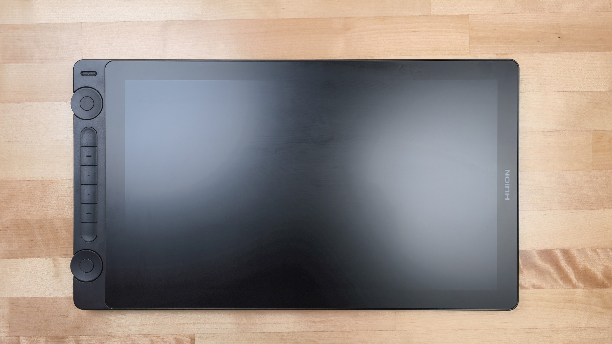
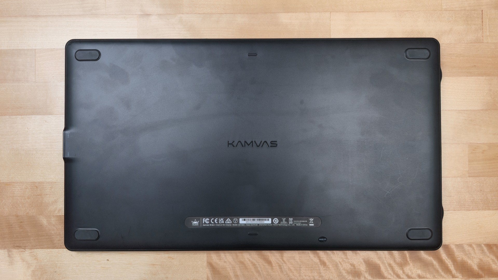
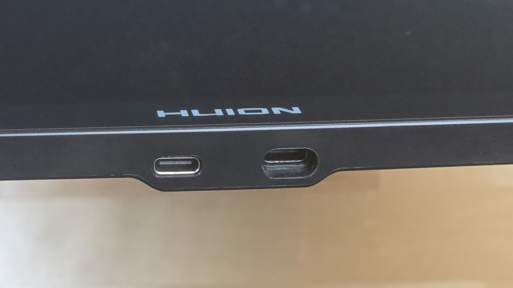
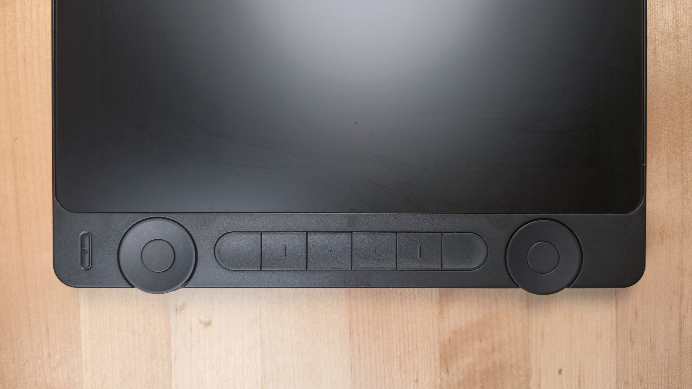
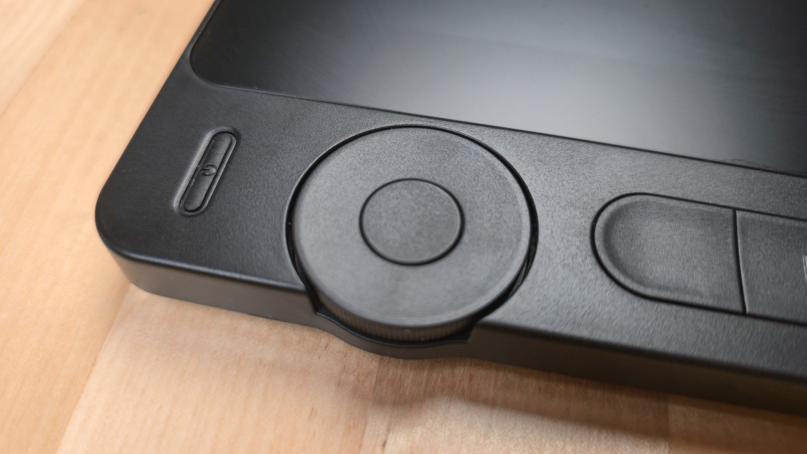

# Huion Kamvas 16 GEN3 (GS1563) notes

## Overview

This is a good tablet with a great drawing experience, thanks to the included PW600L pen. I am very happy with this tablet, and as of Jan 2025, it is my #1 recommended 16" pen display.

#### Known issues

* It does exhibit a tiny bit of diagonal wobble when drawing smooth strokes, but stabilization or smoothing can eliminate that.
* Some units have a known issue with the dials: See: [Dial problems with the Huion GS1333 and GS1563](dial-problems-gs1333-gs1563.md)

### Unboxing and testing live streams

My full notes are not available yet, but I did livestream my unboxing and basic testing:

* [https://www.youtube.com/watch?v=-qmdAHY4f40](https://www.youtube.com/watch?v=-qmdAHY4f40)
* [https://www.youtube.com/watch?v=KSmhwa6MUjM](https://www.youtube.com/watch?v=KSmhwa6MUjM)

### What's in the box

* Kamvas 16 (Gen 3) ×1
* Foldable Stand ST300 ×1
* Battery-free Pen PW600L ×1
* Standard Pen Nibs (inside the Pen Holder) ×10
* Pen Holder ×1
* 3-in-1 Cable (1.8m) ×1
* USB Extension Cable (1.2m) ×1
* USB-C to USB-C Cable (1m) ×1
* USB-C to USB-A Cable (1m) ×1
* Power Adapter ×1
* Artist Glove ×1
* Cleaning Cloth ×1

## Links

* Product page: [https://huion.com/products/pen\_display/Kamvas/kamvas-16-gen-3.html](https://huion.com/products/pen_display/Kamvas/kamvas-16-gen-3.html)
* User manual: [https://driverdl.huion.com/instruction/Kamvas16-Gen3/User\_Manual\_Kamvas16\_Gen3\_en.pdf](https://driverdl.huion.com/instruction/Kamvas16-Gen3/User_Manual_Kamvas16_Gen3_en.pdf)
* [Adam Duff review of Huion Kamvas 16 GEN3 (GS1563)](https://www.youtube.com/watch?v=EA4A5B4GcUY) 2025-01-13
* [Ryan Allan review of Huion Kamvas 16 GEN3 (GS1563)](https://magma.com/blog/huion-kamvas-16-gen-3-review) 2025-01-07
* [Brad Colbow review of Huion Kamvas 16 GEN3 (GS1563)](https://www.youtube.com/watch?v=t2gEAky5ns8) 2025-01-07
* [Teoh on Tech blog review of Huion Kamvas 16 GEN3 (GS1563)](https://www.youtube.com/watch?v=-Xq7oHPpUHQ) 2025-01-09

## Basics

* Name: Huion Kamvas 16 GEN3
* Model: GS1563
* Year released: 2025

## Specs

### Device specs

* Dimensions: 421.2 x 236.81 x 12.62mm
* Weight: 1.245kg
* Ports: 2 USB-C ports
  * 1x USB-C port for use with the 3-in-1 cable
  * 1x full-featured USB-C port

### Digitizer specs

* Size
  * Dimensions:
    * 350 x 197mm
  * Diagonal: 15.8”
* Tech: EMR
* Resolution: 200LPMM (5080 LPI)
* Number of pressure levels: 16384
* Hover: 10mm
* Report Rate: ＞260PPS
* Accuracy:
  * Center: ±0.3mm
  * Corner: ±2mm

### Display specs

* Native resolution: 2560 x 1440
* Aspect ratio: 16:9
* Display tech: IPS
* Laminated: Yes
* AG treatment: AG etched glass
* Contrast ratio: 1000:1
* Brightness: 220 nits
* Response time: 14ms
* Viewing angle: 89°/89°(H)/89°/89°(V) (Typ.)(CR＞10)
* Color Gamut Volume:
  * 120% sRGB
  * Coverage: 99% sRGB, 99% Rec.709, 90% Adobe RGB
* Color bit depth: 8 bits per channel (24 bits per pixel)

## Pen

### Included pen

* The tablet comes with the PW600L, which is a really good pen in terms of pressure handling.
* Pen Technology: Battery-Free Electromagnetic Resonance
* See: [Huion PW600 series pens](../../pens/huion-pens/huion-pw600-notes.md)

## Non-pen inputs

### Buttons & dials

* 6 buttons
* 2 dials

### Touch

This tablet does NOT support touch.

## Ergonomics

### Stand

* This tablet comes with the ST300 stand in the box.
* The recommended stand is the Huion ST300.

## Display experience

### Resolution

With a native resolution of 2560 x 1440 (WQHD) and at 16 inches, the UI text is exceptionally tiny out of the box. Users will likely need to adjust scaling settings to make menus and buttons legible.

### Color accuracy

Ships with an individual factory color calibration report displaying a Delta E of less than 1 (0.76 on the tested unit), which is very good for high color fidelity.

### Surface texture

Features an etched glass surface. It feels slightly less textured than the high-end Huion Kamvas Pro 19. It still feels good to draw on, and the pen is not slippery on the surface.

In comparison:

* Feels similar to the Kamvas 13 GEN3 (GS1333)
* Feels moderately less textured than the Wacom Cintiq 16 2025 (DTK-168)

### Pixel sharpness

The anti-glare etching introduces a very slight "softness" to the pixels. It is not blurry, but it lacks the ultra-crisp bite of a completely glossy panel like an iPad.

### Anti-glare sparkle

Anti-glare sparkle is kept very low, and you have to get your eyes within inches of the screen to explicitly notice it.

## Drawing experience

### Pressure range

The PW600L pen is very good - low IAF and high max pressure. See: [Huion PW600 series pens](../../pens/huion-pens/huion-pw600-notes.md)

### Low-pressure artifacts

Like many drawing tablet pens, the pen is a little over-reactive near the IAF. Drawing perfectly vertical lines with _extremely_ light pressure can occasionally produce slight pressure transitions or "wobble" artifacts as the hardware registers minor hand variations. Again, this is normal. Even if you notice it, you can handle it through pressure curves and pressure smoothing.

### Diagonal wobble

RATING: OK

* Slow Strokes: Exhibits a very minor amount of diagonal line wobble. It is completely acceptable, but slightly more noticeable than on the Kamvas 13 Gen 3 or Kamvas Pro 19.
* Normal/Fast Strokes: a little wobble present. The line quality remains straight during real-world drawing speeds.

<figure><figcaption></figcaption></figure>

### Parallax

VERY LOW (GOOD). The cursor tracks directly underneath the physical pen tip, even when viewing the screen from severe, skewed angles.

### Corner accuracy

EXCELLENT. While nearly all pen displays drift slightly at the extreme outer edges, the Kamvas 16 GEN3 restricts this to just 1–2 millimeters, which does not impact normal workflow usage.

### Tilt compensation

EXCELLENT. Tracks flawlessly across all 4 quadrants (North, South, East, West). Tilted at 45 degrees, the cursor remains perfectly centered directly under the nib, rivaling Wacom Cintiq Pro performance.

## Cabling and connections

### Power & Ports

Features two right-side USB-C ports, one recessed and one flat. The tablet can comfortably run off a single full-featured USB-C cable connected to a laptop like a MacBook Pro that has a USB-C port that meets the requirements for data, power, and video.

## Kamvas 16 GEN3 vs XP-Pen Artist Pro 16 GEN2

These are both very good tablets. Between the two, the Kamvas 16 GEN3 is the winner because of its pen.

**Kamvas 16 GEN3 advantages**

* Can be connected with third-party USB-C cables (that meet the requirements). The XP-Pen tablet has a USB-C port that is recessed, so you need to use XP-Pen's USB-C cable.
* The Huion PW600 pen has a wider pressure range and is more consistent across units than the XP-Pen X3 Pro series.
* Has 6 buttons on the tablet. The XP-Pen has no buttons on the tablet, but it comes with a shortcut remote.
* Has 2 dials on the tablet. The XP-Pen has no dials, but it comes with a shortcut remote.

**XP-Pen Artist Pro 16 GEN2 advantages**

* The industrial design of the XP-Pen tablet is more attractive and stylish. The Huion looks plainer.
* Kamvas 16 GEN3 does NOT come with a separate shortcut remote. The XP-Pen Artist Pro 16 GEN2 comes with a shortcut remote with 10 buttons and 1 dial.

**Other differences**

* Kamvas 16 GEN3 has a standard 16:9 aspect ratio. This matches most monitors and other pen displays. The Artist Pro 16 GEN2 has a 16:10 aspect ratio.
* The XP-Pen has legs built into the tablet to provide some angle. The Kamvas 16 GEN3 does not have any legs and instead comes with a simple stand. For both, I prefer a separate stand.

**Known issues**

* Some users report problems with the dials on the Kamvas 16 GEN3. See: [Dial problems with the Huion GS1333 and GS1563](dial-problems-gs1333-gs1563.md)

**What they have in common**

* Both have a little bit of diagonal wobble. The wobble can be addressed with smoothing/stabilization in your drawing app. More here: [Diagonal wobble](../../../core/diagonal-wobble.md).
* Both can be used with a single USB-C cable if the requirements are met. [Connecting a pen display with USB-C](../../../guides/connecting/connecting-pen-display/connecting-pen-display-usbc.md)

## Photos

<figure><figcaption></figcaption></figure>

<figure><figcaption></figcaption></figure>

<figure><figcaption></figcaption></figure>

<figure><figcaption></figcaption></figure>

<figure><figcaption></figcaption></figure>

