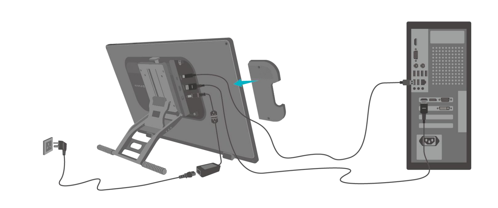
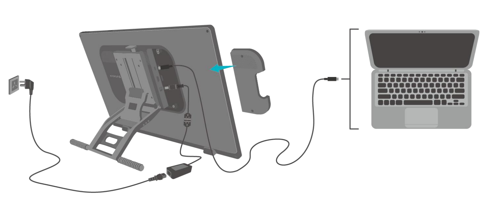

# Kamvas 22 GEN3 (GS2203) notes

## Summary

A worthy successor to the Kamvas 22 (GS2201) and Kamvas 22 Plus (GS2202) models from 2020. Like the other Huion GEN3 pen displays, the primary improvement comes from the included PW600L. Another surprising addition is support for up to a 90Hz refresh rate. The cabling is also simpler than on the GS2201 and GS2202.

## Links

* Product page: [https://www.huion.com/products/kamvas-22-gen-3](https://www.huion.com/products/kamvas-22-gen-3)
* [Brad Colbow - Huion Kamvas 22 (Gen 3) Review](https://www.youtube.com/watch?v=OkoLPFYgiRU) - 2026-03-05
* [Teoh on Tech - Huion Kamvas 22 (Gen 3) review: Sleek upgrade](https://www.youtube.com/watch?v=Mbijan2Gm9U) - 2026-03-05
* [Adam Duff LUCIDPIXUL - HUION Kamvas 22 (Gen 3) - A Turning Point For Huion!](https://www.youtube.com/watch?v=IDvACjevj2A) - 2026-03-05
* [Gartzia Artz - HUION IS BACK | Kamvas 22 gen 3 The new Queen Great Quality/Price](https://www.youtube.com/watch?v=2mSJLNawCO4) - 2026-03-05

## Basics

Model: GS2203

## Device

Like many pen displays, it is a simple "black slab of glass," but it does look and feel very professional.

## Included pen

The tablet comes with the PW600L pen. As part of the PW600 series, it is a very good pen. See: [PW600 series pens](../../pens/huion-pens/huion-pw600-notes.md)

## Compatible pens

The tablet works with the other PW600 series pens:

* PW600
* PW600S
* PW600L

## Display experience

### Pixel sharpness

* The pixels are clear and well-delineated. They appear normal and are what you would expect from a pen display.
* In comparison
  * Looks similar in terms of sharpness to my Cintiq Pro 22
  * The pixels are definitely sharper than the Kamvas Pro 19 (GT1902)
* Effect of refresh rate on sharpness
  * There is a very slight softening of the pixels when using the 90Hz refresh rate.
  * This slight softening is very minor, almost imperceptible to me. Some people do clearly notice it, though.
  * Even at 90Hz, the pixels of this tablet are sharper than those of the Kamvas Pro 19 (GT1902), which only supports 60Hz.
  * Cause of extra softness at 90Hz
    * The cause is unknown.
    * No apparent setting in Windows seems to affect it.
    * No apparent setting in the Nvidia app seems to affect it.

### Color

* The tablet comes with a display color calibration report showing a Delta E of 0.90. Anything less than 2.0 is considered good.
* Looking at the display from different horizontal and vertical angles did not cause any noticeable shifts in color or brightness.
* The display has a special monochrome display mode. This might be useful for some people in certain situations, but I didn't have any use for it.

### Parallax

GOOD. Like most pen displays of this era, this tablet has a low amount of parallax. You won't notice it at normal drawing angles. You'll only notice it if you try to place your eyes in a position that forces the parallax to be visible.

### Refresh rate

The display natively supports up to a 90Hz refresh rate over both HDMI and USB-C. When pushed to maximum (100%) panel brightness along with the 90Hz setting, the tablet handled heat well, remaining cool to the touch.

The 90Hz refresh rate does provide a small improvement to the perception of pointer lag.

## Anti-glare spakle

RATING: LOW

I couldn't notice much sparkle at all. I found it to be the same (or very close to) the Wacom Cintiq 24 touch 2025

## Drawing experience

### Pen tracking accuracy (static, vertical)

I found that the pen's position was tracked very accurately across the entire screen. Like all pen displays, there is a slight deviation a few millimeters from the screen edges.

### Diagonal wobble

Overall, it is good. While there is a little bit of wobble, it is comparable to what I see in the Wacom Cintiq Pro 22 (DTH-227).

* slow strokes - a small bit of wobble
* medium speed strokes - a tiny bit of wobble (less than with slow strokes)
* fast strokes - no wobble

## Connectivity and cabling

### Ports

* Power
* USB-C (full-featured)
* HDMI

### HDMI connection option

This requires 3 cables:

* HDMI
* USB-C to USB-A
* Power

<figure><figcaption></figcaption></figure>

### USB-C connection option

This requires 2 cables:

* Power
* Full-featured USB-C - your computer needs a USB-C port that meets all the requirements.

<figure><figcaption></figcaption></figure>

### Misc

* There is a plastic cover to hide the ports. You do not need to use it, but it does clean up the look.
* I do like the port locations because they hide the cables from view
* I do wish this tablet (and many others) also came with DisplayPort ports because so many GPUs have only one HDMI output, but multiple DisplayPort outputs.

## Non-pen inputs

### Touch

This tablet does NOT support touch.

### Tablet buttons

NONE. The tablet has no buttons, dials, or similar controls.

## Ergonomics

### Stand

This tablet comes with a VESA-attached stand that is pre-attached.

### VESA compatibility

YES - 4 VESA mounting holes on the back.

### Ambient RGB lighting

The tablet has an RGB light strip on the back. You can control the color and light intensity from the driver.

Even at 100% intensity, the light is not very bright. You would only notice it in a very dark environment, and even then it is not intense.

I do like the idea of having lighting like this, but if Huion releases more tablets with this feature, I would prefer it to be much brighter.

### Misc

* Rubber feet at the bottom keep the tablet secure on the desk when it is propped up at an angle.
* Size - While everyone has their preferred size for a pen display, 22" is definitely my favorite size. It is large enough for me without being too large.
