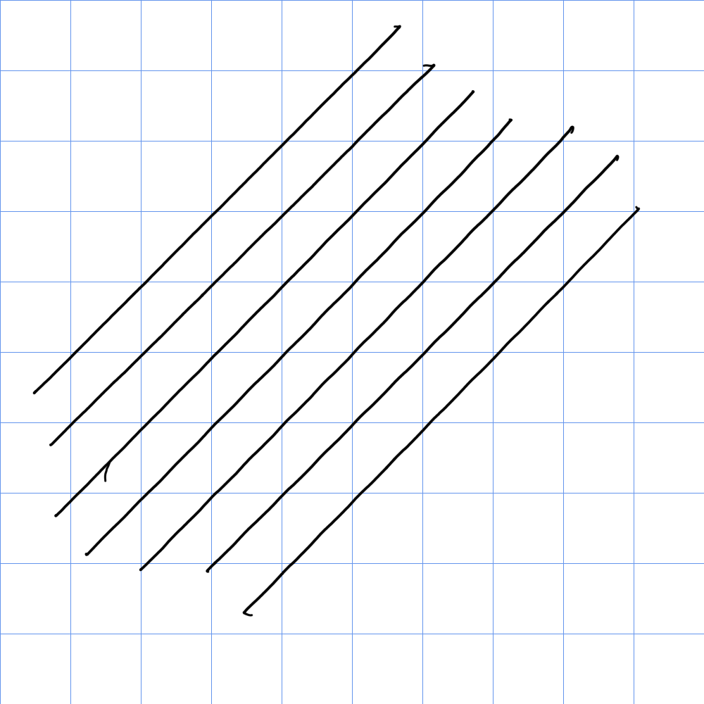
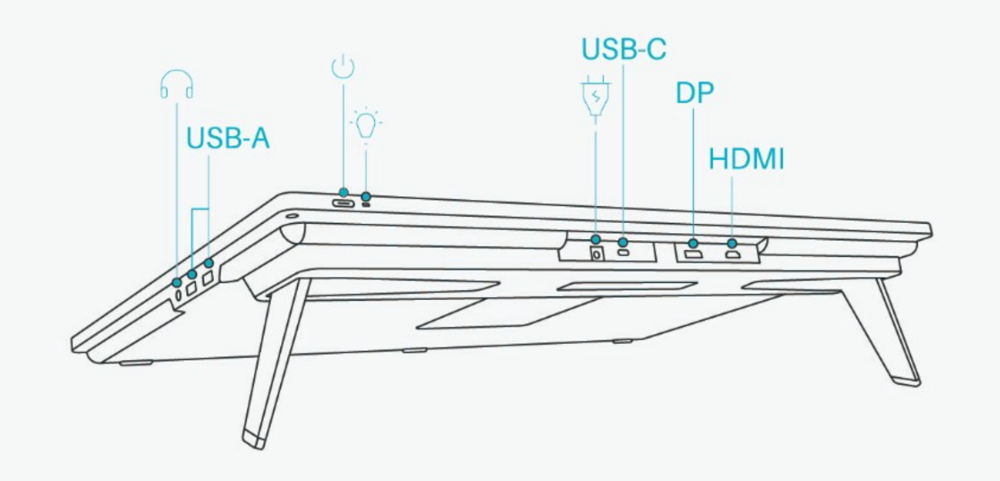

# Huion Kamvas Pro 24 4K (GT2401) notes

## **Summary**

I've been very satisfied with this tablet.

## Links

These links come from the [DrawTabData Explorer](https://thesevenpens.github.io/DrawTabDataExplorer/entity/huion.tabletfamily.huion_kamvaspro_2021). To add or fix a link, change it in DrawTabData.

| Source | Link | Date |
| --- | --- | --- |
| Huion | [Product page](https://www.huion.com/products/kamvas-pro-24-4k) |  |
| Huion | [Store page](https://store.huion.com/products/kamvas-pro-24-4k) |  |
| Huion | [User manual](https://www.huion.com/manual/kamvas-pro-24-4k) |  |
| Huion | [User manual](https://www.huion.com/manaul_pdf/de/Kamvas%20Pro%2024(4K).pdf) |  |
| MossCharmly presents | [2 Year Review of Huion Kamvas Pro 24 (4K)!](https://www.youtube.com/watch?v=XwD_7x2S-7g) | 2023-12-09 |
| Brad Colbow | [Huion Kamvas 24 Pro 4k Review (2021)](https://www.youtube.com/watch?v=HvQxDrzgbOo) | 2021-09-02 |
| Teoh on Tech | [Review: Huion Kamvas Pro 24 (4K)](https://www.youtube.com/watch?v=r8k5qsgJXlM) | 2021-08-17 |
| Teoh on Tech | [Huion Kamvas Pro 24 (4K) Unboxing + First Impression](https://www.youtube.com/watch?v=f200vERwcms) | 2021-07-30 |
| Parka Blogs | [Artist Review: Huion Kamvas Pro 24 (4K) pen display](https://www.parkablogs.com/content/artist-review-huion-kamvas-pro-24-4k-pen-display) |  |

## Specs

These specs come from the [DrawTabData Explorer](https://thesevenpens.github.io/DrawTabDataExplorer/entity/huion.tabletfamily.huion_kamvaspro_2021). Click a model ID to see its full record there.



| | [GT2401](https://thesevenpens.github.io/DrawTabDataExplorer/entity/huion.tablet.gt2401) |
| --- | --- |
| Name | Kamvas Pro 24 4K |
| Released | 2021-09-23 |
| Status | — |



| | [GT2401](https://thesevenpens.github.io/DrawTabDataExplorer/entity/huion.tablet.gt2401) |
| --- | --- |
| Resolution | 3840 × 2160 |
| Aspect ratio | 16:9 |
| Pixel density | 185 PPI |
| Panel | IPS |
| Lamination | Yes |
| Anti-glare | Etched glass |
| Color gamut | sRGB 140% |
| Color depth | 10 bits per channel |
| Brightness | 220 cd/m² |
| Peak brightness | — |
| Viewing angle | 178° horizontal 178° vertical |
| Refresh rate | 60 Hz |
| Response time | 10 ms |



| | [GT2401](https://thesevenpens.github.io/DrawTabDataExplorer/entity/huion.tablet.gt2401) |
| --- | --- |
| Active area | 527 × 296 mm (20.7 × 11.7 in) |
| Diagonal | 604.4 mm (23.8 in) |
| Aspect ratio | 16:9 |
| Pen technology | Passive EMR |
| Pressure levels | 8192 |
| Tilt | ±60° |
| Accuracy (center) | ±0.3 mm |
| Accuracy (corner) | ±3 mm |
| Report rate | 300 Hz |
| Density | 200 LPmm (5080 LPI) |
| Max hover | 10 mm |



| | [GT2401](https://thesevenpens.github.io/DrawTabDataExplorer/entity/huion.tablet.gt2401) |
| --- | --- |
| Included pen | [PW517 (PW517)](https://thesevenpens.github.io/DrawTabDataExplorer/entity/huion.pen.pw517) |
| Compatible pens | [PW517 (PW517)](https://thesevenpens.github.io/DrawTabDataExplorer/entity/huion.pen.pw517) [PW550S (PW550S)](https://thesevenpens.github.io/DrawTabDataExplorer/entity/huion.pen.pw550s) [PW550 (PW550)](https://thesevenpens.github.io/DrawTabDataExplorer/entity/huion.pen.pw550) |



| | [GT2401](https://thesevenpens.github.io/DrawTabDataExplorer/entity/huion.tablet.gt2401) |
| --- | --- |
| Buttons | 0 |
| Dials | 0 |
| Touch rings | 0 |
| Touch strips | 0 |
| Touch | No |



| | [GT2401](https://thesevenpens.github.io/DrawTabDataExplorer/entity/huion.tablet.gt2401) |
| --- | --- |
| Size | 589 × 364 × 22.7 mm (23.2 × 14.3 × 0.9 in) |
| Weight | 6300 g |
| VESA mount | Yes |
| Legs | Yes |
| Included stand | No |



| | [GT2401](https://thesevenpens.github.io/DrawTabDataExplorer/entity/huion.tablet.gt2401) |
| --- | --- |
| Ports | DC power USB-C DisplayPort HDMI USB-A USB-A 3.5 mm audio |
| Attached cable | None |
| Bluetooth | — |



| | [GT2401](https://thesevenpens.github.io/DrawTabDataExplorer/entity/huion.tablet.gt2401) |
| --- | --- |
| Contents | — |



## Basics

* User manual [https://www.huion.com/manaul\_pdf/de/Kamvas%20Pro%2024(4K).pdf](https://www.huion.com/manaul_pdf/de/Kamvas%20Pro%2024\(4K\).pdf)

## **Cost**

This Huion tablet not cheap at about $1300. But sometimes it is on sale at $1000.

## **Compared to Wacom**

* This is Huion's highest end pen display in 2023.
  * In 2025, Huion's has a newer, better high end models: The Kamvas Pro 19 and Kamvas Pro 27.
* Its competitor is the Wacom Cintiq Pro 27. Let me be clear, the Cintiq Pro 27 is a better tablet. But this tablet delivers a LOT for value for it's price. This Huion tablet delivers 90% of what you need for drawing compared to the Cintiq Pro 27's which costs $3500.

## **Pointer tracking accuracy**

Good. Like all pen displays slightly inaccurate in the edges and corner by a couple of millimeters. More accurate in edges/corners than the Huion Kamvas 22 Plus.

## **Pointer lag**

Normal for a pen display. Slightly more than the Cintiq Pro 27.

## **Legs**

Has bult-in legs that give it a nice drawing angle.

## Anti-glare sparkle

Moderate (maybe on the low end). Noticeable if you put your eyes close. At a normal drawing distance my eyes don't pick it up or at least it looks minimal.

## Auxiliary inputs

It has no buttons, dials, etc. So, I use a TourBox device. More here: [TourBox](../../accessories/auxiliary-input-devices/tourbox/)

## **Texture**

The etched glass provides a nice texture for the pen so that it doesn't feel slippery.

## **Heat**

Display stays cool to the touch - maybe sometimes slightly warm. No hot spots.

## **Scenario**

I bought this tablet for digital art, and it works fine for that. I have used it as a secondary display at it works fine for that purpose also. But most of the time I only use it when I want to draw.

## Diagonal wobble

Rating: GOOD (LOW AMOUNT OF WOBBLE)

Wobble is minor and only noticeable in very slow strokes.

## Connections and cabling

## Ports

* The USB-A ports and the headphone jack are on the right side

<figure><figcaption></figcaption></figure>

## How I connect it

There are two cables running from the tablet.

* display signal and data - I connect it via a single USB-C Thunderbolt 3 cable to one my Surface Pro 8's 2 USB-C Thunderbolt 4 ports.
* power - I connect it using Huion's power adapter to the wall.

**Connection quirks**

When connected to my Surface pro 8 via USB-C, when the Surface Pro sleeps, every 20 seconds the Kamvas shows a no signal and power saving message and the Surface Pro keeps playing The "USB device connected" & "USB device disconnected" sounds, this pattern reoccurs every 20 seconds ad infinitum.

To stop it, I simply disconnect the USB-C cable from the Surface Pro.

I'm not sure what the issue is but I suspect its some interaction with the sleep mode of the Surface Pro.

I did not see this in the other devices I tried, so I am not sure how prevalent it is.

Once the Surface Pro is awake, everything works normally.
