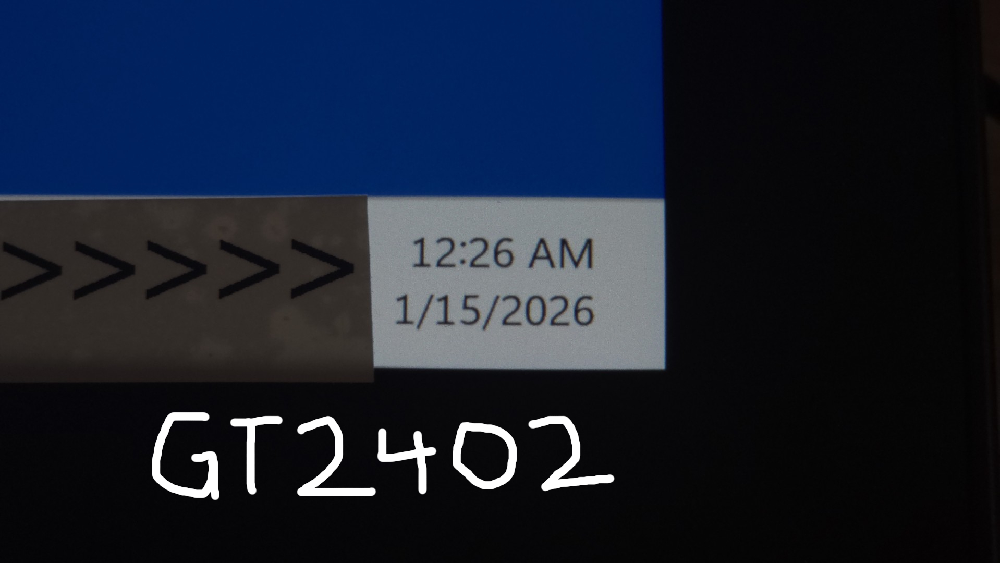
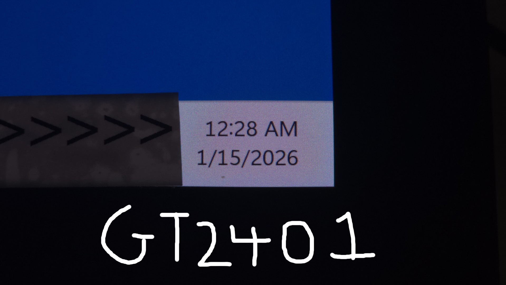
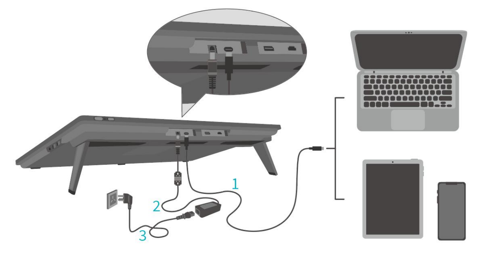

# Huion Kamvas Pro 24 GEN3 (GT2402) notes

## Overview

<mark style="color:red;">**These notes are in progress**</mark>

## Links

* [Trent Kaniuga - Huion Kamvas Pro 24 Gen 3 Review](https://www.youtube.com/watch?v=XgOq3xCci20) 2026-07-02
* [Brad Colbow - Huion Kamvas 24 Pro (Gen 3) Review](https://www.youtube.com/watch?v=QXNex8UZZi8) 2025-10-24
* [Teoh on Tech - Huion Kamvas Pro 24 (gen 3) now with TOUCH (full review)](https://www.youtube.com/watch?v=6E7fCBuXQlA) 2026-02-01&#x20;
* User manual: [https://driverdl.huion.com/instruction/Kamvas\_Pro\_24Gen3/User\_Manual\_Kamvas\_Pro\_24Gen3\_EN.pdf](https://driverdl.huion.com/instruction/Kamvas_Pro_24Gen3/User_Manual_Kamvas_Pro_24Gen3_EN.pdf)

## Digitizer specs

* Active area:
  * Dimensions: 525.89 mm x 295.81 mm
  * Diagonal: TBD
* Resolution: 200 LPmm (5080 LPI)
* Max hover: 9mm
* Tilt: ±60°
* Pressure levels: 16384
* Accuracy:
  * Center: ±0.3mm
  * Corner: ±1mm

## Display specs

* Native resolution: 3840x2160
* Pixel density: 185 PPI
* Display tech: IPS
* Laminated: YES
* Anti-glare treatment: Etched glass
* Contrast ratio: 1000:1
* Brightness: 250 nits
* Response time : 14ms
* Refresh rate: 60Hz

## Pens

### Included pens

* PW600
* PW600S

### Compatible pens

* And PW600 series pen will work

### Incompatible pens

* You can only use PW600 series pens with the tablet.
* Older pens like PW517, PW550, etc will not work with this tablet

## Display experience

### Pixel sharpness

* The GT2402 has noticeably soft pixels (presumably due to the etched glass).
* The older GT2401 is clearly sharper than the GT2402.
* To me the GT2402 was a bit softer than the Huion Kamvas Pro 19 and this might be due to the lower pixel density of the GT2402.

<figure><figcaption></figcaption></figure>

<figure><figcaption></figcaption></figure>

### Anti-glare sparkle

* The GT2402 has very little AG sparkle.
* The Older model GT2401 has a moderate about of AG sparkle.

## Drawing experience

## Connections and cabling

### Ports

* HDMI
* DIsplayPort
* USB-C (full-featured)
* Power

### HDMI connection

For HDMI you connect with three separate cables for power, video, and data.

There is no 3-in-1 cable for this tablet.

<figure><figcaption></figcaption></figure>

### DisplayPort connecton

Connects the same way as shown with the HDMI connection, except with a DisplayPort cable

### USB-C connection

You can connect this tablet with a single USB-C cable for video and data. The cable you need is provided in the box. Power will require using the separate cable.

<figure><figcaption></figcaption></figure>

### Compatible USB-C cables

* The tablet comes with compatible full-featured a USB-C cable for carrying video and data.
* My CableMatters Thunderbolt 3 USB-C cable also worked
* A CalDigit Thunderbolt 4 USB-C cable did not work - when I used it I always saw NO SIGNAL

## Non-pen inputs

### Touch

* Yes supports touch
* Worked well in Windows
* I did not test with MacOS.

### Buttons, Dials, etc.

* Tablet has no buttons

## Remotes

The tablet comes with the K40 Keydial Remote. I did not use this remote.
