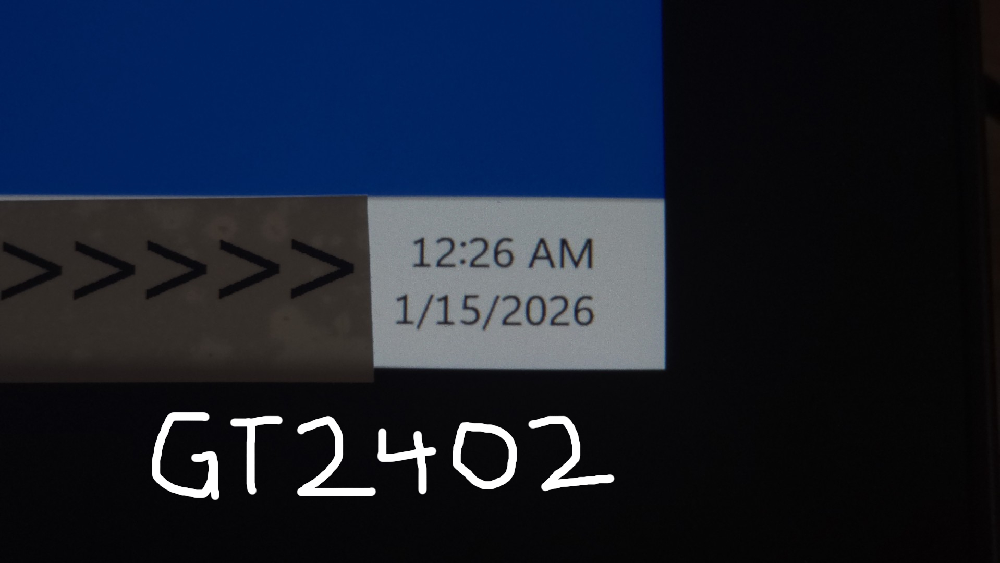
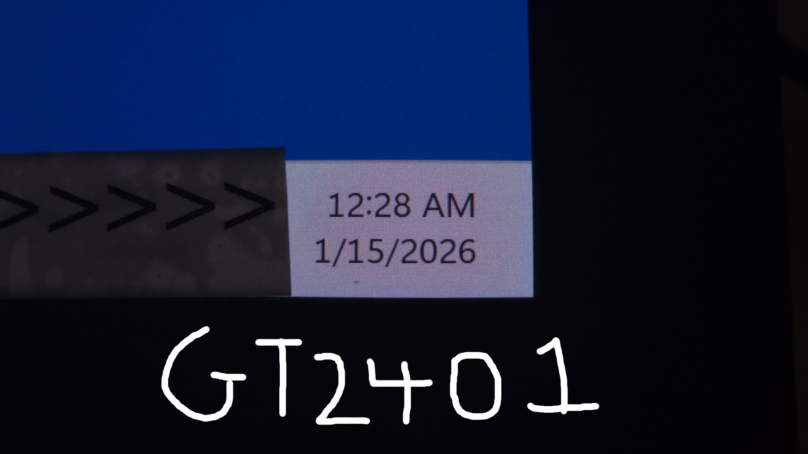
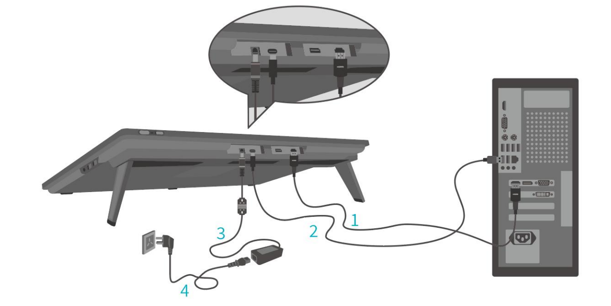
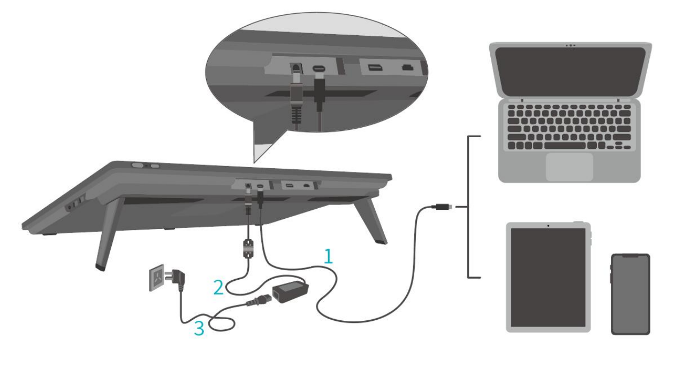

# Huion Kamvas Pro 24 GEN3 (GT2402) notes

## Overview

<mark style="color:red;">**These notes are in progress**</mark>

## Specs

These specs come from the [DrawTabData Explorer](https://thesevenpens.github.io/DrawTabDataExplorer/entity/huion.tabletfamily.huion_kamvasgen3). Click a model ID to see its full record there.



| | [GT2402](https://thesevenpens.github.io/DrawTabDataExplorer/entity/huion.tablet.gt2402) |
| --- | --- |
| Name | Kamvas Pro 24 GEN3 |
| Released | 2025-10-17 |
| Status | Available |



| | [GT2402](https://thesevenpens.github.io/DrawTabDataExplorer/entity/huion.tablet.gt2402) |
| --- | --- |
| Resolution | 3840 × 2160 |
| Aspect ratio | 16:9 |
| Pixel density | 185 PPI |
| Panel | IPS |
| Lamination | Yes |
| Anti-glare | Etched glass |
| Color gamut | sRGB 140% |
| Color depth | 10 bits per channel |
| Brightness | 220 cd/m² |
| Peak brightness | — |
| Viewing angle | 178° horizontal 178° vertical |
| Refresh rate | 60 Hz |
| Response time | 14 ms |



| | [GT2402](https://thesevenpens.github.io/DrawTabDataExplorer/entity/huion.tablet.gt2402) |
| --- | --- |
| Active area | 525.9 × 295.8 mm (20.7 × 11.6 in) |
| Diagonal | 603.4 mm (23.8 in) |
| Aspect ratio | 16:9 |
| Pen technology | Passive EMR |
| Pressure levels | 16384 |
| Tilt | ±60° |
| Accuracy (center) | ±0.3 mm |
| Accuracy (corner) | ±1 mm |
| Report rate | 260 Hz |
| Density | 200 LPmm (5080 LPI) |
| Max hover | 9 mm |



| | [GT2402](https://thesevenpens.github.io/DrawTabDataExplorer/entity/huion.tablet.gt2402) |
| --- | --- |
| Included pen | [PW600 (PW600)](https://thesevenpens.github.io/DrawTabDataExplorer/entity/huion.pen.pw600) [PW600S (PW600S)](https://thesevenpens.github.io/DrawTabDataExplorer/entity/huion.pen.pw600s) |
| Compatible pens | [PW600 (PW600)](https://thesevenpens.github.io/DrawTabDataExplorer/entity/huion.pen.pw600) [PW600S (PW600S)](https://thesevenpens.github.io/DrawTabDataExplorer/entity/huion.pen.pw600s) |



| | [GT2402](https://thesevenpens.github.io/DrawTabDataExplorer/entity/huion.tablet.gt2402) |
| --- | --- |
| Buttons | 0 |
| Dials | — |
| Touch rings | — |
| Touch strips | — |
| Touch | Yes |



| | [GT2402](https://thesevenpens.github.io/DrawTabDataExplorer/entity/huion.tablet.gt2402) |
| --- | --- |
| Size | 589.2 × 364 × 22.7 mm (23.2 × 14.3 × 0.9 in) |
| Weight | 6365 g |
| VESA mount | — |
| Legs | — |
| Included stand | — |



| | [GT2402](https://thesevenpens.github.io/DrawTabDataExplorer/entity/huion.tablet.gt2402) |
| --- | --- |
| Ports | HDMI DisplayPort USB-C (Full-featured) DC power |
| Attached cable | None |
| Bluetooth | — |



| | [GT2402](https://thesevenpens.github.io/DrawTabDataExplorer/entity/huion.tablet.gt2402) |
| --- | --- |
| Contents | — |



## Notes on specs

### Display

* Contrast ratio: 1000:1

### Pens

* Any PW600 series pen will work
* Incompatible pens
  * You can only use PW600 series pens with the tablet.
  * Older pens like PW517, PW550, etc will not work with this tablet

## Links

* [Trent Kaniuga - Huion Kamvas Pro 24 Gen 3 Review](https://www.youtube.com/watch?v=XgOq3xCci20) 2026-07-02
* [Brad Colbow - Huion Kamvas 24 Pro (Gen 3) Review](https://www.youtube.com/watch?v=QXNex8UZZi8) 2025-10-24
* [Teoh on Tech - Huion Kamvas Pro 24 (gen 3) now with TOUCH (full review)](https://www.youtube.com/watch?v=6E7fCBuXQlA) 2026-02-01&#x20;
* User manual: [https://driverdl.huion.com/instruction/Kamvas\_Pro\_24Gen3/User\_Manual\_Kamvas\_Pro\_24Gen3\_EN.pdf](https://driverdl.huion.com/instruction/Kamvas_Pro_24Gen3/User_Manual_Kamvas_Pro_24Gen3_EN.pdf)

## Display experience

### Pixel sharpness

* The GT2402 has noticeably soft pixels (presumably due to the etched glass).
* The older GT2401 is clearly sharper than the GT2402.
* To me the GT2402 was a bit softer than the Huion Kamvas Pro 19 and this might be due to the lower pixel density of the GT2402.

<figure><figcaption></figcaption></figure>

<figure><figcaption></figcaption></figure>

### Anti-glare sparkle

* The GT2402 has very little AG sparkle.
* The Older model GT2401 has a moderate about of AG sparkle.

## Drawing experience

## Connections and cabling

### HDMI connection

For HDMI you connect with three separate cables for power, video, and data.

There is no 3-in-1 cable for this tablet.

<figure><figcaption></figcaption></figure>

### DisplayPort connecton

Connects the same way as shown with the HDMI connection, except with a DisplayPort cable

### USB-C connection

You can connect this tablet with a single USB-C cable for video and data. The cable you need is provided in the box. Power will require using the separate cable.

<figure><figcaption></figcaption></figure>

### Compatible USB-C cables

* The tablet comes with compatible full-featured a USB-C cable for carrying video and data.
* My CableMatters Thunderbolt 3 USB-C cable also worked
* A CalDigit Thunderbolt 4 USB-C cable did not work - when I used it I always saw NO SIGNAL

## Non-pen inputs

### Touch

* Worked well in Windows
* I did not test with MacOS.

## Remotes

The tablet comes with the K40 Keydial Remote. I did not use this remote.
