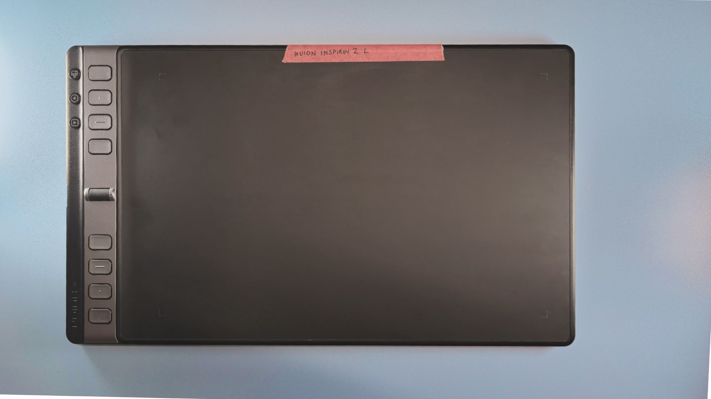
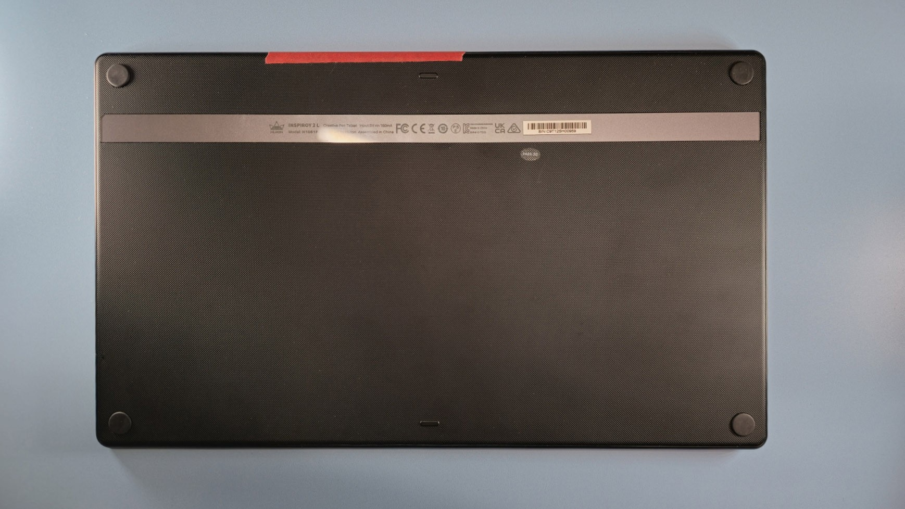
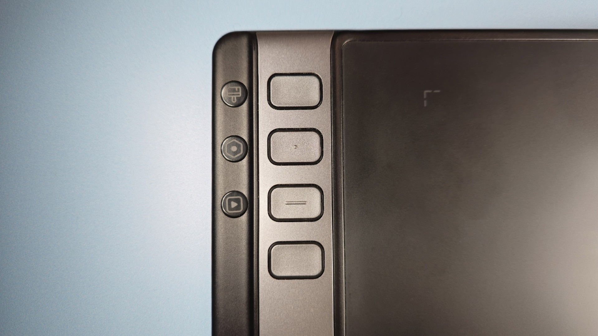
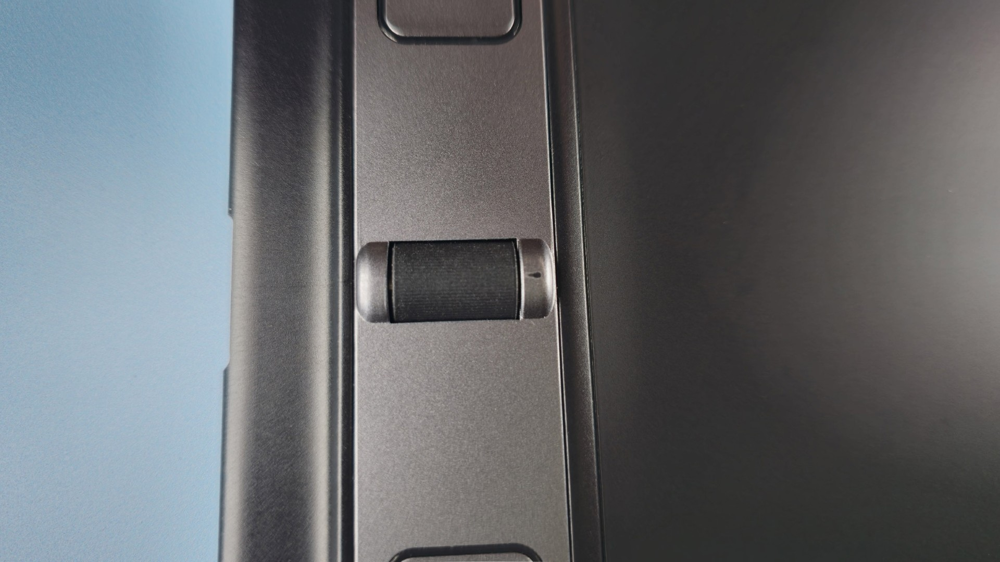
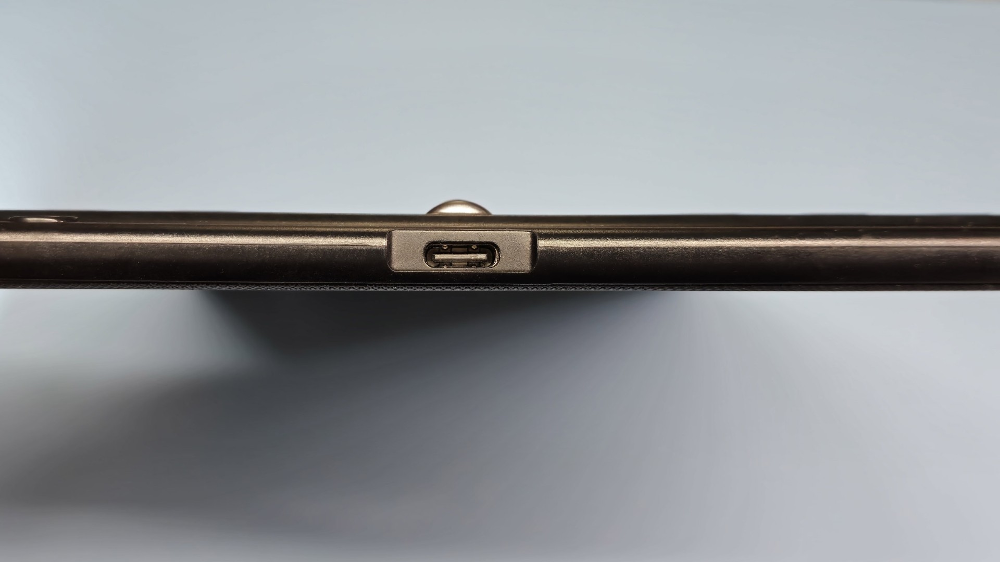

# Huion Inspiroy 2 L (H1061P) notes

## **Summary**

I tested this tablet for about a week and have periodically drawn with it since its introduction. It is a decent tablet, and the buttons and scroller are useful features. Its drawing performance is the same as the other Huion PenTech 3.x tablets from this generation.

I think it is a decent choice, but as of 2025 I hope Huion ships an upgrade that uses PenTech 4.0 with the PW600 pen which should give a very good drawing experience.

## **Links**

* Product site: [https://www.huion.com/products/pen\_tablet/Inspiroy/H1061P.html](https://www.huion.com/products/pen_tablet/Inspiroy/H1061P.html)
* [Teoh on tech review of Huion Inspiroy 2 L](https://youtu.be/mgDDBJf96U8) Feb 15, 2023
* [Create Now Sleep Later review of Huion Inspiroy 2 L](https://youtu.be/L6mgOluUApE) Apr 24, 2023
* [SweetMonia review Huion Inspiroy 2 L](https://sweetmonia.com/Sweet-Drawing-Blog/huion-inspiroy-2-l-review-a-great-elegant-tablet-with-a-comparison-to-huion-inspiroy-2-dial/) 2023-02-14

## **Pen**

This tablet comes with the Huion PW110 pen.

## **Pen compatibility**

The tablet is compatible with several pens in the PenTech 3.x series, not just the one it came with.

* PW110
* PW517 (I tested)
* PW550 (I tested)

As with all PenTech 3.x devices, I recommend purchasing the PW550 pen to use with this tablet because it provides a superior drawing experience.

## **Photos**

<figure><figcaption></figcaption></figure>

<figure><figcaption></figcaption></figure>

## **Size**

Huion uses the L in the name to identify this tablet as the "large" version in the Inspiroy 2 series, but it is not large in the absolute sense when compared to other tablets.

However, this tablet is close in size to medium tablets like the Wacom Intuos Pro Medium (PTH-660).

It is nowhere close to the true large size of something like the Wacom Intuos Pro Large (PTH-860) or the Huion Inspiroy Giano G930L.

## **Wireless**

The tablet does NOT support wireless connectivity. It must be connected with a USB cable.

## **Auxiliary inputs**

I really enjoyed the flexibility of how the buttons work with the group keys. Even though there are 8 buttons, with the three group keys, you get effectively 8x3 = 24 buttons.

<figure><figcaption>
3 group keys on left and 4 of 8 buttons shown.
</figcaption></figure>

<figure><figcaption>
The scroller
</figcaption></figure>

## **Ports**

<figure><figcaption></figcaption></figure>

## **Pressure handling**

All pens have a bit of instability or wobble at low pressure. See: [Drawing at low physical pressure](../../../core/pressure/drawing-low-pressure.md)

Originally, the units I have - I own 2 of this tablet - showed a bit more of this effect compared to my Wacom Intuos Pro with the Pro Pen 2. I did not notice it in normal drawing. Based on other users' comments, not all units seem to exhibit this problem, but certainly some do.

Firmware updates have improved it.

See this thread for some history on this topic: [https://www.reddit.com/r/huion/comments/165acwt/extremely\_unstable\_pen\_pressure\_sensitivity\_on\_a/](https://www.reddit.com/r/huion/comments/165acwt/extremely_unstable_pen_pressure_sensitivity_on_a/)

This is one of those effects (again that all tablets have) that shows up under a specific set of circumstances and not something you will run into regularly. If you do see it there are techniques to control it: [TSG: Low pressure drawing problems](../../../troubleshoot/tsg-strokes-quality-at-low-pressure.md)
