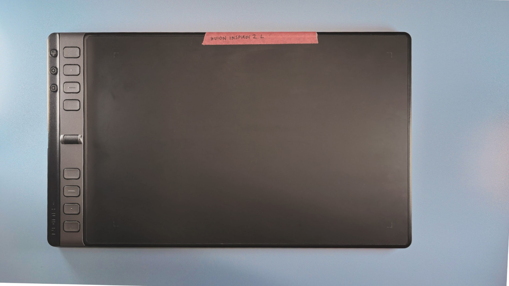
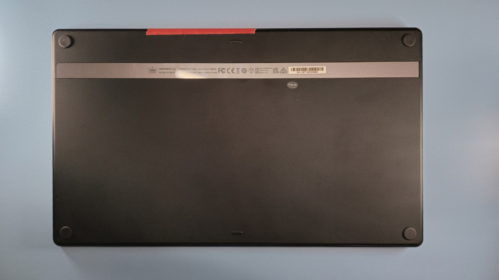
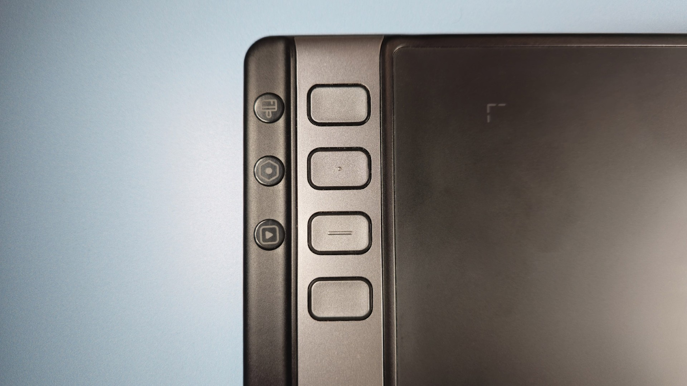
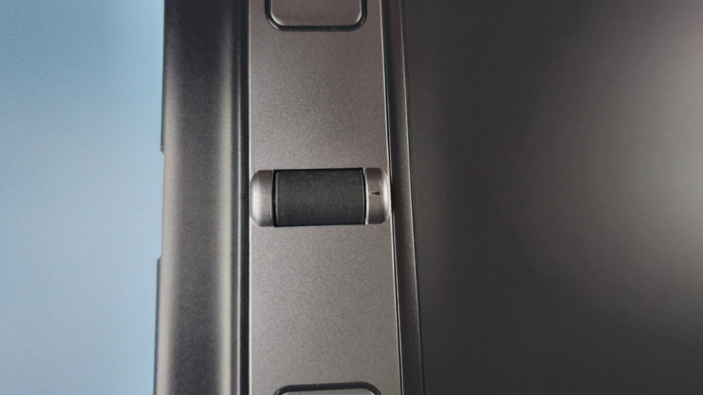
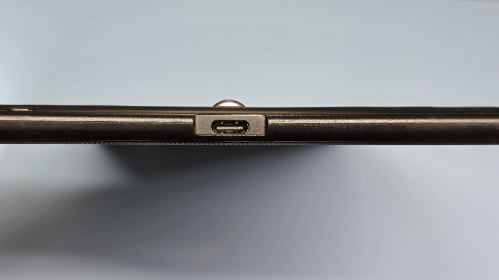

# Huion Inspiroy 2 L (H1061P) notes

## **Summary**

I tested this tablet for about a week and have periodically drawn with it since its introduction. It is a decent tablet, and the buttons and scroller are useful features. Its drawing performance is the same as the other Huion PenTech 3.x tablets from this generation.

I think it is a decent choice, but as of 2025 I hope Huion ships an upgrade that uses PenTech 4.0 with the PW600 pen which should give a very good drawing experience.

## Links

These links come from the [DrawTabData Explorer](https://thesevenpens.github.io/DrawTabDataExplorer/entity/huion.tabletfamily.huion_inspiroy2). To add or fix a link, change it in DrawTabData.

### From the manufacturer

* [Product page](https://www.huion.com/products/inspiroy-2-l)
* [Store page](https://store.huion.com/products/inspiroy-2-l)
* [Product information](https://www.huion.com/products/pen_tablet/Inspiroy/H1061P.html)

### Reviews

* [Huion Inspiroy 2 Series Pen Tablet Review: Is it Worth it?](https://youtu.be/L6mgOluUApE) - Create Now Sleep Later, 2023-04-24
* [¡HUION INSPIROY 2 L y M Las tabletas gráficas BARATAS más PREMIUM!! SE HAN SUPERADO](https://www.youtube.com/watch?v=55bgWDoC-Ks) - Gartzia Artz, 2023-02-24
* [Review: Huion Inspiroy 2 pen tablet - Works great. Good price.](https://youtu.be/mgDDBJf96U8) - Teoh on Tech, 2023-02-15
* [Huion Inspiroy 2 L Review, a great elegant tablet (with a comparison to Huion Inspiroy 2 Dial)](https://sweetmonia.com/Sweet-Drawing-Blog/huion-inspiroy-2-l-review-a-great-elegant-tablet-with-a-comparison-to-huion-inspiroy-2-dial/) - SweetMonia, 2023-02-14
* [Review: Huion Inspiroy 2 pen tablet](https://www.parkablogs.com/content/review-huion-inspiroy-2-pen-tablet) - Parka Blogs, 2023-02-11

## Specs

These specs come from the [DrawTabData Explorer](https://thesevenpens.github.io/DrawTabDataExplorer/entity/huion.tabletfamily.huion_inspiroy2). Click a model ID to see its full record there.



| | [H1061P](https://thesevenpens.github.io/DrawTabDataExplorer/entity/huion.tablet.h1061p) |
| --- | --- |
| Name | Inspiroy 2 L |
| Released | 2023-01-05 |
| Status | — |



| | [H1061P](https://thesevenpens.github.io/DrawTabDataExplorer/entity/huion.tablet.h1061p) |
| --- | --- |
| Active area | 267 × 167 mm (10.5 × 6.6 in) |
| Diagonal | 314.9 mm (12.4 in) |
| Aspect ratio | 16:10 |
| Pen technology | Passive EMR |
| Pressure levels | 8192 |
| Tilt | ±60° |
| Accuracy (center) | ±0.3 mm |
| Accuracy (corner) | — |
| Report rate | 260 Hz |
| Density | 200 LPmm (5080 LPI) |
| Max hover | 10 mm |



| | [H1061P](https://thesevenpens.github.io/DrawTabDataExplorer/entity/huion.tablet.h1061p) |
| --- | --- |
| Included pen | [PW110 (PW110)](https://thesevenpens.github.io/DrawTabDataExplorer/entity/huion.pen.pw110) |
| Compatible pens | [PW110 (PW110)](https://thesevenpens.github.io/DrawTabDataExplorer/entity/huion.pen.pw110) [PW517 (PW517)](https://thesevenpens.github.io/DrawTabDataExplorer/entity/huion.pen.pw517) [PW550S (PW550S)](https://thesevenpens.github.io/DrawTabDataExplorer/entity/huion.pen.pw550s) [PW550 (PW550)](https://thesevenpens.github.io/DrawTabDataExplorer/entity/huion.pen.pw550) |



| | [H1061P](https://thesevenpens.github.io/DrawTabDataExplorer/entity/huion.tablet.h1061p) |
| --- | --- |
| Buttons | 8 |
| Dials | — |
| Touch rings | — |
| Touch strips | — |
| Touch | No |



| | [H1061P](https://thesevenpens.github.io/DrawTabDataExplorer/entity/huion.tablet.h1061p) |
| --- | --- |
| Size | 352.5 × 208.7 × 9.5 mm (13.9 × 8.2 × 0.4 in) |
| Weight | 600 g |



| | [H1061P](https://thesevenpens.github.io/DrawTabDataExplorer/entity/huion.tablet.h1061p) |
| --- | --- |
| Ports | USB-C |
| Attached cable | — |
| Bluetooth | No |



| | [H1061P](https://thesevenpens.github.io/DrawTabDataExplorer/entity/huion.tablet.h1061p) |
| --- | --- |
| Contents | — |



## Notes on specs

### Pens

The tablet is compatible with several pens in the PenTech 3.x series, not just the one it came with. I tested the PW517 and PW550.

As with all PenTech 3.x devices, I recommend purchasing the PW550 pen to use with this tablet because it provides a superior drawing experience.

## **Photos**

<figure><figcaption></figcaption></figure>

<figure><figcaption></figcaption></figure>

## **Size**

Huion uses the L in the name to identify this tablet as the "large" version in the Inspiroy 2 series, but it is not large in the absolute sense when compared to other tablets.

However, this tablet is close in size to medium tablets like the Wacom Intuos Pro Medium (PTH-660).

It is nowhere close to the true large size of something like the Wacom Intuos Pro Large (PTH-860) or the Huion Inspiroy Giano G930L.

## **Auxiliary inputs**

I really enjoyed the flexibility of how the buttons work with the group keys. Even though there are 8 buttons, with the three group keys, you get effectively 8x3 = 24 buttons.

<figure><figcaption>
3 group keys on left and 4 of 8 buttons shown.
</figcaption></figure>

<figure><figcaption>
The scroller
</figcaption></figure>

## **Ports**

<figure><figcaption></figcaption></figure>

## **Pressure handling**

All pens have a bit of instability or wobble at low pressure. See: [Drawing at low physical pressure](../../../core/pressure/drawing-low-pressure.md)

Originally, the units I have - I own 2 of this tablet - showed a bit more of this effect compared to my Wacom Intuos Pro with the Pro Pen 2. I did not notice it in normal drawing. Based on other users' comments, not all units seem to exhibit this problem, but certainly some do.

Firmware updates have improved it.

See this thread for some history on this topic: [**r/huion - Extremely unstable pen pressure sensitivity on a brand new Inspiroy 2 L / H1061P. Anything that can be possibly done here, or is this just a faulty pen?**](https://www.reddit.com/r/huion/comments/165acwt/extremely_unstable_pen_pressure_sensitivity_on_a/) 2023-08-30

This is one of those effects (again that all tablets have) that shows up under a specific set of circumstances and not something you will run into regularly. If you do see it there are techniques to control it: [TSG: Low pressure drawing problems](../../../troubleshoot/tsg-strokes-quality-at-low-pressure.md)
