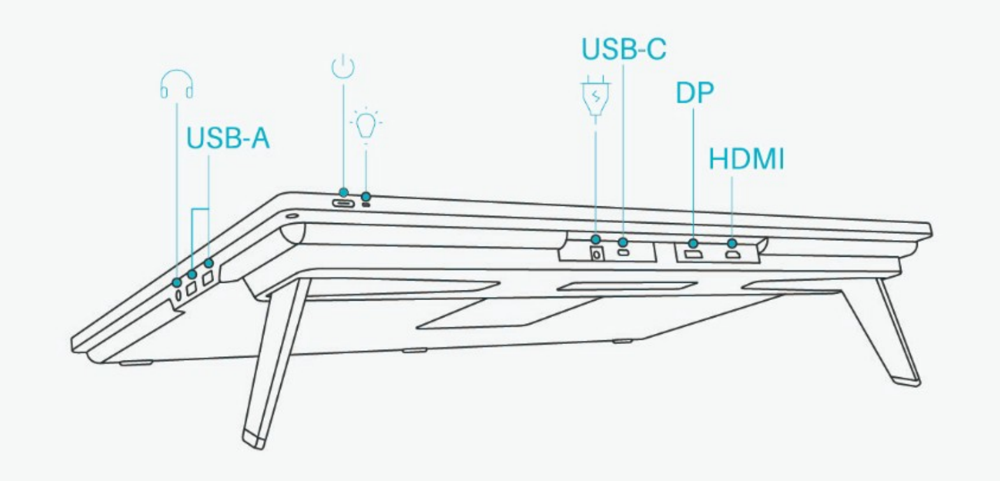

# Huion Kamvas Pro 24 4K (GT2401) notes

## **Summary**

I've been very satisfied with this tablet.

## Basics

* User manual [https://www.huion.com/manaul\_pdf/de/Kamvas%20Pro%2024(4K).pdf](https://www.huion.com/manaul_pdf/de/Kamvas%20Pro%2024\(4K\).pdf)

## **Links**

* User manual: [https://www.huion.com/user-manual-90](https://www.huion.com/user-manual-90)
* [MossCharmly 2 year review Huion Kamvas Pro 24 4K](https://www.youtube.com/watch?v=XwD_7x2S-7g) 2023-12-09
* [Brad Colbow review of Review of Huion Kamvas Pro 24 4K](https://www.youtube.com/watch?v=HvQxDrzgbOo) 2021-09-02
* [Teoh Yi Chie review of Huion Kamvas Pro 24 4K ](https://www.youtube.com/watch?v=r8k5qsgJXlM)2021-09-17

## **Cost**

This Huion tablet not cheap at about $1300. But sometimes it is on sale at $1000.

## **Compared to Wacom**

* This is Huion's highest end pen display in 2023.
  * In 2025, Huion's has a newer, better high end models: The Kamvas Pro 19 and Kamvas Pro 27.
* Its competitor is the Wacom Cintiq Pro 27. Let me be clear, the Cintiq Pro 27 is a better tablet. But this tablet delivers a LOT for value for it's price. This Huion tablet delivers 90% of what you need for drawing compared to the Cintiq Pro 27's which costs $3500.

## **Pointer tracking accuracy**

Good. Like all pen displays slightly inaccurate in the edges and corner by a couple of millimeters. More accurate in edges/corners than the Huion Kamvas 22 Plus.

## **Pointer lag**

Normal for a pen display. Slightly more than the Cintiq Pro 27.

## **Stand**

does not come with a stand.

## **Legs**

Has bult-in legs that give it a nice drawing angle.

## VESA support

YES. The tablet is VESA mountable.

## Anti-glare sparkle

Moderate (maybe on the low end). Noticeable if you put your eyes close. At a normal drawing distance my eyes don't pick it up or at least it looks minimal.

## Auxiliary inputs

It has no buttons, dials, etc. So, I use a TourBox device. More here: [**tourbox**](../../../accessories/auxiliary-input-devices/tourbox/)

## **Texture**

The etched glass provides a nice texture for the pen so that it doesn't feel slippery.

## **Heat**

Display stays cool to the touch - maybe sometimes slightly warm. No hot spots.

## **Scenario**

I bought this tablet for digital art, and it works fine for that. I have used it as a secondary display at it works fine for that purpose also. But most of the time I only use it when I want to draw.

## Diagonal wobble

Rating: GOOD (LOW AMOUNT OF WOBBLE)

Wobble is minor and only noticeable in very slow strokes.

.png>)

## Connections and cabling

## Ports

* Power
* USB-C
* DisplayPort
* HDMI
* 2x USB-A ports on right side
* Headphone jack on right side

<figure><figcaption></figcaption></figure>

## How I connect it

There are two cables running from the tablet.

* display signal and data - I connect it via a single USB-C Thunderbolt 3 cable to one my Surface Pro 8's 2 USB-C Thunderbolt 4 ports.
* power - I connect it using Huion's power adapter to the wall.

**Connection quirks**

When connected to my Surface pro 8 via USB-C, when the Surface Pro sleeps, every 20 seconds the Kamvas shows a no signal and power saving message and the Surface Pro keeps playing The "USB device connected" & "USB device disconnected" sounds, this pattern reoccurs every 20 seconds ad infinitum.

To stop it, I simply disconnect the USB-C cable from the Surface Pro.

I'm not sure what the issue is but I suspect its some interaction with the sleep mode of the Surface Pro.

I did not see this in the other devices I tried, so I am not sure how prevalent it is.

Once the Surface Pro is awake, everything works normally.
