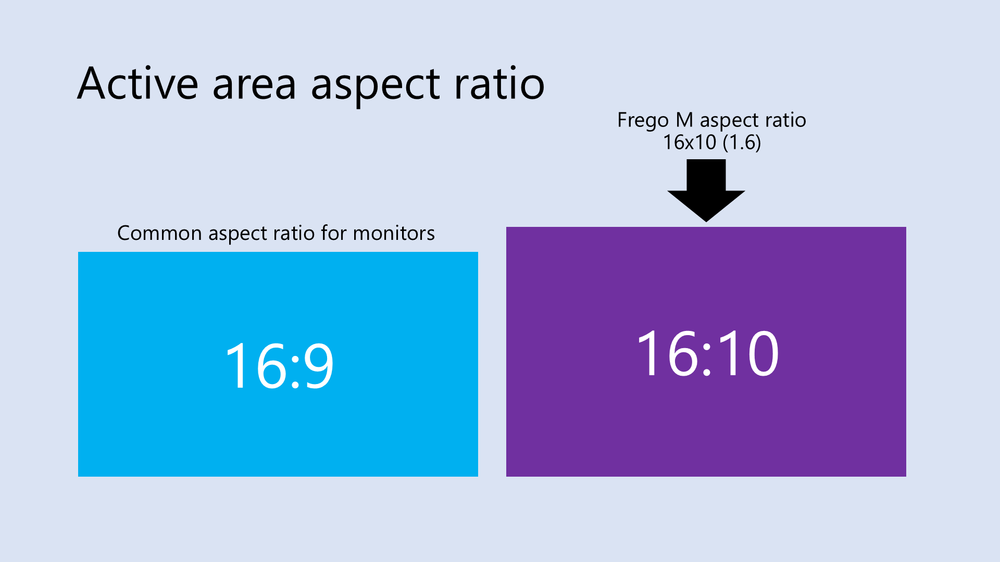
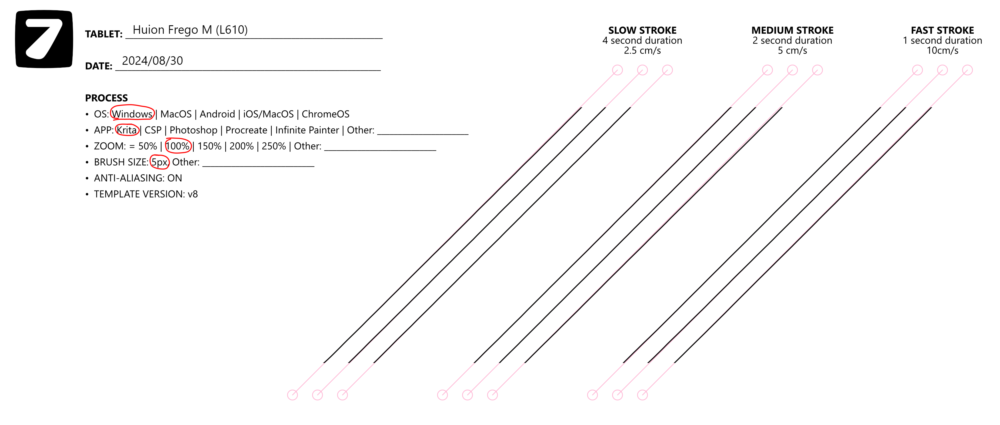
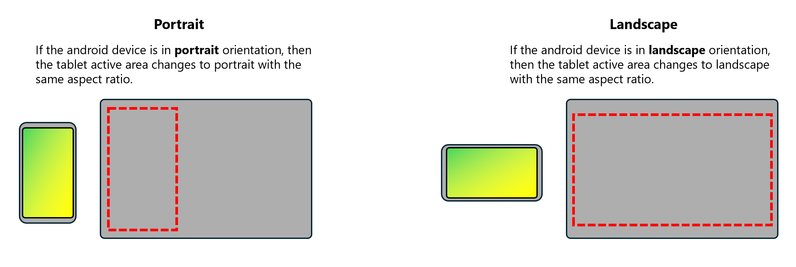
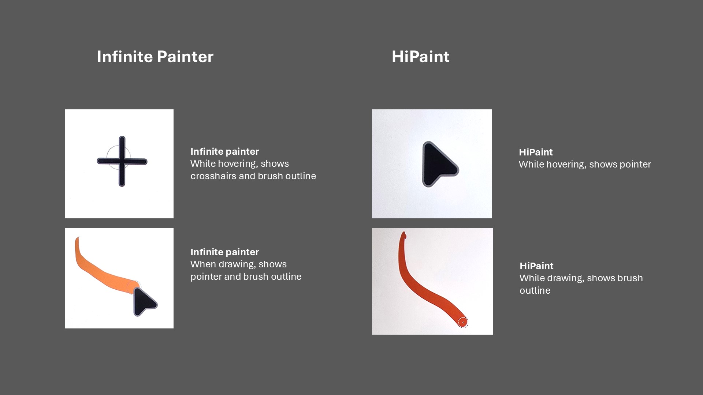
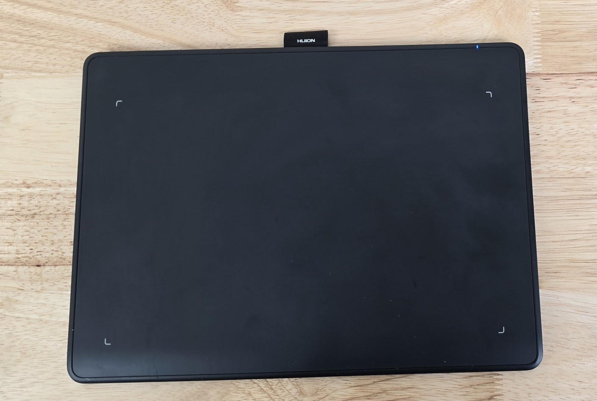
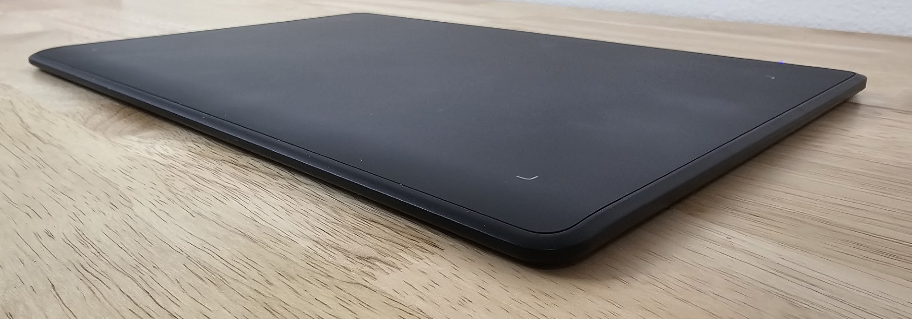
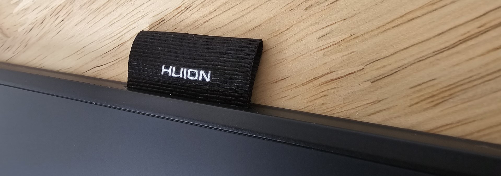
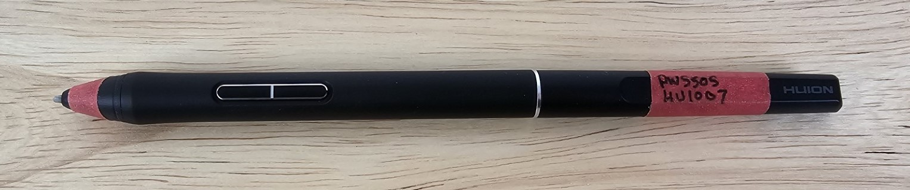
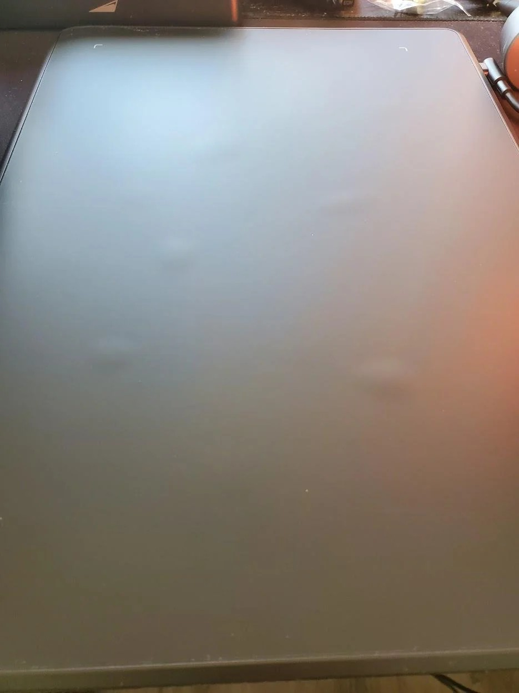

# Huion Inspiroy Frego M (L610) notes

## Overview

This is a great entry-level tablet. It does all the basics extremely well.

* A good simple tablet. Nothing fancy.
* Good for beginners.
* If you have an older Huion tablet it might be a good upgrade.
* The pen it came with had a very wide pressure range. This range is very good. Pen IAF was typical of Huion, meaning slightly higher than Wacom's pro pens.
* <mark style="color:red;">**See the known issues section at the bottom.**</mark> Some users have reported a problem with air bubbles appearing under the surface.

## Companion video



## Links

* Product pages
  * [https://www.huion.com/products/pen\_tablet/Inspiroy/Inspiroy-Frego-M.html](https://www.huion.com/products/pen_tablet/Inspiroy/Inspiroy-Frego-M.html)
  * [https://www.huion.com/products/pen\_tablet/Inspiroy/Inspiroy-Frego-S.html](https://www.huion.com/products/pen_tablet/Inspiroy/Inspiroy-Frego-S.html)
* Parka Blogs - [Review of Huion Frego M (L610) & S (L310)](https://www.parkablogs.com/content/huion-inspiroy-frego-drawing-pen-tablet) 2024-08-22
* Create Now Sleep Later - [Review of Huion Inspiroy Frego (L610)](https://www.youtube.com/watch?v=OpVhKZVFusQ) 2024-09-01

## Basics

* Product page: [https://www.huion.com/products/pen\_tablet/Inspiroy/Inspiroy-Frego-M.html](https://www.huion.com/products/pen_tablet/Inspiroy/Inspiroy-Frego-M.html)
* Release year: 2024
* User manual: [https://driverdl.huion.com/instruction/en/User\_Manual\_inspiroy\_frego\_EN.pdf](https://driverdl.huion.com/instruction/en/User_Manual_inspiroy_frego_EN.pdf)

## Size 

This is a medium-sized tablet, with an active area slightly larger than Wacom Intuos Pro Medium (PTH-660).

* Huion Frego M (L610):
  * Dimensions: 10 x 6.25”
  * Diagonal length: 11.79”
* Wacom Intuos Pro Medium (PTH-660):
  * Dimensions: 8.7 x 5.8”
  * Diagonal length: 10.57”

In terms of paper sizes this is about the size of an A5 sheet of paper which has a diagonal length of 10.13"

## Aspect Ratio

16:10 — which is common for drawing tablets.

<figure><figcaption></figcaption></figure>

### **Build quality and design** 

Looks very simple and nice. Is very good. I wouldn't say it has a premium look.

**Color** - matte black all around

**Huion branding** - On the front, nothing is visible. On the back, the Huion logo is very slightly visible as recessed shiny black plastic.

**Lights**

* green LED on upper right indicating USB connection
* blue LED on upper right indicating Bluetooth operation

## Pens

* Comes with the Huion PW550S pen.
* Default nib: felt.
  * I found this a little unusual because the tablet came with 10 replacement plastic nibs.
* More here: [Huion PW550 series pens notes](../../pens/huion-pens/huion-pw550-notes.md)

## Other compatible pens

* You can use the Huion PW517 pen with this tablet. But it is not as good as the PW550 and PW550S.

## Pen pressure

* **IAF** - The specific pen I had seemed to have a typical IAF (I am not good at measuring) for a Huion PenTech 3.0+ pen. It seemed to be near 3gf as Huion stated.
* **Max pressure** - The max pressure of the PW550S that came with the tablet was very high - about 735gf.
* More here: [Huion PW550 series pens notes](../../pens/huion-pens/huion-pw550-notes.md)

## Pointer lag

VERY LOW - Typical for a pen tablet. Just a tiny tiny bit more lag than a Wacom in my opinion. This lag is fine and will not affect drawing.

## Touch

NONE. This tablet does NOT support touch.

## Auxiliary inputs

The tablet has no buttons, dials, or sliders.

## Replaceable surface

No. The surface is not replaceable.

## Surface texture

Has a nice amount of surface texture.

**With a felt nib** - It feels like it has even more texture than a Wacom Intuos Pro (PTH-x60 series) which is widely known as having a heavily textured surface.

**With a plastic nib** - it felt like slightly less texture than a Wacom Intuos Pro (PTH-x60 series).

**Texture sound** - Moving the pen (with the felt nib installed) across the surface also produces a clearly audible squeaky sound. You may or may not like that. I prefer my tablets essentially silent. I switched to one of the plastic nibs and then it had a normal amount of noise and no squeaking.

## Cables and connections

**Wireless** - yes supports wireless via Bluetooth. I did not test this.

**Ports** - a single USB-C port in the upper-left edge.

## Ergonomics

* The bottom edge slopes down a bit to make it more comfortable for your arm. This is starting to appear more often in recently released tablets.

## Diagonal wobble

EXCELLENT - almost no perceptible diagonal wobble.

<figure><figcaption></figcaption></figure>

## Recommended pressure curve

As is typical for EMR pens, I recommend a pressure curve to reduce the sensitivity at the low end of the physical pressure range.

## Pressure transition (low-high-low)

VERY GOOD. Tested with a 300px brush. Pressure transitions smoothly. There is a little pressure wobble at the extreme low end when the pen is very vertical, but that is normal even for the best pens. Use a pressure curve to address it if needed.

## Pressure scan rate testing

EXCELLENT. I drew 50 small strokes as fast as I could. The tablet registered all 50 strokes.

## Tilt Compensation

OK. Minor displacement at 45°. Totally acceptable for drawing. Likely not noticeable.

Not quite as good as the Wacom Intuos Pro which has excellent tilt compensation.

## Other features

**Pen holder** - a cloth loop affixed on the top edge serves as a convenient pen holder.

## Android Usage

This tablet works very well with Android. In fact, this is the first tablet I have seen that works well out of the box.

Note that the Huion Inspiroy Frego S also works well with Android but slightly differently. See Teoh on Tech's review of the Frego where he explains the difference.

**Devices tested**

All the devices listed below worked well with the Frego.

* Samsung Galaxy Tab S8 Ultra
* Samsung Galaxy Tab S9FE
* Samsung Galaxy S24 Ultra

**Wired vs Wireless**

* Wireless - I connected via Bluetooth. And it worked.
* Wired - Huion says it should work with when using a USB-C cable. I was not able to make this work. That may be my fault. Still investigating. (Huion clearly demonstrated that this is possible in this video: [https://www.youtube.com/watch?v=Oq6KeACQo68](https://www.youtube.com/watch?v=Oq6KeACQo68))

**Orientation**

The Frego M tablet should stay in its normal landscape orientation. The Android device can be in either landscape or portrait orientation. The tablet will adjust its active area as needed.

<figure><figcaption></figcaption></figure>

**Aspect ratio mapping**

When connected to Android, the tablet sets its active area to match the aspect ratio of the Android device display. This means there is no distortion of shapes. If you draw a circle on the tablet, it will draw a circle on the Android device.

**Cursor/Pointer**

NOTE: What I describe below is an interaction between Android and applications. It has nothing to do with the tablet.

Android apps seem inconsistent with how they show cursors. I will contact the creators of these apps and suggest how they should work. Which in my opinion should be: (1) on hover, show the brush outline (2) while drawing show the brush outline.

<figure><figcaption></figcaption></figure>

**Bluetooth pointer lag**

Even with Bluetooth the pen felt very responsive when drawing on an Android device. I didn't notice any lag or skips.

**Bluetooth > switching devices**

I paired it with Android device A. But to pair it with Android device B, I had to go to device A and end the pairing. After that, it worked with device B.

## Photos

.jpg>) .jpg>)

 .jpg>)

 

<figure><figcaption>
PW550S. I put red tape on the pen so I can track it in my inventory
</figcaption></figure>

## Known issues

### Air bubbles

Some users report that "air bubbles" appear under the tablet surface. Sometimes these bubbles have appeared after the first day of usage and sometimes only after some time.

<figure><figcaption></figcaption></figure>

This problem is present, but does not appear super widespread. The vast majority of users don't mention any bubbles. I personally have not run into these bubbles.

If you do encounter this problem, contact Huion support for a replacement.

Examples:

* [https://www.reddit.com/r/huion/comments/1iltd0r/brand\_new\_inspiroy\_frego\_m\_has\_air\_bubbles\_under/](https://www.reddit.com/r/huion/comments/1iltd0r/brand_new_inspiroy_frego_m_has_air_bubbles_under/)
* [https://www.reddit.com/r/huion/comments/1qg6ziq/bubbles\_on\_huion\_inspiroy\_frego\_m/](https://www.reddit.com/r/huion/comments/1qg6ziq/bubbles_on_huion_inspiroy_frego_m/)
*
