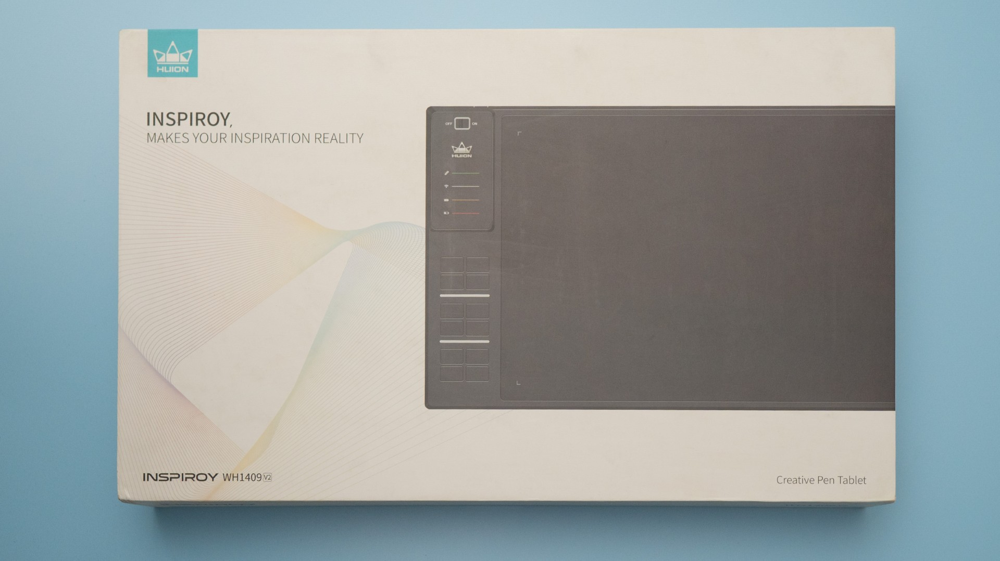
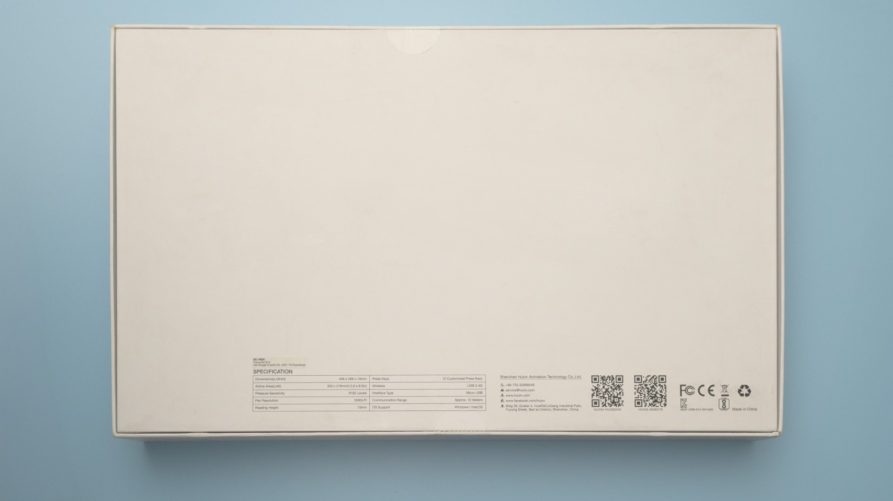

# Huion Inspiroy WH1409V2 notes

<figure><figcaption></figcaption></figure>

<figure><figcaption></figcaption></figure>

## Specs

These specs come from the [DrawTabData Explorer](https://thesevenpens.github.io/DrawTabDataExplorer/). Click a model ID to see its full record there.



| | [WH1409V2](https://thesevenpens.github.io/DrawTabDataExplorer/entity/huion.tablet.wh1409v2) |
| --- | --- |
| Name | Inspiroy WH1409 V2 |
| Released | 2018 |
| Status | Discontinued |
| Included pen | [PW500 (PW500)](https://thesevenpens.github.io/DrawTabDataExplorer/entity/huion.pen.pw500) |



| | [WH1409V2](https://thesevenpens.github.io/DrawTabDataExplorer/entity/huion.tablet.wh1409v2) |
| --- | --- |
| Active area | 350 × 218 mm (13.8 × 8.6 in) |
| Pen technology | Passive EMR |
| Pressure levels | 8192 |
| Tilt | ±60° |
| Report rate | 220 Hz |
| Density | 200 LPmm (5080 LPI) |
| Max hover | 10 mm |



| | [WH1409V2](https://thesevenpens.github.io/DrawTabDataExplorer/entity/huion.tablet.wh1409v2) |
| --- | --- |
| Buttons | — |
| Dials | — |
| Touch rings | — |
| Touch strips | — |
| Touch | No |



| | [WH1409V2](https://thesevenpens.github.io/DrawTabDataExplorer/entity/huion.tablet.wh1409v2) |
| --- | --- |
| Size | 456 × 266 × 15 mm (18 × 10.5 × 0.6 in) |
| Weight | 1100 g |



| | [WH1409V2](https://thesevenpens.github.io/DrawTabDataExplorer/entity/huion.tablet.wh1409v2) |
| --- | --- |
| Ports | — |
| Attached cable | — |
| Bluetooth | — |



