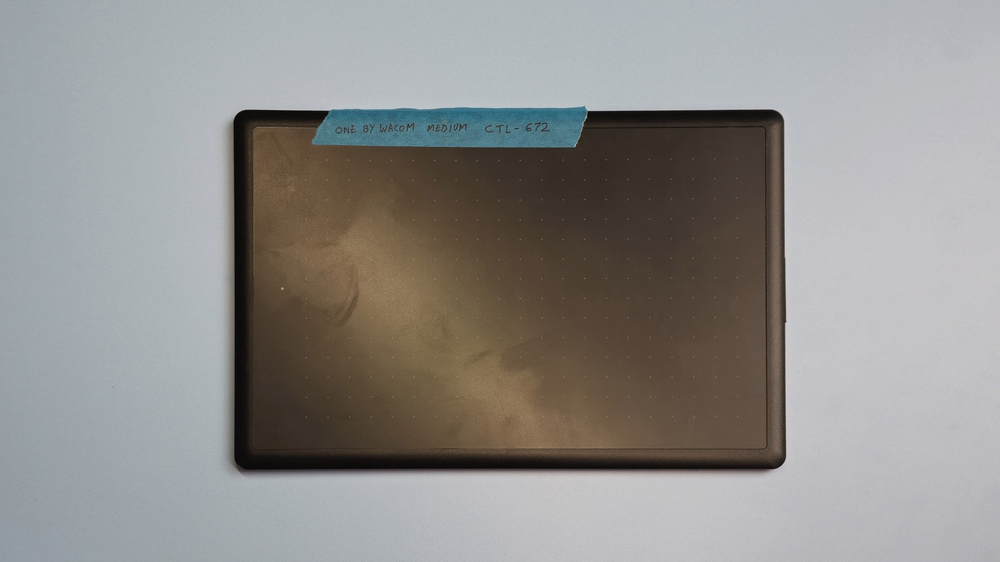
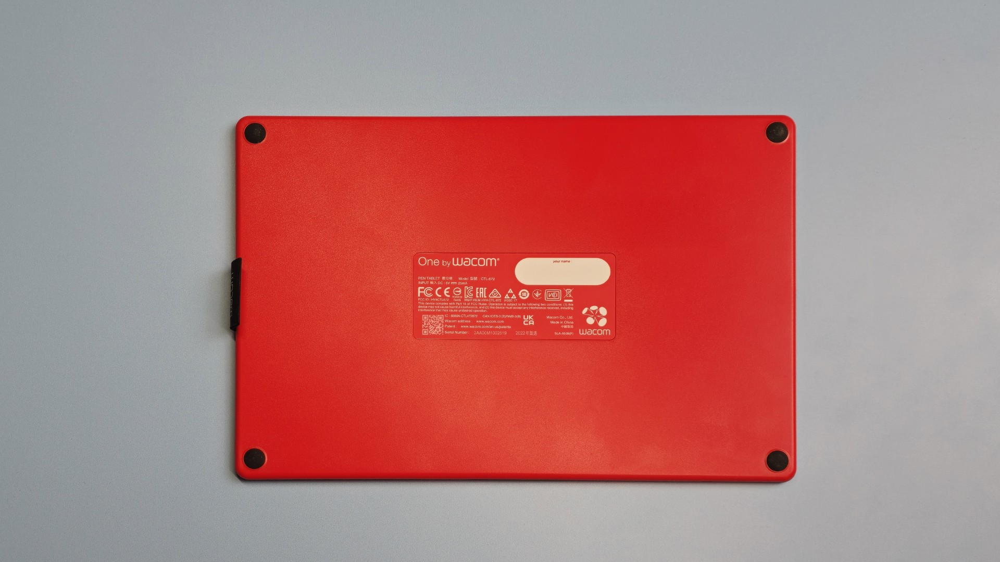
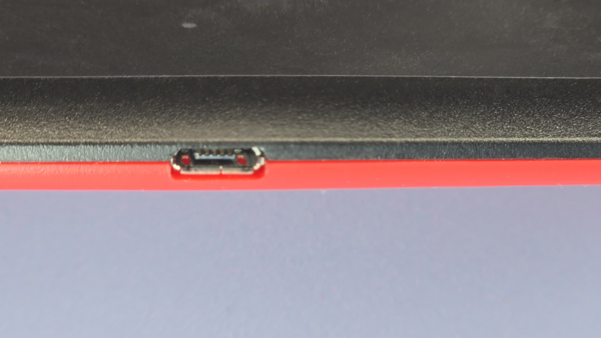
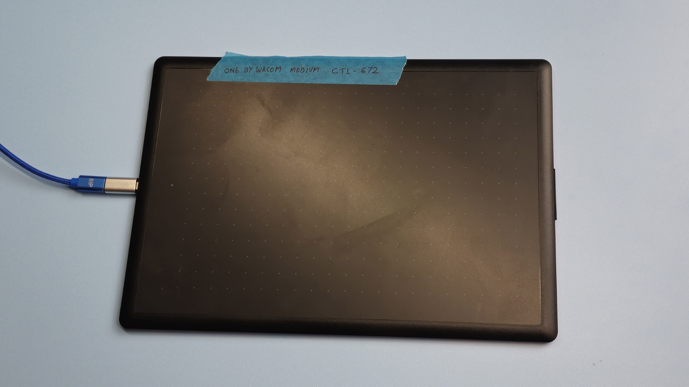
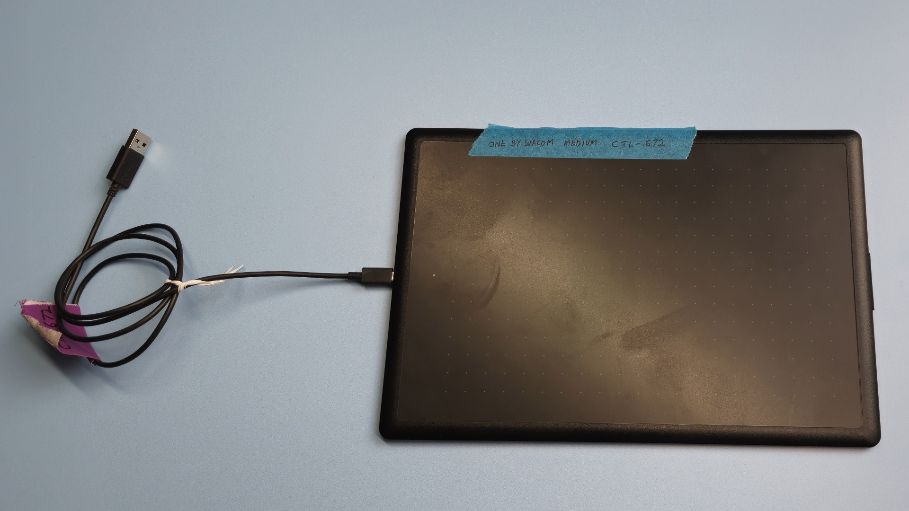
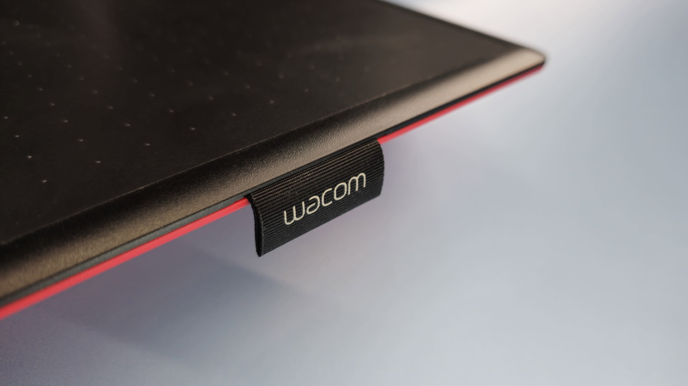
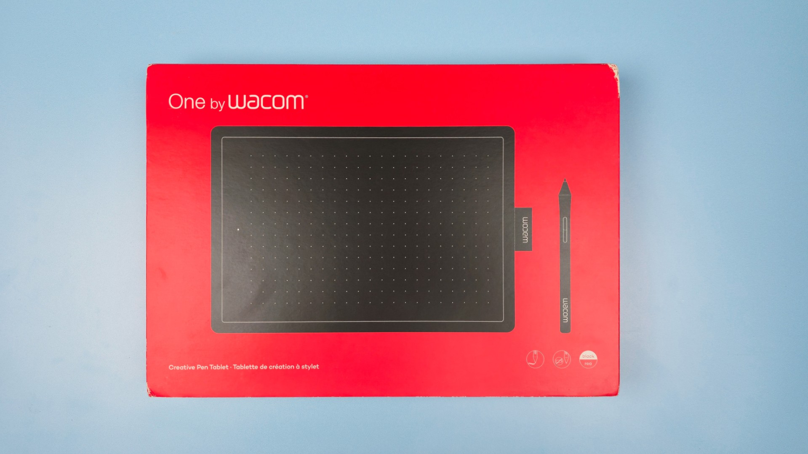
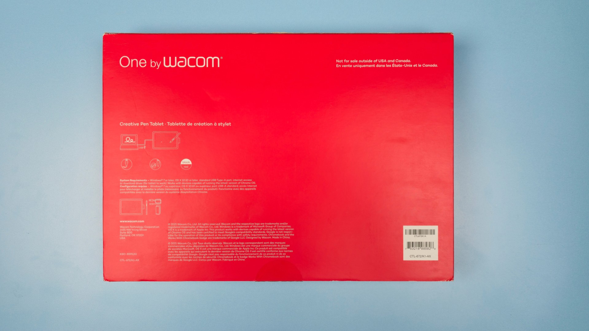

# One by Wacom (CTL-x72) notes

## Overview

The One by Wacom series of pen tablets (CTL-672 and CTL-472) are very good tablets. I highly recommend them for beginners. They are very reliable, have a good drawing experience, and let you explore drawing tablets without spending too much.

## Availability

* Availability - As of December 2025, retail inventories of these tablets have greatly diminished. It is getting very hard to find one. And the new ones you can find are often marked up to a much higher price.
* Some models are still available on eBay. More here: [Buying used drawing tablets](../../../../buying/used-drawtabs.md)

## Future

There is NOT a modern Wacom tablet that is a direct successor to this tablet. Officially, Wacom seems to want people to use the Wacom One 2023 (CTC-x6110WL0) pen tablets. But these tablets are not good, and I do not even recommend them. More here: [Wacom One 2023 pen tablets (CTC-x110WL) notes](../wacom-one/wacom-ctcx110wl-notes.md)

### &#x20;

## Basics

### Product information

* One by Wacom Medium
  * Model number: CTL-672
  * Product page: [https://www.wacom.com/en-us/products/one-by-wacom](https://www.wacom.com/en-us/products/one-by-wacom) ([archive](https://archive.is/wip/PFbRz))
  * User manual: [https://101.wacom.com/UserHelp/en/TOC/CTL-672.htm](https://101.wacom.com/UserHelp/en/TOC/CTL-672.html)
* One by Wacom Small
  * Model number: CTL-472
  * Product page: [https://www.wacom.com/en-us/products/one-by-wacom](https://www.wacom.com/en-us/products/one-by-wacom) ([archive](https://archive.is/wip/PFbRz))
  * User manual: [http://101.wacom.com/UserHelp/en/TOC/CTL-472.html](http://101.wacom.com/UserHelp/en/TOC/CTL-472.html)

### Active area

Diagonal

* Small CTL-472: 179.25 mm (7.06 in)
* Medium CTL-672: 254.72 mm (10.03 in)

Aspect ratio:

* Small: 1.78:1 (16:9)
* Medium: 1.60:1 (16:10)

## **Photos**

<figure><figcaption>
CTL-672 front
</figcaption></figure>

<figure><figcaption>
CTL-672 back
</figcaption></figure>

## Specs

These specs come from the [DrawTabData Explorer](https://thesevenpens.github.io/DrawTabDataExplorer/entity/wacom.tabletfamily.wacom_onebywacom_2019). Click a model ID to see its full record there.



| | [CTL-472](https://thesevenpens.github.io/DrawTabDataExplorer/entity/wacom.tablet.ctl472) | [CTL-672](https://thesevenpens.github.io/DrawTabDataExplorer/entity/wacom.tablet.ctl672) |
| --- | --- | --- |
| Name | One by Wacom Small | One by Wacom Medium |
| Released | 2019-05-10 | 2019-05-10 |
| Status | Available | Available |
| Included pen | [2K Pen (LP-190K)](https://thesevenpens.github.io/DrawTabDataExplorer/entity/wacom.pen.lp190k) | [2K Pen (LP-190K)](https://thesevenpens.github.io/DrawTabDataExplorer/entity/wacom.pen.lp190k) |



| | [CTL-472](https://thesevenpens.github.io/DrawTabDataExplorer/entity/wacom.tablet.ctl472) | [CTL-672](https://thesevenpens.github.io/DrawTabDataExplorer/entity/wacom.tablet.ctl672) |
| --- | --- | --- |
| Active area | 152 × 95 mm (6 × 3.7 in) | 216 × 135 mm (8.5 × 5.3 in) |
| Pen technology | Passive EMR | Passive EMR |
| Pressure levels | 2048 | 2048 |
| Tilt | None | None |
| Report rate | 133 Hz | 133 Hz |
| Density | 100 LPmm (2540 LPI) | 100 LPmm (2540 LPI) |
| Max hover | — | — |



| | [CTL-472](https://thesevenpens.github.io/DrawTabDataExplorer/entity/wacom.tablet.ctl472) | [CTL-672](https://thesevenpens.github.io/DrawTabDataExplorer/entity/wacom.tablet.ctl672) |
| --- | --- | --- |
| Buttons | 0 | 0 |
| Dials | 0 | 0 |
| Touch rings | — | — |
| Touch strips | — | — |
| Touch | No | No |



| | [CTL-472](https://thesevenpens.github.io/DrawTabDataExplorer/entity/wacom.tablet.ctl472) | [CTL-672](https://thesevenpens.github.io/DrawTabDataExplorer/entity/wacom.tablet.ctl672) |
| --- | --- | --- |
| Size | 210 × 146 × 8.7 mm (8.3 × 5.7 × 0.3 in) | 277 × 189 × 8.7 mm (10.9 × 7.4 × 0.3 in) |
| Weight | 260 g | 447 g |



| | [CTL-472](https://thesevenpens.github.io/DrawTabDataExplorer/entity/wacom.tablet.ctl472) | [CTL-672](https://thesevenpens.github.io/DrawTabDataExplorer/entity/wacom.tablet.ctl672) |
| --- | --- | --- |
| Ports | Micro-USB | Micro-USB |
| Attached cable | None | None |
| Bluetooth | No | No |



## Pressure and tilt

* **Pressure Levels** - This may seem low when you see other tablets rated at 8K or 16K pressure levels. Do not worry. 2048 is enough pressure levels for creative tasks. This is absolutely not going to affect the quality of the art you can make with this tablet. I maintain all you need are about 2000 levels of pressure.
* **Tilt** - this tablet does NOT support tilt
  * For a beginner this may not be an issue. Many people do not need tilt.

## **Pens**

### **Included pen**

The tablet comes with a Wacom 2K Pen (LP-190K). This is a standard 2-button pen. And actually quite a good one. More here: [Wacom 2K Pen (LP-190K)](../../../pens/wacom-pens/wacom-lp190k-notes.md)

### Pen compatibility

* This tablet ONLY works with the Wacom 2K Pen (LP-190K).

## **Cabling and connectivity**

* **Cable** - the tablet comes with a Micro USB to USB-A cable. You can use this cable or any cable that supports data.
  * Instead of this cable, I used my own USB-C to USB-A cable and used a Male Micro USB to Female USB-C adapter. This specific one: [https://www.amazon.com/gp/product/B0BDLB86RT/](https://www.amazon.com/gp/product/B0BDLB86RT/)
* **Ports** - the port on the tablet is Micro USB. Micro USB is not reversible, unlike USB-C, so make sure you are connecting a cable in the right orientation.

<figure><figcaption>
Micro USB port on the left side of the tablet
</figcaption></figure>

<figure><figcaption>
Tablet connected with a 3rd party cable and a Micro USB adapter
</figcaption></figure>

<figure><figcaption>
Tablet connected with the cable that came with the tablet
</figcaption></figure>

## **Pen holder**

A small cloth loop on the right side of the tablet can be used to hold the pen.

<figure><figcaption></figcaption></figure>

## Surface texture

There is a slight amount of texture on the surface to keep the pen from feeling "slippery" on the surface. The amount of texture is pretty average for a modern pen tablet.

## Usage scenario

### Osu!

The CTL-x72 series tablets are **highly recommended for playing osu!** More here: [Osu! recommendations](../../../../recs/scenario-recs/osu-recs.md)

## **Box photos**

<figure><figcaption></figcaption></figure>

<figure><figcaption></figcaption></figure>
