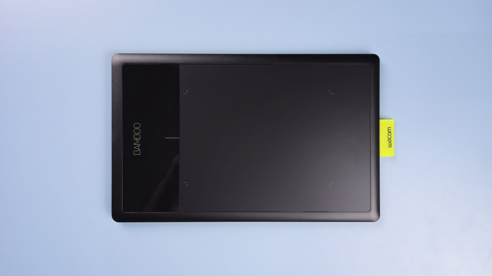
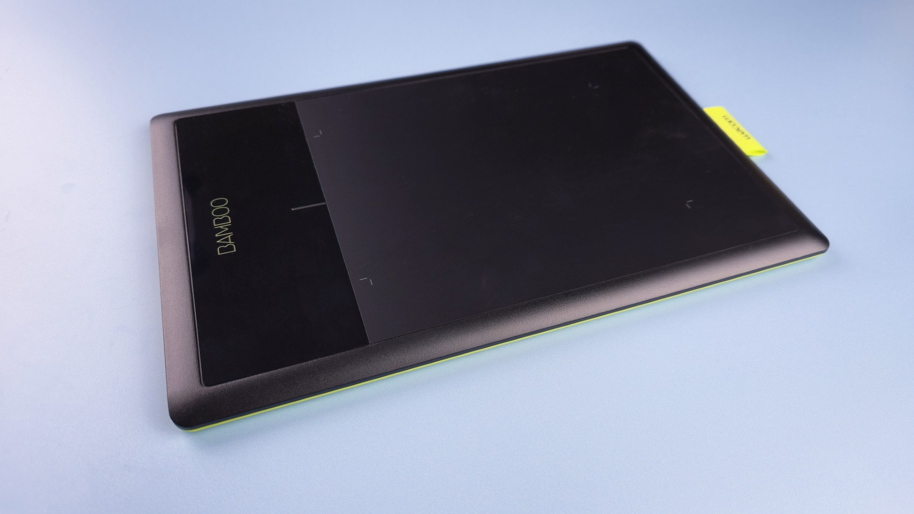
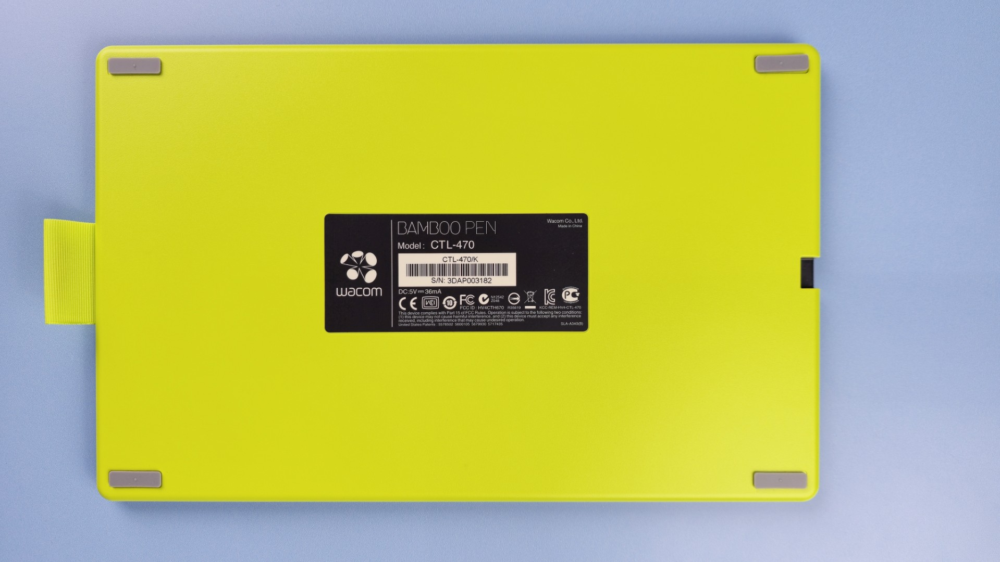
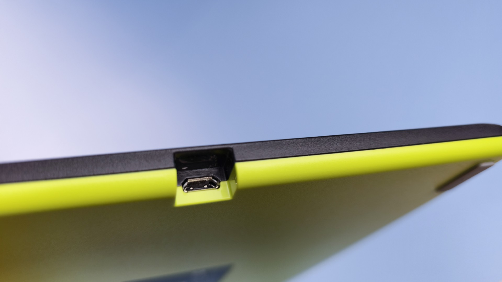

# Wacom Bamboo (CTL-470) notes

## Names

This tablet was sold under different names and with different packaging and artwork:

* Bamboo
* Bamboo Splash
* Bamboo Connect

## Links

These links come from the [DrawTabData Explorer](https://thesevenpens.github.io/DrawTabDataExplorer/entity/wacom.tabletfamily.wacom_bamboo_2011). To add or fix a link, change it in DrawTabData.

DrawTabData has no links for this tablet yet.

## Specs

These specs come from the [DrawTabData Explorer](https://thesevenpens.github.io/DrawTabDataExplorer/entity/wacom.tabletfamily.wacom_bamboo_2011). Click a model ID to see its full record there.



| | [CTL-470](https://thesevenpens.github.io/DrawTabDataExplorer/entity/wacom.tablet.ctl470) |
| --- | --- |
| Name | Bamboo Connect |
| Released | 2011-09-27 |
| Status | Discontinued |



| | [CTL-470](https://thesevenpens.github.io/DrawTabDataExplorer/entity/wacom.tablet.ctl470) |
| --- | --- |
| Active area | 147.2 × 92 mm (5.8 × 3.6 in) |
| Diagonal | 173.6 mm (6.8 in) |
| Aspect ratio | 16:10 |
| Pen technology | Passive EMR |
| Pressure levels | 1024 |
| Tilt | — |
| Accuracy (center) | — |
| Accuracy (corner) | — |
| Report rate | 133 Hz |
| Density | 100 LPmm (2540 LPI) |
| Max hover | — |



| | [CTL-470](https://thesevenpens.github.io/DrawTabDataExplorer/entity/wacom.tablet.ctl470) |
| --- | --- |
| Included pen | [Bamboo Pen (LP-170)](https://thesevenpens.github.io/DrawTabDataExplorer/entity/wacom.pen.lp170) |
| Compatible pens | [Bamboo CTL Pen (LP-160)](https://thesevenpens.github.io/DrawTabDataExplorer/entity/wacom.pen.lp160) [Bamboo CTH Pen (LP-160E)](https://thesevenpens.github.io/DrawTabDataExplorer/entity/wacom.pen.lp160e) [LP-161E (LP-161E)](https://thesevenpens.github.io/DrawTabDataExplorer/entity/wacom.pen.lp161e) [Bamboo Pen (LP-170)](https://thesevenpens.github.io/DrawTabDataExplorer/entity/wacom.pen.lp170) [Bamboo Pen (LP-170E)](https://thesevenpens.github.io/DrawTabDataExplorer/entity/wacom.pen.lp170e) [LP-171 (LP-171)](https://thesevenpens.github.io/DrawTabDataExplorer/entity/wacom.pen.lp171) [LP-180 (LP-180)](https://thesevenpens.github.io/DrawTabDataExplorer/entity/wacom.pen.lp180) [LP-180E (LP-180E)](https://thesevenpens.github.io/DrawTabDataExplorer/entity/wacom.pen.lp180e) |



| | [CTL-470](https://thesevenpens.github.io/DrawTabDataExplorer/entity/wacom.tablet.ctl470) |
| --- | --- |
| Buttons | — |
| Dials | — |
| Touch rings | — |
| Touch strips | — |
| Touch | No |



| | [CTL-470](https://thesevenpens.github.io/DrawTabDataExplorer/entity/wacom.tablet.ctl470) |
| --- | --- |
| Size | 278 × 176 × 9.8 mm (10.9 × 6.9 × 0.4 in) |
| Weight | 390 g |



| | [CTL-470](https://thesevenpens.github.io/DrawTabDataExplorer/entity/wacom.tablet.ctl470) |
| --- | --- |
| Ports | — |
| Attached cable | — |
| Bluetooth | — |



| | [CTL-470](https://thesevenpens.github.io/DrawTabDataExplorer/entity/wacom.tablet.ctl470) |
| --- | --- |
| Contents | — |



## Photos

<figure><figcaption></figcaption></figure>

<figure><figcaption></figcaption></figure>

<figure><figcaption></figcaption></figure>

<figure><figcaption></figcaption></figure>
