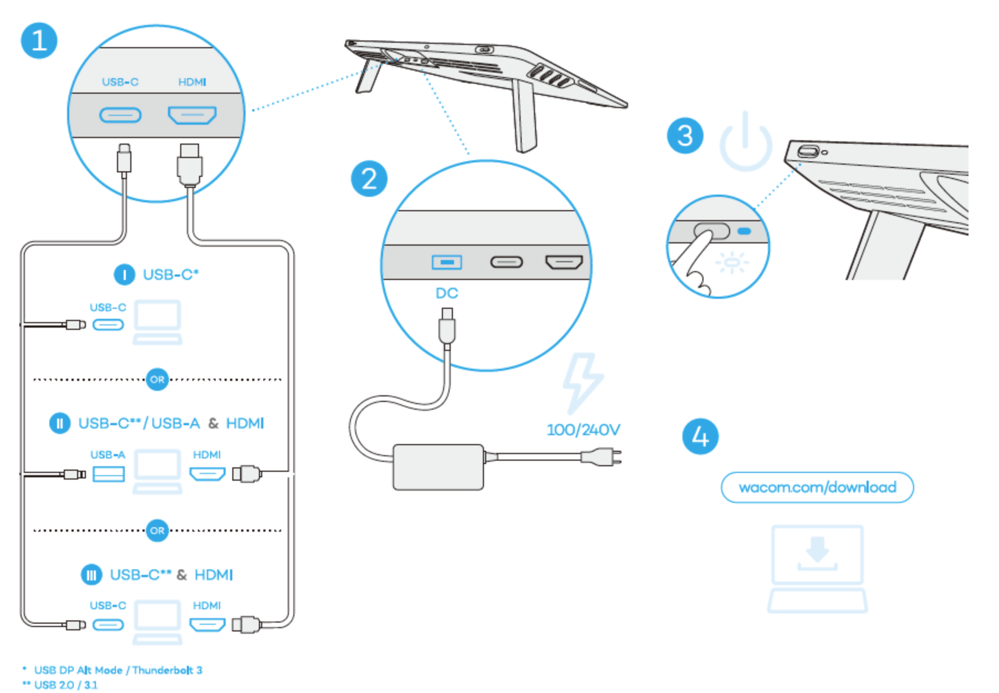
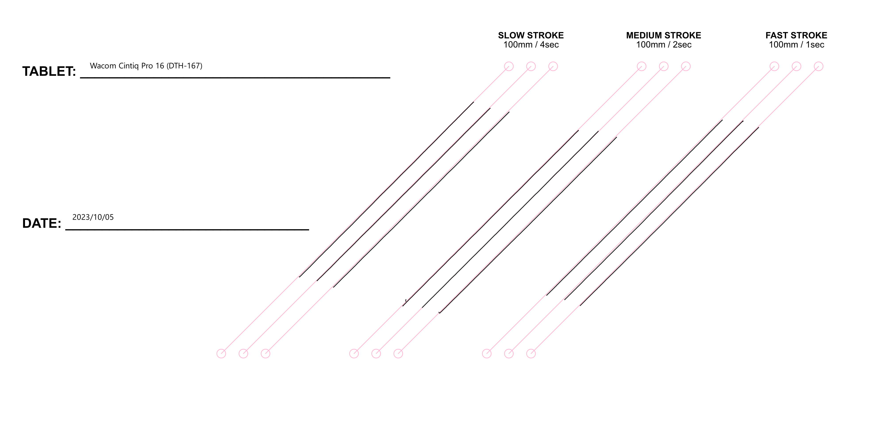

# Wacom Cintiq Pro 16 (DTH-167) notes

## Overview

An EXCELLENT pen display.

Although there are newer Cintiq Pro models from 2022 and 2023, the Cintiq Pro 16 from 2021 competes with them strongly. Wacom may have improved the new models' support for color or added support for higher refresh rates, but they did not improve on the already great drawing experience of this tablet.

User manual: [https://101.wacom.com/UserHelp/en/TOC/DTH167.html](https://101.wacom.com/UserHelp/en/TOC/DTH167.html)

## Specs

These specs come from the [DrawTabData Explorer](https://thesevenpens.github.io/DrawTabDataExplorer/entity/wacom.tabletfamily.wacom_cintiqpro). Click a model ID to see its full record there.



| | [DTH-167](https://thesevenpens.github.io/DrawTabDataExplorer/entity/wacom.tablet.dth167) |
| --- | --- |
| Name | Cintiq Pro 16 2021 |
| Released | 2021-10-20 |
| Status | Discontinued |



| | [DTH-167](https://thesevenpens.github.io/DrawTabDataExplorer/entity/wacom.tablet.dth167) |
| --- | --- |
| Resolution | 3840 × 2160 |
| Aspect ratio | 16:9 |
| Pixel density | 284 PPI |
| Panel | IPS |
| Lamination | — |
| Anti-glare | Etched glass |
| Color gamut | Adobe RGB 95% |
| Color depth | 8 bits per channel |
| Brightness | 300 cd/m² |
| Viewing angle | 178° horizontal 178° vertical |
| Refresh rate | 60 Hz |
| Response time | 30 ms |



| | [DTH-167](https://thesevenpens.github.io/DrawTabDataExplorer/entity/wacom.tablet.dth167) |
| --- | --- |
| Active area | 344 × 194 mm (13.5 × 7.6 in) |
| Diagonal | 394.9 mm (15.5 in) |
| Aspect ratio | 16:9 |
| Pen technology | Passive EMR |
| Pressure levels | 8192 |
| Tilt | ±60° |
| Accuracy (center) | — |
| Accuracy (corner) | — |
| Report rate | — |
| Density | 200 LPmm (5080 LPI) |
| Max hover | — |



| | [DTH-167](https://thesevenpens.github.io/DrawTabDataExplorer/entity/wacom.tablet.dth167) |
| --- | --- |
| Included pen | [Pro Pen 2 (KP-504E)](https://thesevenpens.github.io/DrawTabDataExplorer/entity/wacom.pen.kp504e) |
| Compatible pens | [Intuos4 Classic Pen (KP-300E)](https://thesevenpens.github.io/DrawTabDataExplorer/entity/wacom.pen.kp300e) [Pro Pen Slim (KP-301E)](https://thesevenpens.github.io/DrawTabDataExplorer/entity/wacom.pen.kp301e) [Intuos4 Airbrush Pen (KP-400E)](https://thesevenpens.github.io/DrawTabDataExplorer/entity/wacom.pen.kp400e) [Intuos4 Grip Pen (KP-501E)](https://thesevenpens.github.io/DrawTabDataExplorer/entity/wacom.pen.kp501e) [Intuos4 Pro Pen (KP-503E)](https://thesevenpens.github.io/DrawTabDataExplorer/entity/wacom.pen.kp503e) [Pro Pen 2 (KP-504E)](https://thesevenpens.github.io/DrawTabDataExplorer/entity/wacom.pen.kp504e) [Pro Pen 3D (KP-505)](https://thesevenpens.github.io/DrawTabDataExplorer/entity/wacom.pen.kp505) [Intuos4 Art Pen (KP-701E)](https://thesevenpens.github.io/DrawTabDataExplorer/entity/wacom.pen.kp701e) |



| | [DTH-167](https://thesevenpens.github.io/DrawTabDataExplorer/entity/wacom.tablet.dth167) |
| --- | --- |
| Buttons | — |
| Dials | — |
| Touch rings | — |
| Touch strips | — |
| Touch | Yes |



| | [DTH-167](https://thesevenpens.github.io/DrawTabDataExplorer/entity/wacom.tablet.dth167) |
| --- | --- |
| Size | 410 × 266 × 22 mm (16.1 × 10.5 × 0.9 in) |
| Weight | 1900 g |
| VESA mount | Yes |
| Legs | No |
| Included stand | No |



| | [DTH-167](https://thesevenpens.github.io/DrawTabDataExplorer/entity/wacom.tablet.dth167) |
| --- | --- |
| Ports | HDMI USB-C (DisplayPort Alt Mode) DC power |
| Attached cable | — |
| Bluetooth | — |



| | [DTH-167](https://thesevenpens.github.io/DrawTabDataExplorer/entity/wacom.tablet.dth167) |
| --- | --- |
| Contents | — |



## Links

* User manual: [https://101.wacom.com/UserHelp/en/TOC/DTH167.html](https://101.wacom.com/UserHelp/en/TOC/DTH167.html)
* Be aware there is an older model from 2016 also (DTH-1620)
* User manual: [https://101.wacom.com/UserHelp/en/TOC/DTH167.html](https://101.wacom.com/UserHelp/en/TOC/DTH167.html)
* [Brad Colbow review of Cintiq Pro 16](https://www.youtube.com/watch?v=0B8cNzyO4bs) Mar 7, 2022
* [Aaron Rutten review of Cintiq Pro 16](https://www.youtube.com/watch?v=v9pWwWE_vRM) Oct 26, 2021
* [MobileTechReview review of Cintiq Pro 16](https://www.youtube.com/watch?v=IU-QOOB2AsU) Jan 11, 2022
* [Aaron Blaise review of Cintiq Pro 16](https://www.youtube.com/watch?v=oROcuvimy18) Dec 21, 2021

## Noise

While it does have a fan, the tablet isn't very loud, unlike the Cintiq Pro 27. If you are sensitive to fan noise though, it may be an issue.

The amount of noise is based on the brightness setting. But even at 100% brightness it is quieter than a Cintiq Pro 27.

## Pointer lag

TYPICAL for a pen display. You can see the pointer trail the physical tip of the pen.

Apple iPads with the Apple Pencil have much less pointer lag

Pen tablets also have very little pointer lag in general.

## Anti-glare Sparkle

Rating: LOW. It has more than the Cintiq Pro 27 - but that is to be expected since it is a 4K display.

## Ports

It has 3 ports located on the top edge.

## My connection configuration

I have it connected with a thunderbolt 3 cable and the Wacom power adapter that it came with.

## Pen tracking accuracy

VERY GOOD. Very accurate. Like all pen displays, there is very slight inaccuracy in the last 1mm to 2mm at the edges or corners.

## Pen Pressure

The Wacom Pro Pen 2 (KP-504E) has an excellent low IAF and an excellent large maximum pressure.

## Parallax

Very good. Low amount of parallax for a pen display. On par with other Cintiq Pro models such as the Cintiq Pro 22.

## Connections and Cabling

There are roughly 3 ways to connect to this tablet. All of them require a separate power cable and power adapter.

<figure><figcaption></figcaption></figure>

### Using single USB-C cable

While you can use a single USB-C cable to connect to your computer for data and video. You will need to separately power it with the power cable.

Note that this is a bit of change from the Cintiq Pro 2016 (DTH-1620). The DTH-1620 could get enough power through the USB-C cable.

## Heat

Fans keep it cool. At the default brightness, the tablet is cool to the touch. At maximum brightness slightly warm.

## Stand

It does not come with a stand. I use a VESA-compatible Huion stand to hold this tablet at an angle.

## Diagonal Wobble

Rating: VERY GOOD. Low wobble in all velocities tested.

<figure><figcaption></figcaption></figure>
