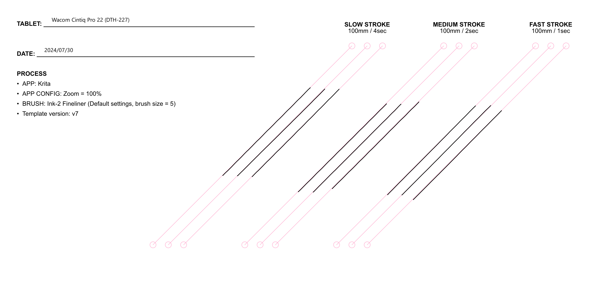
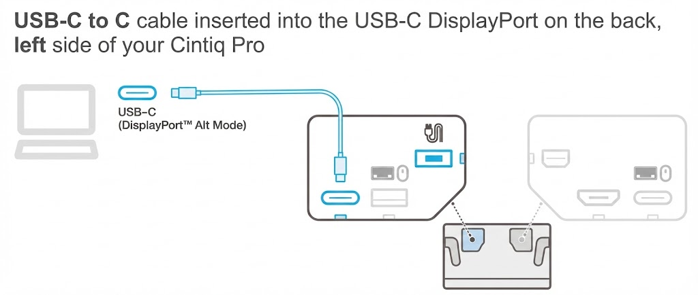

# Wacom Cintiq Pro 22 (DTH-227) notes

## Summary

The Cintiq Pro 22 (DTH-227), along with the Cintiq Pro 27 (DTH-271), is one of the best pen displays on the market as of July 2025.

This is my favorite tablet of the 70+ that I own. I prefer drawing on this one more than any other because of the drawing quality and the size (not too big, not too small).

* My notes on the [Wacom Cintiq Pro 27 (DTH-271)](wacom-dth271-notes.md)

## Specs

These specs come from the [DrawTabData Explorer](https://thesevenpens.github.io/DrawTabDataExplorer/entity/wacom.tabletfamily.wacom_cintiqpro). Click a model ID to see its full record there.



| | [DTH-227](https://thesevenpens.github.io/DrawTabDataExplorer/entity/wacom.tablet.dth227) |
| --- | --- |
| Name | Cintiq Pro 22 |
| Released | 2023-10-19 |
| Status | Available |



| | [DTH-227](https://thesevenpens.github.io/DrawTabDataExplorer/entity/wacom.tablet.dth227) |
| --- | --- |
| Resolution | 3840 × 2160 |
| Aspect ratio | 16:9 |
| Pixel density | 205 PPI |
| Panel | IPS |
| Lamination | Yes |
| Anti-glare | Etched glass |
| Color gamut | Adobe RGB 95% DCI-P3 99% Rec. 709 100% |
| Color depth | 10 bits per channel |
| Brightness | 300 cd/m² |
| Viewing angle | 170° horizontal 170° vertical |
| Refresh rate | 120 Hz |
| Response time | 12 ms |



| | [DTH-227](https://thesevenpens.github.io/DrawTabDataExplorer/entity/wacom.tablet.dth227) |
| --- | --- |
| Active area | 476 × 268 mm (18.7 × 10.6 in) |
| Diagonal | 546.3 mm (21.5 in) |
| Aspect ratio | 16:9 |
| Pen technology | Passive EMR |
| Pressure levels | 8192 |
| Tilt | ±60° |
| Accuracy (center) | — |
| Accuracy (corner) | — |
| Report rate | — |
| Density | 200 LPmm (5080 LPI) |
| Max hover | — |



| | [DTH-227](https://thesevenpens.github.io/DrawTabDataExplorer/entity/wacom.tablet.dth227) |
| --- | --- |
| Included pen | [Pro Pen 3 (ACP-500)](https://thesevenpens.github.io/DrawTabDataExplorer/entity/wacom.pen.acp500) |
| Compatible pens | [Pro Pen 3 (ACP-500)](https://thesevenpens.github.io/DrawTabDataExplorer/entity/wacom.pen.acp500) [Intuos4 Classic Pen (KP-300E)](https://thesevenpens.github.io/DrawTabDataExplorer/entity/wacom.pen.kp300e) [Pro Pen Slim (KP-301E)](https://thesevenpens.github.io/DrawTabDataExplorer/entity/wacom.pen.kp301e) [Intuos4 Airbrush Pen (KP-400E)](https://thesevenpens.github.io/DrawTabDataExplorer/entity/wacom.pen.kp400e) [Intuos4 Grip Pen (KP-501E)](https://thesevenpens.github.io/DrawTabDataExplorer/entity/wacom.pen.kp501e) [Intuos4 Pro Pen (KP-503E)](https://thesevenpens.github.io/DrawTabDataExplorer/entity/wacom.pen.kp503e) [Pro Pen 2 (KP-504E)](https://thesevenpens.github.io/DrawTabDataExplorer/entity/wacom.pen.kp504e) [Pro Pen 3D (KP-505)](https://thesevenpens.github.io/DrawTabDataExplorer/entity/wacom.pen.kp505) [Intuos4 Art Pen (KP-701E)](https://thesevenpens.github.io/DrawTabDataExplorer/entity/wacom.pen.kp701e) |



| | [DTH-227](https://thesevenpens.github.io/DrawTabDataExplorer/entity/wacom.tablet.dth227) |
| --- | --- |
| Buttons | 8 |
| Dials | — |
| Touch rings | — |
| Touch strips | — |
| Touch | Yes |



| | [DTH-227](https://thesevenpens.github.io/DrawTabDataExplorer/entity/wacom.tablet.dth227) |
| --- | --- |
| Size | 517 × 312 × 30 mm (20.4 × 12.3 × 1.2 in) |
| Weight | 5000 g |
| VESA mount | Yes (100×100) |
| Legs | No |
| Included stand | No |



| | [DTH-227](https://thesevenpens.github.io/DrawTabDataExplorer/entity/wacom.tablet.dth227) |
| --- | --- |
| Ports | — |
| Attached cable | — |
| Bluetooth | — |



| | [DTH-227](https://thesevenpens.github.io/DrawTabDataExplorer/entity/wacom.tablet.dth227) |
| --- | --- |
| Contents | — |



## Basics

* Product page: [https://www.wacom.com/en-us/products/wacom-cintiq-pro-overview](https://www.wacom.com/en-us/products/wacom-cintiq-pro-overview)
* User manual: [https://101.wacom.com/UserHelp/en/TOC/DTH227.html](https://101.wacom.com/UserHelp/en/TOC/DTH227.html)

## Compatible pens

The list of compatible pens is here: [https://support.wacom.com/hc/en-us/articles/1500006268761-What-accessories-are-available-for-my-Wacom-Cintiq-22](https://support.wacom.com/hc/en-us/articles/1500006268761-What-accessories-are-available-for-my-Wacom-Cintiq-22)

I mostly use the Wacom Pro Pen 2 with this tablet.

## Display specs

* Aspect ratio: 16x9
* Size: 26.9 in (68.3 cm)
* Brightness
  * I run it at 50% brightness.
  * The larger Cintiq Pro 27 can get up to 400 nits of brightness.
* Refresh rate
  * I run it at 60Hz

### Color modes

* Native (the default)
* AdobeRGB
* DCI-P3
* Rec.709
* Rec.2020
* Display P3
* sRGB
* EBU
* PQ Rec.2100
* PQ DCI
* HLG Rec.2100
* Custom

I left it running in **Native** mode.

## Display experience

### Anti-glare Sparkle

Rating: GOOD (LOW)

It has a little more than the Cintiq Pro 27 - but that is to be expected since it has a higher PPI.

### Dead Pixels

I saw none when I started using it and none have developed.

## Drawing experience

### Summary

* EXCELLENT
* Has the leading drawing experience in the industry thanks to its support of the Wacom Pro Pen 2 and Wacom Pro Pen 3

### Parallax

EXCELLENT - very little parallax.

### Pen tracking accuracy

* Wacom does not publish numbers
* I found it to be extremely accurate at the edges and corners.
  * A bit more accurate than the Cintiq Pro 27 (DTH-271)

### Diagonal wobble

Rating: GOOD. Exhibits a slight wobble in diagonal lines.

Slightly better than Cintiq Pro 27.

<figure><figcaption></figcaption></figure>

### Pressure handling

EXCELLENT (best in the industry) because the pens are very good.

* [Wacom Pro Pen 2 (KP-504E) notes](../../../pens/wacom-pens/wacom-kp504e-notes.md)
* [Wacom Pro Pen 3 (ACP-500) notes](../../../pens/wacom-pens/wacom-acp500-notes.md)

### Pointer lag

GOOD but not GREAT - this is typical for a pen display

Switching to 120Hz makes a little bit of difference to pointer lag but not much.

## Connections and cabling

### Using single USB-C cable

Unlike many other 16" pen displays, a single USB-C cable is not enough to power this tablet. You still have to use the supplied power adapter.

### How I connect it to my PC

Instead of using Wacom's USB-C cable, I use a Cable Matters Thunderbolt 3 cable to connect it to the USB4 port on my mini-PC. The diagram below shows how it is connected.

<figure><figcaption></figcaption></figure>

## Non-pen inputs

### Touch

* There is a physical button on the back of the pen display to enable/disable touch.
* Most of the time I disable touch but occasionally use it when I need to.

### Express Keys

* 4 on back left
* 4 on back right
* I don't enjoy the ExpressKeys. I find them awkward to use. Instead, I use a TourBox.

## Build quality

EXCELLENT

## OSD

* You can get to the OSD by pressing a physical button on the back of the tablet

## Ergonomics

### Heat

Fans keep it cool. At the default brightness, the tablet is cool to the touch - maybe just very slightly warm.

### Fans

It DOES have fans. Which cause some noise.

There is no control over the speed of the fans.

### Noise

* The fan noise is always on.
* Quieter than the Cintiq Pro 27 (DTH-271), but louder than the Cintiq Pro 16 (DTH-167).
* At 50% brightness, the noise is audible but does not bother me, unlike the DTH-271, which irritates me. With normal sounds in my office, such as the air conditioner, I often can't hear it.

### Stand

There is a specific Wacom Cintiq 22 Stand which is very expensive.

I used this tablet with two different non-Wacom stands:

* **Huion ST100 stand**. This stand is designed for 24"+ pen displays. With the Cintiq Pro 22 using the ST100 stand at the lowest angle means that the bottom of the tablet does not touch the desk and so doesn't provide any additional stability. As a result, at the lowest angle there is some wobble while drawing on the tablet. You need to increase the angle a little bit to ensure that the bottom of the tablet touches the desk. At that point drawing is stable.
* **VIVO STAND-V100R stand**. More here: [VIVO Pneumatic Arm Monitor Desk Stand (STAND-V100R)](../../../accessories/stands/vivo-v100r.md)

### Laying flat

The back of the pen display has pieces that stick out due to the buttons. This means:

* It does not lay down flat on a desk
* It will slide around easily

