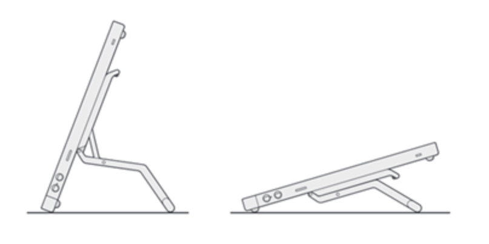
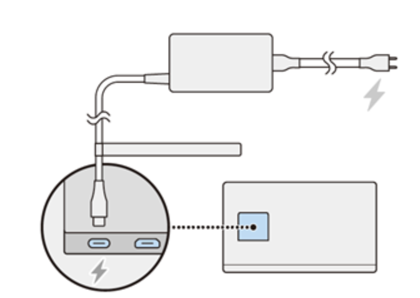
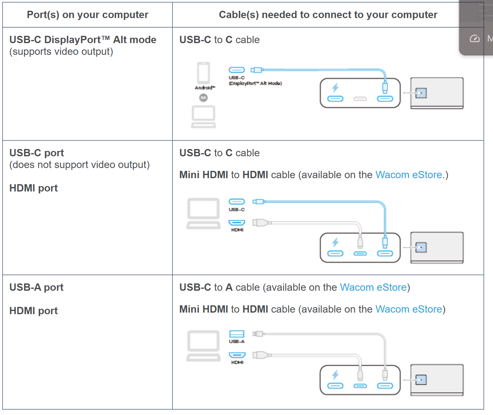

# Wacom Cintiq 24 touch 2025 (DTH-246) notes

## Overview

This is an EXCELLENT tablet, and for most people this will be a better choice than a Cintiq Pro.

It delivers the same excellent drawing experience as a Cintiq Pro.

Its only limitation is that it is not 4K and is instead 2.5K (2560x1440), which should be enough for most people.

While not inexpensive it is a fantastic value for getting something with such a great drawing experience at this price.

## Links

These links come from the [DrawTabData Explorer](https://thesevenpens.github.io/DrawTabDataExplorer/entity/wacom.tabletfamily.wacom_cintiq). To add or fix a link, change it in DrawTabData.

| Source | Link | Date |
| --- | --- | --- |
| Wacom | [Product page](https://www.wacom.com/en-us/products/wacom-cintiq) |  |
| Wacom | [Store page](https://estore.wacom.com/en-us/wacom-cintiq-24-touch-dth246k0a.html) |  |
| Wacom | [User manual](http://101.wacom.com/UserHelp/en/TOC/DTH246.html) |  |
| Brad Colbow | [Wacom Cintiq 24 Touch Review](https://www.youtube.com/watch?v=0mXPOLiSNv0) | 2025-07-28 |
| Aaron Rutten | [2025 Wacom Cintiq 24 Touch (Review)](https://www.youtube.com/watch?v=Oo4m5EgCSWE) | 2025-07-01 |
| Seven Pens | [New Wacom Cintiq 24 Touch (2025) unboxing and testing](https://www.youtube.com/watch?v=Lm-5X-gFtuw) | 2025-06-25 |

## Specs

These specs come from the [DrawTabData Explorer](https://thesevenpens.github.io/DrawTabDataExplorer/entity/wacom.tabletfamily.wacom_cintiq). Click a model ID to see its full record there.



| | [DTH-246](https://thesevenpens.github.io/DrawTabDataExplorer/entity/wacom.tablet.dth246) |
| --- | --- |
| Name | Cintiq 24 touch 2025 |
| Released | 2025-06-05 |
| Status | Available |



| | [DTH-246](https://thesevenpens.github.io/DrawTabDataExplorer/entity/wacom.tablet.dth246) |
| --- | --- |
| Resolution | 2560 × 1440 |
| Aspect ratio | 16:9 |
| Pixel density | 123 PPI |
| Panel | IPS |
| Lamination | Yes |
| Anti-glare | Etched glass |
| Color gamut | sRGB 100% |
| Color depth | 8 bits per channel |
| Brightness | 350 cd/m² |
| Peak brightness | — |
| Viewing angle | 178° horizontal 178° vertical |
| Refresh rate | 60 Hz |
| Response time | 12 ms |



| | [DTH-246](https://thesevenpens.github.io/DrawTabDataExplorer/entity/wacom.tablet.dth246) |
| --- | --- |
| Active area | 527 × 296 mm (20.7 × 11.7 in) |
| Diagonal | 604.4 mm (23.8 in) |
| Aspect ratio | 16:9 |
| Pen technology | Passive EMR |
| Pressure levels | 8192 |
| Tilt | ±60° |
| Accuracy (center) | — |
| Accuracy (corner) | — |
| Report rate | — |
| Density | 200 LPmm (5080 LPI) |
| Max hover | — |



| | [DTH-246](https://thesevenpens.github.io/DrawTabDataExplorer/entity/wacom.tablet.dth246) |
| --- | --- |
| Included pen | [Pro Pen 3 (ACP-500)](https://thesevenpens.github.io/DrawTabDataExplorer/entity/wacom.pen.acp500) |
| Compatible pens | [Pro Pen 3 (ACP-500)](https://thesevenpens.github.io/DrawTabDataExplorer/entity/wacom.pen.acp500) [Pro Pen 3E (ACP-501E)](https://thesevenpens.github.io/DrawTabDataExplorer/entity/wacom.pen.acp501e) [Art Pen 2 (ACP-700)](https://thesevenpens.github.io/DrawTabDataExplorer/entity/wacom.pen.acp700) [Pro Pen Slim (KP-301E)](https://thesevenpens.github.io/DrawTabDataExplorer/entity/wacom.pen.kp301e) [Intuos4 Grip Pen (KP-501E)](https://thesevenpens.github.io/DrawTabDataExplorer/entity/wacom.pen.kp501e) [Intuos4 Pro Pen (KP-503E)](https://thesevenpens.github.io/DrawTabDataExplorer/entity/wacom.pen.kp503e) [Pro Pen 2 (KP-504E)](https://thesevenpens.github.io/DrawTabDataExplorer/entity/wacom.pen.kp504e) [Pro Pen 3D (KP-505)](https://thesevenpens.github.io/DrawTabDataExplorer/entity/wacom.pen.kp505) [Intuos4 Art Pen (KP-701E)](https://thesevenpens.github.io/DrawTabDataExplorer/entity/wacom.pen.kp701e) |



| | [DTH-246](https://thesevenpens.github.io/DrawTabDataExplorer/entity/wacom.tablet.dth246) |
| --- | --- |
| Buttons | 0 |
| Dials | 0 |
| Touch rings | 0 |
| Touch strips | 0 |
| Touch | Yes |



| | [DTH-246](https://thesevenpens.github.io/DrawTabDataExplorer/entity/wacom.tablet.dth246) |
| --- | --- |
| Size | 340 × 568 × 21 mm (13.4 × 22.4 × 0.8 in) |
| Weight | 5000 g |
| VESA mount | Yes (75×75) |
| Legs | — |
| Included stand | Yes |



| | [DTH-246](https://thesevenpens.github.io/DrawTabDataExplorer/entity/wacom.tablet.dth246) |
| --- | --- |
| Ports | USB-C (Power) Mini HDMI USB-C (Video and data) |
| Attached cable | — |
| Bluetooth | — |



| | [DTH-246](https://thesevenpens.github.io/DrawTabDataExplorer/entity/wacom.tablet.dth246) |
| --- | --- |
| Power input | 20 V, 1.8 A |
| Consumption | — |
| Standby | — |
| Power adapter | — |
| Power output | — |



| | [DTH-246](https://thesevenpens.github.io/DrawTabDataExplorer/entity/wacom.tablet.dth246) |
| --- | --- |
| Contents | — |



## Notes on specs

### Pens

* Other compatible pens
  * Classic Pen (KP-300E)
  * Accessory Pen Black DTK-2451/DTH-2452 (KP302E)
* Unlike the Intuos Pro 2025 tablets, the Cintiq Pro 2025 tablets are NOT compatible with UD EMR pens. More here: [Pens that support UD EMR 2nd gen](../../../../tech/wacom-ud-emr/ud-emr-pens.md).

## Videos

I livestreamed the unboxing, testing, and drawing on this tablet:

* [Drawing](https://youtube.com/live/1q3xNSkTW54?feature=share) 2025-06-25

Sometime in 2026 I will make a full "review" video soon.

## Non-pen input

### Stand

Pay attention to the direction you attach the stand. It should be attached as shown below.

<figure><figcaption></figcaption></figure>

It's easy to accidentally install the stand upside down if you aren't paying attention - and the stand is much less stable that way.

## Ergonomics

### Fans

None

### Noise

None. This model is completely silent

### Heat

EXCELLENT. At 100% brightness for 3 hours of continuous use, the display had no "warm" or "hot spots" and stayed very close to the room temperature of the desk it was sitting on. This may be the best heat management I've seen for a display without a fan. Wacom did an excellent job here.

## On-Screen Display (OSD)

One of the buttons on the lower right side will bring up the OSD.

The OSD is very similar to the OSD introduced in the Wacom Movink.

## Connections and cabling

### Ports

On the back of the tablet there are three ports.

### Connection options

First, this tablet requires you to always use the power adapter as shown below.

<figure><figcaption></figcaption></figure>

For video signal and data, you have multiple options

<figure><figcaption></figcaption></figure>

## Power delivery FROM tablet

* The USB-C port that connects to the computer will deliver a very small amount of power.
* It could in theory recharge your phone after many hours, but it would not be suitable to recharge a laptop.
* Wacom does NOT identify power delivery as a feature of this tablet.

## Comparisons

### Cintiq 24 touch vs Cintiq Pro 27

* Overall
  * I think the Cintiq 24 touch is a very compelling choice instead of the Cintiq Pro 27. It actually has some advantages over the Cintiq Pro 27.
* Physical device
  * The Cintiq 24 touch has a smaller physical size that is much easier to deal with on my desk
  * It doesn't get in the way of reaching other objects on the desk
  * It's easier to move. Part of this is due to decreased weight. Part of this is due to the Cintiq 24 stand which itself weighs less and is easier to move.
* Touch
  * Works the same on the two devices
* Connection options
  * Cintiq Pro 27 has more ports and ways it can connect.
  * Cintiq 24 Touch - uses a mini HDMI port. Which is unusual. And will likely be a very very minor convenience.
  * Both require power to come from a power adapter
* Stand
  * The Cintiq 24 touch comes with a stand in the box. Also the stand is pre-attached.
  * The Cintiq Pro 27
* Power delivery
  * The Cintiq 24 touch delivered power to a my Samsung phone and tablet. I don't recall Wacom advertising this specifically.
  * The Cintiq Pro 27 - I can't remember if it supported power delivery. I'd have to check again.
* Noise
  * Cintiq 24 touch is SILENT because it has no fans.
  * The Cintiq Pro 27 has fans which cause noise. I only use the Cintiq Pro 27 at 50% brightness to reduce fan noise, but the tablet is never silent.
* Drawing Performance
  * The core drawing experience - pen pressure, tilt, accuracy are exactly the same.
