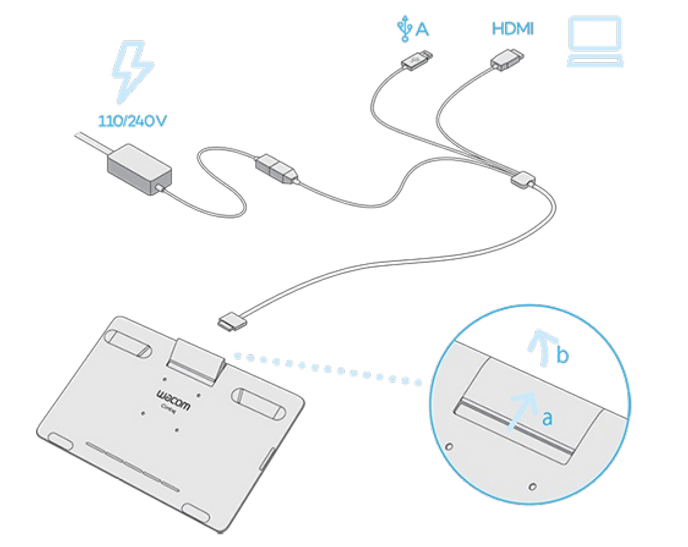

# Wacom Cintiq 16 2019 (DTK-1660) notes

## Summary

This is a little bit of a dated tablet. I do suggest you consider getting the Cintiq 16 2025 (DTK-168) instead. [Wacom Cintiq 16 2025 (DTK-168) notes](wacom-dtk168-notes.md) have a comparison between the two tablets.

## Links

These links come from the [DrawTabData Explorer](https://thesevenpens.github.io/DrawTabDataExplorer/entity/wacom.tabletfamily.wacom_cintiq). To add or fix a link, change it in DrawTabData.

| Source | Link | Date |
| --- | --- | --- |
| Wacom | [User manual](http://101.wacom.com/UserHelp/en/TOC/DTK-1660.html) |  |
| Wacom | [Product information](https://cdn.wacom.com/u/support/wiki_migration/c/cd/dtk-1660_en.pdf) |  |
| Wacom | [User manual](http://101.wacom.com/UserHelp/en/TOC/DTK-1660E.html) |  |
| Ross Draws | [Wacom Cintiq 16 Review + SKETCH!](https://youtu.be/6_tMU5z6s9s) | 2019-02-22 |
| Brad Colbow | [Wacom Cintiq 16 Review (A $650 Wacom Drawing Tablet!)](https://www.youtube.com/watch?v=ye8R0LAbkiE) | 2019-01-08 |
| MobileTechReview | [Wacom Cintiq 16 Review - the Much More Affordable Cintiq](https://youtu.be/v4qDRupCLHY) | 2019-01-08 |
| Aaron Rutten | [Wacom CINTIQ 16 - Drawing Tablet Review](https://youtu.be/nXrFULq096A) | 2019-01-07 |

## Specs

These specs come from the [DrawTabData Explorer](https://thesevenpens.github.io/DrawTabDataExplorer/entity/wacom.tabletfamily.wacom_cintiq). Click a model ID to see its full record there.



| | [DTK-1660](https://thesevenpens.github.io/DrawTabDataExplorer/entity/wacom.tablet.dtk1660) |
| --- | --- |
| Name | Cintiq 16 |
| Released | 2019-01-08 |
| Status | Discontinued |



| | [DTK-1660](https://thesevenpens.github.io/DrawTabDataExplorer/entity/wacom.tablet.dtk1660) |
| --- | --- |
| Resolution | 1920 × 1080 |
| Aspect ratio | 16:9 |
| Pixel density | 142 PPI |
| Panel | IPS |
| Lamination | — |
| Anti-glare | — |
| Color gamut | sRGB 96% NTSC 72% |
| Color depth | 8 bits per channel |
| Brightness | 210 cd/m² |
| Peak brightness | — |
| Viewing angle | 178° horizontal 178° vertical |
| Refresh rate | — |
| Response time | 25 ms |



| | [DTK-1660](https://thesevenpens.github.io/DrawTabDataExplorer/entity/wacom.tablet.dtk1660) |
| --- | --- |
| Active area | 344 × 194 mm (13.5 × 7.6 in) |
| Diagonal | 394.9 mm (15.5 in) |
| Aspect ratio | 16:9 |
| Pen technology | Passive EMR |
| Pressure levels | 8192 |
| Tilt | ±60° |
| Accuracy (center) | — |
| Accuracy (corner) | — |
| Report rate | — |
| Density | 200 LPmm (5080 LPI) |
| Max hover | — |



| | [DTK-1660](https://thesevenpens.github.io/DrawTabDataExplorer/entity/wacom.tablet.dtk1660) |
| --- | --- |
| Included pen | [Pro Pen 2 (KP-504E)](https://thesevenpens.github.io/DrawTabDataExplorer/entity/wacom.pen.kp504e) |
| Compatible pens | [Intuos4 Classic Pen (KP-300E)](https://thesevenpens.github.io/DrawTabDataExplorer/entity/wacom.pen.kp300e) [Pro Pen Slim (KP-301E)](https://thesevenpens.github.io/DrawTabDataExplorer/entity/wacom.pen.kp301e) [Intuos4 Airbrush Pen (KP-400E)](https://thesevenpens.github.io/DrawTabDataExplorer/entity/wacom.pen.kp400e) [Intuos4 Grip Pen (KP-501E)](https://thesevenpens.github.io/DrawTabDataExplorer/entity/wacom.pen.kp501e) [Intuos4 Pro Pen (KP-503E)](https://thesevenpens.github.io/DrawTabDataExplorer/entity/wacom.pen.kp503e) [Pro Pen 2 (KP-504E)](https://thesevenpens.github.io/DrawTabDataExplorer/entity/wacom.pen.kp504e) [Pro Pen 3D (KP-505)](https://thesevenpens.github.io/DrawTabDataExplorer/entity/wacom.pen.kp505) [Intuos4 Art Pen (KP-701E)](https://thesevenpens.github.io/DrawTabDataExplorer/entity/wacom.pen.kp701e) |



| | [DTK-1660](https://thesevenpens.github.io/DrawTabDataExplorer/entity/wacom.tablet.dtk1660) |
| --- | --- |
| Buttons | — |
| Dials | — |
| Touch rings | — |
| Touch strips | — |
| Touch | No |



| | [DTK-1660](https://thesevenpens.github.io/DrawTabDataExplorer/entity/wacom.tablet.dtk1660) |
| --- | --- |
| Size | 422 × 285 × 16.6 mm (16.6 × 11.2 × 0.7 in) |
| Weight | 1900 g |
| VESA mount | — |
| Legs | — |
| Included stand | — |



| | [DTK-1660](https://thesevenpens.github.io/DrawTabDataExplorer/entity/wacom.tablet.dtk1660) |
| --- | --- |
| Ports | — |
| Attached cable | — |
| Bluetooth | — |



| | [DTK-1660](https://thesevenpens.github.io/DrawTabDataExplorer/entity/wacom.tablet.dtk1660) |
| --- | --- |
| Power input | 12 V, 3 A |
| Consumption | 27 W max |
| Standby | 0.5 W |
| Power adapter | 36 W |
| Power output | — |



| | [DTK-1660](https://thesevenpens.github.io/DrawTabDataExplorer/entity/wacom.tablet.dtk1660) |
| --- | --- |
| Contents | — |



## Cables and connections

This tablet connects to your computer via a proprietary 3-in-1 cable.

This tablet does NOT support getting a video signal over a USB-C cable, unlike many modern pen displays.

<figure><figcaption></figcaption></figure>
