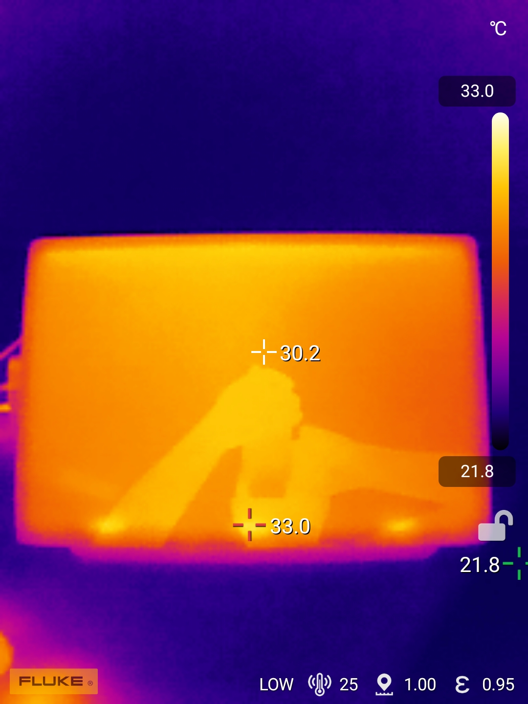

# Wacom Cintiq 16 2025 (DTK-168) notes

## Overview

Wacom released three new Cintiq 2025 models in mid 2025. One of them is the Wacom Cintiq 16 (2025) (DTK-168).

This is an EXCELLENT tablet with an excellent drawing experience and a very good display. It does miss some "Cintiq Pro" features, but it has the same great drawing experience when it comes to pressure, tilt, and related behavior.

## Compared to the Cintiq 16 2019 (DTK-1660)

Summary: The Cintiq 16 2025 is a significant upgrade in many ways

* Native resolution: Cintiq 16 2025 has 2560x1600 compared to the 1920x1080 of the older model
* Aspect ratio: Cintiq 16 2025 screen is 16x10, while the Cintiq 16 2019 has a 16x9 aspect ratio. Many people feel that the 16x10 aspect ratio makes the Cintiq 16 2025 feel a little larger than it actually is.
* Included pen: Cintiq 16 2025 comes with the Wacom Pro Pen 3 (ACP-500). The Cintiq 16 2019 comes with the Wacom Pro Pen 2. Opinions are divided on which pen is better. Note that the Pro Pen 2 works with the Cintiq 16 2025
* Colors: Cintiq 16 2025 has much brighter and more vivid colors. The Cintiq 16 2019 is known for a more washed-out look.
* Parallax: Cintiq 16 2025 has low parallax, which is better. Cintiq 16 2019 is known to have more noticeable parallax.
* Cabling: Cintiq 16 2025 has a simpler and more flexible cabling that can use standard cables. The Cintiq 16 2019 must be connected with a proprietary Wacom 3-in-1 cable.

[Wacom Cintiq 16 2019 (DTK-1660) notes](wacom-dtk1660-notes.md)

## Basics

* Product page: [https://www.wacom.com/en-us/products/wacom-cintiq](https://www.wacom.com/en-us/products/wacom-cintiq)

## Specs

These specs come from the [DrawTabData Explorer](https://thesevenpens.github.io/DrawTabDataExplorer/entity/wacom.tabletfamily.wacom_cintiq). Click a model ID to see its full record there.



| | [DTK-168](https://thesevenpens.github.io/DrawTabDataExplorer/entity/wacom.tablet.dtk168) |
| --- | --- |
| Name | Cintiq 16 2025 |
| Released | 2025-06-05 |
| Status | Available |
| Included pen | [Pro Pen 3 (ACP-500)](https://thesevenpens.github.io/DrawTabDataExplorer/entity/wacom.pen.acp500) |



| | [DTK-168](https://thesevenpens.github.io/DrawTabDataExplorer/entity/wacom.tablet.dtk168) |
| --- | --- |
| Resolution | 2560 × 1600 |
| Panel | IPS |
| Lamination | Yes |
| Anti-glare | Etched glass |
| sRGB | 100% |
| Color depth | 8 bits per channel |
| Brightness | 290 cd/m² |
| Refresh rate | 60 Hz |
| Response time | 8 ms |



| | [DTK-168](https://thesevenpens.github.io/DrawTabDataExplorer/entity/wacom.tablet.dtk168) |
| --- | --- |
| Active area | 345 × 215 mm (13.6 × 8.5 in) |
| Pen technology | Passive EMR |
| Pressure levels | 8192 |
| Tilt | ±60° |
| Report rate | — |
| Density | 200 LPmm (5080 LPI) |
| Max hover | — |



| | [DTK-168](https://thesevenpens.github.io/DrawTabDataExplorer/entity/wacom.tablet.dtk168) |
| --- | --- |
| Buttons | 0 |
| Dials | 0 |
| Touch rings | 0 |
| Touch strips | 0 |
| Touch | No |



| | [DTK-168](https://thesevenpens.github.io/DrawTabDataExplorer/entity/wacom.tablet.dtk168) |
| --- | --- |
| Size | 259 × 384 × 15 mm (10.2 × 15.1 × 0.6 in) |
| Weight | 2000 g |
| VESA mount | Yes (75×75) |
| Legs | — |
| Included stand | No |



| | [DTK-168](https://thesevenpens.github.io/DrawTabDataExplorer/entity/wacom.tablet.dtk168) |
| --- | --- |
| Ports | USB-C (Power) USB-C (Power, video and data) Mini HDMI |
| Attached cable | — |
| Bluetooth | — |



## Device weight

Slightly heavier than other pen displays at this size

* Wacom Cintiq 16 (2025): 2.0kg
* Xencelabs Pen Display 16: 1.3 kg
* Huion Kamvas 16 gen 3: 1.2kg
* Wacom Movink 13: 0.420kg

## Display specs

* Aspect ratio: 16:10
* Laminated: Wacom uses the term "bonded"

## Display experience

### Color

* Color gamut (Wacom specified)
  * DCI-P3 99% (CIE1931) (typ)
* I was satisfied with color.
* This is not a "wide-gamut" display
* Its colors are pleasing and a big improvement over older Cintiq, non-Pro, models that had washed-out colors.

### Antiglare sparkle

* RATING: GOOD. Very low.
* Comparisons:
  * Similar to Wacom Cintiq Pro 22
  * Similar to Huion Kamvas Pro 19
  * Similar to Wacom Cintiq 24 (2025)

### Pixel sharpness

* Rating: GOOD
* Pixels were clear and well-delineated
* In comparison
* Pixels look sharper than on the Huion Kamvas Pro 19, which has a slight softness that many people notice and some do not like
  * How does it compare to a 4K at the same size? I would have a hard time telling this apart from 4K

### PWM flicker

* No PWM flicker detected at any brightness level
* Comparisons:
  * Movink 13 has obvious PWM flicker
* NOTE: Link to flicker testing methodology

## Drawing experience

### Surface texture

* Surface texture is very typical for a pen display.
* Pen does not feel slippery on the surface when drawing
* Cintiq 16 (2025) has a surface texture that is
  * the same as Cintiq 24 (2025)
  * a bit more than Huion Kamvas 13 GEN3
  * about the same as Movink 13 (but has a different sensation - Movink feels "softer")
  * a bit more than Xencelabs Pen Display 16
  * somewhat less than the Cintiq Pro 22

## Connections and cabling

### Included cables

* USB-C cable #1 supports power, data, and video (5Gbps and 60W)
* USB-C cable #2 power only

### Ports

* It does NOT come with a mini-HDMI adapter.

### Connection options

* TBD add screenshots from Wacom doc

### Connecting with a single USB-C cable

* YES. This is supported. But your computer will need a USB-C port that must meet the requirements for power, data, and video signal.
* Cabling notes
  *   The included USB-C cable will work for this purpose.

      The included cable is 5Gbps and 60W
  * I also tested with a CableMatters Thunderbolt 3 cable.
* Brightness when connected with a single USB-C cable
  * Was able to achieve 100% brightness in my scenarios
* Connection scenario 1 (worked)
  * Tablet –> CableMatters TB3 -> CalDigit TS4 dock -> M1 MAX Mac Studio
* Connection scenario 2 (worked)
  * Tablet -> CableMatters TB3 -> M3 MacBook Pro
  * M3 MacBook Pro was not attached to power and was able to power the tablet
* Notes
  * When using a single USB-C connection, if you attach a power cable, the tablet will turn itself off and then back on
  * It can be a little tricky to plug the cable in because of that "thing" on the back
    * Some people consider using a USB-C L-type adapter

## On-Screen Display Menu (OSD)

* Button above the power button on the right side of the tablet
* Because there is no touch support, you must use the pen to use the OSD
* You will have to pick a language the first time you open the OSD before you can use it

## Ergonomics

### Fans

No fans

### Noise

No noise. Completely silent.

### Heat

* I measured with the tablet on 100% brightness for several days.
* Heat is well managed - only very slight warmth toward the top
* temperature range
  * MIN: 30.2C (86.36F)
  * MAX: 33.0C (91.4F)
* NOTE: My IR reflection is visible in the IR photo

<figure><figcaption></figcaption></figure>

*
