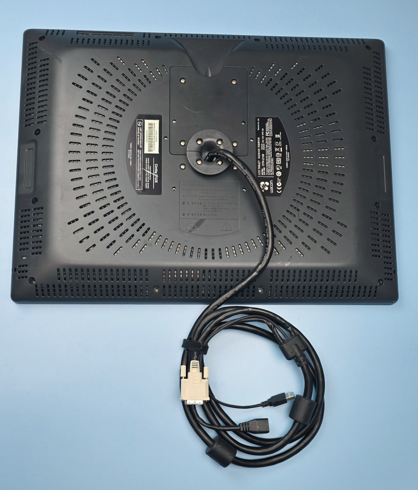
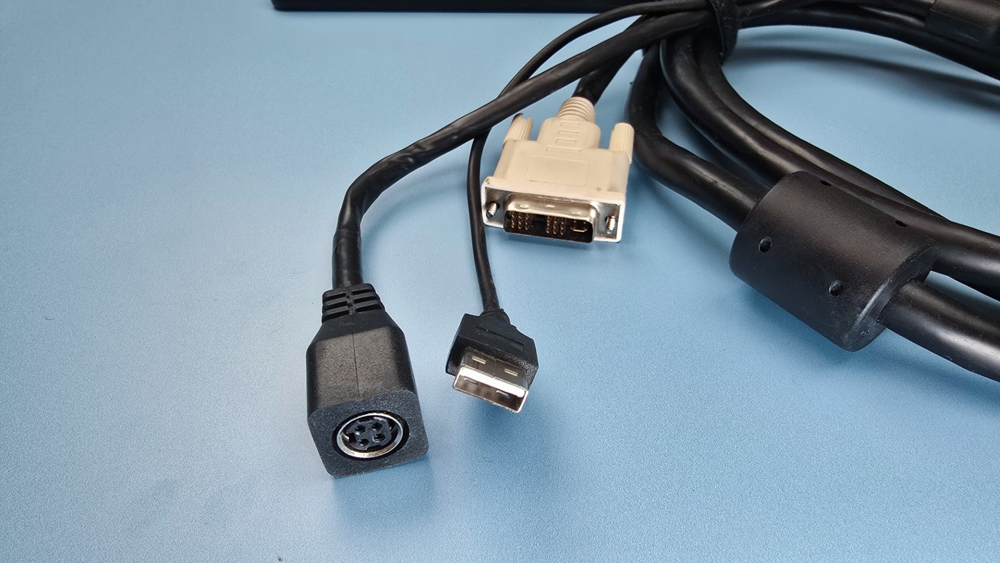
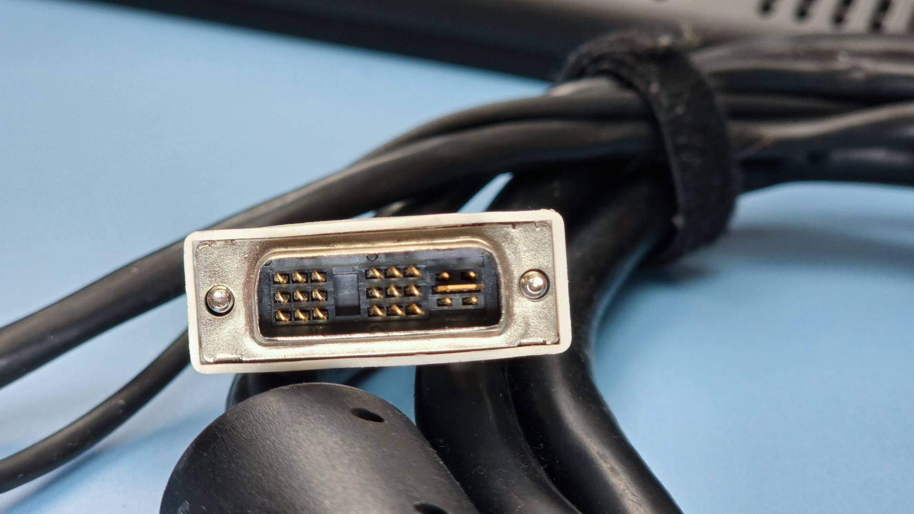

# Wacom Cintiq 21 UX 2010 (DTK-2100) notes

## Overview

Release date: 2010

NOTE: This is a second generation of the Cintiq 21 UX (DTZ-2100) that was released in 2005. [Wacom Cintiq 21UX 2005 (DTZ-2100) notes](wacom-dtz2100-notes.md).

## Specs

### Display specs

* Native resolution: 1600x1200
* Aspect ratio: 4:3
*

## Connections and cabling

### 3-in-1 cable

A fixed 3-in-1 cable coming out the back splits into three ends

* USB-A for data
* DVI-I (Dual Link) for video signal
* Power

<figure><figcaption></figcaption></figure>

### Power connector

<figure><figcaption></figcaption></figure>

<figure><figcaption></figcaption></figure>

## DVI-I (Dual Link) connector

<figure><figcaption></figcaption></figure>

To connect this to a modern computer you via HDMI or DisplayPort will need an adapter. Make sure you get one that supports 1600x1200 resolution at 60hz. Not all adapters are capable of that.

