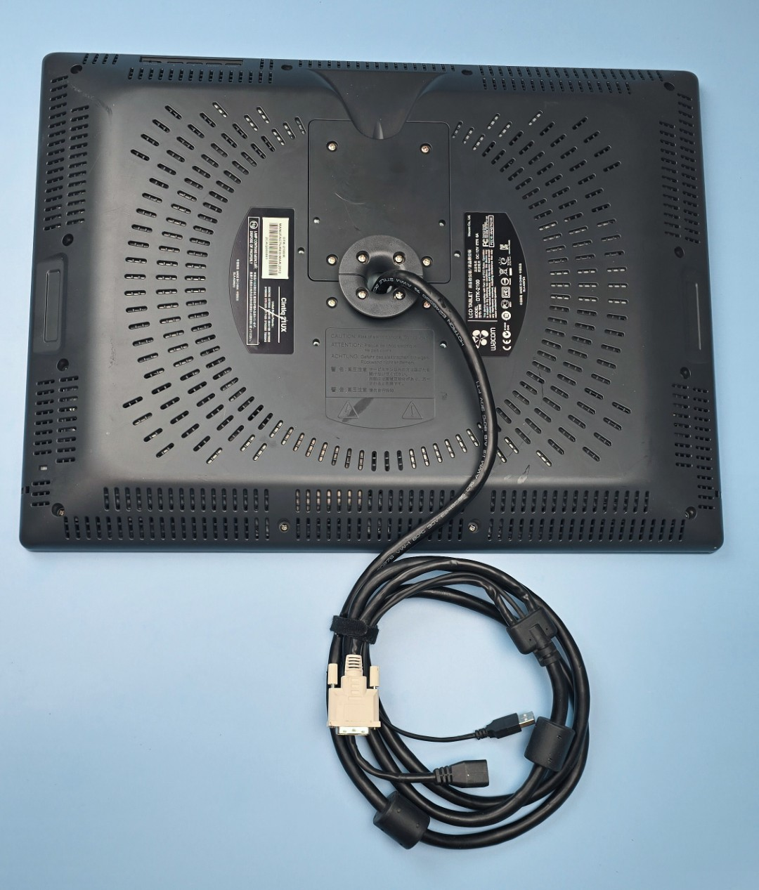
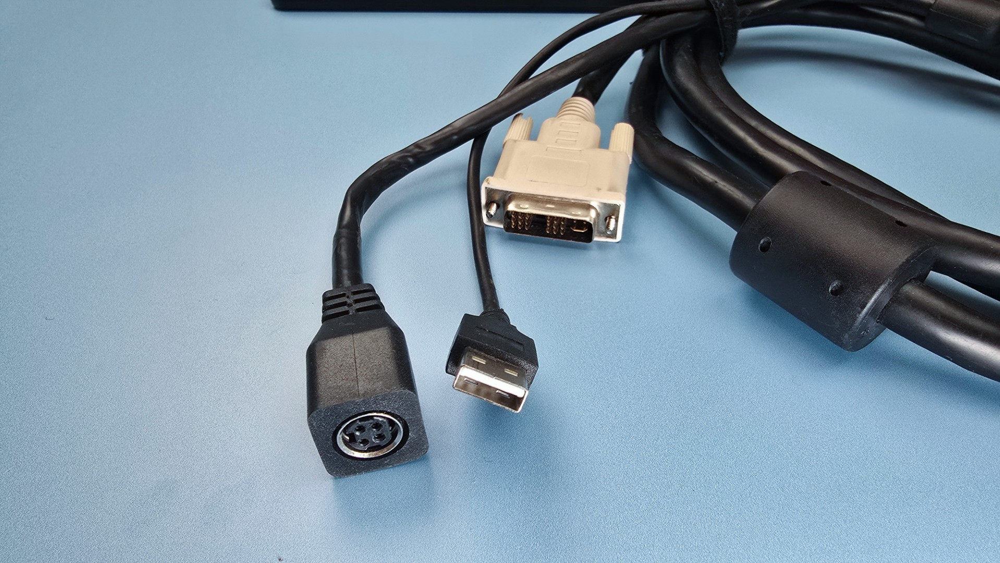
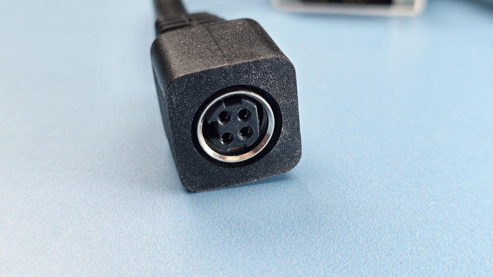
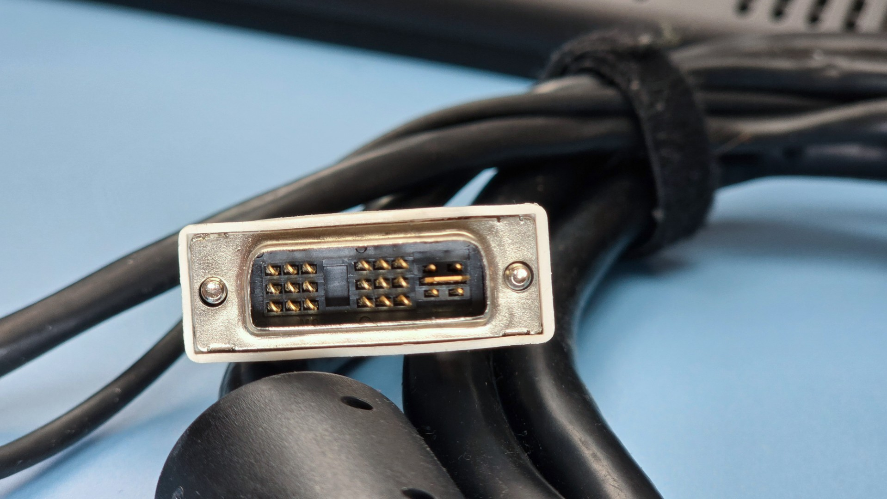

# Wacom Cintiq 21 UX 2010 (DTK-2100) notes

## Overview

NOTE: This is a second generation of the Cintiq 21 UX (DTZ-2100) that was released in 2005. [Wacom Cintiq 21UX 2005 (DTZ-2100) notes](wacom-dtz2100-notes.md).

## Links

These links come from the [DrawTabData Explorer](https://thesevenpens.github.io/DrawTabDataExplorer/entity/wacom.tabletfamily.wacom_cintiq). To add or fix a link, change it in DrawTabData.

DrawTabData has no links for this tablet yet.

## Specs

These specs come from the [DrawTabData Explorer](https://thesevenpens.github.io/DrawTabDataExplorer/entity/wacom.tabletfamily.wacom_cintiq). Click a model ID to see its full record there.



| | [DTK-2100](https://thesevenpens.github.io/DrawTabDataExplorer/entity/wacom.tablet.dtk2100) |
| --- | --- |
| Name | Cintiq 21UX 2010 |
| Released | 2010-03-26 |
| Status | Discontinued |



| | [DTK-2100](https://thesevenpens.github.io/DrawTabDataExplorer/entity/wacom.tablet.dtk2100) |
| --- | --- |
| Resolution | 1600 × 1200 |
| Aspect ratio | 4:3 |
| Pixel density | 94 PPI |
| Panel | IPS |
| Lamination | — |
| Anti-glare | Etched glass |
| Color gamut | — |
| Color depth | 8 bits per channel |
| Brightness | 200 cd/m² |
| Peak brightness | — |
| Viewing angle | — |
| Refresh rate | — |
| Response time | 20 ms |



| | [DTK-2100](https://thesevenpens.github.io/DrawTabDataExplorer/entity/wacom.tablet.dtk2100) |
| --- | --- |
| Active area | 432 × 324 mm (17 × 12.8 in) |
| Diagonal | 540 mm (21.3 in) |
| Aspect ratio | 4:3 |
| Pen technology | Passive EMR |
| Pressure levels | 2048 |
| Tilt | ±40° |
| Accuracy (center) | ±0.5 mm |
| Accuracy (corner) | ±4 mm |
| Report rate | 133 Hz |
| Density | 200 LPmm (5080 LPI) |
| Max hover | 5 mm |



| | [DTK-2100](https://thesevenpens.github.io/DrawTabDataExplorer/entity/wacom.tablet.dtk2100) |
| --- | --- |
| Included pen | [Intuos4 Grip Pen (KP-501E)](https://thesevenpens.github.io/DrawTabDataExplorer/entity/wacom.pen.kp501e) |
| Compatible pens | [Intuos4 Inking Pen (KP-130)](https://thesevenpens.github.io/DrawTabDataExplorer/entity/wacom.pen.kp130) [Pro Pen Slim (KP-301E)](https://thesevenpens.github.io/DrawTabDataExplorer/entity/wacom.pen.kp301e) [Intuos4 Airbrush Pen (KP-400E)](https://thesevenpens.github.io/DrawTabDataExplorer/entity/wacom.pen.kp400e) [Intuos4 Grip Pen (KP-501E)](https://thesevenpens.github.io/DrawTabDataExplorer/entity/wacom.pen.kp501e) [Intuos4 Art Pen (KP-701E)](https://thesevenpens.github.io/DrawTabDataExplorer/entity/wacom.pen.kp701e) |



| | [DTK-2100](https://thesevenpens.github.io/DrawTabDataExplorer/entity/wacom.tablet.dtk2100) |
| --- | --- |
| Buttons | — |
| Dials | — |
| Touch rings | — |
| Touch strips | — |
| Touch | No |



| | [DTK-2100](https://thesevenpens.github.io/DrawTabDataExplorer/entity/wacom.tablet.dtk2100) |
| --- | --- |
| Size | — |
| Weight | 8700 g |
| VESA mount | — |
| Legs | — |
| Included stand | — |



| | [DTK-2100](https://thesevenpens.github.io/DrawTabDataExplorer/entity/wacom.tablet.dtk2100) |
| --- | --- |
| Ports | — |
| Attached cable | USB-A DVI DC power |
| Bluetooth | — |



| | [DTK-2100](https://thesevenpens.github.io/DrawTabDataExplorer/entity/wacom.tablet.dtk2100) |
| --- | --- |
| Contents | — |



## Connections and cabling

### 3-in-1 cable

A fixed 3-in-1 cable coming out the back splits into three ends

* USB-A for data
* DVI-I (Dual Link) for video signal
* Power

<figure><figcaption></figcaption></figure>

### Power connector

<figure><figcaption></figcaption></figure>

<figure><figcaption></figcaption></figure>

## DVI-I (Dual Link) connector

<figure><figcaption></figcaption></figure>

To connect this to a modern computer you via HDMI or DisplayPort will need an adapter. Make sure you get one that supports 1600x1200 resolution at 60hz. Not all adapters are capable of that.

