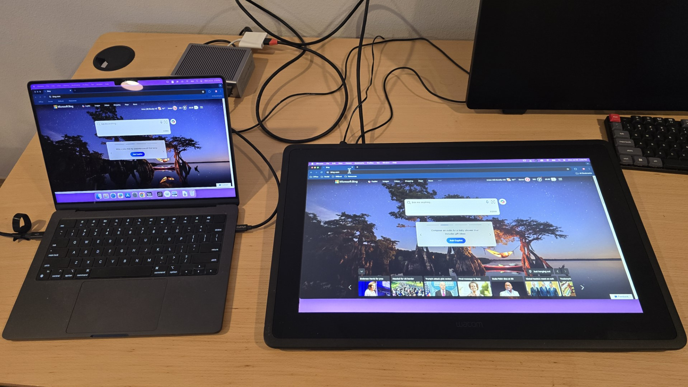
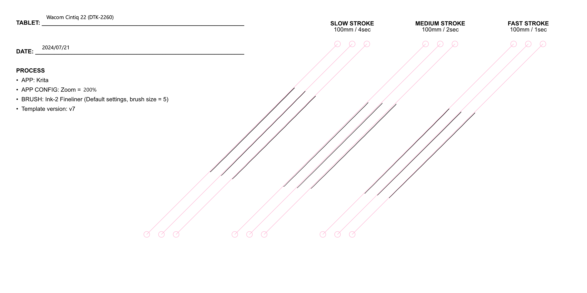
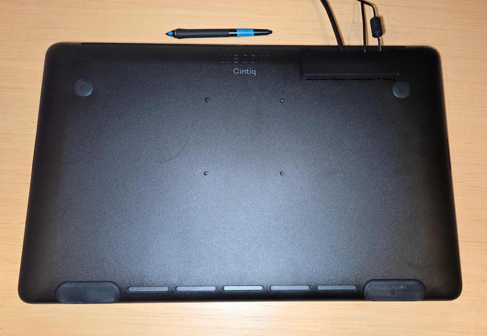
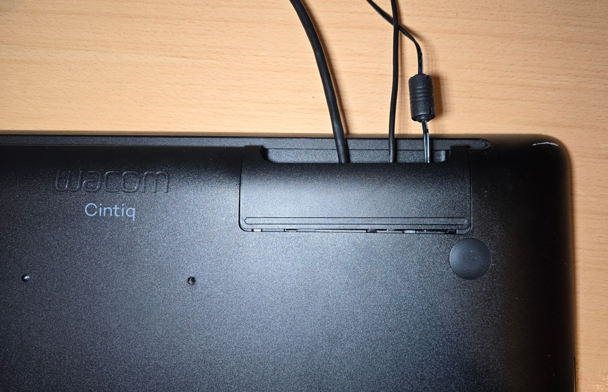
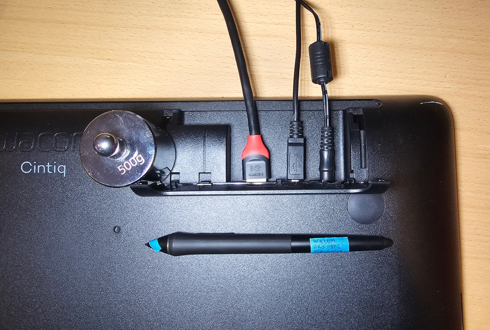
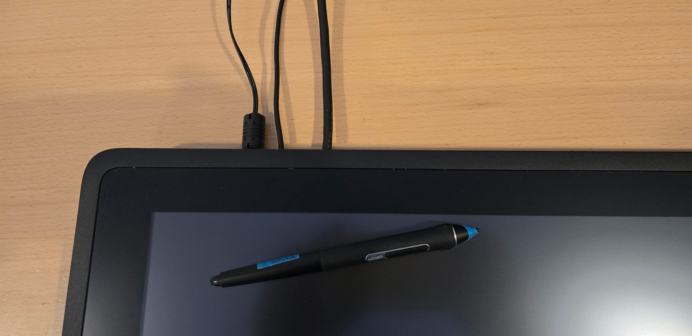
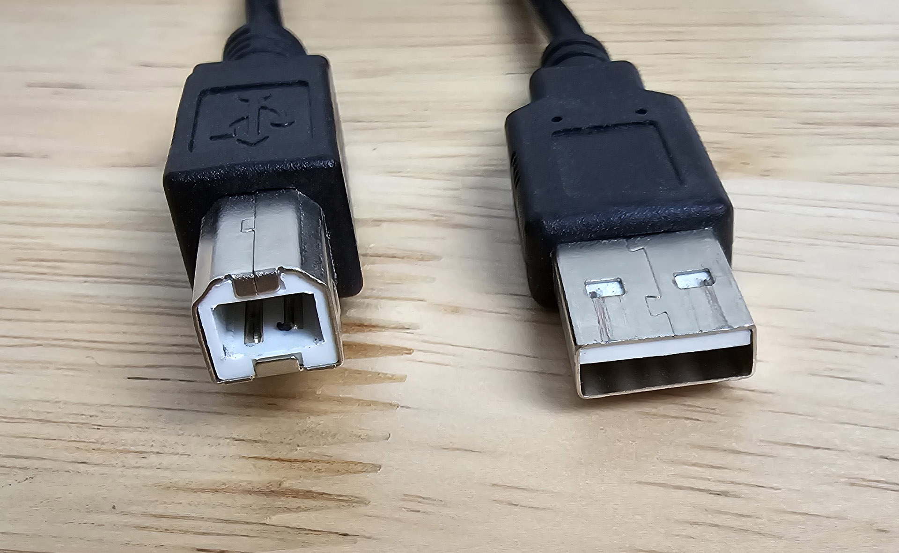
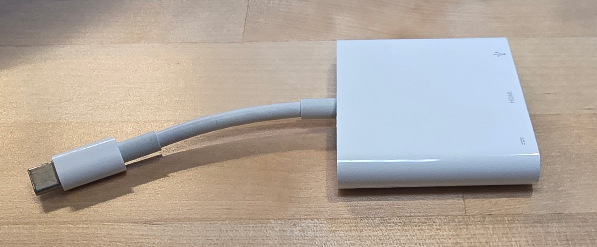
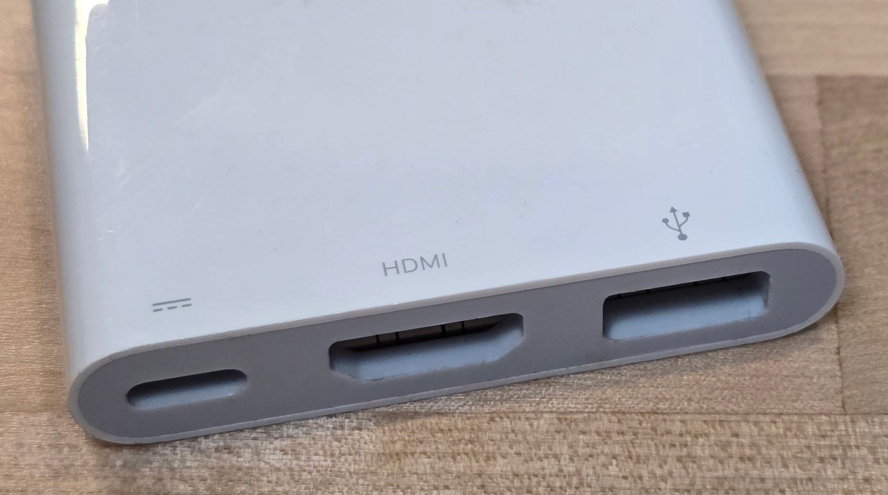

# Wacom Cintiq 22 2019 (DTK-2260) notes

## Overview

As of July 2024, although released in 2019, the Wacom Cintiq 22 continues to deliver an excellent drawing experience despite its slightly out-of-date screen.

I bought mine used from eBay for $380 and was very satisfied.

Model year: 2019

## Links

* User manual: [http://101.wacom.com/UserHelp/en/TOC/DTK-2260.html](http://101.wacom.com/UserHelp/en/TOC/DTK-2260.html)
* [Aaron Rutten review of Wacom Cintiq 22](https://youtu.be/xBPNyYX6zi8) 2019-07-17
* [Brad Colbow review of Wacom Cintiq 22 (DTK-2260)](https://www.youtube.com/watch?v=662QvZMik4U) 2019-07-18
* [Ross Draws review of Wacom Cintiq 22 (DTK-2260)](https://www.youtube.com/watch?v=02kg7Oxxd20) 2019-08-23
* [MobileTechReview review of Wacom Cintiq 22](https://www.youtube.com/watch?v=03XtX5Gg76g) 2019-07-19

## Basics

Release year: 2019

User manual: [https://101.wacom.com/UserHelp/en/TOC/DTK-2260.html](https://101.wacom.com/UserHelp/en/TOC/DTK-2260.html)

## Setup

<figure><figcaption></figcaption></figure>

## General

**Pen** - comes with the Wacom Pro Pen 2. Which is an excellent pen and responsible for much of the great drawing experience. See [Wacom Pro Pen 2 (KP-504E) notes](../../../pens/wacom-pens/wacom-kp504e-notes.md).

**Pressure handling** - EXCELLENT. See my notes on the Pro Pen 2.

## Display > basics

**Size:** 21.5 in (55 cm)

**Lamination** - NO. This is not a laminated display. Yes this introduces a very slight increase in parallax but not much. And it did not affect my drawing.

**Refresh Rate** - Standard. up to 60 Hz.

**Resolution** - 1920x1080

**Brightness**: 210 nits specified. Like many pen displays, this is not a super bright display - which is fine because most people tend to keep their eyes closer to the screen than a normal monitor and if the display was brighter, it might be overwhelming.

**Can you see pixels?** YES clearly. Which is to be expected with this resolution at this size.

**Bit depth**: 8bits per channel

**AG film:** YES

**Etched glass:** NO

**Response time (G2G):** 22ms. This response time is fine for drawing and office work. Serious gamers will likely not want to use this for a gaming monitor.

**Color gamut:**

* 72% NTSC
* 96% sRGB
* The colors look fine. This is not a modern wide-gamut display so you might find it looks less saturated than other modern displays. But I think it looks fine and works well for my needs. I prefer to work in sRGB anyway.

## **Pen tracking**

**Accuracy:** EXCELLENT in the center and at the edges and corners. Very small deviation in corners and edges, and better than many other tablets I have seen.

**Tilt compensation** - EXCELLENT. Tilting pen in its full supported range did not move the pointer from the tip by an appreciable amount.

## **Pointer lag**

TYPICAL. Lag is visible but this amount is what we see in all pen displays.

## **Diagonal wobble**

MINOR WOBBLE. Good for a pen display.

<figure><figcaption></figcaption></figure>

## **Anti-glare sparkle**

VERY GOOD. Very faint ag sparkle visible. Only visible if eyes are 4" to 6" from tablet.

## **Display sharpness**

pixels are clearly visible and well delineated

## Backlight bleed

I think this did have a little more backlight bleed than other pen displays. I am not particularly sensitive to backlight bleed, and it did not affect me at all.

## **Auxiliary inputs**

Tablet has none.

## **VESA mounting**

YES. This tablet supports VESA mounting (100mmx100mm)

I did not test with any VESA arm or stand.

## **Stand**

I think the original packaging includes a stand but the used package I bought on eBay did not come with a stand.

## **Legs**

Does not have legs.

## Surface Texture

Typical texture of a plastic film on glass. Film provides enough grip. Pen does not "slide" around.

Feels ever so slightly "stickier" than an etched glass display.

## Fans

It does not have any fans. You can clearly see that there are no fans in various teardowns ([teardown 1](https://www.youtube.com/watch?v=zip2xj-nBIw), [teardown 2](https://www.youtube.com/watch?v=Pr1bAqkNhV4))

## Noise

Silent.

## Touch

NO. This tablet does NOT support touch.

## Heat

I ran the display at 100% brightness for two hours. The overall tablet stayed about room temperature, with very slight warmth toward the left side.

## Device shape

It has a wedge shape. It is thicker at the top of the screen and thinner at the bottom of the screen. So laying it on a desk surface gives it a very slight angle of maybe 10 degrees. It's nice to have some angle but typically if drawing at an angle is important for you, then get a stand.

The device works very well on the desk. It does not slip around due to the 4 rubber strips on the bottom.

<figure><figcaption></figcaption></figure>

## Sound support

* No speakers
* No headphone jack

## **Cables and Connectivity**

**Ports**

* Power
* USB-B
* HDMI

**Port location**

The ports are behind a cover on the back.

<figure><figcaption></figcaption></figure>

<figure><figcaption></figcaption></figure>

The ports are oriented up so cords will go straight up and out and are clearly visible when using this device.

<figure><figcaption></figcaption></figure>

**Special note on USB-B**

This port type is getting less common. So to make sure you know what the cable looks like here is a photo of the cable I used. I used my own cable, the original Wacom cable was part of the package I bought from eBay. USB-B is on the left. USB-A is on the right.

<figure><figcaption></figcaption></figure>

**Special note on HDMI**

In 2024, HDMI ports on laptops are getting rare. So you may need a USB-C to HDMI adapter for your USB-C port that supports DP Alt Mode. In my experience, these adapters can sometimes be "finicky." More here: [Using HDMI adapters with pen displays](../../../../guides/pen-displays/hdmi-adapters/)

## My connectivity setup

My laptop was connected to a CalDigit TS4 dock via a TB4 cable.

The provided power went to the wall.

For the HDMI connection I tested two scenarios:

* The Cintiq was connected to the dock via the USB cable and an HDMI cable using an adapter.
* Connecting the Cintiq directly to the laptop with an HDMI cable.

This is the adapter I used for HDMI when connecting to the CalDigit TS4 dock, which has no HDMI port: Apple USB-C Digital AV Multiport Adapter.

<figure><figcaption></figcaption></figure>

<figure><figcaption></figcaption></figure>

## Other notes

If you are going to buy this tablet used to save some money, please keep in mind that the Pro Pen 2 is not cheap. If you lose or break the pen, getting a new one is about $90.
