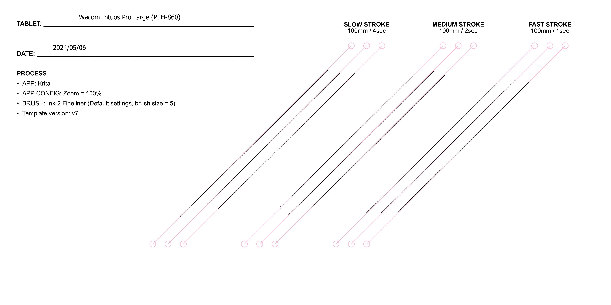

# Wacom Intuos Pro 2017 (PTH-x60) notes

## Overview

The Wacom Intuos Pro 2017 (PTH-x60) series of tablets are still the best pen tablets ever made even in 2025. They are tied with the Intuos Pro 2025 series (PTK-x70) series. Both are at the top of their game but depending on your background you might prefer one over the other.

With the release of the 2025 edition, you might be tempted to buy the 2017 edition to save some money. This is a valid choice but you should take some things into consideration: [Buying an Intuos Pro 2017 in 2026](buying-pthx60-in-2026.md)

## Models

There are three models in this edition.

<table><thead><tr><th width="131">Model ID</th><th width="90.39344262295083">Year</th><th width="279">Name</th></tr></thead><tbody><tr><td>PTH-860</td><td>2017</td><td>Intuos Pro Large (2017)</td></tr><tr><td>PTH-660</td><td>2017</td><td>Intuos Pro Medium (2017)</td></tr><tr><td>PTH-460</td><td>2019</td><td>Intuos Pro Small (2019)</td></tr></tbody></table>

The Intuos Pro Small (PTH-460) was actually released in 2019 instead of 2017. It is still considered part of the Intuos Pro (2017) series.

## My experience with the models

All models are excellent and highly recommended. I have spent MANY hours with all the models since their released.&#x20;

* My creative time has been spent with PTH-660 and PTH-860.&#x20;
* I used the PTH-660 primarily until 2022 when I switched to the PTH-860.
* To understand my experience with the PTH-860, see: [https://www.youtube.com/watch?v=YCmVugc3w\_g](https://www.youtube.com/watch?v=YCmVugc3w_g)
* I do use the PTH-460 - but not for creative work. Primarily when I need to test pens or test apps, I find it very convenient to use small PTH-460.

## Which model works for you

Again, I recommend all three. But specifically, I suggest looking at these models

* **For most users (the vast majority)** - I recommend thePTH-660 for most users. This reflects my standard guidance that medium-sized tablets are the best choice for the vast majority of people.
* **For people who KNOW they need a large tablet** - then these people should get the PTH-860. See this video that covers what it is like to use a large tablet: [https://www.youtube.com/watch?v=Tv\_qX1Z9-wI](https://www.youtube.com/watch?v=Tv_qX1Z9-wI). I and some others find that this size fits in well for line work, offering better control over strokes, especially if you are used to drawing from the arm instead of from the wrist.

**The PTH-460 is a fine tablet**, but I generally see that adult sized people complain of pain in their wrists when drawing with small tablets like this one. This certainly happens for me. It is a good size for smaller people, or for people who are looking for using it as a mouse replacement.&#x20;

## Pens

### Included Pen

These tablets come with the **Wacom Pro Pen 2 (KP-504E)** which is a HUGE part of why the drawing experience is so good. [Wacom Pro Pen 2 (KP-504E) notes](../../../pens/wacom-pens/wacom-kp504e-notes.md).

### Compatible pens

* Pro Pen 2 (KP-504E)&#x20;
* Pro Pen 3D (KP-505)&#x20;
* Pro Pen Slim (KP-301E)
* Airbrush Pen (KP-400E)&#x20;
* Art Pen (KP-701E)&#x20;
* Classic Pen (KP-300E)&#x20;
* Grip Pen (KP-501E)&#x20;
* Pro Pen (KP-503E)&#x20;
   

## **Drawing experience**

In summary, the drawing experience is EXCELLENT. Only the Intuos Pro 2025 series matches this tablet.

### **Pressure handling**

Quality of pressure handling due to the pen. And the KP-504E pen is EXCELLENT at pressure. See [Wacom Pro Pen 2 (KP-504E) notes](../../../pens/wacom-pens/wacom-kp504e-notes.md).

### **Pointer lag**

EXCELLENT. These tablets have very little pointer lag. You can see that demonstrated in this video: [https://youtu.be/CRwzPJPA\_5A](https://youtu.be/CRwzPJPA_5A).

### Diagonal wobble

Rating: VERY GOOD. Low amounts of wobble.

<figure><figcaption></figcaption></figure>

## Cables and connectivity

**Included cables** - These tablets come with a USB C cable.

**Using 3rd party USB-C cables** - You can use this cable or any USB C cable that supports data. In fact, I never use the USB C cables that Wacom provides for these tablets.

**Wireless** - All three tablets support Bluetooth connectivity for wireless operation.

## Touch

In my opinion the touch support is not great. The touch pad on any laptop you use will be far better and more responsive. The touch support has poor palm rejection. Disabling touch is the first thing I do with any tablet that supports touch. And I do the same with this tablet.

### **Touch on Windows vs MacOS**

Touch works much better on Windows systems than on MacOS systems. This is NOT Wacom's fault, it is due to how well Windows supports touch compared to MacOS. Windows has had very good built-in touch support since 2012 when Windows 8 launched and it has been continually improved over the years. So touch support is "baked-into" Windows as a deep level. So touch-enabled devices can take advantage of this built-in capability. For MacOS as of 2026 there is no touch built-into the OS. So many touch devices on MacOS don't work as well as you might expect. If you are expecting a PTH-x60 tablet to work just like an Apple Magic Trackpad, you will be very disappointed.&#x20;

## Surface texture

The Intuos Pro series has a slightly more textured surface than many other tablets.

For those of us who have used previous Intuos professional models. most found that the PTH-x60 series suddenly had a much greater texture feeling than those previous models. So if you are considering upgrading to this tablet, be aware of this.

### Texture erosion

Over an extended period of time (months?), you'll notice that the texture erodes a bit. The texture never goes completely away but it has a more typical amount of texture for a tablet. And the surface can end up looking a little "smooth" or "polished" in those areas. If you move the tip of your pen across the surface of the tablet you will even hear the difference as you move into these eroded areas. Below is an example of the texture erosion in Wacom Intuos Large (PTH-860).

<figure><figcaption></figcaption></figure>

### Texture sheets

The Intuos Pro MEDIUM and LARGE models have a surface that is replaceable with a **Texture Sheet**.

Wacom has three kinds of texture sheets: Standard, Smooth, and Rough. These texture sheets are often sold out and the smooth one is EXTREMELY rare. Besides giving you the texture feeling you want, they are useful if you've scratched up the surface of your tablet and want to make it feel like new.

### Nib wear 

A result of surface texture texture is that - depending how you draw - you can wear down a nib very fast. If you are doing a lot of shading with many back and forth strokes you might even notice significant wear within a week or even a day.

In any case, I advise everyone to always pay attention to their nibs and replace them if they are getting very worn.

### Wacom Intuos Pro Large (PTH-860)

Using a large tablet feels quite a bit different from using a medium tablet. It's important to understand this. So if you're interested in this tablet please watch the video below. In that video, I go into great detail about the practical issues of using a large tablet. And the video specifically covers the Wacom Intuos Pro large (PTH 860).



## Links

### Intuos Pro 2017 Medium (PTH-660)

* User manual: [https://101.wacom.com/UserHelp/en/TOC/PTH-660.html](https://101.wacom.com/UserHelp/en/TOC/PTH-660.html)
* [Brad Colbow review of Wacom Intuos Pro Medium](https://youtu.be/bbOGvAW3o-M)
* [Claudio Juliano Wacom Intuos Pro Medium](https://youtu.be/lKJYuRQfLkc)
* [EyeKooDrawsStuff review of Intuos Pro Medium](https://www.youtube.com/watch?v=XozM9fs9Jlc) May 13, 2022

### Intuos Pro 2017 Small (PTH-460)

* User manual: [http://101.wacom.com/UserHelp/en/TOC/PTH-460.html](http://101.wacom.com/UserHelp/en/TOC/PTH-460.html)
* [Brad Colbow review of Wacom Intuos Pro Smal](https://www.youtube.com/watch?v=VhR4dcxd_DU)l
* [Aaron Rutten review of Wacom Intus Pro Small](https://youtu.be/ZHIsUKtVbio)

### Intuos Pro 2017 Large (PTH-860)

* User manual: [http://101.wacom.com/UserHelp/en/TOC/PTH-860.html](http://101.wacom.com/UserHelp/en/TOC/PTH-860.html)

