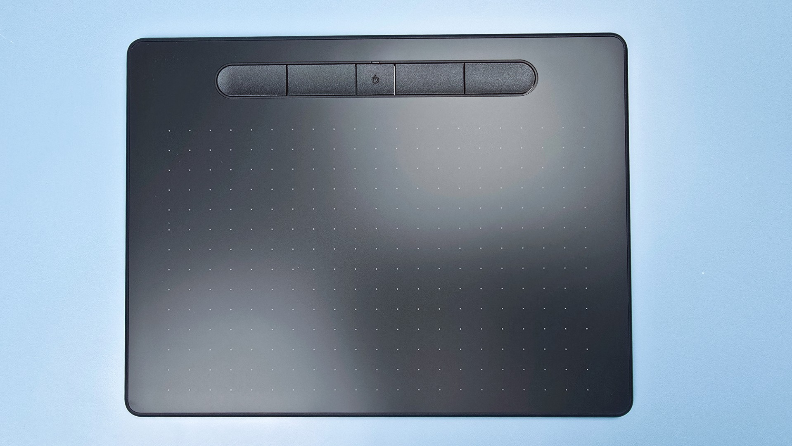
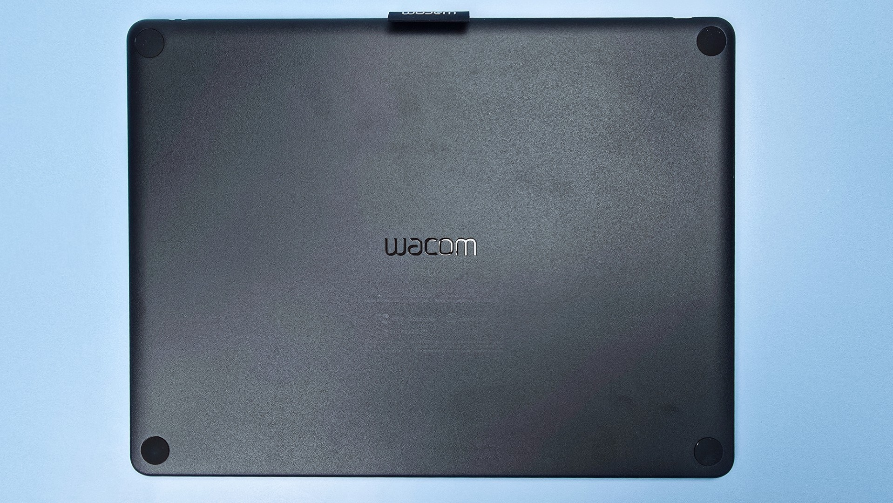
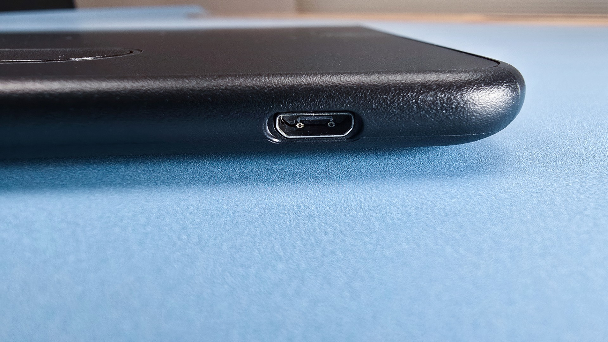
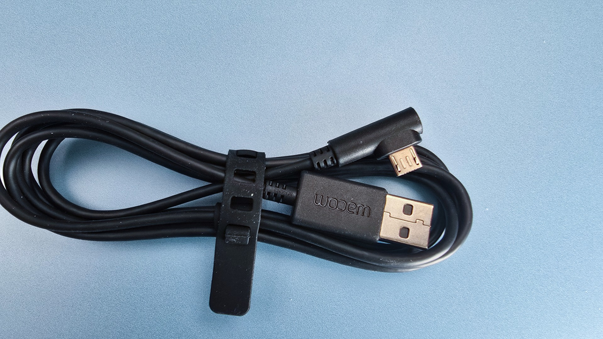
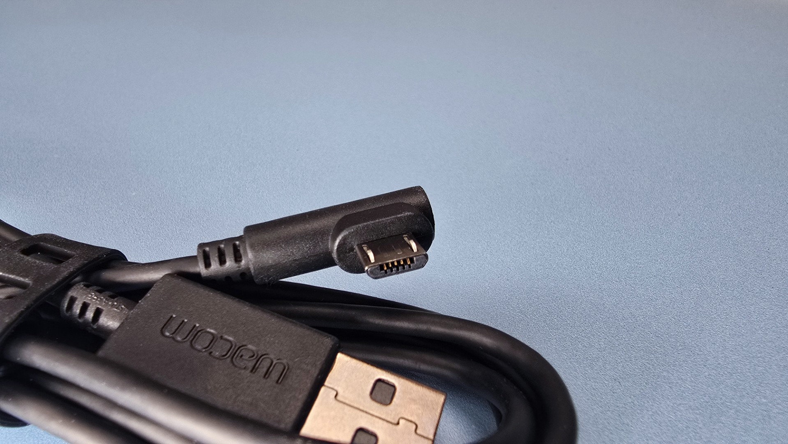
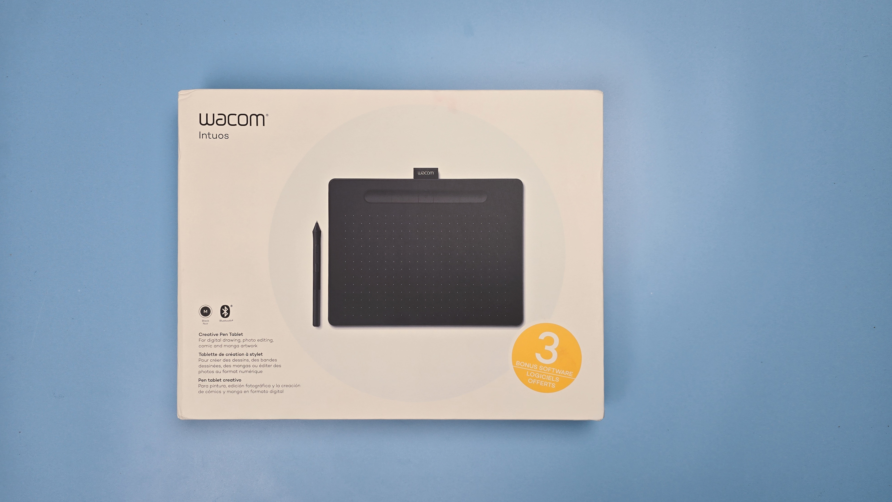
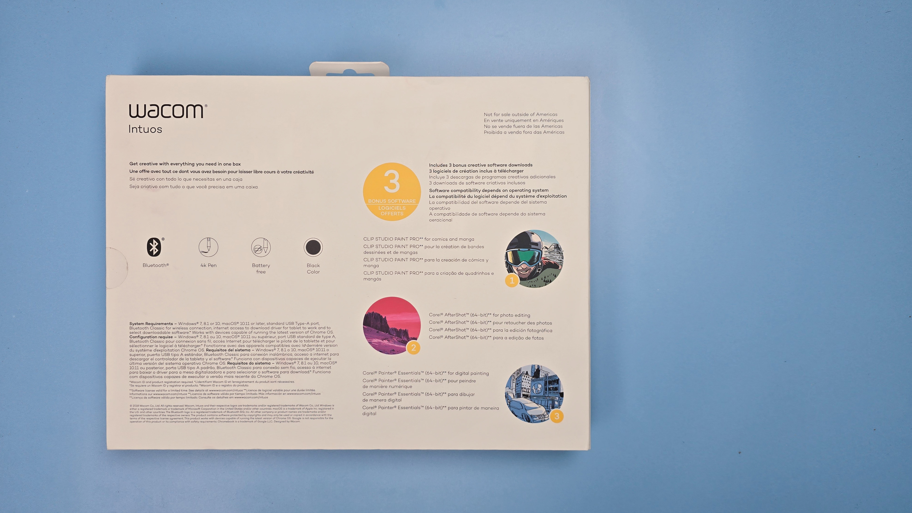

# Wacom Intuos

## Overview

These are **VERY GOOD** pen tablets from Wacom and still highly competitive with pro tablets from non-Wacom brands. The only real limitation is that they don't support TILT.

<figure><figcaption>
CTL-6100WL
</figcaption></figure>

<figure><figcaption>
CTL-6100WL
</figcaption></figure>

## Basics

Year introduced: 2018

## Models

<table><thead><tr><th>Name</th><th>Model</th><th width="100.199951171875">Year</th><th>Year</th></tr></thead><tbody><tr><td>Intuos S</td><td>CTL-4100</td><td>2018</td><td>User manual: <a href="http://101.wacom.com/UserHelp/en/TOC/CTL-4100.html">http://101.wacom.com/UserHelp/en/TOC/CTL-4100.html</a></td></tr><tr><td>Intuos S BT</td><td>CTL-4100WL</td><td>2018</td><td></td></tr><tr><td>Intuos M</td><td>CTL-6100</td><td>2018</td><td>User manual: <a href="http://101.wacom.com/UserHelp/en/TOC/CTL-6100wl.html">http://101.wacom.com/UserHelp/en/TOC/CTL-6100</a></td></tr><tr><td>Intuos M BT</td><td>CTL-6100WL</td><td>2018</td><td></td></tr></tbody></table>

## Older Intuos professional tablets

Currently "Intuos" refers to a consumer line of Wacom pen tablets. However, it "Intuos" used to be the name for the professional line of pen tablets before they switched to "Intuos Pro".

For those professional Intuos tablets go here:

* [Wacom Intuos5](wacom-intuos5.md)
* [Wacom Intuos4](wacom-intuos4/)
* [Wacom Intuos3](wacom-intuos3.md)
* [Wacom Intuos2](wacom-intuos2.md)
* [Wacom Intuos1](wacom-intuos1.md)

## Digitizer specs

* Active area
  * CTL-4100 & CTL-4100WL
    * Dimensions: 152.0 x 95.0 mm (6.0 x 3.7 in)
    * Diagonal
  * CTL-6100 & CTL-6100WL
    * Dimensions: 216.0 x 135.0 mm (8.5 x 5.3 in)
    * Diagonal
* Digitizer resolution: 100 LPmm (2540 LPi)
* Report rate: 133Hz
* Tilt - NONE. Does NOT support tilt

## Included pen

These tablets come with LP-1100K pen

## Pen compatibility

These tables are ONLY compatible with the Wacom 4K Pen (LP-1100K) pen. See [Wacom 4K Pen for Intuos (LP-1100K) notes](../../pens/wacom-pens/wacom-lp1100k-notes.md).

## -pen inputs

### Touch

The tablet does NOT support touch

### Auxiliary inputs

The tablet has 4 buttons at the top

NOTE: technically there is a fifth button - but that is for turning the bluetooth on and off

## Cables and connectivity

### Ports

There is a single micro USB port on the upper left corner of the tablet.

<figure><figcaption></figcaption></figure>

### Cabling

The tablet comes with a USB-A to Micro USB cable.

<figure><figcaption></figcaption></figure>

<figure><figcaption></figcaption></figure>

### Alternate cabling

You can use a micro usb-C adapter. Since I prefer to connect all my pen tablets with the same USB-C connector I use a female USB-C to male Micro-USB adapter.

### Wireless

The CTL-6100WL and CTL-4100WL models support Bluetooth for wireless connectivity

## Photos

<figure><figcaption></figcaption></figure>

<figure><figcaption></figcaption></figure>

## Resources

* [Brad Colbow - Wacom Intuos Small / Medium (2018) Review](https://www.youtube.com/watch?v=H-ZYte_UOVM) 2018-03-26
* [Aaron Rutton - INTUOS Small & Medium - Wacom Drawing Tablet for Beginners (Review)](https://www.youtube.com/watch?v=WLclWCHmrjg) 2019-03-21
* [Wacom - Playlist: Getting started with your Wacom Intuos pen tablet](https://www.youtube.com/playlist?list=PL5JDtjDGWsw3KRruZfqAwRmbNpAQbW89y)
