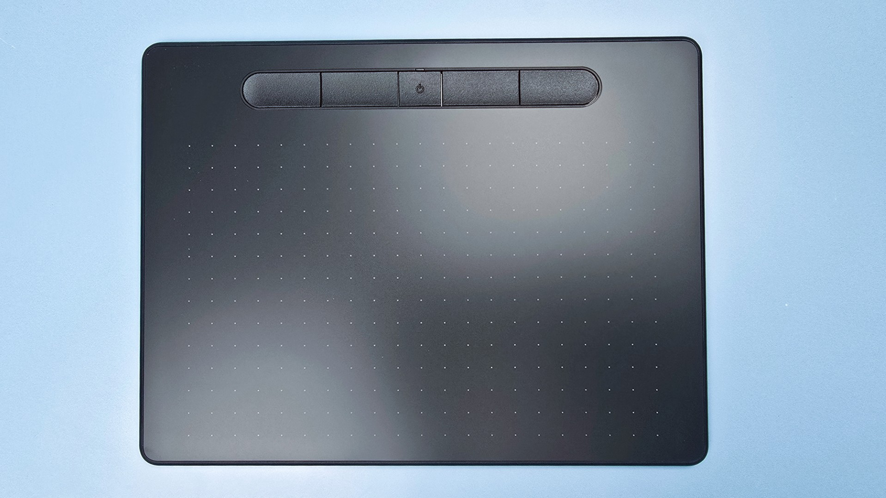
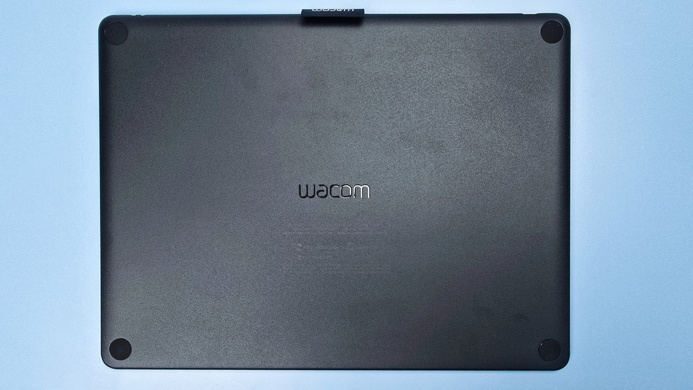
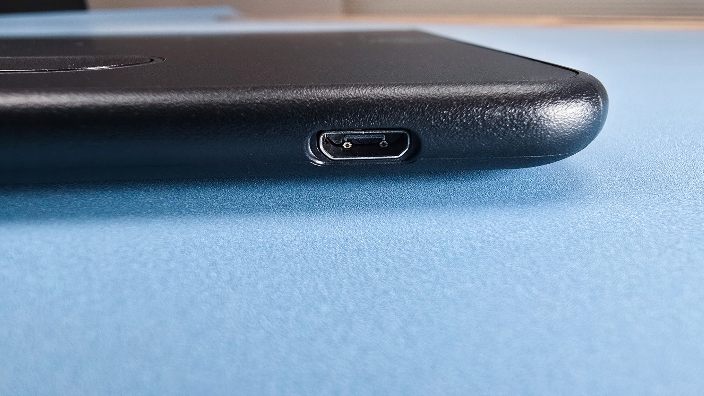
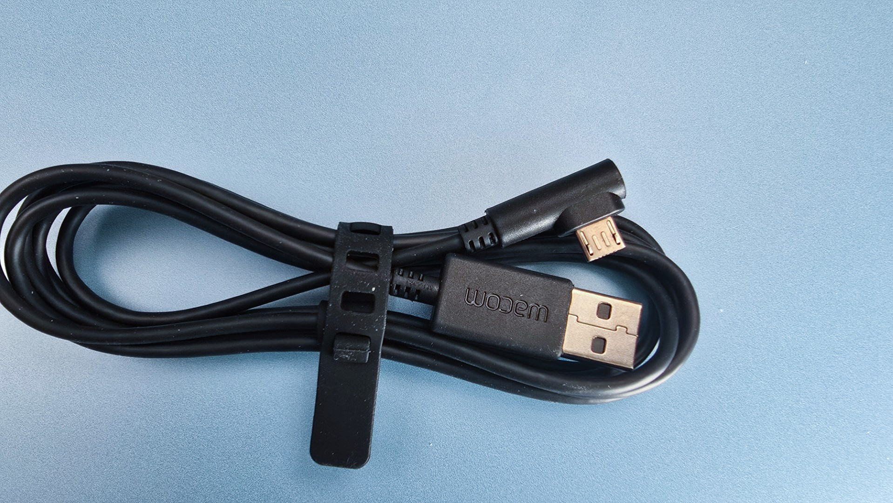
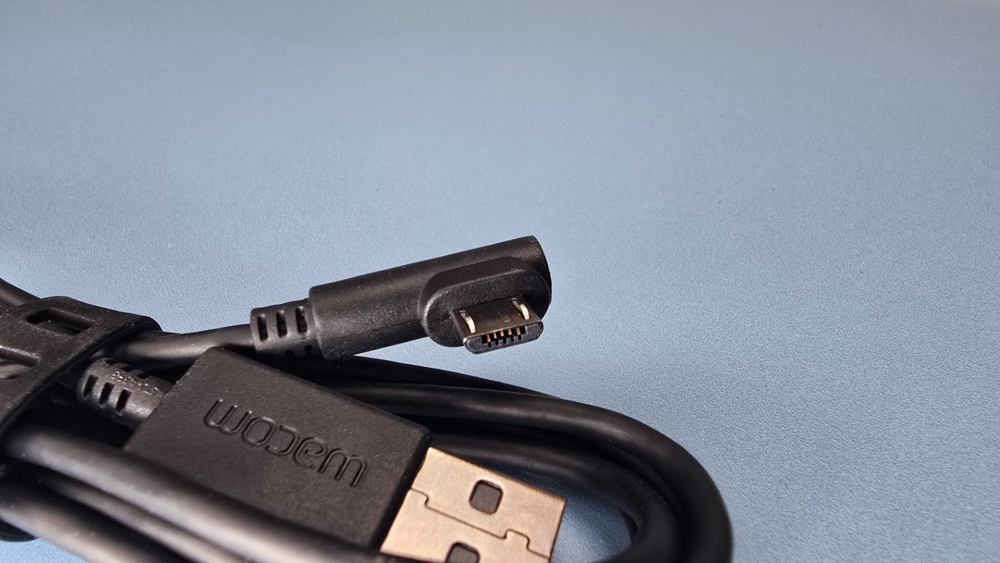
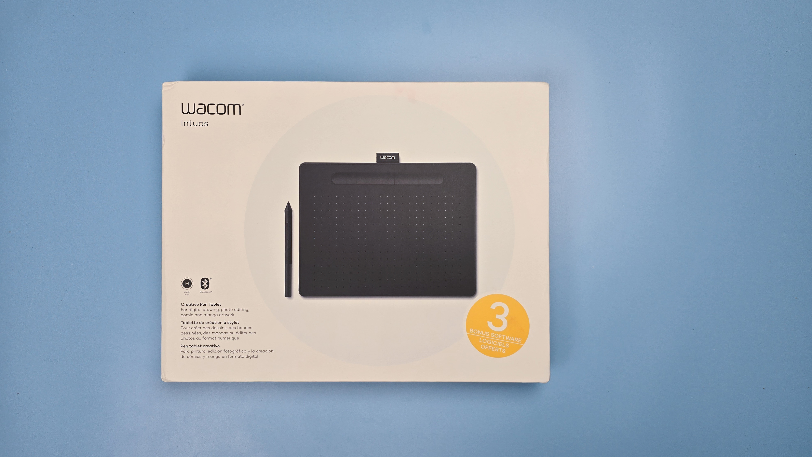
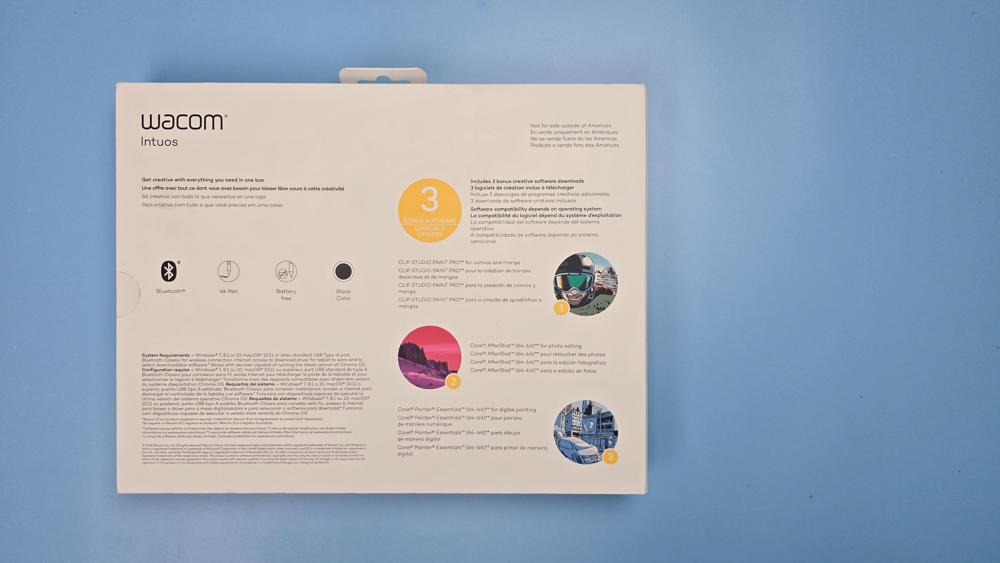

# Wacom Intuos (CTL-x100) notes

## Overview

These are **VERY GOOD** pen tablets from Wacom and still highly competitive with pro tablets from non-Wacom brands. The only real limitation is that they don't support TILT.

<figure><figcaption>
CTL-6100WL
</figcaption></figure>

<figure><figcaption>
CTL-6100WL
</figcaption></figure>

## Specs

These specs come from the [DrawTabData Explorer](https://thesevenpens.github.io/DrawTabDataExplorer/entity/wacom.tabletfamily.wacom_intuos_2018). Click a model ID to see its full record there.



| | [CTL-4100](https://thesevenpens.github.io/DrawTabDataExplorer/entity/wacom.tablet.ctl4100) | [CTL-4100WL](https://thesevenpens.github.io/DrawTabDataExplorer/entity/wacom.tablet.ctl4100wl) | [CTL-6100](https://thesevenpens.github.io/DrawTabDataExplorer/entity/wacom.tablet.ctl6100) | [CTL-6100WL](https://thesevenpens.github.io/DrawTabDataExplorer/entity/wacom.tablet.ctl6100wl) |
| --- | --- | --- | --- | --- |
| Name | Intuos Small | Intuos Small Bluetooth | Intuos Medium | Intuos Medium Bluetooth |
| Released | 2018-03-06 | 2018-03-06 | 2018-03-06 | 2018-03-06 |
| Status | Discontinued | Discontinued | Discontinued | Discontinued |
| Included pen | [4K Pen (LP-1100K)](https://thesevenpens.github.io/DrawTabDataExplorer/entity/wacom.pen.lp1100k) | [4K Pen (LP-1100K)](https://thesevenpens.github.io/DrawTabDataExplorer/entity/wacom.pen.lp1100k) | [4K Pen (LP-1100K)](https://thesevenpens.github.io/DrawTabDataExplorer/entity/wacom.pen.lp1100k) | [4K Pen (LP-1100K)](https://thesevenpens.github.io/DrawTabDataExplorer/entity/wacom.pen.lp1100k) |



| | [CTL-4100](https://thesevenpens.github.io/DrawTabDataExplorer/entity/wacom.tablet.ctl4100) | [CTL-4100WL](https://thesevenpens.github.io/DrawTabDataExplorer/entity/wacom.tablet.ctl4100wl) | [CTL-6100](https://thesevenpens.github.io/DrawTabDataExplorer/entity/wacom.tablet.ctl6100) | [CTL-6100WL](https://thesevenpens.github.io/DrawTabDataExplorer/entity/wacom.tablet.ctl6100wl) |
| --- | --- | --- | --- | --- |
| Active area | 152 × 95 mm (6 × 3.7 in) | 152 × 95 mm (6 × 3.7 in) | 216 × 135 mm (8.5 × 5.3 in) | 216 × 135 mm (8.5 × 5.3 in) |
| Pen technology | Passive EMR | — | Passive EMR | Passive EMR |
| Pressure levels | 4096 | 4096 | 4096 | 4096 |
| Tilt | None | None | None | None |
| Report rate | 133 Hz | 133 Hz | 133 Hz | 133 Hz |
| Density | 100 LPmm (2540 LPI) | 100 LPmm (2540 LPI) | 100 LPmm (2540 LPI) | 100 LPmm (2540 LPI) |
| Max hover | — | — | — | — |



| | [CTL-4100](https://thesevenpens.github.io/DrawTabDataExplorer/entity/wacom.tablet.ctl4100) | [CTL-4100WL](https://thesevenpens.github.io/DrawTabDataExplorer/entity/wacom.tablet.ctl4100wl) | [CTL-6100](https://thesevenpens.github.io/DrawTabDataExplorer/entity/wacom.tablet.ctl6100) | [CTL-6100WL](https://thesevenpens.github.io/DrawTabDataExplorer/entity/wacom.tablet.ctl6100wl) |
| --- | --- | --- | --- | --- |
| Buttons | 4 | 4 | 4 | 4 |
| Dials | — | — | — | — |
| Touch rings | — | — | — | — |
| Touch strips | — | — | — | — |
| Touch | No | No | No | No |



| | [CTL-4100](https://thesevenpens.github.io/DrawTabDataExplorer/entity/wacom.tablet.ctl4100) | [CTL-4100WL](https://thesevenpens.github.io/DrawTabDataExplorer/entity/wacom.tablet.ctl4100wl) | [CTL-6100](https://thesevenpens.github.io/DrawTabDataExplorer/entity/wacom.tablet.ctl6100) | [CTL-6100WL](https://thesevenpens.github.io/DrawTabDataExplorer/entity/wacom.tablet.ctl6100wl) |
| --- | --- | --- | --- | --- |
| Size | 200 × 160 × 8.8 mm (7.9 × 6.3 × 0.3 in) | 200 × 160 × 8.8 mm (7.9 × 6.3 × 0.3 in) | 264 × 200 × 8.8 mm (10.4 × 7.9 × 0.3 in) | 264 × 200 × 8.8 mm (10.4 × 7.9 × 0.3 in) |
| Weight | 230 g | 230 g | 410 g | 410 g |



| | [CTL-4100](https://thesevenpens.github.io/DrawTabDataExplorer/entity/wacom.tablet.ctl4100) | [CTL-4100WL](https://thesevenpens.github.io/DrawTabDataExplorer/entity/wacom.tablet.ctl4100wl) | [CTL-6100](https://thesevenpens.github.io/DrawTabDataExplorer/entity/wacom.tablet.ctl6100) | [CTL-6100WL](https://thesevenpens.github.io/DrawTabDataExplorer/entity/wacom.tablet.ctl6100wl) |
| --- | --- | --- | --- | --- |
| Ports | Micro-USB | Micro-USB | Micro-USB | Micro-USB |
| Attached cable | None | None | None | None |
| Bluetooth | No | Yes | No | Yes |



## Pen compatibility

These tablets are ONLY compatible with the Wacom 4K Pen (LP-1100K). See [Wacom 4K Pen for Intuos (LP-1100K) notes](../../../pens/wacom-pens/wacom-lp1100k-notes.md).

## -pen inputs

### Auxiliary inputs

The tablet has 4 buttons at the top

NOTE: technically there is a fifth button - but that is for turning the bluetooth on and off

## Cables and connectivity

### Ports

There is a single micro USB port on the upper left corner of the tablet.

<figure><figcaption></figcaption></figure>

### Cabling

The tablet comes with a USB-A to Micro USB cable.

<figure><figcaption></figcaption></figure>

<figure><figcaption></figcaption></figure>

### Alternate cabling

You can use a USB-C to Micro-USB adapter. Since I prefer to connect all my pen tablets with the same USB-C connector, I use a female USB-C to male Micro-USB adapter.

## Photos

<figure><figcaption></figcaption></figure>

<figure><figcaption></figcaption></figure>

## Resources

* [Brad Colbow - Wacom Intuos Small / Medium (2018) Review](https://www.youtube.com/watch?v=H-ZYte_UOVM) 2018-03-26
* [Aaron Rutten - INTUOS Small & Medium - Wacom Drawing Tablet for Beginners (Review)](https://www.youtube.com/watch?v=WLclWCHmrjg) 2019-03-21
* [Wacom - Playlist: Getting started with your Wacom Intuos pen tablet](https://www.youtube.com/playlist?list=PL5JDtjDGWsw3KRruZfqAwRmbNpAQbW89y)
