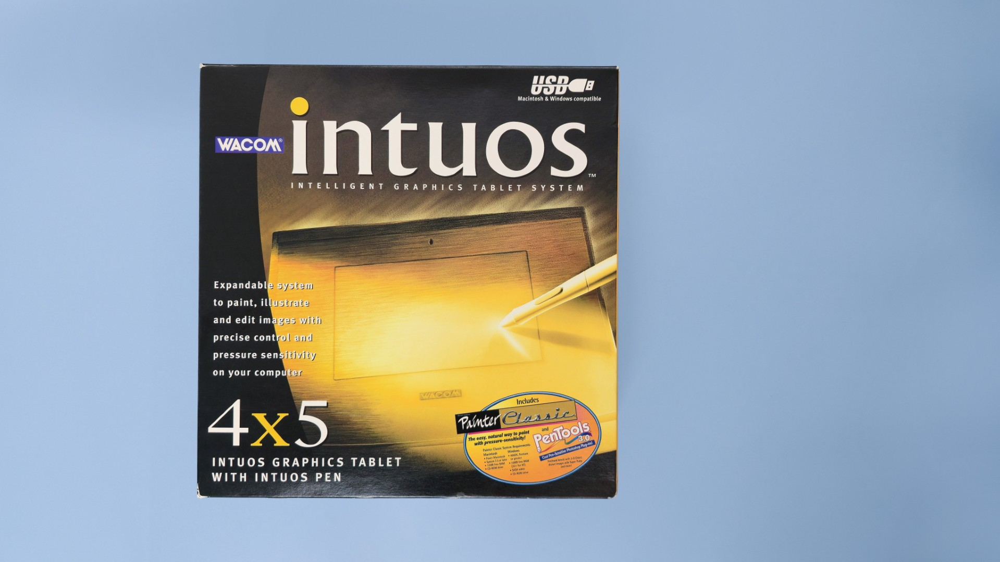
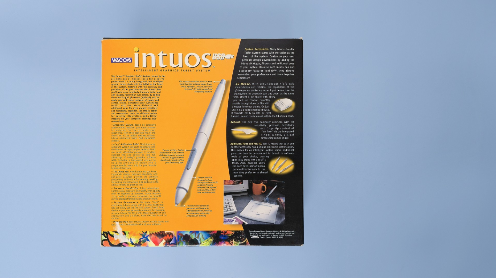

# Wacom Intuos1 (GD-xxxx) notes

## Links

* [S-Config - Original Wacom GD-0912-R on Windows 7 x64 ](https://www.s-config.com/original-wacom-gd-0912-r-on-windows-7-x64/)([archive](https://archive.is/oeUFc))
* [EyekooDrawsStuff - review of Intuos 12x12 (GD-1212-U)](https://www.youtube.com/watch?v=eXgcuOzg1-M) 2021-10-27

## Name

This was the first introduction of the “Intuos” name into their products.

At this time, the name “Intuos” indicated that a tablet was part of Wacom's professional pen tablet series. It was only some years later that Wacom decided to use "Intuos" for its consumer tablets and Intuos Pro for the professional tablets.

## Photos

<figure><figcaption></figcaption></figure>

<figure><figcaption></figcaption></figure>

## Included pen

Intuos1 Pen (GP-300E)

## Connections and cabling

Unlike the previous generation, the Intuos2 series featured tablets that connected via USB and serial and no longer supported Apple Desktop Bus (ADB) connections.
