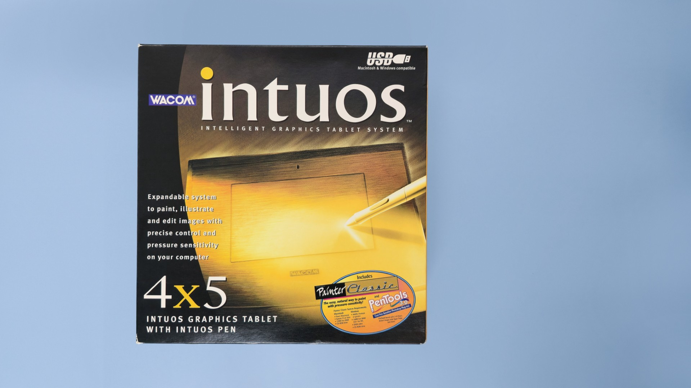
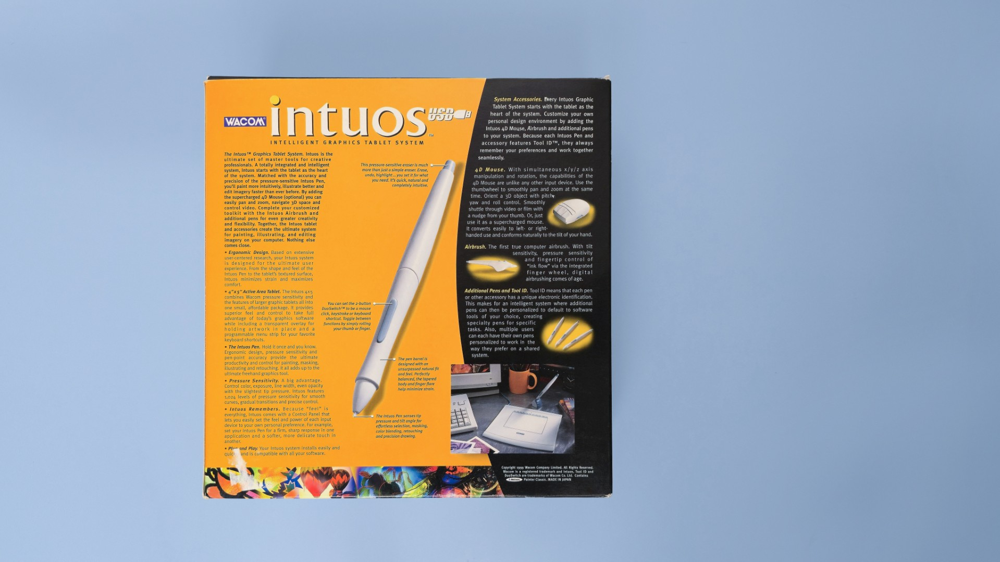

# Wacom Intuos1 (GD-xxxx) notes

## Other links

* [S-Config - Original Wacom GD-0912-R on Windows 7 x64 ](https://www.s-config.com/original-wacom-gd-0912-r-on-windows-7-x64/)([archive](https://archive.is/oeUFc))

## Name

This was the first introduction of the “Intuos” name into their products.

At this time, the name “Intuos” indicated that a tablet was part of Wacom's professional pen tablet series. It was only some years later that Wacom decided to use "Intuos" for its consumer tablets and Intuos Pro for the professional tablets.

## Links

These links come from the [DrawTabData Explorer](https://thesevenpens.github.io/DrawTabDataExplorer/entity/wacom.tabletfamily.wacom_intuos1_1998). To add or fix a link, change it in DrawTabData.

| Source | Link | Date |
| --- | --- | --- |
| Wacom | [User manual](https://101.wacom.com/productsupport/manual/IntuosUserManual.pdf) |  |
| EyekooDrawsStuff | [This 23 year old tablet is still going!](https://www.youtube.com/watch?v=eXgcuOzg1-M) (GD-1212-U) | 2021-10-27 |

## Specs

These specs come from the [DrawTabData Explorer](https://thesevenpens.github.io/DrawTabDataExplorer/entity/wacom.tabletfamily.wacom_intuos1_1998). Click a model ID to see its full record there.



| | [GD-0405-U](https://thesevenpens.github.io/DrawTabDataExplorer/entity/wacom.tablet.gd0405u) | [GD-0608-U](https://thesevenpens.github.io/DrawTabDataExplorer/entity/wacom.tablet.gd0608u) | [GD-0912-U](https://thesevenpens.github.io/DrawTabDataExplorer/entity/wacom.tablet.gd0912u) | [GD-1212-U](https://thesevenpens.github.io/DrawTabDataExplorer/entity/wacom.tablet.gd1212u) | [GD-1218-U](https://thesevenpens.github.io/DrawTabDataExplorer/entity/wacom.tablet.gd1218u) |
| --- | --- | --- | --- | --- | --- |
| Name | Intuos 4x5 USB | Intuos 6x8 USB | Intuos 9x12 USB | Intuos 12x12 USB | Intuos 12x18 USB |
| Released | 1998-09-01 | 1998-09-01 | 1998-09-01 | 1998-09-01 | 1998-09-01 |
| Status | Discontinued | Discontinued | Discontinued | Discontinued | Discontinued |



| | [GD-0405-U](https://thesevenpens.github.io/DrawTabDataExplorer/entity/wacom.tablet.gd0405u) | [GD-0608-U](https://thesevenpens.github.io/DrawTabDataExplorer/entity/wacom.tablet.gd0608u) | [GD-0912-U](https://thesevenpens.github.io/DrawTabDataExplorer/entity/wacom.tablet.gd0912u) | [GD-1212-U](https://thesevenpens.github.io/DrawTabDataExplorer/entity/wacom.tablet.gd1212u) | [GD-1218-U](https://thesevenpens.github.io/DrawTabDataExplorer/entity/wacom.tablet.gd1218u) |
| --- | --- | --- | --- | --- | --- |
| Active area | 127 × 106 mm (5 × 4.2 in) | 203.2 × 162.4 mm (8 × 6.4 in) | 304.8 × 240.6 mm (12 × 9.5 in) | 304.8 × 316.8 mm (12 × 12.5 in) | 457.2 × 316.8 mm (18 × 12.5 in) |
| Diagonal | 165.4 mm (6.5 in) | 260.1 mm (10.2 in) | 388.3 mm (15.3 in) | 439.6 mm (17.3 in) | 556.2 mm (21.9 in) |
| Aspect ratio | 1.198:1 | 5:4 | ≈5:4 (1.267:1) | ≈1:1 (1.039:1) | 1.443:1 |
| Pen technology | Passive EMR | Passive EMR | Passive EMR | Passive EMR | Passive EMR |
| Pressure levels | 1024 | 1024 | 1024 | 1024 | 1024 |
| Tilt | ±50° | ±60° | ±60° | ±60° | ±60° |
| Accuracy (center) | ±0.25 mm | ±0.25 mm | ±0.25 mm | ±0.25 mm | ±0.25 mm |
| Accuracy (corner) | — | — | — | — | — |
| Report rate | 200 Hz | 200 Hz | 200 Hz | 200 Hz | 200 Hz |
| Density | 100 LPmm (2540 LPI) | 100 LPmm (2540 LPI) | 100 LPmm (2540 LPI) | 100 LPmm (2540 LPI) | 100 LPmm (2540 LPI) |
| Max hover | 6 mm | 6 mm | 6 mm | 6 mm | 6 mm |



| | [GD-0405-U](https://thesevenpens.github.io/DrawTabDataExplorer/entity/wacom.tablet.gd0405u) | [GD-0608-U](https://thesevenpens.github.io/DrawTabDataExplorer/entity/wacom.tablet.gd0608u) | [GD-0912-U](https://thesevenpens.github.io/DrawTabDataExplorer/entity/wacom.tablet.gd0912u) | [GD-1212-U](https://thesevenpens.github.io/DrawTabDataExplorer/entity/wacom.tablet.gd1212u) | [GD-1218-U](https://thesevenpens.github.io/DrawTabDataExplorer/entity/wacom.tablet.gd1218u) |
| --- | --- | --- | --- | --- | --- |
| Included pen | [Intuos1 Classic Pen (GP-300E)](https://thesevenpens.github.io/DrawTabDataExplorer/entity/wacom.pen.gp300e) | [Intuos1 Classic Pen (GP-300E)](https://thesevenpens.github.io/DrawTabDataExplorer/entity/wacom.pen.gp300e) | [Intuos1 Classic Pen (GP-300E)](https://thesevenpens.github.io/DrawTabDataExplorer/entity/wacom.pen.gp300e) | [Intuos1 Classic Pen (GP-300E)](https://thesevenpens.github.io/DrawTabDataExplorer/entity/wacom.pen.gp300e) | [Intuos1 Classic Pen (GP-300E)](https://thesevenpens.github.io/DrawTabDataExplorer/entity/wacom.pen.gp300e) |
| Compatible pens | [Intuos1 Inking Pen (GP-110)](https://thesevenpens.github.io/DrawTabDataExplorer/entity/wacom.pen.gp110) [Intuos1 Stroke Pen (GP-120)](https://thesevenpens.github.io/DrawTabDataExplorer/entity/wacom.pen.gp120) [Intuos1 Classic Pen (GP-300E)](https://thesevenpens.github.io/DrawTabDataExplorer/entity/wacom.pen.gp300e) [Intuos1 Airbrush Pen (GP-400E)](https://thesevenpens.github.io/DrawTabDataExplorer/entity/wacom.pen.gp400e) | [Intuos1 Inking Pen (GP-110)](https://thesevenpens.github.io/DrawTabDataExplorer/entity/wacom.pen.gp110) [Intuos1 Stroke Pen (GP-120)](https://thesevenpens.github.io/DrawTabDataExplorer/entity/wacom.pen.gp120) [Intuos1 Classic Pen (GP-300E)](https://thesevenpens.github.io/DrawTabDataExplorer/entity/wacom.pen.gp300e) [Intuos1 Airbrush Pen (GP-400E)](https://thesevenpens.github.io/DrawTabDataExplorer/entity/wacom.pen.gp400e) | [Intuos1 Inking Pen (GP-110)](https://thesevenpens.github.io/DrawTabDataExplorer/entity/wacom.pen.gp110) [Intuos1 Stroke Pen (GP-120)](https://thesevenpens.github.io/DrawTabDataExplorer/entity/wacom.pen.gp120) [Intuos1 Classic Pen (GP-300E)](https://thesevenpens.github.io/DrawTabDataExplorer/entity/wacom.pen.gp300e) [Intuos1 Airbrush Pen (GP-400E)](https://thesevenpens.github.io/DrawTabDataExplorer/entity/wacom.pen.gp400e) | [Intuos1 Inking Pen (GP-110)](https://thesevenpens.github.io/DrawTabDataExplorer/entity/wacom.pen.gp110) [Intuos1 Stroke Pen (GP-120)](https://thesevenpens.github.io/DrawTabDataExplorer/entity/wacom.pen.gp120) [Intuos1 Classic Pen (GP-300E)](https://thesevenpens.github.io/DrawTabDataExplorer/entity/wacom.pen.gp300e) [Intuos1 Airbrush Pen (GP-400E)](https://thesevenpens.github.io/DrawTabDataExplorer/entity/wacom.pen.gp400e) | [Intuos1 Inking Pen (GP-110)](https://thesevenpens.github.io/DrawTabDataExplorer/entity/wacom.pen.gp110) [Intuos1 Stroke Pen (GP-120)](https://thesevenpens.github.io/DrawTabDataExplorer/entity/wacom.pen.gp120) [Intuos1 Classic Pen (GP-300E)](https://thesevenpens.github.io/DrawTabDataExplorer/entity/wacom.pen.gp300e) [Intuos1 Airbrush Pen (GP-400E)](https://thesevenpens.github.io/DrawTabDataExplorer/entity/wacom.pen.gp400e) |



| | [GD-0405-U](https://thesevenpens.github.io/DrawTabDataExplorer/entity/wacom.tablet.gd0405u) | [GD-0608-U](https://thesevenpens.github.io/DrawTabDataExplorer/entity/wacom.tablet.gd0608u) | [GD-0912-U](https://thesevenpens.github.io/DrawTabDataExplorer/entity/wacom.tablet.gd0912u) | [GD-1212-U](https://thesevenpens.github.io/DrawTabDataExplorer/entity/wacom.tablet.gd1212u) | [GD-1218-U](https://thesevenpens.github.io/DrawTabDataExplorer/entity/wacom.tablet.gd1218u) |
| --- | --- | --- | --- | --- | --- |
| Buttons | — | — | — | — | — |
| Dials | — | — | — | — | — |
| Touch rings | — | — | — | — | — |
| Touch strips | — | — | — | — | — |
| Touch | No | No | No | No | No |



| | [GD-0405-U](https://thesevenpens.github.io/DrawTabDataExplorer/entity/wacom.tablet.gd0405u) | [GD-0608-U](https://thesevenpens.github.io/DrawTabDataExplorer/entity/wacom.tablet.gd0608u) | [GD-0912-U](https://thesevenpens.github.io/DrawTabDataExplorer/entity/wacom.tablet.gd0912u) | [GD-1212-U](https://thesevenpens.github.io/DrawTabDataExplorer/entity/wacom.tablet.gd1212u) | [GD-1218-U](https://thesevenpens.github.io/DrawTabDataExplorer/entity/wacom.tablet.gd1218u) |
| --- | --- | --- | --- | --- | --- |
| Size | 225 × 210 × 7.5 mm (8.9 × 8.3 × 0.3 in) | 334 × 258 × 14 mm (13.1 × 10.2 × 0.6 in) | 456 × 361 × 14 mm (18 × 14.2 × 0.6 in) | 444 × 435.5 × 37 mm (17.5 × 17.1 × 1.5 in) | 616 × 445.5 × 37 mm (24.3 × 17.5 × 1.5 in) |
| Weight | 520 g | 900 g | 1600 g | 2100 g | 3000 g |



| | [GD-0405-U](https://thesevenpens.github.io/DrawTabDataExplorer/entity/wacom.tablet.gd0405u) | [GD-0608-U](https://thesevenpens.github.io/DrawTabDataExplorer/entity/wacom.tablet.gd0608u) | [GD-0912-U](https://thesevenpens.github.io/DrawTabDataExplorer/entity/wacom.tablet.gd0912u) | [GD-1212-U](https://thesevenpens.github.io/DrawTabDataExplorer/entity/wacom.tablet.gd1212u) | [GD-1218-U](https://thesevenpens.github.io/DrawTabDataExplorer/entity/wacom.tablet.gd1218u) |
| --- | --- | --- | --- | --- | --- |
| Ports | — | — | — | — | — |
| Attached cable | — | — | USB-A | USB-A | USB-A |
| Bluetooth | — | — | — | — | — |



| | [GD-0405-U](https://thesevenpens.github.io/DrawTabDataExplorer/entity/wacom.tablet.gd0405u) | [GD-0608-U](https://thesevenpens.github.io/DrawTabDataExplorer/entity/wacom.tablet.gd0608u) | [GD-0912-U](https://thesevenpens.github.io/DrawTabDataExplorer/entity/wacom.tablet.gd0912u) | [GD-1212-U](https://thesevenpens.github.io/DrawTabDataExplorer/entity/wacom.tablet.gd1212u) | [GD-1218-U](https://thesevenpens.github.io/DrawTabDataExplorer/entity/wacom.tablet.gd1218u) |
| --- | --- | --- | --- | --- | --- |
| Power input | 5 V, 0.5 A | 5 V, 0.5 A | 5 V, 0.5 A | 5 V, 0.5 A | 5 V, 0.5 A |
| Consumption | 2 W | 2 W | 2 W | 2 W | 2 W |
| Standby | — | — | — | — | — |
| Power adapter | — | — | — | — | — |
| Power output | — | — | — | — | — |



| | [GD-0405-U](https://thesevenpens.github.io/DrawTabDataExplorer/entity/wacom.tablet.gd0405u) | [GD-0608-U](https://thesevenpens.github.io/DrawTabDataExplorer/entity/wacom.tablet.gd0608u) | [GD-0912-U](https://thesevenpens.github.io/DrawTabDataExplorer/entity/wacom.tablet.gd0912u) | [GD-1212-U](https://thesevenpens.github.io/DrawTabDataExplorer/entity/wacom.tablet.gd1212u) | [GD-1218-U](https://thesevenpens.github.io/DrawTabDataExplorer/entity/wacom.tablet.gd1218u) |
| --- | --- | --- | --- | --- | --- |
| Contents | — | — | — | — | — |



## Photos

<figure><figcaption></figcaption></figure>

<figure><figcaption></figcaption></figure>

## Connections and cabling

Unlike the previous generation, the Intuos2 series featured tablets that connected via USB and serial and no longer supported Apple Desktop Bus (ADB) connections.
