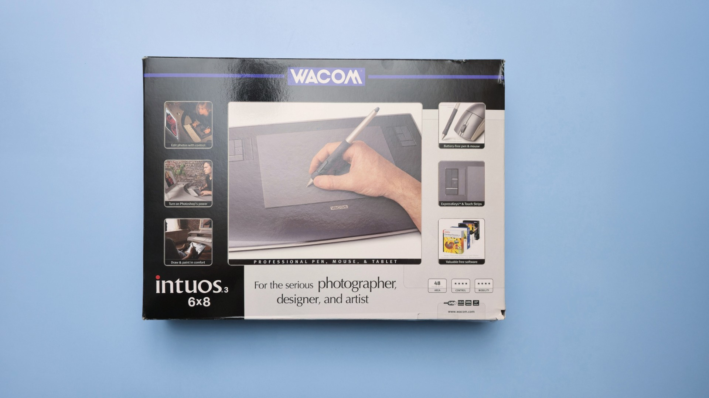
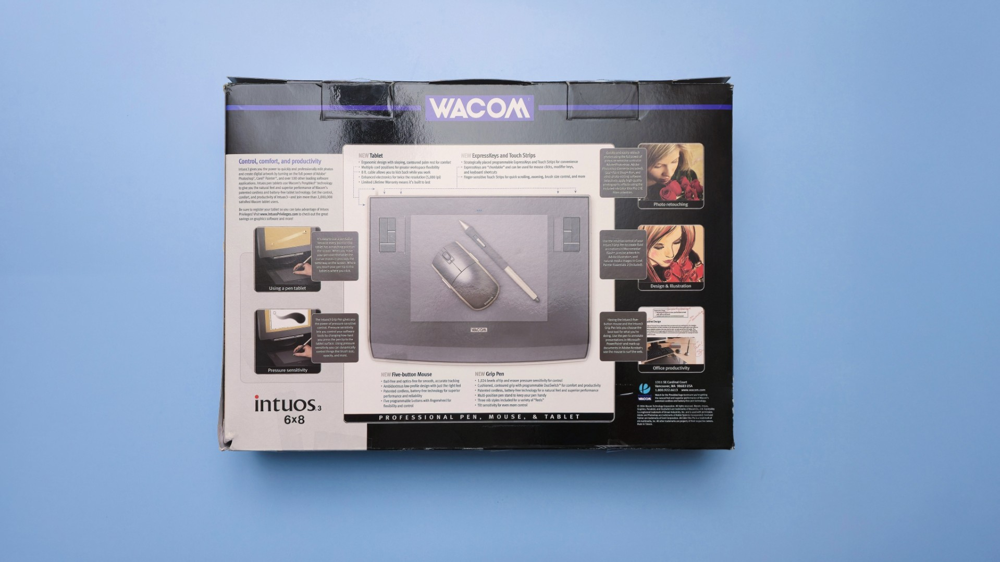

# Wacom Intuos3

## Overview

* Release year: 2004
* Intuos pro generation: 3rd gen
* Preceded by: [Wacom Intuos2](wacom-intuos2.md)
* Succeeded by: [Wacom Intuos4](wacom-intuos4/)
* User manual
  * [Intuos 3 User Manual](https://cdn.wacom.com/u/productsupport/manuals/intuos3/user's%20manual.pdf) ([archive.org](https://archive.org/details/manualzilla-id-5708085))
* Last supported driver
  * Windows: 6.3.15-3 released 2015-12-22
  * MacOS: 6.3.15-3 released on 2015-12-21

## Models

<table><thead><tr><th width="131">Model ID</th><th width="279">Name</th></tr></thead><tbody><tr><td>PTZ-430</td><td>Intuos3 4x5</td></tr><tr><td>PTZ-431W</td><td>Intuos3 4x6</td></tr><tr><td>PTZ-630</td><td>Intuos3 6x8</td></tr><tr><td>PTZ-631W</td><td>Intuos3 6x11</td></tr><tr><td>PTZ-930</td><td>Intuos3 9x12</td></tr><tr><td>PTZ-1230</td><td>Intuos3 12x12</td></tr><tr><td>PTZ-1231W</td><td>Intuos3 12x19</td></tr></tbody></table>

## Resources

* [Wacom - What is the driver for the Intuos3, PTZ model tablets?](https://support.wacom.com/hc/en-us/articles/1500006341302-What-is-the-driver-for-the-Intuos-3-PTZ-model-tablets-)
* [EyeKooDrawsStuff review of Intuos3](https://www.youtube.com/watch?v=oX1olkXab60) 2021-09-11
* [Pen & Blade review of Intuos3](https://www.youtube.com/watch?v=yve0umU7ONQ) 2017-01-14
* [Matthew Pearce review of Intuos3](https://www.youtube.com/watch?v=O_tZqMrcprE) 2009-10-18
* [reddit r/wacom - Got an Intuos3 PTZ-630 fully working on macOS 26](https://www.reddit.com/r/wacom/comments/1paa38t/got_an_intuos_3_ptz630_fully_working_on_macos_26/) 2025-11-29
* [EyekooDrawsStuff - Wacom Intuos 3 6x8 (PTZ-630)](https://www.youtube.com/watch?v=GAb-mte-j5w) 2021-09-11

## Photos

<figure><figcaption></figcaption></figure>

<figure><figcaption></figcaption></figure>
