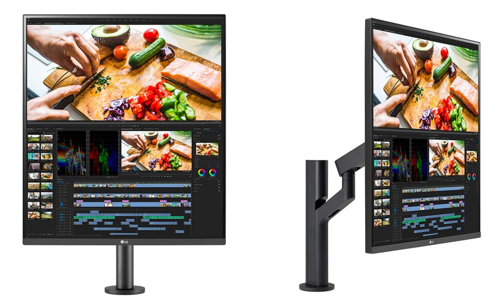
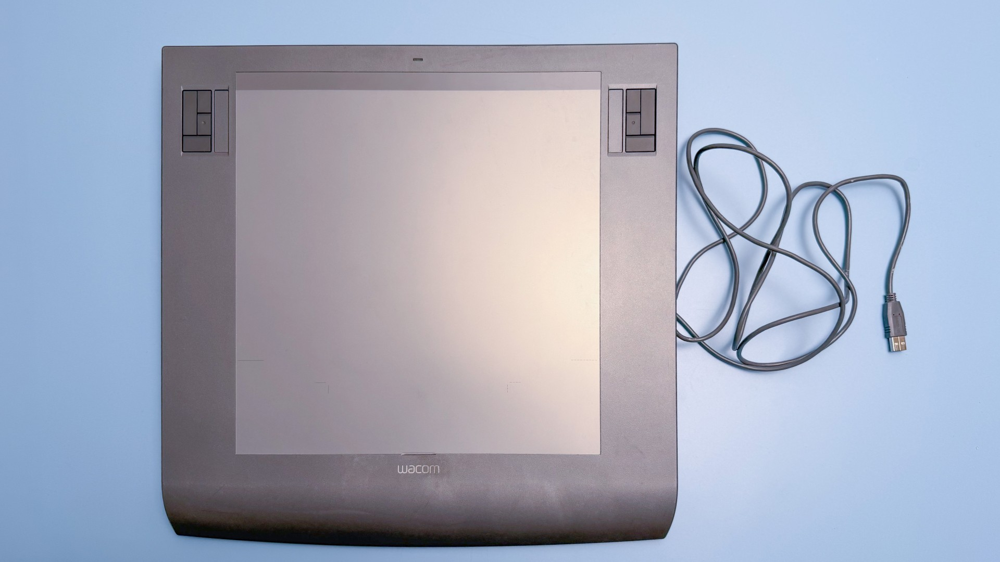
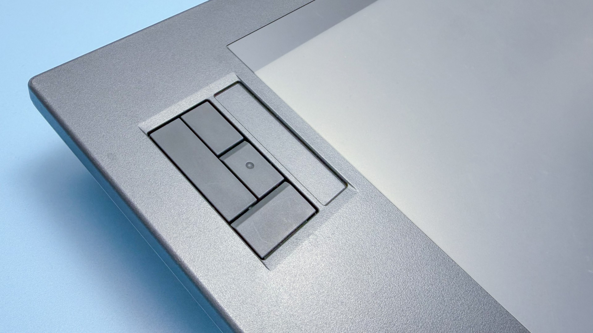
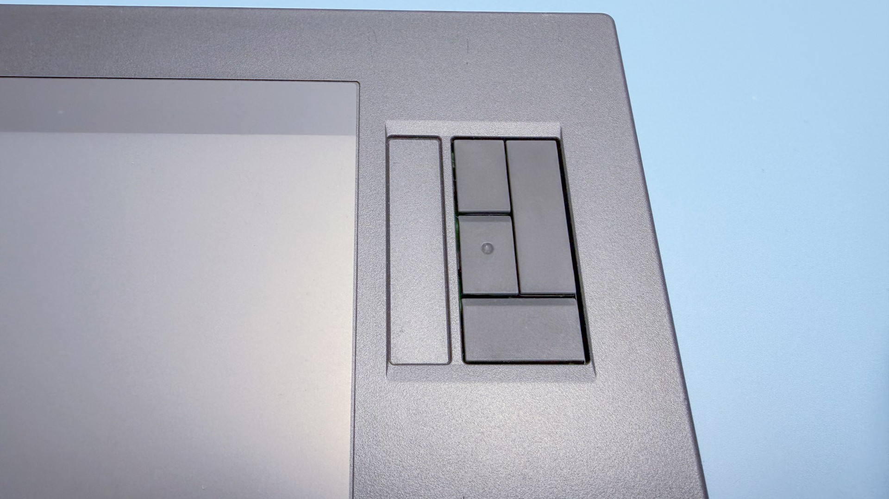
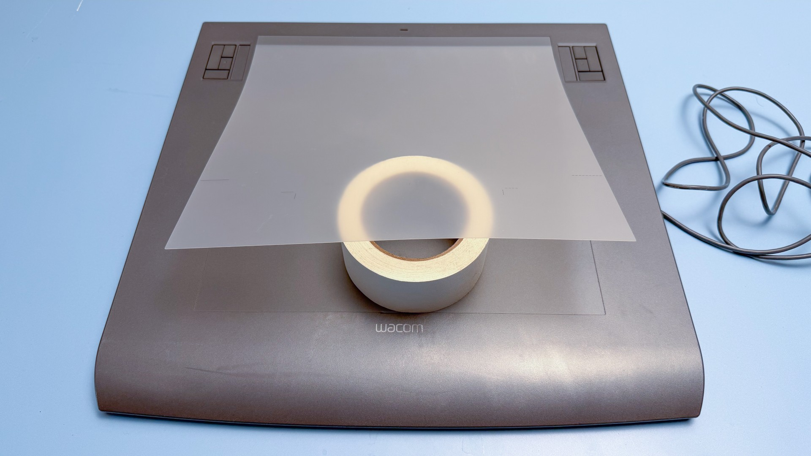
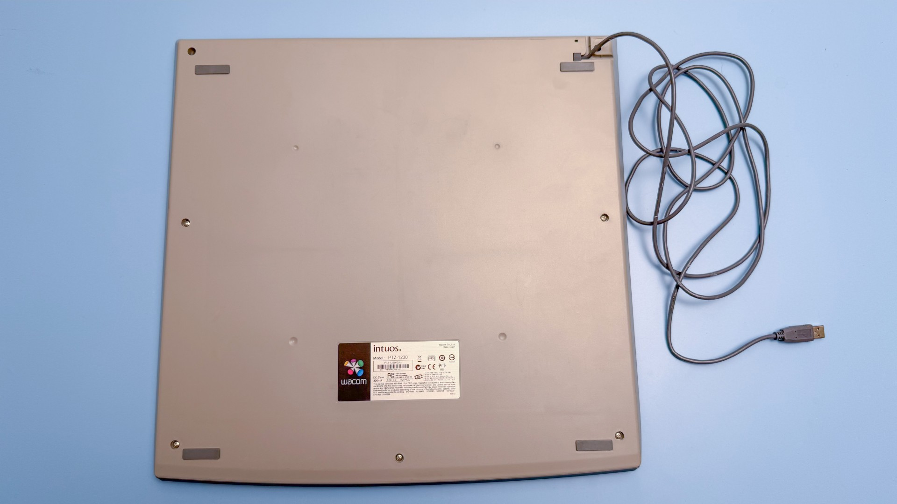
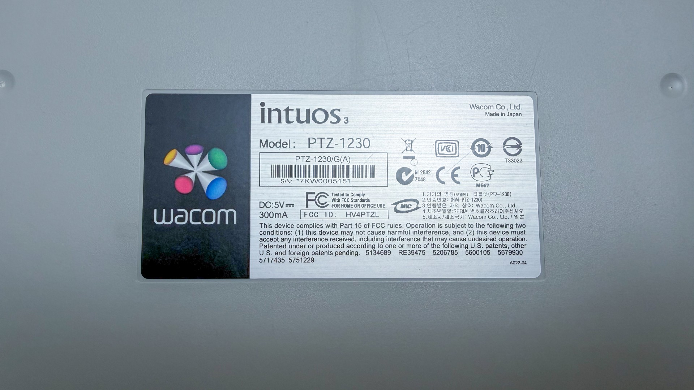
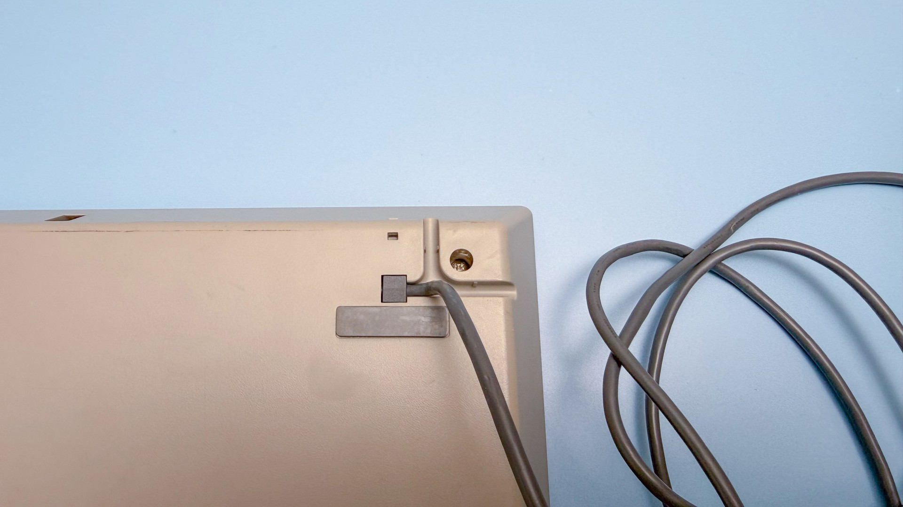
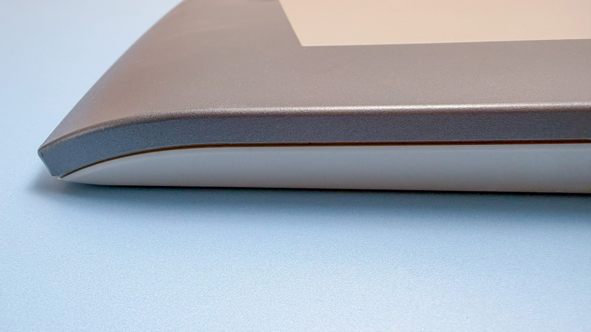
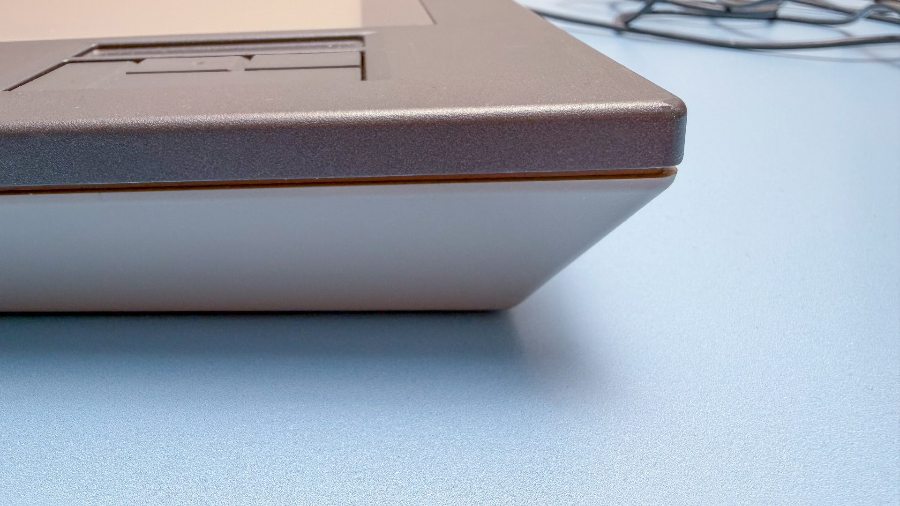

# Wacom Intuos3 12x12 (PTZ-1230) notes

## Overview

Released in 2004, the PTZ-1230 is the last of Wacom's pen tablets with a square aspect ratio.

## Specs

These specs come from the [DrawTabData Explorer](https://thesevenpens.github.io/DrawTabDataExplorer/entity/wacom.tabletfamily.wacom_intuos3_2004). Click a model ID to see its full record there.



| | [PTZ-1230](https://thesevenpens.github.io/DrawTabDataExplorer/entity/wacom.tablet.ptz1230) |
| --- | --- |
| Name | Intuos3 12x12 |
| Released | 2004-09-14 |
| Status | Discontinued |
| Included pen | [Intuos3 Grip Pen (ZP-501E)](https://thesevenpens.github.io/DrawTabDataExplorer/entity/wacom.pen.zp501e) |



| | [PTZ-1230](https://thesevenpens.github.io/DrawTabDataExplorer/entity/wacom.tablet.ptz1230) |
| --- | --- |
| Active area | 304.8 × 304.8 mm (12 × 12 in) |
| Pen technology | Passive EMR |
| Pressure levels | 1024 |
| Tilt | ±60° |
| Report rate | 200 Hz |
| Density | 200 LPmm (5080 LPI) |
| Max hover | — |



| | [PTZ-1230](https://thesevenpens.github.io/DrawTabDataExplorer/entity/wacom.tablet.ptz1230) |
| --- | --- |
| Buttons | — |
| Dials | — |
| Touch rings | — |
| Touch strips | — |
| Touch | No |



| | [PTZ-1230](https://thesevenpens.github.io/DrawTabDataExplorer/entity/wacom.tablet.ptz1230) |
| --- | --- |
| Size | 439.5 × 429.3 × 36.4 mm (17.3 × 16.9 × 1.4 in) |
| Weight | 2100 g |



| | [PTZ-1230](https://thesevenpens.github.io/DrawTabDataExplorer/entity/wacom.tablet.ptz1230) |
| --- | --- |
| Ports | — |
| Attached cable | USB-A |
| Bluetooth | No |



## Pairing it with a Monitor

Because this Pen display has a 1:1 aspect ratio, it will work better if your monitor also has a close to one-to-one aspect ratio. Of course, you can enable the "force proportions" setting so that it works with any monitor, but with a 1:1 aspect ratio monitor, you'll be able to use the full active area to draw with. I used it with the 28-inch LG DualUp monitor (28MQ780-B) which has an aspect ratio of 16:18. So, while it's not perfectly square, it is very close. I also enabled "force proportions" in the Wacom driver. Initially, I thought using this unusual 1:1 aspect ratio tablet would feel very weird, but actually, it felt totally fine to use. It wasn't uncomfortable or unnatural.

<figure><figcaption>
LG DualUp monitor (28MQ780-B)
</figcaption></figure>

## Usage notes

* This Pen tablet is very thick, which is normal for tablets of this generation.&#x20;
* This device does not support wireless, as wireless support was not a feature in this generation of tablets.

## Photos

<figure><figcaption></figcaption></figure>

<figure><figcaption></figcaption></figure>

<figure><figcaption></figcaption></figure>

<figure><figcaption></figcaption></figure>

<figure><figcaption></figcaption></figure>

<figure><figcaption></figcaption></figure>

<figure><figcaption></figcaption></figure>

<figure><figcaption></figcaption></figure>

<figure><figcaption></figcaption></figure>

