# Wacom Intuos 4 XL (PTK-1240) notes

## Overview

I used the Wacom Intuos 4 XL (model number PTK-1240) as my primary drawing tablet for about six months. This document consists of my notes about the usage, performance, and adjustment to using such a large Pen tablet.&#x20;

This as a very special case tablet that is really only appropriate for certain people who truly need a tablet of this size. Additionally, because this tablet has not been supported by modern Wacom drivers since about 2015, you may find it difficult to continue using it in the future unless you switch to using OpenTabletDriver.

I do greatly enjoy using this Pen tablet, but as you will see, using it requires special care to set up your environment correctly and enough space. You have to work at using the advantage of its large size.

So, although I love this tablet, I would not typically recommend it for someone unless they have prior experience with an extra-large tablet.

If you want to learn about extra-large pen tablets in general, see: [Extra-Large pen tablets.](../../../../guides/general/extra-large-pen-tablets.md)

## Video

If you would prefer this information as a video, you can watch on youtube:



## History

The PTK-1240 is the last in the series of extra-large Pen tablets released by Wacom. It is also the largest extra-large tablet ever released by Wacom. It started production in 2009 and Wacom dropped support for it in 2023 - much later than others in the Intuos 4 series.

## Driver support

The last supported driver:

* Windows: version 6.4.3-1, released in August 09 2023
* MacOS: version 6.4.3-2, released for macOS on August 09 2023.

## Included pen

The PTK-1240 came with the Intuos 4 Grip Pen (KP-501E).

## Pen compatibility

| Pen                                  |
| ------------------------------------ |
| Wacom Intuos4 Pro Pen (KP-503E)      |
| Wacom Intuos4 Grip Pen (KP-501E)     |
| Wacom Intuos4 Classic Pen (KP-300E)  |
| Wacom Intuos4 Art Pen (KP-701E)      |
| Wacom Intuos4 Airbrush Pen (KP-400E) |

## Availability

Wacom has not produced the PTK 1240 for many years, and it is no longer listed on the Wacom store. You can still find this model used on sites like eBay, but the prices vary greatly. I've seen it from as low as $100 to as high as $500.

## Active area size

* Diagonal length is \~575mm (22.6 mm)
* Dimensions: 487.7 x 304.8 mm (19.2 x 12 in)

<figure>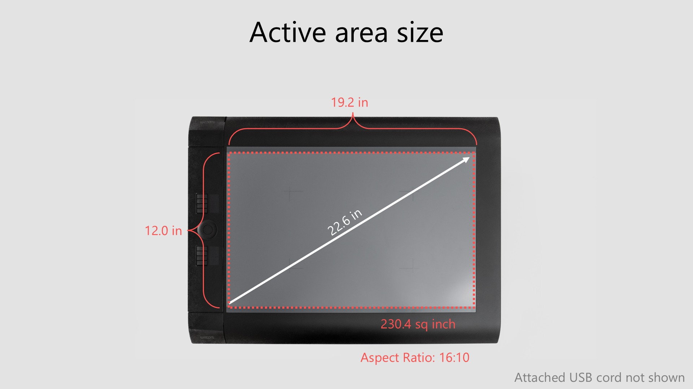<figcaption></figcaption></figure>

Looking at the sizes of other tablets that Wacom has made, which go from small, medium, large, to extra-large, you can see that, in general, the size of the active area roughly doubles as the size category increases.&#x20;

<figure>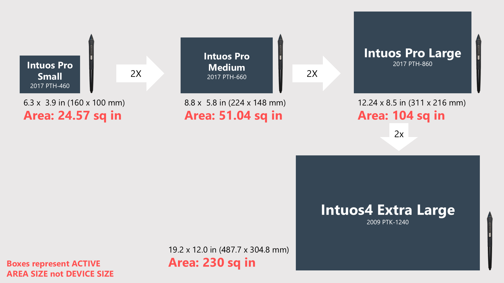<figcaption></figcaption></figure>

<figure>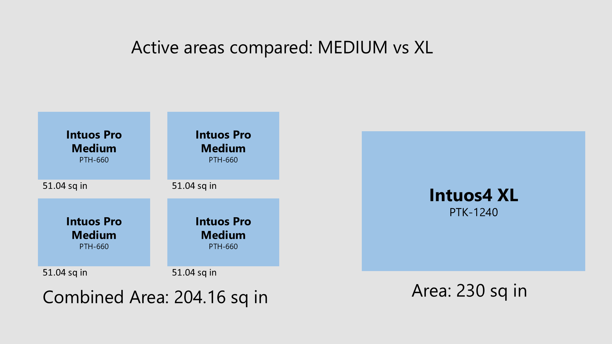<figcaption></figcaption></figure>

<figure>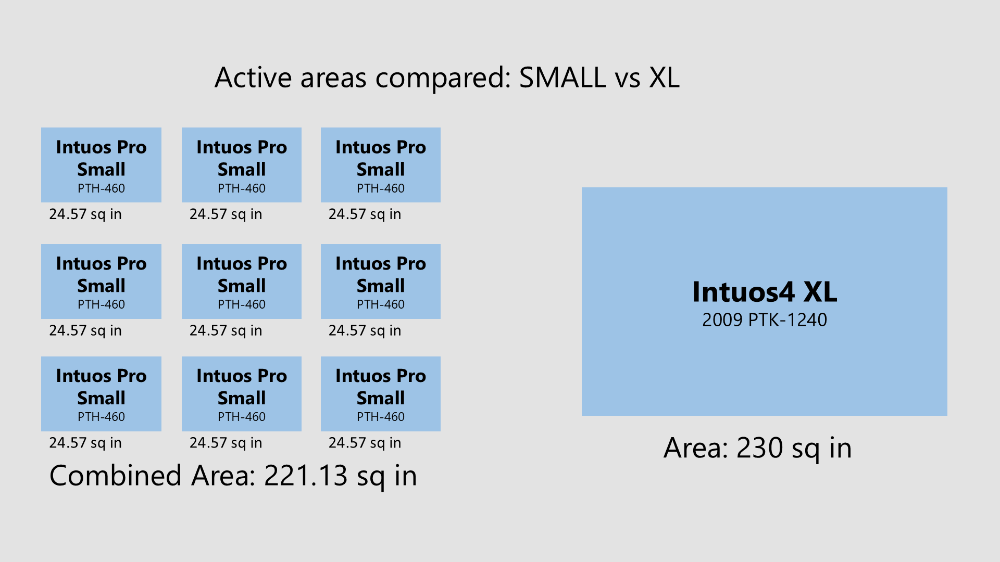<figcaption></figcaption></figure>

## Device

The PTK 1240 reflects a lot of design decisions that were common for tablets of its era and size.

It is **extremely thick.** At its thickest, the Pen tablet measures 28 mm, which is a little bit thicker than 1 inch. This is over three times the thickness of modern professional tablets, which tend to be around 8 mm.

<figure>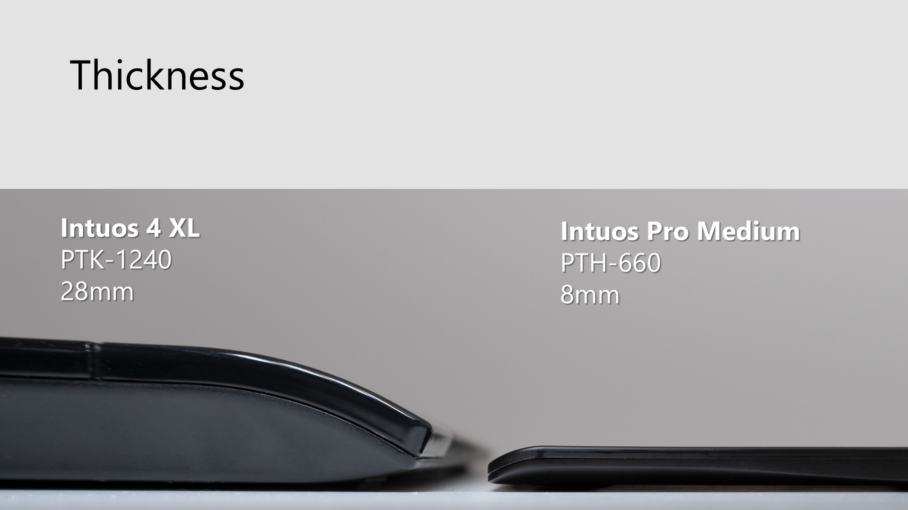<figcaption></figcaption></figure>

The **tablet is relatively heavy.** The PTK 1240 weighs 7.7 pounds.

<figure>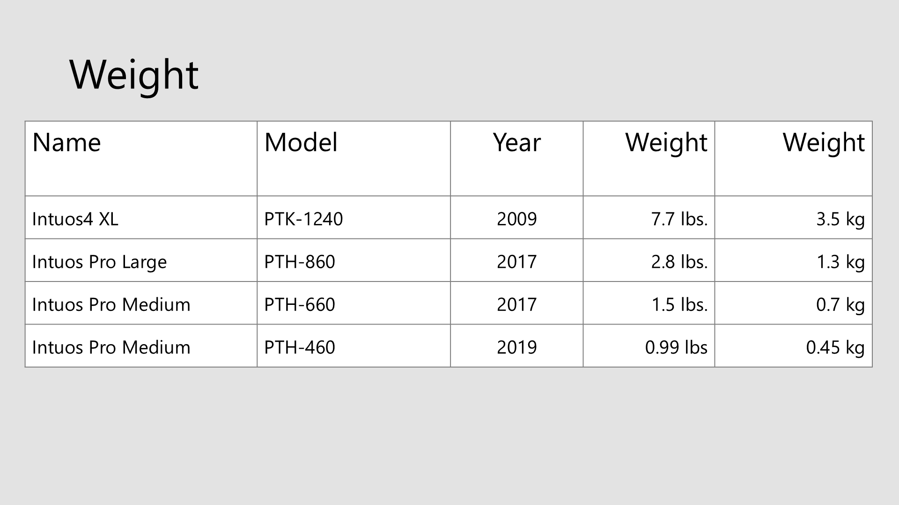<figcaption></figcaption></figure>

Modern pen tablets have a USB-C port and a cable that plugs into that port, which makes it easy to replace a cable if it gets damaged. But the PTK 1240 has a p**ermanently affixed cable** that ends in a USB-A connection. There are benefits to this approach because the connection to the tablet is highly protected, but if there is ever any damage to the cable, you will need to seek expert help in repairing it.

<figure>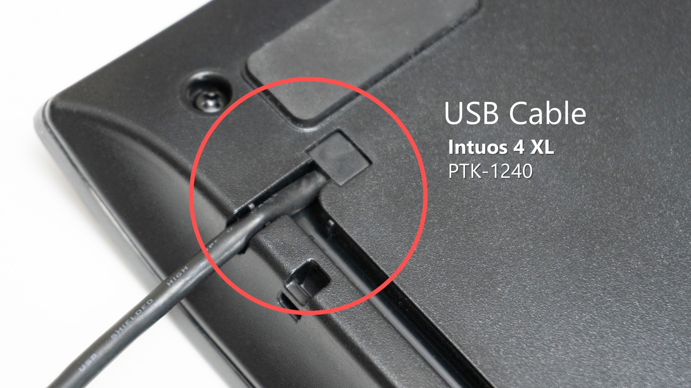<figcaption></figcaption></figure>

In pro pen tablets of this era, Wacom had a **clear sheet of plastic** that you could lift up and put paper underneath, which helped if you wanted to do something like tracing a drawing. The PTK 1240 has this feature, and the Intuos 4 series are the last of Wacom's professional tablets to feature this plastic sheet. This plastic sheet is quite durable, though I am not sure if Wacom ever sold a replacement for it in case you scratch it up.

<figure>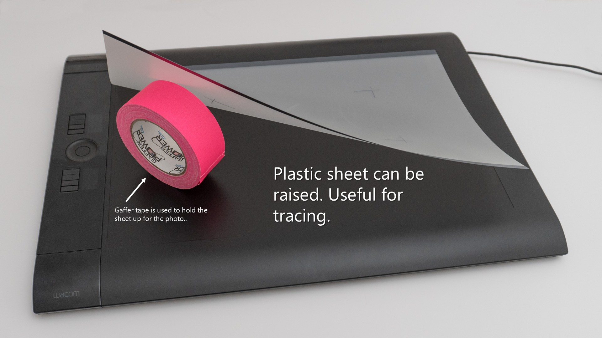<figcaption></figcaption></figure>

## Digitizer

The maximum number of pressure levels supported is 2048, which I think is more than enough for most people, despite the fact that modern tablets have 8,000 or even 16,000 levels of pressure.&#x20;

The digitized resolution is 200 lines per millimeter, equivalent to 5,080 lines per inch.&#x20;

Tilt sensitivity is supported in all compatible pens.&#x20;

Barrel rotation is supported if you use the Intuos 4 pen, model number KP 701E, which you can purchase separately.&#x20;

The aspect ratio of the active area is 16 by 10. So if you are using this Pen tablet, as I would recommend with any other Pen tablet, turn on force proportions in the driver so that your strokes will be distortion-free.

## Pairing the PTK 1240 with a monitor.

There is a loose relationship between the size of the tablet's active area and the size of a monitor that feels comfortable. The exact relationship depends on personal preference, but roughly speaking, in my testing, I found that I could maintain a natural and intuitive feeling if I used a 43-inch or 50-inch screen with the PTK 1240. I did try using smaller monitors, but it just felt weird having such a large tablet paired with a smaller screen.

## Reachability

Typically, when we talk about drawing tablets, we are concerned with the movements of the hand or arm that relate to drawing strokes. With a tablet of this size, we also have to take into account the fact that you have to perform tasks with the applications or the operating system. For example, some application tasks include things like file save or file export, or closing the application window. What makes some of these operations challenging with the PTK 1240 is that they happen at a very great distance from the center of the tablet. I'm six feet tall with slightly long arms for my height, and when the tablet is laying flat on a table, it can be challenging for me to comfortably reach the top edge of the active area and the corners. It's not impossible; it just requires noticeably more effort, and I have to strain a bit.

The way to mitigate this problem is to put the tablet on a stand of some kind, which raises it to an angle, instead of laying it flat on a desk. That puts it within reach of your arm. Later in this document, you'll see the stand I put together to help me with this. Laying it flat is uncomfortable to draw with, but with the stand, it is quite comfortable.

## My custom stand

I bought a drafting stand on Amazon for about $60. I then used a screwdriver to remove the sliding metal rule meant to hold paper to the board, which gave me a flat surface. To keep the Pen tablet from sliding off the smooth surface when it's angled, I cut a length of Cat5 networking cable to the width of the tablet and taped it to the bottom edge of the board's surface. This created a ledge that easily supports the weight of this 7.7 lb device and brings the far corners within easy reach of my arms.

<figure>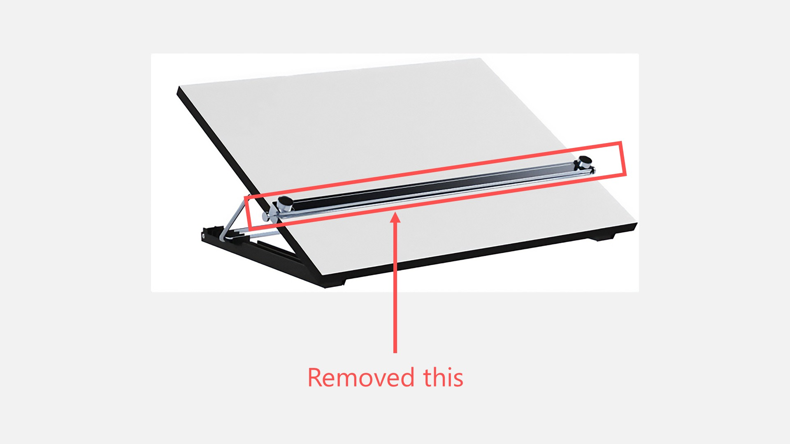<figcaption></figcaption></figure>

<figure>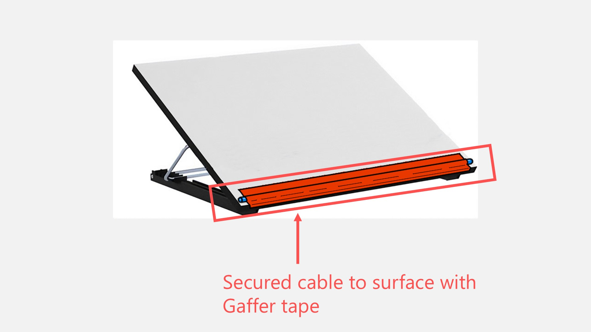<figcaption></figcaption></figure>

<figure>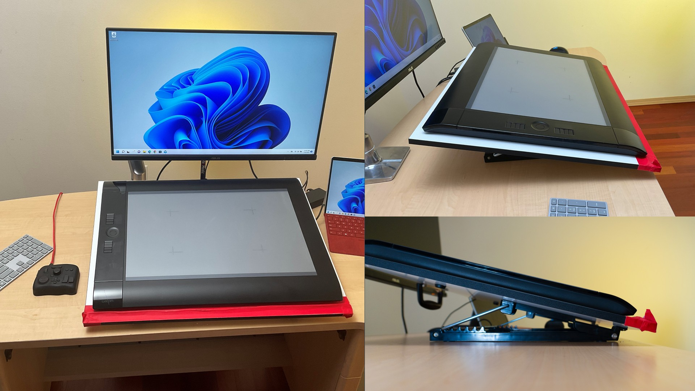<figcaption></figcaption></figure>

## Setting up my desktop

This tablet is huge and heavy. Using it with a stand puts even more equipment on your desk. The tablet and stand occupy so much space that essentially nothing is easily within reach, even for the width of my arms. I have to keep the keyboard and mouse off to the side, and it's awkward to type on the keyboard because it's so far away from me.

My solution to this problem was to minimize the use of the keyboard by using a TourBox controller. The controller allows me to put my left hand on it, which maps all my shortcut keys, and keep my right hand holding the pen on the tablet. This means that 99% of the time, I never need to touch a keyboard.

Personally, if I did not use a TourBox with this device, I think it would be somewhat frustrating because hitting keyboard shortcuts would be rather awkward.

