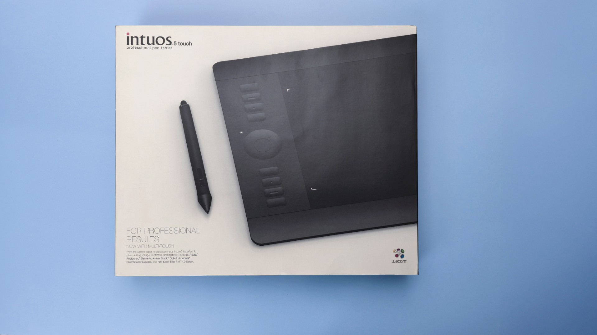

# Wacom Intuos4 (PTH-x50/PTK-x50) notes

## Name

This is the last time "Intuos + Number" was how these professional pen tablets were named.

## Photos

<figure><figcaption></figcaption></figure>

<figure><figcaption></figcaption></figure>

## Models

## Core specs

* Pressure levels: 2048
* Digitizer resolution: 5080 LPI (200 LPMM)
* Tilt range: ±60°

## Included pen

Grip pen (KP-501E)

## Pen compatibility

* Wacom Grip pen (KP-501E)
* Wacom Pro Pen (KP-503E)
* Wacom Art Pen (KP-701E)
* Wacom Classic Pen (KP-300E)
* Wacom Airbrush Pen (KP-400E)

## Resources

* [Terry Lee White - Intuos 5 Review](https://www.youtube.com/watch?v=4bNXtZCVg54) 2012-03-15
* [New Brit Workshop - Intuos 5 Medium Touch Review](https://www.youtube.com/watch?v=KXoYgYUdVyY) - 2013-01-22
* [Sara Dietschy - Wacom Tablet Small Intuos Pro VS Medium Intuos5 | Which One To Get / Size Comparison](https://www.youtube.com/watch?v=MeJ6DvJCjUk) 2015-02-10
