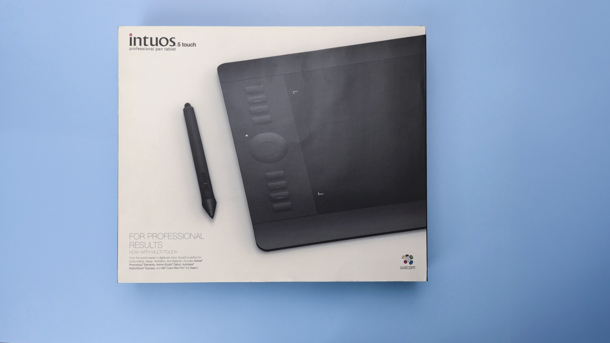
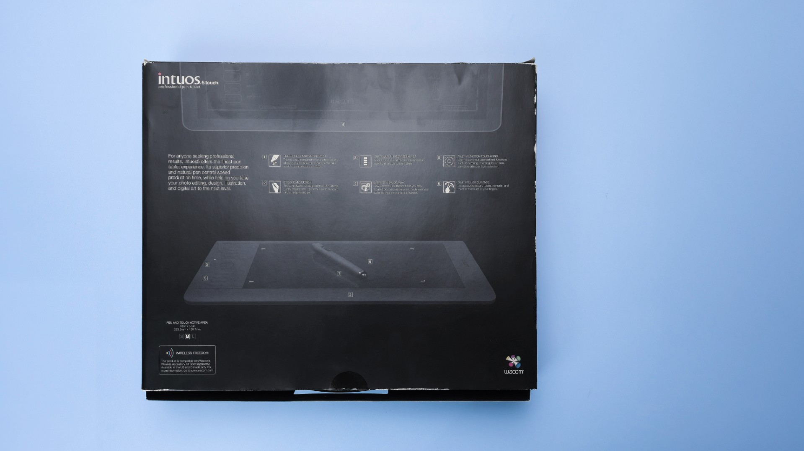

# Wacom Intuos4 (PTH-x50/PTK-x50) notes

## Name

This is the last time "Intuos + Number" was how these professional pen tablets were named.

## Photos

<figure><figcaption></figcaption></figure>

<figure><figcaption></figcaption></figure>

## Models

## Links

These links come from the [DrawTabData Explorer](https://thesevenpens.github.io/DrawTabDataExplorer/entity/wacom.tabletfamily.wacom_intuos5_2012). To add or fix a link, change it in DrawTabData.

| Source | Link | Date |
| --- | --- | --- |
| Wacom | [User manual](https://cdn.wacom.com/f/manuals/en/Intuos5-Users-Manual.pdf) |  |
| New Brit Workshop (Peter) | [Wacom Intuos 5 Medium Touch Tablet Review](https://www.youtube.com/watch?v=KXoYgYUdVyY) (PTH-650) | 2013-01-22 |
| Parka Blogs | [Review: Wacom Intuos5 Medium Touch Tablet](https://www.parkablogs.com/content/review-wacom-intuos5-medium-touch-tablet) (PTH-650) | 2012-12-03 |
| Terry Lee White | [Wacom Intuos 5 Review](https://www.youtube.com/watch?v=4bNXtZCVg54) | 2012-03-15 |

## Specs

These specs come from the [DrawTabData Explorer](https://thesevenpens.github.io/DrawTabDataExplorer/entity/wacom.tabletfamily.wacom_intuos5_2012). Click a model ID to see its full record there.



| | [PTH-450](https://thesevenpens.github.io/DrawTabDataExplorer/entity/wacom.tablet.pth450) | [PTH-650](https://thesevenpens.github.io/DrawTabDataExplorer/entity/wacom.tablet.pth650) | [PTH-850](https://thesevenpens.github.io/DrawTabDataExplorer/entity/wacom.tablet.pth850) | [PTK-450](https://thesevenpens.github.io/DrawTabDataExplorer/entity/wacom.tablet.ptk450) | [PTK-650](https://thesevenpens.github.io/DrawTabDataExplorer/entity/wacom.tablet.ptk650) |
| --- | --- | --- | --- | --- | --- |
| Name | Intuos5 touch Small | Intuos5 touch Medium | Intuos5 touch Large | Intuos5 Small | Intuos5 Medium |
| Released | 2012-03-01 | 2012-03-01 | 2012-03-01 | 2012-03-01 | 2012-03-01 |
| Status | Discontinued | Discontinued | Discontinued | Discontinued | Discontinued |



| | [PTH-450](https://thesevenpens.github.io/DrawTabDataExplorer/entity/wacom.tablet.pth450) | [PTH-650](https://thesevenpens.github.io/DrawTabDataExplorer/entity/wacom.tablet.pth650) | [PTH-850](https://thesevenpens.github.io/DrawTabDataExplorer/entity/wacom.tablet.pth850) | [PTK-450](https://thesevenpens.github.io/DrawTabDataExplorer/entity/wacom.tablet.ptk450) | [PTK-650](https://thesevenpens.github.io/DrawTabDataExplorer/entity/wacom.tablet.ptk650) |
| --- | --- | --- | --- | --- | --- |
| Active area | 157.5 × 98.4 mm (6.2 × 3.9 in) | 223.5 × 139.7 mm (8.8 × 5.5 in) | 325.1 × 203.2 mm (12.8 × 8 in) | 157.5 × 98.4 mm (6.2 × 3.9 in) | 223.5 × 139.7 mm (8.8 × 5.5 in) |
| Diagonal | 185.7 mm (7.3 in) | 263.6 mm (10.4 in) | 383.4 mm (15.1 in) | 185.7 mm (7.3 in) | 263.6 mm (10.4 in) |
| Aspect ratio | 16:10 | 16:10 | 16:10 | 16:10 | 16:10 |
| Pen technology | Passive EMR | Passive EMR | Passive EMR | Passive EMR | Passive EMR |
| Pressure levels | 2048 | 2048 | 2048 | 2048 | 2048 |
| Tilt | ±60° | ±60° | ±60° | ±60° | ±60° |
| Accuracy (center) | — | — | — | — | — |
| Accuracy (corner) | — | — | — | — | — |
| Report rate | 200 Hz | 200 Hz | 200 Hz | 200 Hz | 200 Hz |
| Density | 200 LPmm (5080 LPI) | 200 LPmm (5080 LPI) | 200 LPmm (5080 LPI) | 200 LPmm (5080 LPI) | 200 LPmm (5080 LPI) |
| Max hover | — | — | — | — | — |



| | [PTH-450](https://thesevenpens.github.io/DrawTabDataExplorer/entity/wacom.tablet.pth450) | [PTH-650](https://thesevenpens.github.io/DrawTabDataExplorer/entity/wacom.tablet.pth650) | [PTH-850](https://thesevenpens.github.io/DrawTabDataExplorer/entity/wacom.tablet.pth850) | [PTK-450](https://thesevenpens.github.io/DrawTabDataExplorer/entity/wacom.tablet.ptk450) | [PTK-650](https://thesevenpens.github.io/DrawTabDataExplorer/entity/wacom.tablet.ptk650) |
| --- | --- | --- | --- | --- | --- |
| Included pen | [Intuos4 Grip Pen (KP-501E)](https://thesevenpens.github.io/DrawTabDataExplorer/entity/wacom.pen.kp501e) | [Intuos4 Grip Pen (KP-501E)](https://thesevenpens.github.io/DrawTabDataExplorer/entity/wacom.pen.kp501e) | [Intuos4 Grip Pen (KP-501E)](https://thesevenpens.github.io/DrawTabDataExplorer/entity/wacom.pen.kp501e) | [Intuos4 Grip Pen (KP-501E)](https://thesevenpens.github.io/DrawTabDataExplorer/entity/wacom.pen.kp501e) | [Intuos4 Grip Pen (KP-501E)](https://thesevenpens.github.io/DrawTabDataExplorer/entity/wacom.pen.kp501e) |
| Compatible pens | [Intuos4 Classic Pen (KP-300E)](https://thesevenpens.github.io/DrawTabDataExplorer/entity/wacom.pen.kp300e) [Intuos4 Airbrush Pen (KP-400E)](https://thesevenpens.github.io/DrawTabDataExplorer/entity/wacom.pen.kp400e) [Intuos4 Grip Pen (KP-501E)](https://thesevenpens.github.io/DrawTabDataExplorer/entity/wacom.pen.kp501e) [Intuos4 Pro Pen (KP-503E)](https://thesevenpens.github.io/DrawTabDataExplorer/entity/wacom.pen.kp503e) [Intuos4 Art Pen (KP-701E)](https://thesevenpens.github.io/DrawTabDataExplorer/entity/wacom.pen.kp701e) | [Intuos4 Classic Pen (KP-300E)](https://thesevenpens.github.io/DrawTabDataExplorer/entity/wacom.pen.kp300e) [Intuos4 Airbrush Pen (KP-400E)](https://thesevenpens.github.io/DrawTabDataExplorer/entity/wacom.pen.kp400e) [Intuos4 Grip Pen (KP-501E)](https://thesevenpens.github.io/DrawTabDataExplorer/entity/wacom.pen.kp501e) [Intuos4 Pro Pen (KP-503E)](https://thesevenpens.github.io/DrawTabDataExplorer/entity/wacom.pen.kp503e) [Intuos4 Art Pen (KP-701E)](https://thesevenpens.github.io/DrawTabDataExplorer/entity/wacom.pen.kp701e) | [Intuos4 Classic Pen (KP-300E)](https://thesevenpens.github.io/DrawTabDataExplorer/entity/wacom.pen.kp300e) [Intuos4 Airbrush Pen (KP-400E)](https://thesevenpens.github.io/DrawTabDataExplorer/entity/wacom.pen.kp400e) [Intuos4 Grip Pen (KP-501E)](https://thesevenpens.github.io/DrawTabDataExplorer/entity/wacom.pen.kp501e) [Intuos4 Pro Pen (KP-503E)](https://thesevenpens.github.io/DrawTabDataExplorer/entity/wacom.pen.kp503e) [Intuos4 Art Pen (KP-701E)](https://thesevenpens.github.io/DrawTabDataExplorer/entity/wacom.pen.kp701e) | [Intuos4 Classic Pen (KP-300E)](https://thesevenpens.github.io/DrawTabDataExplorer/entity/wacom.pen.kp300e) [Intuos4 Airbrush Pen (KP-400E)](https://thesevenpens.github.io/DrawTabDataExplorer/entity/wacom.pen.kp400e) [Intuos4 Grip Pen (KP-501E)](https://thesevenpens.github.io/DrawTabDataExplorer/entity/wacom.pen.kp501e) [Intuos4 Pro Pen (KP-503E)](https://thesevenpens.github.io/DrawTabDataExplorer/entity/wacom.pen.kp503e) [Intuos4 Art Pen (KP-701E)](https://thesevenpens.github.io/DrawTabDataExplorer/entity/wacom.pen.kp701e) | [Intuos4 Classic Pen (KP-300E)](https://thesevenpens.github.io/DrawTabDataExplorer/entity/wacom.pen.kp300e) [Intuos4 Airbrush Pen (KP-400E)](https://thesevenpens.github.io/DrawTabDataExplorer/entity/wacom.pen.kp400e) [Intuos4 Grip Pen (KP-501E)](https://thesevenpens.github.io/DrawTabDataExplorer/entity/wacom.pen.kp501e) [Intuos4 Pro Pen (KP-503E)](https://thesevenpens.github.io/DrawTabDataExplorer/entity/wacom.pen.kp503e) [Intuos4 Art Pen (KP-701E)](https://thesevenpens.github.io/DrawTabDataExplorer/entity/wacom.pen.kp701e) |



| | [PTH-450](https://thesevenpens.github.io/DrawTabDataExplorer/entity/wacom.tablet.pth450) | [PTH-650](https://thesevenpens.github.io/DrawTabDataExplorer/entity/wacom.tablet.pth650) | [PTH-850](https://thesevenpens.github.io/DrawTabDataExplorer/entity/wacom.tablet.pth850) | [PTK-450](https://thesevenpens.github.io/DrawTabDataExplorer/entity/wacom.tablet.ptk450) | [PTK-650](https://thesevenpens.github.io/DrawTabDataExplorer/entity/wacom.tablet.ptk650) |
| --- | --- | --- | --- | --- | --- |
| Buttons | — | — | — | — | — |
| Dials | — | — | — | — | — |
| Touch rings | — | — | — | — | — |
| Touch strips | — | — | — | — | — |
| Touch | Yes | Yes | Yes | No | No |



| | [PTH-450](https://thesevenpens.github.io/DrawTabDataExplorer/entity/wacom.tablet.pth450) | [PTH-650](https://thesevenpens.github.io/DrawTabDataExplorer/entity/wacom.tablet.pth650) | [PTH-850](https://thesevenpens.github.io/DrawTabDataExplorer/entity/wacom.tablet.pth850) | [PTK-450](https://thesevenpens.github.io/DrawTabDataExplorer/entity/wacom.tablet.ptk450) | [PTK-650](https://thesevenpens.github.io/DrawTabDataExplorer/entity/wacom.tablet.ptk650) |
| --- | --- | --- | --- | --- | --- |
| Size | 320 × 208.2 × 12.7 mm (12.6 × 8.2 × 0.5 in) | 381 × 251.5 × 12.7 mm (15 × 9.9 × 0.5 in) | 487.7 × 317.5 × 12.7 mm (19.2 × 12.5 × 0.5 in) | 320 × 208.2 × 12.7 mm (12.6 × 8.2 × 0.5 in) | 381 × 251.5 × 12.7 mm (15 × 9.9 × 0.5 in) |
| Weight | 660 g | 990 g | 1800 g | 660 g | 990 g |



| | [PTH-450](https://thesevenpens.github.io/DrawTabDataExplorer/entity/wacom.tablet.pth450) | [PTH-650](https://thesevenpens.github.io/DrawTabDataExplorer/entity/wacom.tablet.pth650) | [PTH-850](https://thesevenpens.github.io/DrawTabDataExplorer/entity/wacom.tablet.pth850) | [PTK-450](https://thesevenpens.github.io/DrawTabDataExplorer/entity/wacom.tablet.ptk450) | [PTK-650](https://thesevenpens.github.io/DrawTabDataExplorer/entity/wacom.tablet.ptk650) |
| --- | --- | --- | --- | --- | --- |
| Ports | — | — | — | — | — |
| Attached cable | — | — | — | — | — |
| Bluetooth | — | — | — | — | — |



| | [PTH-450](https://thesevenpens.github.io/DrawTabDataExplorer/entity/wacom.tablet.pth450) | [PTH-650](https://thesevenpens.github.io/DrawTabDataExplorer/entity/wacom.tablet.pth650) | [PTH-850](https://thesevenpens.github.io/DrawTabDataExplorer/entity/wacom.tablet.pth850) | [PTK-450](https://thesevenpens.github.io/DrawTabDataExplorer/entity/wacom.tablet.ptk450) | [PTK-650](https://thesevenpens.github.io/DrawTabDataExplorer/entity/wacom.tablet.ptk650) |
| --- | --- | --- | --- | --- | --- |
| Contents | — | — | — | — | — |



## Resources

* [Sara Dietschy - Wacom Tablet Small Intuos Pro VS Medium Intuos5 | Which One To Get / Size Comparison](https://www.youtube.com/watch?v=MeJ6DvJCjUk) 2015-02-10
