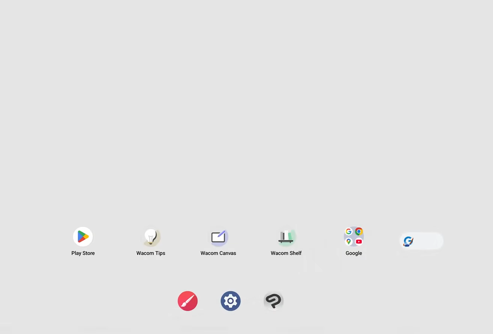

# Wacom MovinkPad Pro 14 (DTH-A140) notes

## Overview

OVERALL RATING: EXCELLENT

As of March 2026, This is the standalone tablet that offers the BEST drawing experience. While it does have some missing features, it is an excellent tablet at a reasonable cost for what it provides.

### Why this tablet is important

Until the release of this tablet we have not had an answer that felt good about what stand alone tablet provides the best drawing experience.

The Apple iPads with their Apple Pencils are too polarizing and works very differently from a typical drawing tablet

The Samsung Galaxy Tab S series come with consumer grade pens. These pens are clearly inferior to what we find with Wacom’s professional products.

But with the arrival of the moving pad pro 14 we have a clear answer. This is the best strong experience you can get in a standalone tablet. And it represents and your standard for this category of devices.

It gives competitors a clear bar to meet. After this point if anyone releases a standalone tablet the question will be “does the tablet and its pen work as well as the Wacom MovingPad Pro 14.”

### How to think about this tablet

Treat this as a tablet dedicated for DRAWING. Yes, it can serve many of the needs of a general purpose mobile device. But it's optimized for DRAWING. If you already have an iPad or Samsung Galaxy tab S that you use for browsing, watching videos, etc. I suggest you keep using it for that purpose.

If you are familiar with a Samsung Galaxy Tab S11 Ultra. Think of this as the same tablet, minus a few features, a much better drawing experience, a nice anti-glare etched glass surface that feels very nice to draw on.

### Price/Performance

While not an inexpensive choice, this tablet delivers more value than what I would expect given the cost. For what you get, this is a terrific deal.

### What would make this tablet even better

I hope the next generation of this tablet incorporates these features:

* USB4 USB-C port that supports
  * DP-IN
  * DP-OUT
* Compatibility with Pro Pen 2
* Biometric Login
  * Face unlock
  * Fingerprint
* A clear upgrade story for newer Android OS releases anbd support timeline. Ideally this device would match the support for a similar tablet such as the Samsung Galaxy Tab S11 Ultra which supports seven generations of OS upgrades and seven years of security updates from the initial global launch date.

### Links

* Product page: [https://www.wacom.com/en-us/products/wacom-movinkpad-pro-14](https://www.wacom.com/en-us/products/wacom-movinkpad-pro-14)
* [Brad Colbow - Wacom Movink Pad 11 and 14 - 8 Months Later](https://www.youtube.com/watch?v=NEEm1xAVJrQ) - 2026/05/08
* [Adam Duff - Wacom MovinkPad Pro 14 - Secret Settings / Accessories / Setup Guide](https://www.youtube.com/watch?v=xAZpMpdyWes) 2026-03-05
* [Gartzia Arts - Review of MovinkPad Pro 14](https://www.youtube.com/watch?v=L2A1lis4_Ng) 2025-12-16
* [Brad Colbow - Review MovinkPad Pro 14](https://www.youtube.com/watch?v=lpBGmiO4f7I) 2025-10-17
* [Teoh on Tech - Apple nano-texture glass vs MovinkPad Pro 14 matte glass](https://www.youtube.com/watch?v=Hizl2R9qTGM) - 2025-12-08
* [Teoh on Tech - Wacom MovinkPad Pro 14 review](https://www.youtube.com/watch?v=CRxC_tyyUCk) - 2025-11-22
* [Seven Pens - Budget Android Drawing Tablet Recommendations for 2025](https://www.youtube.com/watch?v=NK2_dIGQKk8) - 2025-09-25. Although this video is about budget Android tablets, much of what it says is relevant for the MovinkPad Pro 14/ 

## Specs

### Device

* Weight: 680g (according to my scale)
* Dimensions: TBD
* Size
  * Very close the size of a A4 piece of paper

### Standalone

* Operating System: Android 15
* CPU: Snapdragon 8s Gen 3 (SM8635)
* RAM: 12GB
* Storage: 256GB
* Expandable storage: YES. via Micro SD card slot
* Cameras: NONE
* Biometric features:
  * Fingerprint reader - NO.
  * Face recognition - NO. Has no camera
* Device dimensions: TBD
* Speakers: YES

### Digitizer

* Pressure levels: 8192

### Display

* Display panel tech: OLED
* Diagonal size: 14"
* Native resolution: 2200x1800
* Aspect ratio: 16x10
* Pixel density: 142 ppi
* Contrast: 100,000:1
* Refresh rate: 120Hz
* Response time: 1ms
* Etched glass: YES (Wacom states AR/AG/AF)
* Brightness: 900 nits
* Color bit depth: 10-bit
* Viewing Angle: 170 degrees
* Color gamut:
  * 100% sRGB
  * 100% DCI-P3

## What's in the box

* Tablet
* Pro Pen 3 (no grip)
* USB-C charging cable
* 3 nibs (stored in pen)
  * Carbon Shaft POM x1
  * Felt nib x1
  * POM x1

## Pens

### Included Pen

* Pro Pen 3 (no grip)
* See: [Wacom Pro Pen 3 (ACP-500) notes](../../../pens/wacom-pens/wacom-acp500-notes.md)

### Compatible pens

* Pro Pen 3 (ACP-500) [Wacom Pro Pen 3 (ACP-500) notes](../../../pens/wacom-pens/wacom-acp500-notes.md)
* UD EMR pens such as:
  * Wacom One (CP-913) [Wacom One Pen (CP-913) notes](../../../pens/wacom-pens/wacom-cp913-notes.md)
  * Wacom One (CP-923) [Wacom One 2023 Standard Pen (CP-923) notes](../../../pens/wacom-pens/wacom-cp923-notes.md)
  * Samsung S Pen
  * Keep in mind that these UD EMR pens are nowhere close to the quality of the Wacom professional pens such as the Pro Pen 3. Their chief advantage is that they cost much less - usually around 30 to $40 whereas the Pro Pen 3 costs $130.00. So, these UD EMR pens can serve as a backup in case you lose or break your Pro Pen 3.

### Incompatible Pens

* Pro Pen 2 (KP-504E) [Wacom Pro Pen 2 (KP-504E) notes](../../../pens/wacom-pens/wacom-kp504e-notes.md)
  * You will not be able to use any of your existing Pro Pen 2 models with this device.
  * I hope Wacom revisits this decision

## Standalone experience

### **Performance**

I was surprisingly pleased. I found using Clip Studio Paint very responsive - even with relatively large brushes - much more than I was expecting. Definitely a big improvement over the MovinkPad 11.

Maybe not quite as performant as the Samsung S11 Ultra - but still very very good.

### **Android updates**

On August 2026, Wacom revealed they will offer an OS update to Android 17 sometime in 2027 (see [https://x.com/wacom/status/2089351831856230885](https://x.com/wacom/status/2089351831856230885))

## Speakers

Has speakers but they are not great. Sound week and tinny. I am FINE with this as the tablet is not intended for media consumption.

## Device experience

## Build quality

EXCELLENT. Feels solid and premium.

### Plastic/acrylic back

Originally when I learned that the back of the device was some plastic/acrylic material I was a little concerned that it would cheapen the experience. In fact it hasn't affected things at all. The plastic is very pleasant to touch. I'd like that it's not cold metal. And it maintains a very premium feel.

### Bezels

Slightly larger than what you might expect. For example the Samsung Galaxy Tab S11 Ultra has smaller bezels.

### Size

At 14" this is a tablet best suited for putting on a desk an working. Although not heavy, it's not something that you'd want to keep holding in one hand and looking at.

### No camera

The device does not have a front or back camera. I didn't find this to be a limitation at all.

### No camera bump

I appreciate the lack of camera and camera bump because it makes this tablet natural to use on a flat surface.

### Drawing on the go

If you are using this tablet, due to its size, you will need to put it down on a flat surface.

This is not something that would for example, work while sketching on public transportation. It's just too big.

### Using in portrait orientation

Certainly you can use it in portrait, but the aspect ratio makes it awkward to hold because of how the weight is distributed.

## Standalone experience

### First run

Initial setup is quick. It leaves you with in a very simple and sparse desktop.

<figure><figcaption></figcaption></figure>

### App compatibility

It has full support for the Google Play store so you can install any application.

In theory any Android application should run on this tablet. And certainly most do.

HOWEVER for reasons we are not clear about some applications will not install on this tablet. We suspect it may be due to some customizations of the operating system that prevent certain apps from being identified as compatible.

For example, Teoh on Tech in his review pointed out that:

* Amazon app could not be installed
* He could not sign into the facebook app. This means that he could not use apps that required facebook authentication.

Apps I used without issue

* Clip Studio Paint
* HiPaint
* Infinite Painter
* Concepts
* Discord
* YouTube
* YouTube Music
* In fact every app I normally used worked fine with this device.

## Built-in Wacom Apps

These Wacom-specific apps are pre-installed

* Wacom Canvas - simple sketching
* Wacom Shelf - to browse and manage your sketches
* Wacom Tips - teaches you about the tablet

## Display experience

### Anti-glare

* VERY GOOD. The AG treatment diffuses a lot of light without too greatly impacting the contrast and colors. Comparable to what I see in a modern Cintiq Pro.

### Anti-glare sparkle

* VERY LOW. Not much of a rainbow effect - more of a slight variation in brightness

### Viewing angles

* Even at extreme angles only a minor lost in contrast and no color shifts

### OLED Color fringing

Like many OLED displays there is a little bit of color fringing. This is noticeable when you're transitioning from a black to white pixel you might see a small magenta or green fringe. That does happen with this tablet which is normal but it is very minimal and I think in most situations you will not notice it. It's one of those things that you'll have to make some effort to see.

### Color modes

In the settings you can switch between:

* "Standard mode"
* "Color profile mode"

Standard mode - more saturated colors. I assume this switches the tablet to using Display P3.

Color profile mode - less saturated. sRGB.

### Pixel sharpness

The pixels were sharp and well delineated. The pixels did not seem blurry or soft.

### Switching color modes?

In my testing I did not find a way to switch the tablet between SRGB and display P3. I'm still searching for a solution here.

### Refresh rate

Normally I use tablets at 60Hz but for this tablet I enabled 120Hz refresh rate. Which make interacting with the tablet seem very slick and smooth when scrolling, etc.

The higher refresh rate did also improve perceived pointer lag a bit - by about 20% if I had to guess. This matches my previous experience with using higher refresh rates and drawing tablets.

## Drawing performance

OVERALL: EXCELLENT

### No Driver app

Like all other Android-based standalone drawing tablets - there is no driver app corresponding to the "Wacom Center".

## Customizing tablet behavior

Because there is no "driver app" - means there is no way to control the global configuration for:

* Pressure curves
* Pen button actions

To configure those settings, you will need an app that implements those features. For example Krita and Clip Studio Paint support app-specific and even brush-specific pressure curves.

### Static tracking accuracy

EXCELLENT. Very accurate across the screen

### Corner and edge accuracy

GOOD/OK

Within about 4mm of the edge, above normal deflection of pointer position. I noticed it slightly more toward certain spots in the bottom edge - this seems due to magnets for the cover. It did not interfere with my drawing. I only noticed it in my testing.

Below is a set of diagonal lines drawn WITH A RULER qt the corners. There is some distortion in these areas"

1. Bottom left and bottom right had the most distortion
2. These were not slow strokes
3. Towards the bottom edge there was more distortion

I think this kind of distortion may be common to standalone mobile device so I don't have any particular concern, but for some people this may be irritating. Though remember it is easy to avoid - move the corner of you canvas a bit further toward the middle of the screen.

<figure><figcaption></figcaption></figure>

### Tilt compensation

EXCELLENT

* Tilting the Pro Pen 3 to 45 degrees deflects the pointer maybe 1mm away from directly under the time of the pen.
* With UD EMR pens such as the Samsung S pen, I noticed slightly more deflection of maybe 1.5 mm.

### Surface texture

* Very pleasant texture to draw on. One of my favorites. The best of any standalone Android tablet I have used.
* All nibs had terrific grip. Not slippery at all. The felt nib provided a big increased in the textured feeling.
* MovinkPad Pro 14 surface texture comparisons
  * somewhat more than MovinkPad 11
  * about the same as Cintiq 16 2025
  * about the same as Cintiq 24 touch 2025
  * noticeably less than Cintiq Pro 22

### Parallax

EXCELLENT - Low parallax

### Pointer lag

NORMAL for an standalone Android drawing tablet.

### Diagonal wobble

TBD

### Using the tablet as a pen display

Although the tablet does not support DP-IN, you can use a special feature called "Instant Pen Display" to provide the same experience. See [Wacom Instant Pen Display](../../../apps/wacom-instant-pen-display.md)

## Connections and cabling

### Ports

There is a single USB-C port on the right side of the tablet.

### DP-IN support

The tablet does NOT support native DP-IN.

### DP-OUT support

The tablet does not support DP-OUT. So you cannot connect it to an external display.

## Other inputs

### Tablet buttons

This tablet has no assignable buttons

### Touch

Yes. Touch works very well.

Palm rejection is very good

## Ergonomics

### Heat

In my drawing sessions with Clip Studio Paint I didn't notice it getting warm at all

### Noise

None. It was completely silent.

### Legs

It does NOT have any legs

### Stand

The tablet does NOT come with a stand.

I used the Parblo PR-100 when I needed to keep it at an angle

### VESA mounting

Does not have and VESA mounting holes.

### Staying in place on a desk

There are four rubber feet on the back. This keeps the tablet slightly elevated about the surface of the desk. Also it keeps the tablet in one place. The tablet will not accidentally slide around as you draw on it.

### Magnets

Along the bottom edge are four sets of magents - presumably for the cover to connect to.

The photo below shows one of the four sets that is located in the bottom right corner.

<figure><figcaption></figcaption></figure>

### Securing the Pen

* The pen does NOT magnetically attach to the tablet.
* The tablet does NOT have any way to store the pen inside it
* The (not-included) MovinkPad Pro 14 cover does have a cloth loop for securing the pen to the cover

## Accessories

### MovinkPad Pro 14 cover

See [Wacom MovinkPad Pro 14 cover (ACK45633Z) notes](wacom-ack45633z-notes.md)

## Choosing between tablets

### Versus Samsung Galaxy Tab S11 Ultra

MovinkPad Pro 14 vs Samsung Galaxy Tab S11 Ultra In general terms have almost exactly the same size.

If you were trying to pick between the two tablets here is my guidance:

**pick the Wacom MovinkPad Pro 14 if:**

* you want a similar experience to non standalone drawing tablets
* you've become accustomed to Wacom professional tablets
* you you need the best drawing performance - especially if you're doing creative work like sketching drawing or painting
* you want a device that is focused on drawing
* You want pretty good colors, and want an etched-glass surface that diffuses reflections and glare

**pick the Samsung Galaxy Tab S11 ultra if:**

* you want a device that has a good general purpose Android tablet for browsing the web listening to music etc.
* You need a camera
* You want an OK drawing experience
* you want all Android applications to work with your tablet
* You want brighter, more vibrant colors and are OK with a glossy screen
* You need the DP-OUT feature to use an external display
* You need Samsung Dex

### Versus Apple iPad + Apple Pencil Pro

In general, see:

* [Apple iPad notes](../../apple/apple-ipad-notes.md)
* [Apple iPad vs drawing tablets](../../apple/ipad-vs-drawtab.md)
* [Apple Pencil notes](../../../pens/apple-pencil/apple-pencil-notes.md)

Overall, I do find that the Wacom MovinkPad Pro 14 is better for drawing.

## Factory resetting the MovinkPad Pro 14

If you forget your PIN, you will be unable to get into the device.

Your options are

* Call Wacom support about this. They will need you to send the device to them. This will take time and be expensive.
* Like any other Android device, you can use the Google find up (online or you can use the app). It will remotely do a factory reset. I have tried this with the MovinkPad 11 and it has worked fine.
