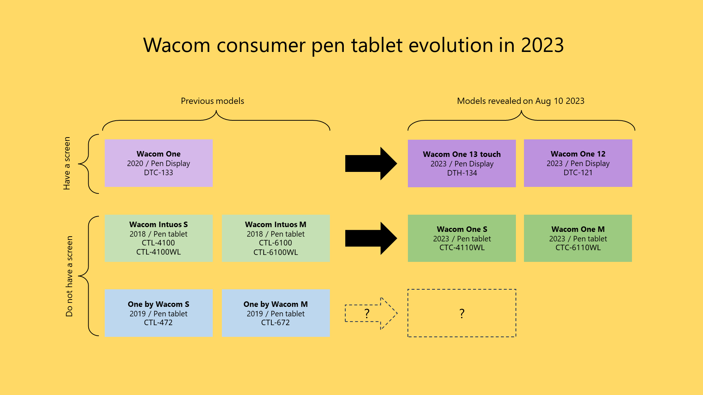

# Wacom One

## Models

<table><thead><tr><th width="189.60003662109375">Tablet</th><th width="136.7999267578125">Model</th><th width="82.7332763671875">Year</th><th width="123.4000244140625">Type</th><th></th></tr></thead><tbody><tr><td>Wacom One 14 2025</td><td>DTC-141</td><td>2025</td><td>pen display</td><td><a href="wacom-dtc141-notes.md"><strong>Notes on DTC-141</strong></a></td></tr><tr><td>Wacom One 13 touch 2023</td><td>DTH-134</td><td>2023</td><td>pen display</td><td><a href="wacom-one-2023-pen-displays-notes.md"><strong>Notes on DTH-134 and DTC-121</strong></a></td></tr><tr><td>Wacom One 122023</td><td>DTC-121</td><td>2023</td><td>pen display</td><td><a href="wacom-one-2023-pen-displays-notes.md"><strong>Notes on DTH-134 and DTC-121</strong></a></td></tr><tr><td>Wacom One M 2023</td><td>CTC-6110WL</td><td>2023</td><td>pen tablet</td><td><a href="wacom-ctcx110wl-notes.md"><strong>Notes on CTC-x110WL</strong></a></td></tr><tr><td>Wacom One S 2023</td><td>CTC-4110WL</td><td>2023</td><td>pen tablet</td><td><a href="wacom-ctcx110wl-notes.md"><strong>Notes on CTC-x110WL</strong></a></td></tr><tr><td>Wacom One 13 2019</td><td>DTC-133</td><td>2019</td><td>pen display</td><td><a href="wacom-dtc133-notes.md"><strong>Notes on DTC-133</strong></a></td></tr></tbody></table>

## Evolution

This diagram summarizes how their consumer tablet line is evolving.

<figure><figcaption></figcaption></figure>
