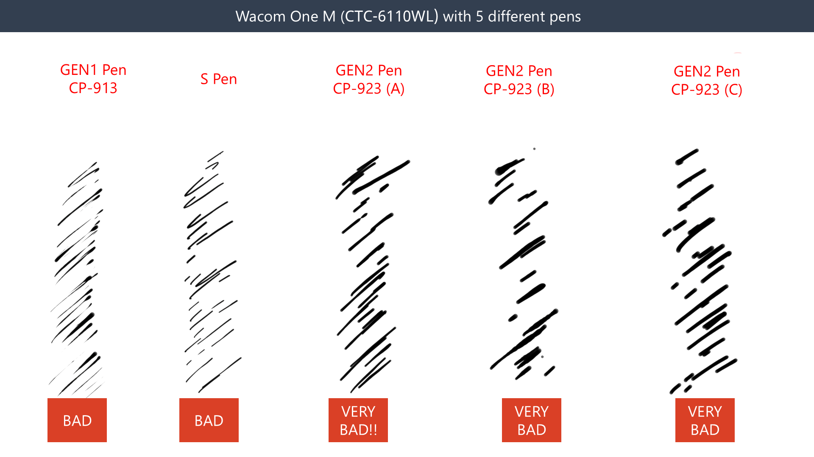

# Wacom One 2023 pen tablets (CTC-x110WL) notes

## Summary

<mark style="color:red;">**I do not recommend the Wacom One 2023 pen tablets because of their bad pressure handling. They produce poor strokes.**</mark>

The Wacom One 2023 pen tablets have pressure issues. See this video for details: [https://youtu.be/415ngQOHiME](https://youtu.be/415ngQOHiME)

In 2025, a firmware update improved the pressure handling, but not enough. More here: [https://www.youtube.com/watch?v=\_A6hmEay-xs](https://www.youtube.com/watch?v=_A6hmEay-xs)


The Wacom One 2023 tablets are sometimes referred to as the Wacom One GEN2 tablets.


## **Basics**

### Models

* Wacom One S (2023) - CTC4110WL
* Wacom One M (2023) - CTC6110WL

### Links

* Wacom One S user manual - [https://101.wacom.com/userhelp/en/toc/ctc4110wl.html](https://101.wacom.com/userhelp/en/toc/ctc4110wl.html)
* Wacom One M user manual - [https://101.wacom.com/userhelp/en/toc/ctc6110wl.html](https://101.wacom.com/userhelp/en/toc/ctc6110wl.html)
* [Brad Colbow review of Wacom One M and Wacom One S](https://www.youtube.com/watch?v=5CPEqVOTRN0) 2023-09-05

## **Pens**

### **Included pen**

* Wacom One Standard Pen (CP-923) - [Wacom One 2023 Standard Pen (CP-923) notes](../../../pens/wacom-pens/wacom-cp923-notes.md)

### Compatible pens

* Wacom One pen (CP-913) - [Wacom One Pen (CP-913) notes](../../../pens/wacom-pens/wacom-cp913-notes.md)
* Wacom One Standard Pen (CP-923) - [Wacom One 2023 Standard Pen (CP-923) notes](../../../pens/wacom-pens/wacom-cp923-notes.md)
* UD EMR pens (like Samsung S pen, etc.)

## **Digitizer specs**

* Active area
  * Wacom One S (2023) - CTC4110WL
    * Dimensions: 152 x 95 mm (6.0 x 3.7 in)
    * Diagonal: 179.25 mm (7.06 in)
  * Wacom One M (2023) - CTC6110WL
    * Dimensions: 216 x 135 mm (8.5 x 5.3 in)
    * Diagonal: 254.72 mm (10.03 in)
* Digitizer resolution: 2540 lpi (200lpmm)
* Tilt: 60 deg
* Pressure levels: 4096

## **Drawing experience**

### **Stroke quality**

At launch, you could clearly see how bad the strokes looked with this tablet and the new CP-923 pen.

<figure><figcaption></figcaption></figure>

## **Connectivity**

### **Wireless**

The Wacom One 2023 pen tablets all support wireless as indicated by their model numbers that include the "WL" code.
