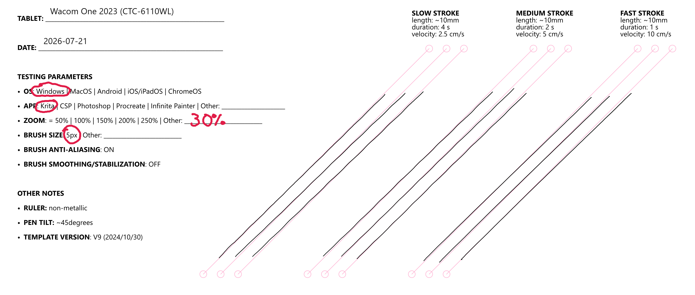
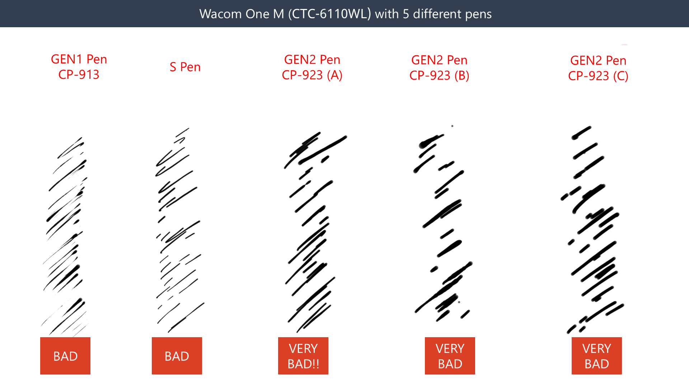

# Wacom One 2023 pen tablets (CTC-x110WL) notes

## Summary

<mark style="color:red;">**I do not recommend the Wacom One 2023 pen tablets because of their bad pressure handling. They produce poor strokes.**</mark>

The Wacom One 2023 pen tablets have pressure issues. See this video for details: [https://youtu.be/415ngQOHiME](https://youtu.be/415ngQOHiME)

In 2025, a firmware update improved the pressure handling, but not enough. More here: [https://www.youtube.com/watch?v=\_A6hmEay-xs](https://www.youtube.com/watch?v=_A6hmEay-xs)


The Wacom One 2023 tablets are sometimes referred to as the Wacom One GEN2 tablets.


## **Basics**

### Models

* Wacom One S (2023) - [CTC4110WL](https://thesevenpens.github.io/DrawTabDataExplorer/entity/wacom.tablet.ctc4110wl)
* Wacom One M (2023) - [CTC6110WL](https://thesevenpens.github.io/DrawTabDataExplorer/entity/wacom.tablet.ctc6110wl)

## Links

These links come from the [DrawTabData Explorer](https://thesevenpens.github.io/DrawTabDataExplorer/entity/wacom.tabletfamily.wacom_one_2023). To add or fix a link, change it in DrawTabData.

| Source | Link | Date |
| --- | --- | --- |
| Wacom | [Product page](https://www.wacom.com/en-us/products/pen-displays/wacom-one-pen-tablet) |  |
| Wacom | [Store page](https://estore.wacom.com/en-us/wacom-one-s-ctc4110wlw0a.html) (CTC-4110WL) |  |
| Wacom | [Store page](https://estore.wacom.com/en-us/wacom-one-m-ctc6110wlw0a.html) (CTC-6110WL) |  |
| Wacom | [User manual](https://101.wacom.com/userhelp/en/toc/ctc4110wl.html) (CTC-4110WL) |  |
| Wacom | [User manual](https://101.wacom.com/userhelp/en/toc/ctc6110wl.html) (CTC-6110WL) |  |
| Seven Pens | [Pressure Improvements for Wacom One 2023 pen tablets (firmware update 1.7.0.0)](https://www.youtube.com/watch?v=_A6hmEay-xs) | 2025-02-23 |
| Android Police | [Wacom One M review](https://www.androidpolice.com/wacom-one-m-review/) (CTC-6110WL) | 2024-04-26 |
| Aaron Rutten | [Wacom One Small & Medium 2023 - Drawing Tablet for Beginners (Review)](https://www.youtube.com/watch?v=w7QLQFOK_eU) | 2023-09-15 |
| Seven Pens | [Pressure problems with new Wacom One (2023/GEN2) drawing tablets](https://www.youtube.com/watch?v=415ngQOHiME) | 2023-09-11 |
| Brad Colbow | [Review: Wacom One Pen Tablets](https://www.youtube.com/watch?v=5CPEqVOTRN0) | 2023-09-05 |

## Specs

These specs come from the [DrawTabData Explorer](https://thesevenpens.github.io/DrawTabDataExplorer/entity/wacom.tabletfamily.wacom_one_2023). Click a model ID to see its full record there.



| | [CTC-4110WL](https://thesevenpens.github.io/DrawTabDataExplorer/entity/wacom.tablet.ctc4110wl) | [CTC-6110WL](https://thesevenpens.github.io/DrawTabDataExplorer/entity/wacom.tablet.ctc6110wl) |
| --- | --- | --- |
| Name | Wacom One S 2023 | Wacom One M 2023 |
| Released | 2023-08-10 | 2023-08-10 |
| Status | Available | Available |



| | [CTC-4110WL](https://thesevenpens.github.io/DrawTabDataExplorer/entity/wacom.tablet.ctc4110wl) | [CTC-6110WL](https://thesevenpens.github.io/DrawTabDataExplorer/entity/wacom.tablet.ctc6110wl) |
| --- | --- | --- |
| Active area | 152 × 95 mm (6 × 3.7 in) | 216 × 135 mm (8.5 × 5.3 in) |
| Diagonal | 179.2 mm (7.1 in) | 254.7 mm (10 in) |
| Aspect ratio | 16:10 | 16:10 |
| Pen technology | Passive EMR | Passive EMR |
| Pressure levels | 4096 | 4096 |
| Tilt | ±60° | ±60° |
| Accuracy (center) | — | — |
| Accuracy (corner) | — | — |
| Report rate | — | — |
| Density | 100 LPmm (2540 LPI) | 100 LPmm (2540 LPI) |
| Max hover | — | — |



| | [CTC-4110WL](https://thesevenpens.github.io/DrawTabDataExplorer/entity/wacom.tablet.ctc4110wl) | [CTC-6110WL](https://thesevenpens.github.io/DrawTabDataExplorer/entity/wacom.tablet.ctc6110wl) |
| --- | --- | --- |
| Included pen | [Wacom One Standard Pen (CP-923)](https://thesevenpens.github.io/DrawTabDataExplorer/entity/wacom.pen.cp923) | [Wacom One Standard Pen (CP-923)](https://thesevenpens.github.io/DrawTabDataExplorer/entity/wacom.pen.cp923) |
| Compatible pens | [Wacom One Pen (CP-913)](https://thesevenpens.github.io/DrawTabDataExplorer/entity/wacom.pen.cp913) [Wacom One Standard Pen (CP-923)](https://thesevenpens.github.io/DrawTabDataExplorer/entity/wacom.pen.cp923) | [Wacom One Pen (CP-913)](https://thesevenpens.github.io/DrawTabDataExplorer/entity/wacom.pen.cp913) [Wacom One Standard Pen (CP-923)](https://thesevenpens.github.io/DrawTabDataExplorer/entity/wacom.pen.cp923) |



| | [CTC-4110WL](https://thesevenpens.github.io/DrawTabDataExplorer/entity/wacom.tablet.ctc4110wl) | [CTC-6110WL](https://thesevenpens.github.io/DrawTabDataExplorer/entity/wacom.tablet.ctc6110wl) |
| --- | --- | --- |
| Buttons | 0 | 0 |
| Dials | — | — |
| Touch rings | — | — |
| Touch strips | — | — |
| Touch | No | No |



| | [CTC-4110WL](https://thesevenpens.github.io/DrawTabDataExplorer/entity/wacom.tablet.ctc4110wl) | [CTC-6110WL](https://thesevenpens.github.io/DrawTabDataExplorer/entity/wacom.tablet.ctc6110wl) |
| --- | --- | --- |
| Size | 188 × 141 × 8 mm (7.4 × 5.6 × 0.3 in) | 252 × 181 × 8 mm (9.9 × 7.1 × 0.3 in) |
| Weight | 200 g | 350 g |



| | [CTC-4110WL](https://thesevenpens.github.io/DrawTabDataExplorer/entity/wacom.tablet.ctc4110wl) | [CTC-6110WL](https://thesevenpens.github.io/DrawTabDataExplorer/entity/wacom.tablet.ctc6110wl) |
| --- | --- | --- |
| Ports | USB-C | USB-C |
| Attached cable | None | None |
| Bluetooth | Yes (5.1) | Yes (5.1) |



| | [CTC-4110WL](https://thesevenpens.github.io/DrawTabDataExplorer/entity/wacom.tablet.ctc4110wl) | [CTC-6110WL](https://thesevenpens.github.io/DrawTabDataExplorer/entity/wacom.tablet.ctc6110wl) |
| --- | --- | --- |
| Contents | — | — |



## Notes on specs

### Pens

* Included pen: see [Wacom One 2023 Standard Pen (CP-923) notes](../../../pens/wacom-pens/wacom-cp923-notes.md)
* Wacom One pen (CP-913): see [Wacom One Pen (CP-913) notes](../../../pens/wacom-pens/wacom-cp913-notes.md)
* UD EMR pens (like Samsung S pen, etc.)

## **Drawing experience**

### **Diagonal wobble**

A moderate-to-low amount of wobble in slow strokes that reduces as strokes get faster.

<figure><figcaption></figcaption></figure>

### **Stroke quality**

At launch, you could clearly see how bad the strokes looked with this tablet and the new CP-923 pen. For my current view of the pen: [Wacom One 2023 Standard Pen (CP-923) notes](../../../pens/wacom-pens/wacom-cp923-notes.md)

<figure><figcaption></figcaption></figure>
