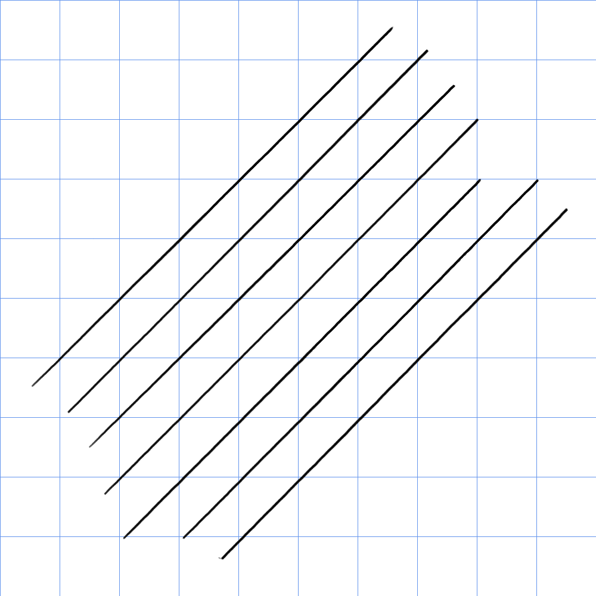
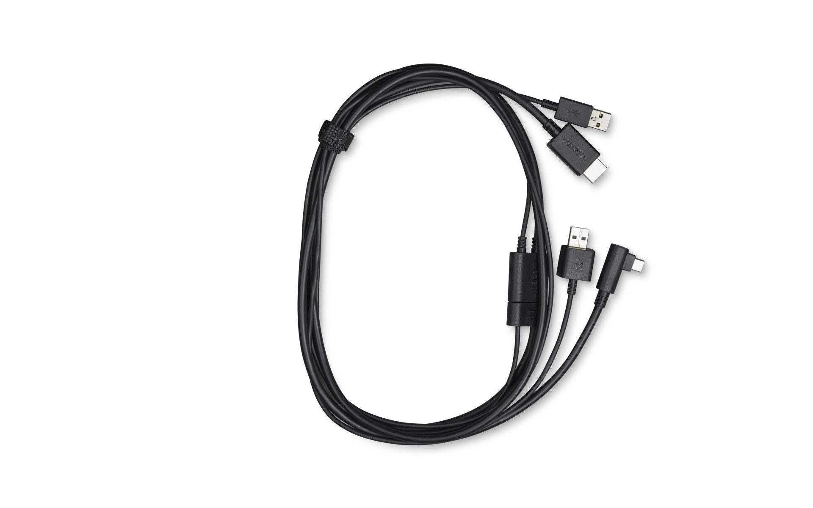
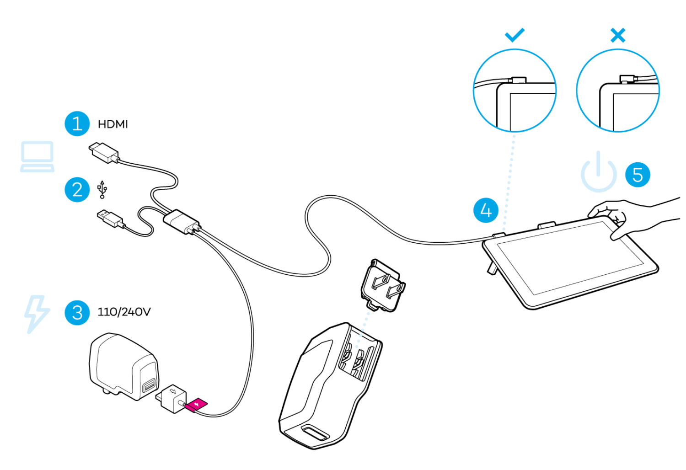
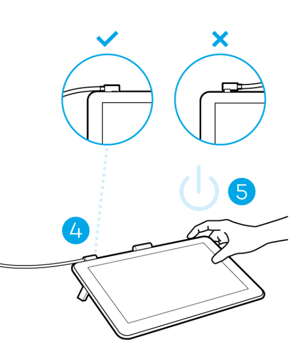

# Wacom One 2019 (DTC-133) notes

## Overview

This solid but dated beginner tablet - and it is somewhat overpriced for what it is. If you can get it used for $150 it, then that is a good deal.

## Basics

* Model year: 2019
* User manual: [http://101.wacom.com/UserHelp/en/TOC/DTC133.html](http://101.wacom.com/UserHelp/en/TOC/DTC133.html)

## Links

* [Teoh On Tech review of Wacom One 2019 DTC-133](https://www.youtube.com/watch?v=Hv2dpHkLAOE)
* [Brad Colbow review of Wacom One 2018 DTC-133](https://www.youtube.com/watch?v=EFvpOWZDGUU)
* [Create Now Sleep Later review of Wacom One 2019 DTC-133](https://youtu.be/VPbAUF7AZhA)
* [Aaron Rutten review of Wacom One 2019 DTC-133](https://www.youtube.com/watch?v=D4DFFH-hPr8)

### Newer versions

In 2023, Wacom released two updated pen display versions in the Wacom One 2023 series. See: [Wacom One 2023 pen displays notes](wacom-one-2023-pen-displays-notes.md).

## Device

### Size

I still find 13" tablets a little too small for me. I normally recommend 16" tablets. But as a starter tablet or intended for use by a child, this size works well.

## **Included pen**

The supplied Wacom One pen (CP-913) is a decent consumer pen. It's not as good as what you would find with the Pro Pen 2. Much more here: [Wacom One Pen (CP-913) notes](../../../pens/wacom-pens/wacom-cp913-notes.md)

The supplied Wacom One pen (CP-913) is a decent consumer pen. It's not as good as what you would find with the Pro Pen 2. Much more here: [Wacom One Pen (CP-913) notes](../../../pens/wacom-pens/wacom-cp913-notes.md)

## Compatible pens

Besides the Wacom CP-913, the Wacom One 2019 (DTC-133) tablet is compatible with 2nd gen UD EMR pens.

* Official Pen compatibility list from Wacom: [https://www.wacom.com/en-us/comp](https://www.wacom.com/en-us/comp)
* [Pens that support UD EMR 2nd gen](../../../../tech/wacom-ud-emr/ud-emr-pens.md)
* r/wacom - [Summary of pens (including double button pens) available for wacom one pen displa](https://www.reddit.com/r/wacom/comments/kkfip3/summary_of_pens_including_double_button_pens/)y 2020-12-26
* [Teoh on Tech - Wacom One pen vs other EMR pens](https://www.youtube.com/watch?v=rCXvaMhW3xI) 2023-09-07
* r/Wacom - [https://www.reddit.com/r/wacom/comments/s3go3g/what\_pens\_are\_compatible\_with\_the\_wacom\_one/](https://www.reddit.com/r/wacom/comments/s3go3g/what_pens_are_compatible_with_the_wacom_one/) 2022-01-13

## **Display experience**

This has an AVHA display panel, not IPS. The colors are a little washed out and viewing angles are not great as other pen displays

## Drawing experience

### Overall

Taking the screen and the pen into consideration, this tablet provides a DECENT drawing experience but not EXCELLENT. It is very suited for beginners.

### Diagonal wobble

GOOD. has low amount of wobble.

##

## **Cables and connectivity**

### Wacom X-Shape cable for Wacom One DTC-133

The Wacom One (DTC-133) uses a PROPRIETARY 3-in-1 cable that Wacom calls the "X-Shape cable" (ACK44506Z).

You can purchase it from the Wacom store: [https://estore.wacom.com/en-us/wacom-one-x-shape-cable.html](https://estore.wacom.com/en-us/wacom-one-x-shape-cable.html).

You MUST use this cable to connect the DTC-133 tablet. No other cable can be used.

<figure><figcaption></figcaption></figure>

## HDMI connection

<figure><figcaption></figcaption></figure>

### **Cable attachment direction**

<mark style="color:$danger;">**THIS IS IMPORTANT**</mark>

When you plug in the 3-in-1 cable to the top of the tablet, the cord from should go to the left. If the cord goes to the right the tablet won't work. See the diagram below from Wacom's user manual for this tablet.

<figure><figcaption></figcaption></figure>

### **USB-C connection**

The tablet DOES NOT work with a single USB-C cable.

### **USB-C port reliability**

Based on what I have seen with user feedback on this tablet over the years, the USB-C port can get loose and eventually make it difficult for the cable to securely stay in place. This can cause loss of video signal. So be gentle with that port.

## Ergonomics

### Legs

This tablet has two legs on the back that can place the tablet at an angle more convenient for drawing.

### VESA

This tablet does not have any VESA mounting holes.
