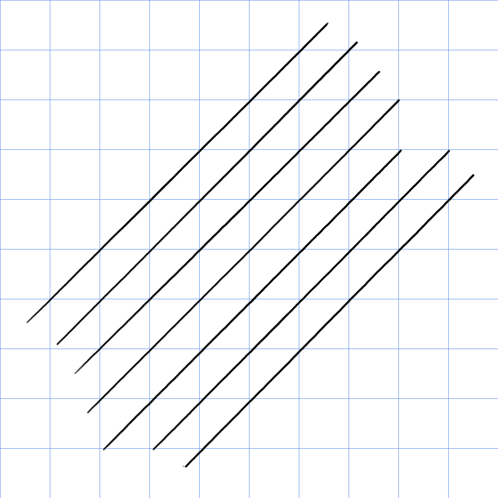
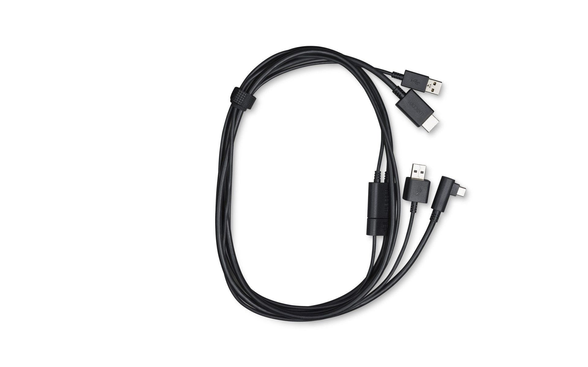
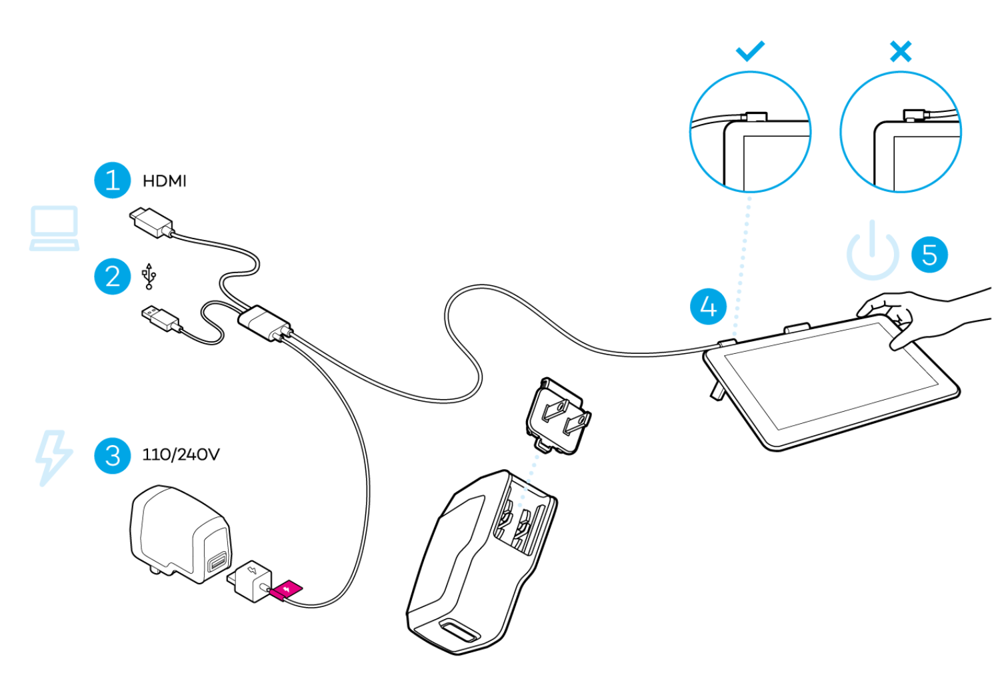
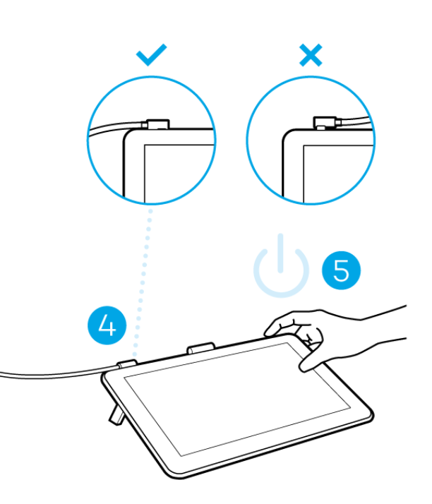

# Wacom One 2019 (DTC-133) notes

## Overview

This solid but dated beginner tablet - and it is somewhat overpriced for what it is. If you can get it used for $150 it, then that is a good deal.

## Links

These links come from the [DrawTabData Explorer](https://thesevenpens.github.io/DrawTabDataExplorer/entity/wacom.tabletfamily.wacom_ondpendisplaygen1). To add or fix a link, change it in DrawTabData.

### From the manufacturer

* [Product page](https://www.wacom.com/en-us/products/pen-displays/wacom-one-gen1)
* [User manual](http://101.wacom.com/UserHelp/en/TOC/DTC133.html)
* [Product information](https://www.wacom.com/en-us/comp)

### Reviews

* [Wacom One 13 Touch - 1st Gen. VS 2nd Gen. (2023) - Comparison](https://www.youtube.com/watch?v=lQGeqT6YA7Y) - Aaron Rutten, 2023-09-19
* [Wacom One vs iPad](https://www.youtube.com/watch?v=FLHf2G8CxEQ) - Teoh on Tech, 2020-02-14
* [Review: Wacom One 13.3" Pen Display](https://www.youtube.com/watch?v=Hv2dpHkLAOE) - Teoh on Tech, 2020-02-13
* [Review: Wacom One 13.3-inch pen display](https://www.parkablogs.com/content/review-wacom-one-133-inch-pen-display) - Parka Blogs, 2020-02-11
* [REVIEW: The Wacom One](https://www.youtube.com/watch?v=EFvpOWZDGUU) - Brad Colbow, 2020-01-27
* [Wacom One Pen Display | Good as Cintiq?](https://youtu.be/VPbAUF7AZhA) - Create Now Sleep Later, 2020-01-20
* [WACOM ONE 1st Gen. - Review](https://www.youtube.com/watch?v=D4DFFH-hPr8) - Aaron Rutten, 2020-01-16

## Specs

These specs come from the [DrawTabData Explorer](https://thesevenpens.github.io/DrawTabDataExplorer/entity/wacom.tabletfamily.wacom_ondpendisplaygen1). Click a model ID to see its full record there.



| | [DTC-133](https://thesevenpens.github.io/DrawTabDataExplorer/entity/wacom.tablet.dtc133) |
| --- | --- |
| Name | Wacom One 13 2019 |
| Released | 2020-01-07 |
| Status | Discontinued |



| | [DTC-133](https://thesevenpens.github.io/DrawTabDataExplorer/entity/wacom.tablet.dtc133) |
| --- | --- |
| Resolution | 1920 × 1080 |
| Aspect ratio | 16:9 |
| Pixel density | 166 PPI |
| Panel | AHVA |
| Lamination | — |
| Anti-glare | AG film |
| Color gamut | NTSC 72% |
| Color depth | 8 bits per channel |
| Brightness | 200 cd/m² |
| Peak brightness | — |
| Viewing angle | 170° horizontal 170° vertical |
| Refresh rate | — |
| Response time | 26 ms |



| | [DTC-133](https://thesevenpens.github.io/DrawTabDataExplorer/entity/wacom.tablet.dtc133) |
| --- | --- |
| Active area | 294 × 166 mm (11.6 × 6.5 in) |
| Diagonal | 337.6 mm (13.3 in) |
| Aspect ratio | ≈16:9 (1.771:1) |
| Pen technology | Passive EMR |
| Pressure levels | 4096 |
| Tilt | ±60° |
| Accuracy (center) | — |
| Accuracy (corner) | — |
| Report rate | — |
| Density | 100 LPmm (2540 LPI) |
| Max hover | — |



| | [DTC-133](https://thesevenpens.github.io/DrawTabDataExplorer/entity/wacom.tablet.dtc133) |
| --- | --- |
| Included pen | [Wacom One Pen (CP-913)](https://thesevenpens.github.io/DrawTabDataExplorer/entity/wacom.pen.cp913) |
| Compatible pens | [Wacom One Pen (CP-913)](https://thesevenpens.github.io/DrawTabDataExplorer/entity/wacom.pen.cp913) |



| | [DTC-133](https://thesevenpens.github.io/DrawTabDataExplorer/entity/wacom.tablet.dtc133) |
| --- | --- |
| Buttons | — |
| Dials | — |
| Touch rings | — |
| Touch strips | — |
| Touch | No |



| | [DTC-133](https://thesevenpens.github.io/DrawTabDataExplorer/entity/wacom.tablet.dtc133) |
| --- | --- |
| Size | 357 × 225 × 14.6 mm (14.1 × 8.9 × 0.6 in) |
| Weight | 1000 g |
| VESA mount | No |
| Legs | Yes |
| Included stand | — |



| | [DTC-133](https://thesevenpens.github.io/DrawTabDataExplorer/entity/wacom.tablet.dtc133) |
| --- | --- |
| Ports | USB-C |
| Attached cable | None |
| Bluetooth | — |



| | [DTC-133](https://thesevenpens.github.io/DrawTabDataExplorer/entity/wacom.tablet.dtc133) |
| --- | --- |
| Contents | — |



## Notes on specs

### Pens

* The supplied Wacom One pen (CP-913) is a decent consumer pen. It's not as good as what you would find with the Pro Pen 2. Much more here: [Wacom One Pen (CP-913) notes](../../../pens/wacom-pens/wacom-cp913-notes.md)
* Besides the Wacom CP-913, the Wacom One 2019 (DTC-133) tablet is compatible with 2nd gen UD EMR pens.
  * Official Pen compatibility list from Wacom: [https://www.wacom.com/en-us/comp](https://www.wacom.com/en-us/comp)
  * [Pens that support UD EMR 2nd gen](../../../../tech/wacom-ud-emr/ud-emr-pens.md)
  * r/wacom - [Summary of pens (including double button pens) available for wacom one pen displa](https://www.reddit.com/r/wacom/comments/kkfip3/summary_of_pens_including_double_button_pens/)y 2020-12-26
  * [Teoh on Tech - Wacom One pen vs other EMR pens](https://www.youtube.com/watch?v=rCXvaMhW3xI) 2023-09-07
  * [**r/wacom - What pens are compatible with the Wacom One?**](https://www.reddit.com/r/wacom/comments/s3go3g/what_pens_are_compatible_with_the_wacom_one/) 2022-01-13

## Other links

### Newer versions

In 2023, Wacom released two updated pen display versions in the Wacom One 2023 series. See: [Wacom One 2023 pen displays notes](wacom-one-2023-pen-displays-notes.md).

## Device

### Size

I still find 13" tablets a little too small for me. I normally recommend 16" tablets. But as a starter tablet or intended for use by a child, this size works well.

## **Display experience**

This has an AVHA display panel, not IPS. The colors are a little washed out and viewing angles are not great as other pen displays

## Drawing experience

### Overall

Taking the screen and the pen into consideration, this tablet provides a DECENT drawing experience but not EXCELLENT. It is very suited for beginners.

### Diagonal wobble

GOOD. has low amount of wobble.

##

## **Cables and connectivity**

### Wacom X-Shape cable for Wacom One DTC-133

The Wacom One (DTC-133) uses a PROPRIETARY 3-in-1 cable that Wacom calls the "X-Shape cable" (ACK44506Z).

You can purchase it from the Wacom store: [https://estore.wacom.com/en-us/wacom-one-x-shape-cable.html](https://estore.wacom.com/en-us/wacom-one-x-shape-cable.html).

You MUST use this cable to connect the DTC-133 tablet. No other cable can be used.

<figure><figcaption></figcaption></figure>

## HDMI connection

<figure><figcaption></figcaption></figure>

### **Cable attachment direction**

<mark style="color:$danger;">**THIS IS IMPORTANT**</mark>

When you plug in the 3-in-1 cable to the top of the tablet, the cord from should go to the left. If the cord goes to the right the tablet won't work. See the diagram below from Wacom's user manual for this tablet.

<figure><figcaption></figcaption></figure>

### **USB-C connection**

The tablet DOES NOT work with a single USB-C cable.

### **USB-C port reliability**

Based on what I have seen with user feedback on this tablet over the years, the USB-C port can get loose and eventually make it difficult for the cable to securely stay in place. This can cause loss of video signal. So be gentle with that port.
