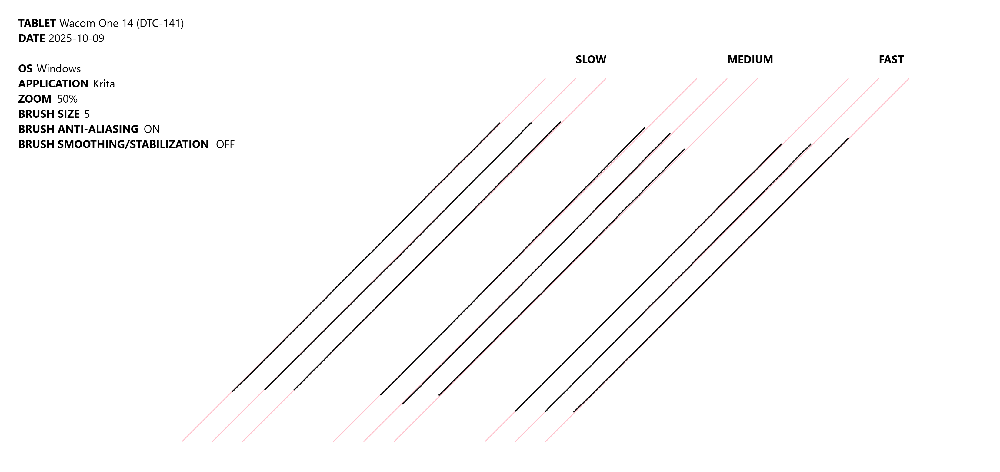
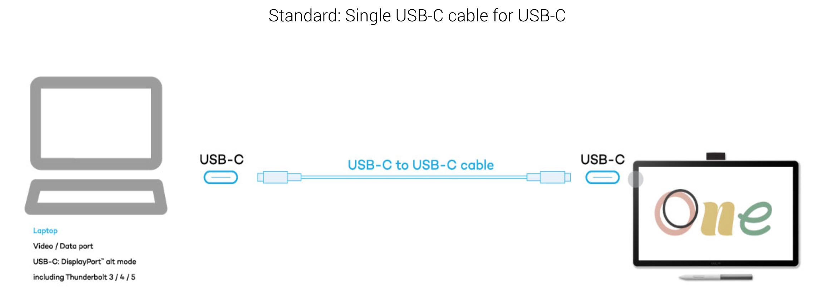
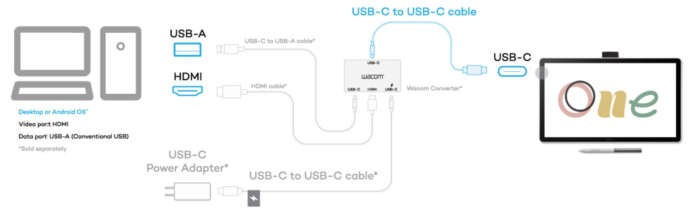

# Wacom One 14 (DTC-141) notes

## Summary

The Wacom One (DTC-141) is a decent entry level consumer pen display with OK drawing performance at a competetive price.

* The OK rating for drawing performance is due to the physical pressure range of the pen which has a HIGH IAF and LOW maximum physical pressure.
* The tablet will require buying $100+ of additional accessories if you need to connect to your computer with HDMI. HDMI will be almost certainly needed to connect it to desktop computers.

This tablet makes sense for the following scenarios:

* someone's first pen display
* a good tablet for a beginner
* light artistic work
* for use in education or communication or online meetings

**Ensure you understand how it will connect to your computer.** This tablet is intended to connect to your computer via the provided USB-C cable. You MUST make sure your USB-C port on your computer meets all the requirements. It is possible to connect to your computer via HDMI. However, this requires the purchase of the Wacom Converter ($80) and additional cables.

## Video

## Links

* [Brad Colbow - Review of the Wacom One 14](https://www.youtube.com/watch?v=GKxx9Vwz79U) 2024-11-10

## Basics

### Product information

* Name: Wacom One 14
* Model number DTC-141
* Launch year: 2025
* Product page: [https://www.wacom.com/en-us/products/pen-displays/wacom-one](https://www.wacom.com/en-us/products/pen-displays/wacom-one)

### Active area

* Dimensions: 309 x 174 mm
* Diagonal length: 357.1 (14.06 in)
* Aspect ratio: 16x9

### What's in the box

* 1 x Display Device
* 1 x Wacom One Standard Pen
* 3 x Wacom One Pen Standard Nib
* 1 x nib removal tool
* 1 x USB Type-C Cable (1.8m)

###

*

## Specs

### Digitizer

* Digitizer resolution: 2540 LPI (100 LPmm)
* Number of pressure levels: 4096
* Tilt: YES
* Tilt range: ± 60°
* Report rate: Unknown

### Display

* Native resolution: 1920x1080 (Full HD)
* Aspect ratio: 16x9
* Surface Etched glass. Described as "AG + AF glass"
* Laminated: YES. Described as "Direct Bonding"
* Display panel: IPS
* Contrast ratio: 1000:1
* Brightness 285 nits
* Response time: 16ms
* Color bit depth: 8bpp
* Color Gamut: sRGB (CIE 1931) 98％

### Included pen

* Wacom One Standard Pen (CP-923) - [Wacom One 2023 Standard Pen (CP-923) notes](../../../pens/wacom-pens/wacom-cp923-notes.md)
  * High consumer-level IAF
  * OK pressure range
  * Replacement cost: $35

### Compatible pens

* Wacom One Standard Pen (CP-923)
* Wacom One Pen (CP-913)
* UD EMR pens. See [Pens that support UD EMR 2nd gen](../../../../technology/wacom-ud-emr/pens-that-support-ud-emr-2nd-gen.md)
* I tested these pens and they worked fine
  * Wacom One Pen (CP-913)
  * Wacom One Standard Pen (CP-923)
  * Samsung S Pen
  * Staedtler Noris Digitial
  * Staedtler Noris Digitial Jumbo
  * Staedtler Mars Lumograph digital

### Incompatible pens

* All Wacom pro pens are incompatible
  * Example: Pro Pen 2, Pro Pen 3, Art Pen, etc.

## Display

### Anti-glare sparkle

LOW (GOOD)

### Viewing angles

Very good. Almost no color shift at extreme angles.

### Surface protection

The surface is etched glass

the tablet does NOT come with a screen protector

### Display sharpness

Very good. Pixels are clear and well-delineated.

## Pixelation

As expected slightly more pixelation (slightly lower PPI) than previous Wacom One tablet that have same native resolution but are 13" instead of 14".

I did not notice the difference in practive.

## Drawing performance

The drawing performance OK. It's not bad. However, it does not match the excellent experience you would see with a Wacom Cintiq or Wacom Cintiq Pro and their professional pens.

### **Static tracking accuracy**

* EXCELLENT. The pointer is directly under the tip of the pen across the entire surface when the pen is held perpendicular to the tablet

### Tilt compensation

* EXCELLENT. At all angles the pointer is very close to the tip of the pen.

### Diagonal wobble

* Low wobble at all strokes speeds
* In Krita, weighted smoothing at level 30 removed the wobble
* In comparison, Wacom Movink 13 has less notably diagonal wobble

<figure><figcaption></figcaption></figure>

### Pointer lag

OK. Typical for a pen display of this size.

### Artifacts at low pressure

TYPICAL. Drawing near IAF with large brushes (ex: 300px) you might see some blobby strokes. Can control with pressure curves and pressure smoothing.

### Pressure banding

EXCELLENT. No pressure banding observed.

### Pressure range (IAF and MAX)

See my notes on the Wacom One Standard Pen (CP-923) - [Wacom One 2023 Standard Pen (CP-923) notes](../../../pens/wacom-pens/wacom-cp923-notes.md)

### Pressure scan rate

EXCELLENT. No missed strokes during fast input of 50 strokes

### Pressure Banding

GOOD. DIsplayed NO pressure banding.

### Parallax

VERY GOOD (LOW)

## Pressure curves

The "Tip feel" slider in the Wacom One application controls the pressure curve. However the curve itself is not shown in the Wacom Center, just the slider.

### Surface texture

* OK. Light surface texture. Typical of many pen displays
* Feels similar to MovinkPad 11 or Movink 13
* Pen does NOT feel slippery on the glass
* Enough texture to draw well

## Ergonomics

### Noise

None. Completely silent. Has no fans to cause noise.

### Heat

Stayed cool to the touch even at 100% brightness brightness

### Legs

Does not have legs

### Stand

* Does not come with a stand.
* For this tablet, Wacom suggestes the Wacom Foldable Stand (ACK652Z). This costs $100
* I used the tablet with a Parblo PR-100 stand

### VESA mounting

* NO. Has no VESA mounting holes on the back

## Other inputs

### Touch

Does not support touch.

If you need touch, consider these tablets:

* Wacom Movink 13 (DTH-135)
* Wacom One 13 touch (DTH-134)

### Auxiliary inputs

* None. No buttons, No dials, etc.

## Connections and cabling

### Ports

* 1 USB-C port

### USB-C connection

<figure><figcaption></figcaption></figure>

The tabet comes with a USB-C cable to achieve a single cable connection to your computer.

You computer's USB-C port needs to meet the requirements for this to work. See: [Connecting a pen display with USB-C](../../../../guides/connecting/connecting-pen-display/connecting-pen-display-usbc.md)

### HDMI connection

Instead of USB-C, the tablet CAN connect via HDMI. However it DOES NOT include the cables you need for this. AND it requires very a specific accessory for this to work.

<figure><figcaption></figcaption></figure>

You need to purchase:

* Wacom Converter device
* USB-A to USB-C cable for data
* HDMI cable
* USB-C to USB-C cable for power
* USB-C power adapter

The Wacom Converter costs $80. If you need to connect via HDMI then you are going to end up spending more than $100.

### Notes on alternative cabling

Older Wacom one tablets use their own cables for HDMI connection. I've tested and they WILL NOT WORK with this device. Here are the cables that DO NOT work:

* Wacom One X-Shape Cable (ACK44506Z) - will not work with DTC-141
* Wacom One 3 In 1 Cable (ACK4490602Z) - does not work with DTC-141
