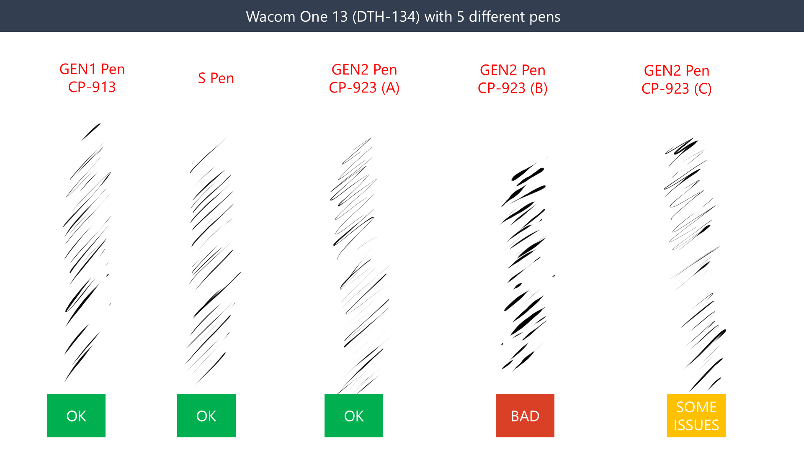
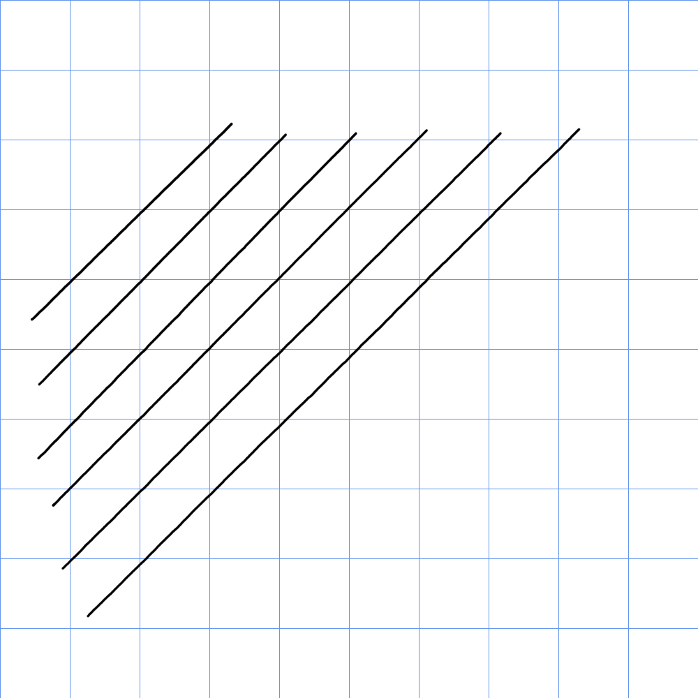
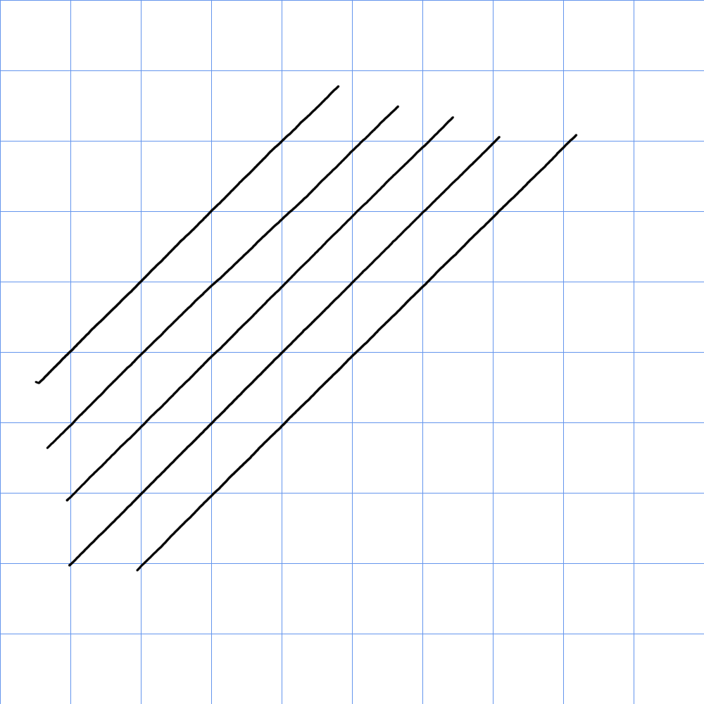
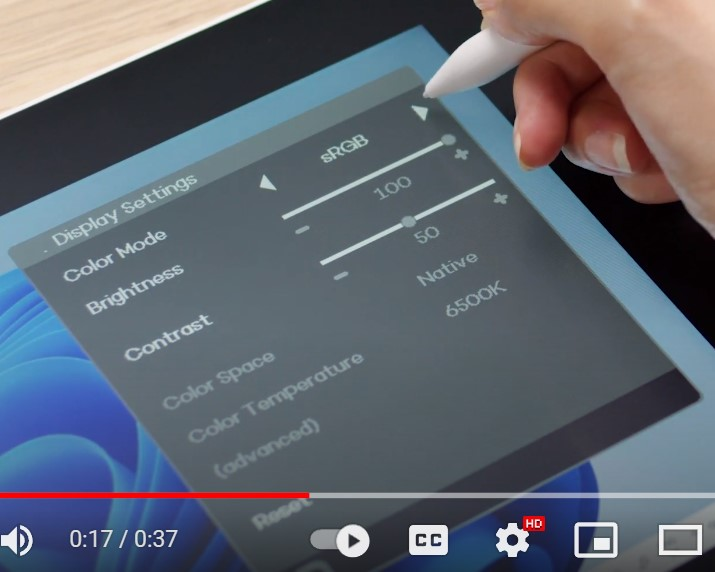
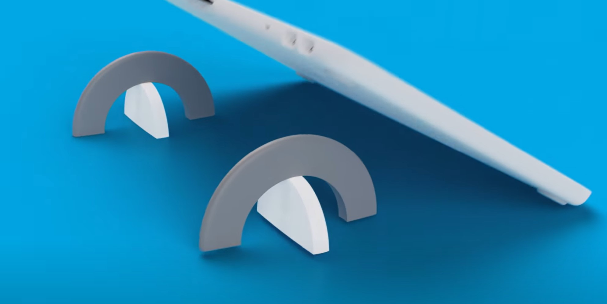

# Wacom One 2023 pen displays notes

## Overview

This is an OK pen display that provides a consumer-level drawing experience in terms of pressure handling. The key limitation is that the pens that work with this tablet require more force to draw with than pens from Wacom's professional tablet series. That is typical of the Wacom One pen display series. Some people will be totally fine with these tablets, but I think there are better choices for the money.

## Basics

* Product page: [https://www.wacom.com/en-us/products/pen-displays/wacom-one](https://www.wacom.com/en-us/products/pen-displays/wacom-one)
* Release year: 2023
* Models
  * Wacom One 12 (2023) DTC-121
  * Wacom One 13 (2023) DTH-134

## Links

* Wacom One 13 touch user manual - [https://101.wacom.com/userhelp/en/toc/dth134.html](https://101.wacom.com/userhelp/en/toc/dth134.html)
* Wacom One 12 user manual - [https://101.wacom.com/userhelp/en/toc/dtc121.html](https://101.wacom.com/userhelp/en/toc/dtc121.html)
* [Draw your weapon - Wacom One 13 Touch – a digital painter’s review](https://drawyourweapon.com/tablet-review-wacom-one-13-touch/) 2024-01-19
* [Android Police review of Wacom One](https://www.androidpolice.com/wacom-one-m-review/) 2024-04-26
* [Brad Colbow review of Wacom One 13](https://www.youtube.com/watch?v=VXtQvhrV6WY) 2023-09-25
* [Aaron Rutten: Wacom One 13 GEN1 VS GEN2 (2023) - Comparison](https://www.youtube.com/watch?v=lQGeqT6YA7Y) 2023-09-19
* [Aaron Rutten review of Wacom One 12 & Wacom One 13 Touch (2023)](https://www.youtube.com/watch?v=X_FrZGl0lYM) 2023-09-18
* [Aaron Rutten review of Wacom One Small & Medium](https://www.youtube.com/watch?v=w7QLQFOK_eU) 2023-09-15
* [Brad Colbow review of Wacom One 12](https://www.youtube.com/watch?v=SBlliNcRKNw) 2023-08-18
* [Tom's Guide review of Wacom One 13 touch](https://www.tomsguide.com/reviews/wacom-one-13-touch) 2023-08-10

## Included pen

Comes with the Wacom One Standard Pen (CP-923). [Wacom One 2023 Standard Pen (CP-923) notes](../../../pens/wacom-pens/wacom-cp923-notes.md)

## Compatible pens

Besides the CP-923, these tablets are compatible with the older CP-913, which you might prefer. They are also compatible with some other third-party pens.

* Pen compatibility list from Wacom: [https://www.wacom.com/en-us/comp](https://www.wacom.com/en-us/comp)
* r/wacom - [Summary of pens, including double-button pens, available for Wacom One pen displays](https://www.reddit.com/r/wacom/comments/kkfip3/summary_of_pens_including_double_button_pens/) 2020-12-26
* [Teoh on Tech - Wacom One pen vs other EMR pens](https://www.youtube.com/watch?v=rCXvaMhW3xI) 2023-09-07

## Display specs

* Native resolution: HD (2K): 1920x1080
* Refresh rate: 60Hz
* The new display panels have a wider color gamut. They are clearly better than the old Wacom One (DTC-133) tablet.

## Drawing experience

### Stroke quality

The stroke quality with the new CP-923 pen is not good compared to the older CP-913 pen. You may need to employ the use of pressure curves to get the strokes that you want.

<figure><figcaption></figcaption></figure>

<figure><figcaption></figcaption></figure>

## Diagonal wobble

Very good. Almost no wobble visible at all speeds.

### Wacom One 12 (DTC-121)

### Wacom One 13 touch (DTH-134)

### 

## Tilt

* Wacom One 13 touch -> supports tilt
* Wacom One 12 -> supports tilt

## Display experience

### **Color**

Clearly more vibrant than the older Wacom One DTC-133 model. Big improvement.

### **Parallax**

Good

## **Other inputs**

### **Touch**

* Only the Wacom One 13 touch supports touch input

### **Tablet Buttons**

None

## Pen display > OSD

<figure><figcaption></figcaption></figure>

Picture above from this video: ([https://youtu.be/-vwMZf1nbVU](https://youtu.be/-vwMZf1nbVU))

## Ergonomics

### Noise

Silent

### Heat

Both tablets felt room temperature even when working at 100%. I don't recall any hotspots.

### Legs

The new Wacom One 2023 pen displays do not have any legs. They lay flat on the desk.

The old Wacom One (DTC-133) pen display has legs on the back. You can lay the display flat on the desk or pull out the legs and draw at an angle.

Wacom is offering a very unique design for their stand.

<figure><figcaption></figcaption></figure>

### VESA mounting

Neither the Wacom One (DTC-133) or the Wacom One 2023 pen displays are directly VESA mountable.

## **Cables & connectivity**

### Ports

* The Wacom One 2023 pen displays have two USB-C ports

### **Connection options**

The Wacom One 2023 pen displays can be connected in three ways:

* With a 3-in-1 cable (video over HDMI)
* With a single USB-C cable (video over USB-C)
  * Wacom sells the "USB-C to C cable for Wacom One and Wacom Cintiq displays (2023 edition)" for this purpose.
  * I personally use USB-C Thunderbolt 3 cables from CableMatters to connect it to my computers.
  * More about USB-C connections: [Connecting a pen display with USB-C](../../../../guides/connecting/connecting-pen-display/connecting-pen-display-usbc.md)
* With two USB-C cables. One for display and one for power.
  * Not all computers supply enough power over a USB-C connection to power a display. So this makes sense to provide the option. Most other pen displays work this way.
  * These tablets don't draw that much power - every laptop I tested them with supplied enough power via USB for them. So it is unlikely you will need to use this option.

### Wacom 3-in-1 cable for Wacom One 2023 pen displays

The Wacom One 12 (DTC-121) and Wacom One 13 touch (DTH-134) work with a 3-in-1 cable. I SUPPOSE this is a proprietary cable.

model number: ACK4490602Z

You can buy it from the Wacom store: [https://estore.wacom.com/en-us/wacom-one-3-in-1-cable-ack4490602z.html](https://estore.wacom.com/en-us/wacom-one-3-in-1-cable-ack4490602z.html)
