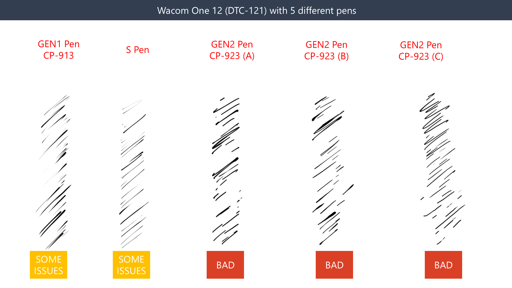
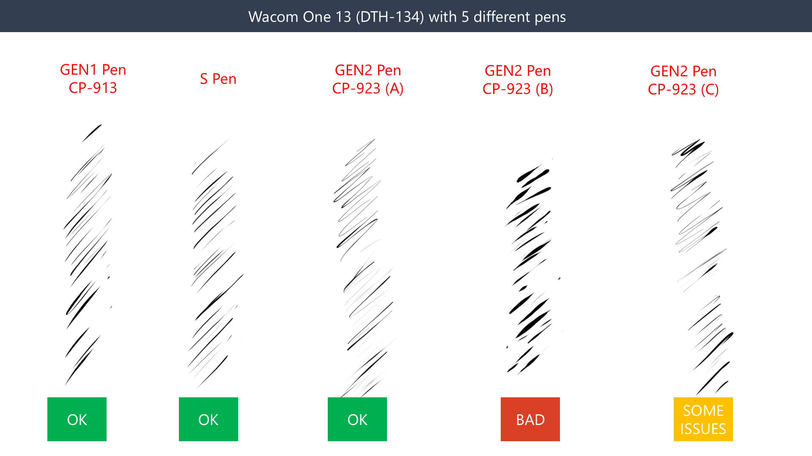
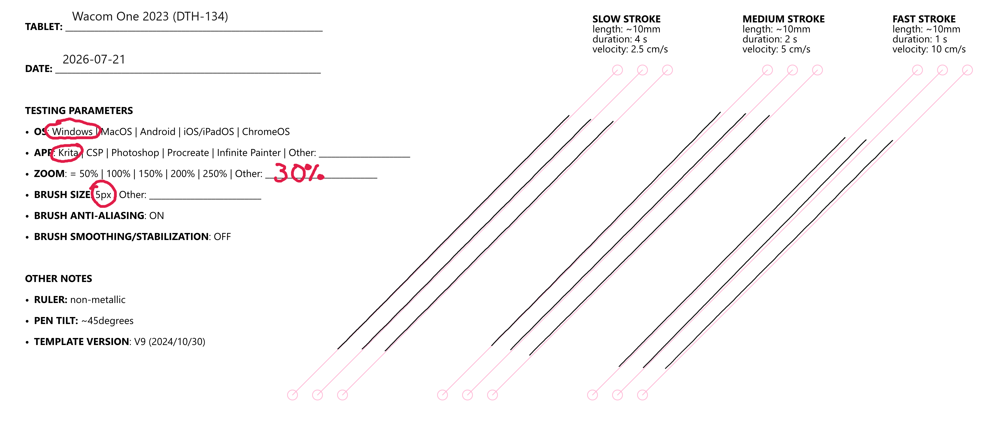
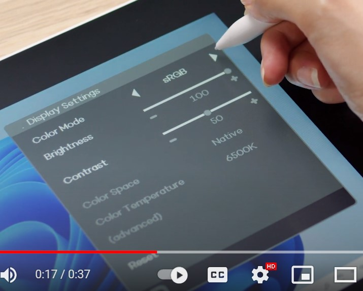
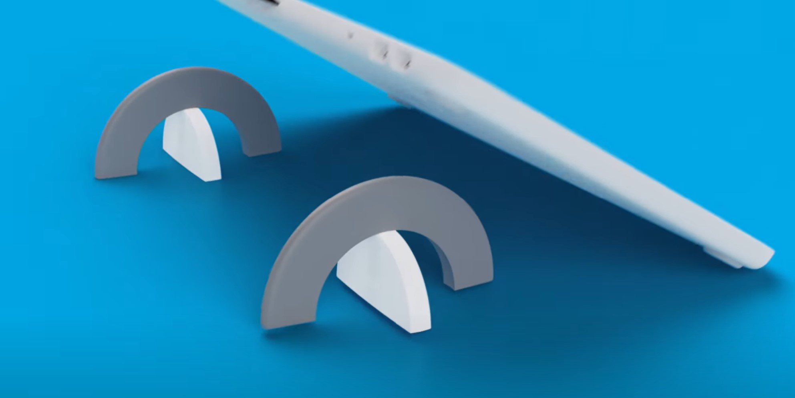

# Wacom One 2023 pen displays notes

## Overview

This is an OK pen display that provides a consumer-level drawing experience in terms of pressure handling. The key limitation is that the pens that work with this tablet require more force to draw with than pens from Wacom's professional tablet series. That is typical of the Wacom One pen display series. Some people will be totally fine with these tablets, but I think there are better choices for the money.

## Basics

* Models
  * Wacom One 12 (2023) [DTC-121](https://thesevenpens.github.io/DrawTabDataExplorer/entity/wacom.tablet.dtc121)
  * Wacom One 13 (2023) [DTH-134](https://thesevenpens.github.io/DrawTabDataExplorer/entity/wacom.tablet.dth134)

## Links

These links come from the [DrawTabData Explorer](https://thesevenpens.github.io/DrawTabDataExplorer/entity/wacom.tabletfamily.wacom_ondpendisplaygen2). To add or fix a link, change it in DrawTabData.

| Source | Link | Date |
| --- | --- | --- |
| Wacom | [Product page](https://www.wacom.com/en-us/products/pen-displays/wacom-one-pen-tablet) |  |
| Wacom | [User manual](https://101.wacom.com/userhelp/en/toc/dtc121.html) (DTC-121) |  |
| Wacom | [User manual](https://101.wacom.com/userhelp/en/toc/dth134.html) (DTH-134) |  |
| Wacom | [Product information](https://www.wacom.com/en-us/comp) |  |
| EyekooDrawsStuff | [Wacom One 13 Touch – a digital painter's review](https://drawyourweapon.com/tablet-review-wacom-one-13-touch/) (DTH-134) | 2024-01-19 |
| Gartzia Artz | [Muy Buena PEEERO... La tableta gráfica TÁCTIL más BARATA \| Review Wacom One 13 Touch](https://www.youtube.com/watch?v=8GdVv-XHxto) (DTH-134) | 2023-10-14 |
| Brad Colbow | [Wacom One 13 Touch Review](https://www.youtube.com/watch?v=VXtQvhrV6WY) (DTH-134) | 2023-09-25 |
| Aaron Rutten | [Wacom One 13 Touch - 1st Gen. VS 2nd Gen. (2023) - Comparison](https://www.youtube.com/watch?v=lQGeqT6YA7Y) (DTH-134) | 2023-09-19 |
| Aaron Rutten | [Wacom One 12 & 13 Touch (2023) - Review](https://www.youtube.com/watch?v=X_FrZGl0lYM) | 2023-09-18 |
| Brad Colbow | [Wacom One 12" Pen Display Review](https://www.youtube.com/watch?v=SBlliNcRKNw) (DTC-121) | 2023-08-18 |
| Tom's Guide | [Wacom One 13 touch review](https://www.tomsguide.com/reviews/wacom-one-13-touch) (DTH-134) | 2023-08-10 |

## Specs

These specs come from the [DrawTabData Explorer](https://thesevenpens.github.io/DrawTabDataExplorer/entity/wacom.tabletfamily.wacom_ondpendisplaygen2). Click a model ID to see its full record there.



| | [DTC-121](https://thesevenpens.github.io/DrawTabDataExplorer/entity/wacom.tablet.dtc121) | [DTH-134](https://thesevenpens.github.io/DrawTabDataExplorer/entity/wacom.tablet.dth134) |
| --- | --- | --- |
| Name | Wacom One 12 2023 | Wacom One 13 touch 2023 |
| Released | 2023-08-10 | 2023-08-10 |
| Status | Available | Available |



| | [DTC-121](https://thesevenpens.github.io/DrawTabDataExplorer/entity/wacom.tablet.dtc121) | [DTH-134](https://thesevenpens.github.io/DrawTabDataExplorer/entity/wacom.tablet.dth134) |
| --- | --- | --- |
| Resolution | 1920 × 1080 | 1920 × 1080 |
| Aspect ratio | 16:9 | 16:9 |
| Pixel density | 190 PPI | 166 PPI |
| Panel | IPS | IPS |
| Lamination | — | — |
| Anti-glare | Etched glass | Etched glass |
| Coatings | Anti-fingerprint | Anti-fingerprint |
| Color gamut | sRGB 99% coverage | sRGB 99% coverage |
| Color depth | 8-bit | 8-bit |
| Brightness | 275 cd/m² | 320 cd/m² |
| Peak brightness | — | — |
| Viewing angle | 170° horizontal 170° vertical | 170° horizontal 170° vertical |
| Refresh rate | 60 Hz | 60 Hz |
| Response time | 18 ms | 19 ms |



| | [DTC-121](https://thesevenpens.github.io/DrawTabDataExplorer/entity/wacom.tablet.dtc121) | [DTH-134](https://thesevenpens.github.io/DrawTabDataExplorer/entity/wacom.tablet.dth134) |
| --- | --- | --- |
| Active area | 257 × 145 mm (10.1 × 5.7 in) | 294 × 165 mm (11.6 × 6.5 in) |
| Diagonal | 295.1 mm (11.6 in) | 337.1 mm (13.3 in) |
| Aspect ratio | ≈16:9 (1.772:1) | 16:9 |
| Pen technology | Passive EMR | Passive EMR |
| Pressure levels | 4096 | 4096 |
| Tilt | ±60° | ±60° |
| Accuracy (center) | — | — |
| Accuracy (corner) | — | — |
| Report rate | — | — |
| Density | 100 LPmm (2540 LPI) | 100 LPmm (2540 LPI) |
| Max hover | — | — |



| | [DTC-121](https://thesevenpens.github.io/DrawTabDataExplorer/entity/wacom.tablet.dtc121) | [DTH-134](https://thesevenpens.github.io/DrawTabDataExplorer/entity/wacom.tablet.dth134) |
| --- | --- | --- |
| Included pen | [Wacom One Standard Pen (CP-923)](https://thesevenpens.github.io/DrawTabDataExplorer/entity/wacom.pen.cp923) | [Wacom One Standard Pen (CP-923)](https://thesevenpens.github.io/DrawTabDataExplorer/entity/wacom.pen.cp923) |
| Compatible pens | [Wacom One Standard Pen (CP-923)](https://thesevenpens.github.io/DrawTabDataExplorer/entity/wacom.pen.cp923) | [Wacom One Standard Pen (CP-923)](https://thesevenpens.github.io/DrawTabDataExplorer/entity/wacom.pen.cp923) |



| | [DTC-121](https://thesevenpens.github.io/DrawTabDataExplorer/entity/wacom.tablet.dtc121) | [DTH-134](https://thesevenpens.github.io/DrawTabDataExplorer/entity/wacom.tablet.dth134) |
| --- | --- | --- |
| Buttons | 0 | 0 |
| Dials | — | — |
| Touch rings | — | — |
| Touch strips | — | — |
| Touch | No | Yes |



| | [DTC-121](https://thesevenpens.github.io/DrawTabDataExplorer/entity/wacom.tablet.dtc121) | [DTH-134](https://thesevenpens.github.io/DrawTabDataExplorer/entity/wacom.tablet.dth134) |
| --- | --- | --- |
| Size | 299 × 190 × 11 mm (11.8 × 7.5 × 0.4 in) | 336 × 222 × 12 mm (13.2 × 8.7 × 0.5 in) |
| Weight | 700 g | 900 g |
| VESA mount | No | No |
| Legs | No | No |
| Included stand | — | — |



| | [DTC-121](https://thesevenpens.github.io/DrawTabDataExplorer/entity/wacom.tablet.dtc121) | [DTH-134](https://thesevenpens.github.io/DrawTabDataExplorer/entity/wacom.tablet.dth134) |
| --- | --- | --- |
| Ports | USB-C USB-C | USB-C USB-C |
| Attached cable | None | None |
| Bluetooth | — | — |



| | [DTC-121](https://thesevenpens.github.io/DrawTabDataExplorer/entity/wacom.tablet.dtc121) | [DTH-134](https://thesevenpens.github.io/DrawTabDataExplorer/entity/wacom.tablet.dth134) |
| --- | --- | --- |
| Power input | 5 V, 3 A via USB-C PD 9 V, 2.77 A via AC adapter | 5 V, 3 A via USB-C PD 9 V, 2.77 A via AC adapter |
| Consumption | 14 W max | 15 W max |
| Standby | 1.5 W | 1.5 W |
| Power adapter | — | — |
| Power output | — | — |



| | [DTC-121](https://thesevenpens.github.io/DrawTabDataExplorer/entity/wacom.tablet.dtc121) | [DTH-134](https://thesevenpens.github.io/DrawTabDataExplorer/entity/wacom.tablet.dth134) |
| --- | --- | --- |
| Contents | — | — |



## Notes on specs

### Display

* The new display panels have a wider color gamut. They are clearly better than the old Wacom One (DTC-133) tablet.

### Pens

* Included pen: [Wacom One 2023 Standard Pen (CP-923) notes](../../../pens/wacom-pens/wacom-cp923-notes.md)
* Besides the CP-923, these tablets are compatible with the older CP-913, which you might prefer. They are also compatible with some other third-party pens.
  * r/wacom - [Summary of pens, including double-button pens, available for Wacom One pen displays](https://www.reddit.com/r/wacom/comments/kkfip3/summary_of_pens_including_double_button_pens/) 2020-12-26
  * [Teoh on Tech - Wacom One pen vs other EMR pens](https://www.youtube.com/watch?v=rCXvaMhW3xI) 2023-09-07

## Other links

* [Android Police review of Wacom One](https://www.androidpolice.com/wacom-one-m-review/) 2024-04-26
* [Aaron Rutten review of Wacom One Small & Medium](https://www.youtube.com/watch?v=w7QLQFOK_eU) 2023-09-15

## Drawing experience

### Stroke quality

The CP-923 is OK-ish for drawing, like the older CP-913 - I don't typically recommend either for artists. You may need to employ the use of pressure curves to get the strokes that you want. More here: [Wacom One 2023 Standard Pen (CP-923) notes](../../../pens/wacom-pens/wacom-cp923-notes.md)

<figure><figcaption></figcaption></figure>

<figure><figcaption></figcaption></figure>

## Diagonal wobble

Very good. Almost no wobble visible at all speeds.

### Wacom One 13 touch (DTH-134)

A moderate amount of wobble visisble in slow and fast strokes.

<figure><figcaption></figcaption></figure>

## Display experience

### **Color**

Clearly more vibrant than the older Wacom One DTC-133 model. Big improvement.

### **Parallax**

Good

## Pen display > OSD

<figure><figcaption></figcaption></figure>

Picture above from this video: ([https://youtu.be/-vwMZf1nbVU](https://youtu.be/-vwMZf1nbVU))

## Ergonomics

### Noise

Silent

### Heat

Both tablets felt room temperature even when working at 100%. I don't recall any hotspots.

### Legs

The new Wacom One 2023 pen displays do not have any legs. They lay flat on the desk.

The old Wacom One (DTC-133) pen display has legs on the back. You can lay the display flat on the desk or pull out the legs and draw at an angle.

Wacom is offering a very unique design for their stand.

<figure><figcaption></figcaption></figure>

### VESA mounting

Neither the Wacom One (DTC-133) or the Wacom One 2023 pen displays are directly VESA mountable.

## **Cables & connectivity**

### **Connection options**

The Wacom One 2023 pen displays can be connected in three ways:

* With a 3-in-1 cable (video over HDMI)
* With a single USB-C cable (video over USB-C)
  * Wacom sells the "USB-C to C cable for Wacom One and Wacom Cintiq displays (2023 edition)" for this purpose.
  * I personally use USB-C Thunderbolt 3 cables from CableMatters to connect it to my computers.
  * More about USB-C connections: [Connecting a pen display with USB-C](../../../../guides/connecting/connecting-pen-display/connecting-pen-display-usbc.md)
* With two USB-C cables. One for display and one for power.
  * Not all computers supply enough power over a USB-C connection to power a display. So this makes sense to provide the option. Most other pen displays work this way.
  * These tablets don't draw that much power - every laptop I tested them with supplied enough power via USB for them. So it is unlikely you will need to use this option.

### Wacom 3-in-1 cable for Wacom One 2023 pen displays

The Wacom One 12 (DTC-121) and Wacom One 13 touch (DTH-134) work with a 3-in-1 cable. I SUPPOSE this is a proprietary cable.

model number: ACK4490602Z

You can buy it from the Wacom store: [https://estore.wacom.com/en-us/wacom-one-3-in-1-cable-ack4490602z.html](https://estore.wacom.com/en-us/wacom-one-3-in-1-cable-ack4490602z.html)
