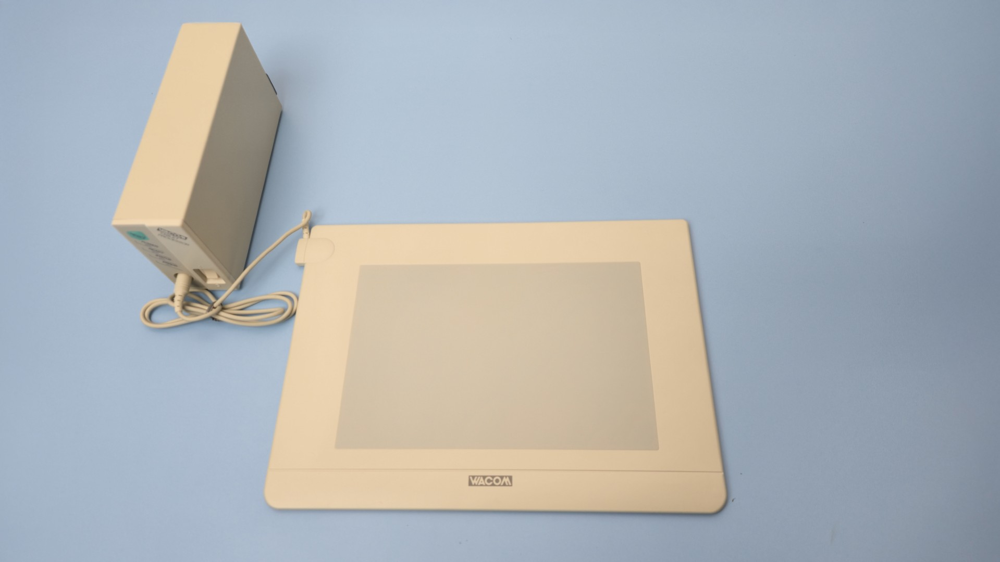
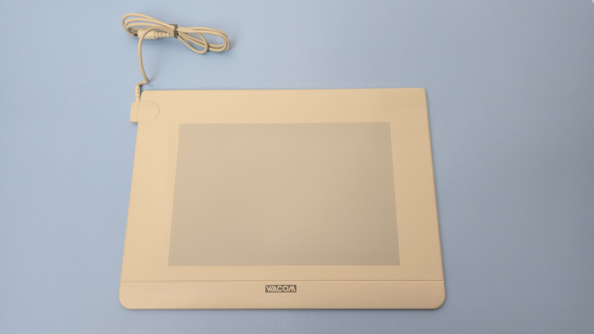
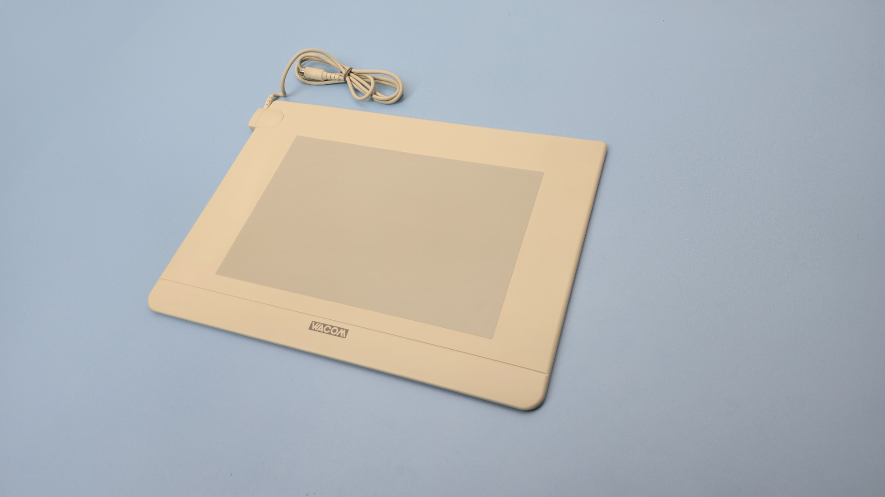
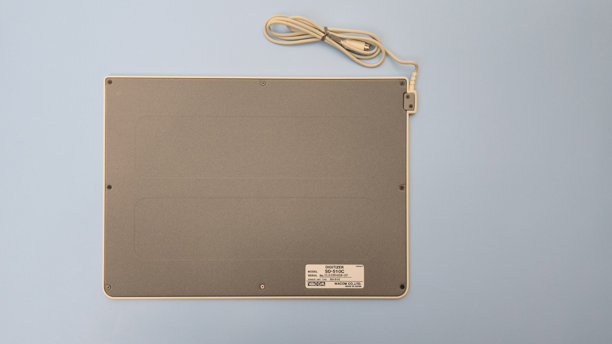
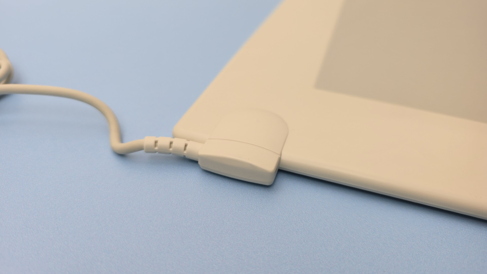
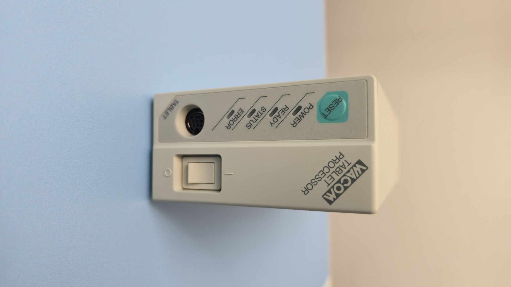
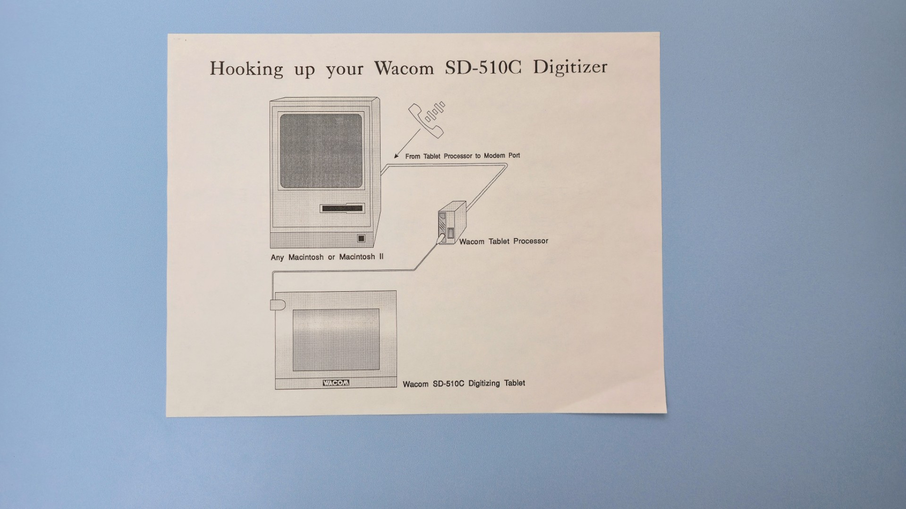
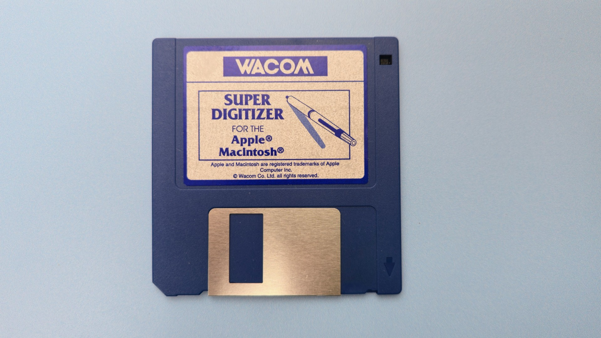

# Wacom SD-510C notes

## Overview

TBD

## Specs

These specs come from the [DrawTabData Explorer](https://thesevenpens.github.io/DrawTabDataExplorer/entity/wacom.tabletfamily.wacom_sd_1988). Click a model ID to see its full record there.



| | [SD-510C](https://thesevenpens.github.io/DrawTabDataExplorer/entity/wacom.tablet.sd510c) |
| --- | --- |
| Name | SD-510C |
| Released | 1988-07 |
| Status | Discontinued |



| | [SD-510C](https://thesevenpens.github.io/DrawTabDataExplorer/entity/wacom.tablet.sd510c) |
| --- | --- |
| Active area | 232 × 151 mm (9.1 × 5.9 in) |
| Diagonal | 276.8 mm (10.9 in) |
| Aspect ratio | ≈3:2 (1.536:1) |
| Pen technology | — |
| Pressure levels | — |
| Tilt | — |
| Accuracy (center) | — |
| Accuracy (corner) | — |
| Report rate | — |
| Density | 20 LPmm (508 LPI) |
| Max hover | — |



| | [SD-510C](https://thesevenpens.github.io/DrawTabDataExplorer/entity/wacom.tablet.sd510c) |
| --- | --- |
| Included pen | — |
| Compatible pens | [SP-200 (SP-200)](https://thesevenpens.github.io/DrawTabDataExplorer/entity/wacom.pen.sp200) [SP-200A (SP-200A)](https://thesevenpens.github.io/DrawTabDataExplorer/entity/wacom.pen.sp200a) [SP-210 (SP-210)](https://thesevenpens.github.io/DrawTabDataExplorer/entity/wacom.pen.sp210) [SP-210A (SP-210A)](https://thesevenpens.github.io/DrawTabDataExplorer/entity/wacom.pen.sp210a) [SP-300 (SP-300)](https://thesevenpens.github.io/DrawTabDataExplorer/entity/wacom.pen.sp300) [SP-310 (SP-310)](https://thesevenpens.github.io/DrawTabDataExplorer/entity/wacom.pen.sp310) |



| | [SD-510C](https://thesevenpens.github.io/DrawTabDataExplorer/entity/wacom.tablet.sd510c) |
| --- | --- |
| Buttons | — |
| Dials | — |
| Touch rings | — |
| Touch strips | — |
| Touch | No |



| | [SD-510C](https://thesevenpens.github.io/DrawTabDataExplorer/entity/wacom.tablet.sd510c) |
| --- | --- |
| Size | 327 × 238 × 7.5 mm (12.9 × 9.4 × 0.3 in) |
| Weight | 2000 g |



| | [SD-510C](https://thesevenpens.github.io/DrawTabDataExplorer/entity/wacom.tablet.sd510c) |
| --- | --- |
| Ports | — |
| Attached cable | — |
| Bluetooth | — |



| | [SD-510C](https://thesevenpens.github.io/DrawTabDataExplorer/entity/wacom.tablet.sd510c) |
| --- | --- |
| Contents | — |



## Photos of SD-510C

<figure><figcaption></figcaption></figure>

<figure><figcaption></figcaption></figure>

<figure><figcaption></figcaption></figure>

<figure><figcaption></figcaption></figure>

<figure><figcaption></figcaption></figure>

<figure><figcaption></figcaption></figure>

<figure><figcaption></figcaption></figure>

<figure><figcaption></figcaption></figure>
