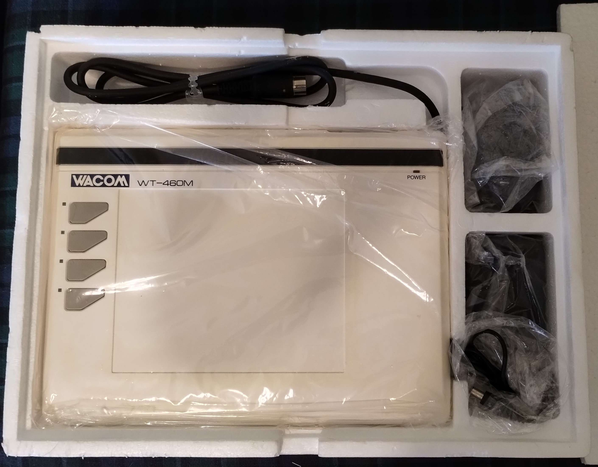
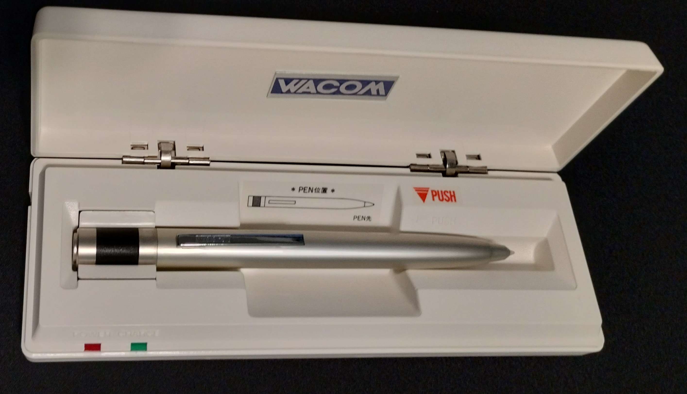

# Wacom WT series

## Basics

Release Year: 1984

Succeeded by: [Wacom SD series](wacom-sd-tablets/)

## Overview

Although these can be considered drawing tablets, they are not used the way we would expect in a modern sense.

* Most of them do not come with a pen, but rather a mouse/puck.
* The WT-460M came with a pen. The WT-4400SE model might have also come with a pen.
* The pen seems to work with the WT-460M and WT-4400SE, but it is unclear whether the other models allowed the pen to be used with them.
* The apparent intended use of the tablet - which is for digitizing things like architecture diagrams. And not for painting.
* The pen does NOT report multiple pressure levels like you would expect. The pressure is either ON or OFF, so it is like having only two pressure levels.
* Pressure detection is very different.
  * A modern EMR pen has a piezoelectric pressure sensor inside the pen. When you press down with the pen, the force from the press is transmitted through the nib to the pressure sensor. Which can sense variable amounts of pressure - thousands of different levels.
* The WT series pen contains an internal button. When you press down, the nib presses against this button. The button is either ON or OFF - either NO PRESSURE or PRESSURE.

If you are looking for the first "real" drawing tablet from Wacom. Look at the [Wacom SD series](wacom-sd-tablets/).

## Links

* lowtechblog - [The History of WACOM Tablets - Prehistory of Intuos 0.5](http://www.lowtech-city.org/blog/index.php?e=189\&PHPSESSID=fd133ba961598e7abf1dcf67441dbd32) 2018-09-01 ([archive](https://archive.is/sgoZa))

## Models

* WT-3000
* WT-4000
* WT-4400
* WT-4400SE
* WT-460M

## Photos

### WT-460M

<figure><figcaption>
WT-460M (picture from <a href="../../../resources/community/kuuube/">Kuuube</a>)
</figcaption></figure>

<figure><figcaption>
Included pen for the WT-460 (picture from <a href="../../../resources/community/kuuube/">Kuuube</a>)
</figcaption></figure>
