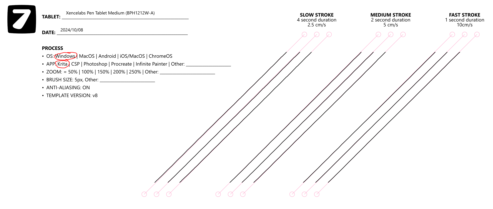

# Xencelabs Pen Tablet Medium (BPH1212W-A) notes

## **Summary**

Had a good experience with this tablet after using for six months.

## Notes

* Product page: [https://www.xencelabs.com/us/products/explore-pen-tablet-medium](https://www.xencelabs.com/us/products/explore-pen-tablet-medium)
* [Teoh on Tech - Xencelabs Pen Tablet Medium: Premium Entry From a New Company](https://www.youtube.com/watch?v=Vrwifey6168) 2021-04-08
* [Brad Colbow review of Xencelabs Pen Tablet](https://www.youtube.com/watch?v=d3vIa8cBzwI) 2021-04-30
* [Aaron Rutten - XENCELABS Tablet Review](https://www.youtube.com/watch?v=4m2yqJ3wFgI) 2021-05-14
* [ManyLearn - Xencelabs tablet review by a long-term Wacom user](https://www.youtube.com/watch?v=uS63-2e32i8) 2022-04-13
* [/u/BeckleyBak/ on reddit - Xencelabs Pen Display 24 review](https://www.reddit.com/r/drawingtablet/comments/173v9je/xencelabs_pen_display_24_review/) 2023-10-09

## Cost

It's in the same price range as Wacom.

## **Build quality**

Rating: very good.

Comparable to Wacom Intuos Pro GEN2.

## **Basic drawing**

Rating: very good.

I forgot I wasn't using a Wacom Intuos Pro tablet.

## **Driver**

Rating: Excellent

Driver UX is very friendly and modern in appearance.

## **Diagonal wobble**

Rating: OK

I did see some wobble at all speeds though it diminished at higher speeds. This amount of wobble could be a bit better for a pro tablet.

You might notice this wobble if you are doing line art or very careful strokes.

You can eliminate this wobble with Smoothing:

* Krita Brush Smoothing
  * **Basic** smoothing was enough to remove it
  * **Weighted** with **Distance** = 130 got rid of it
* **Clip Studio Paint**
  * Stabilization of 50 got rid of it

<figure><figcaption></figcaption></figure>
