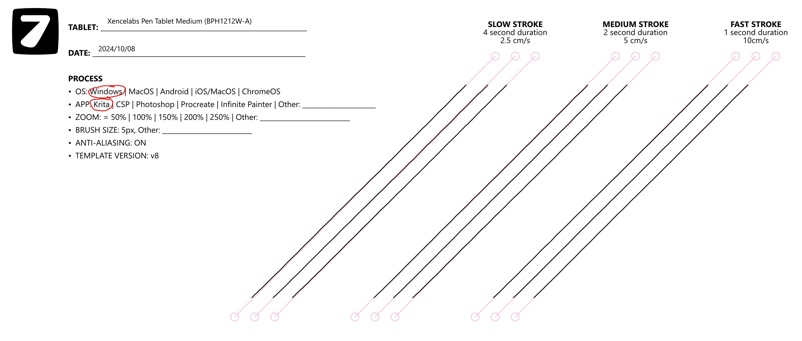

# Xencelabs Pen Tablet Medium (BPH1212W-A) notes

## **Summary**

Had a good experience with this tablet after using for six months.

## Links

These links come from the [DrawTabData Explorer](https://thesevenpens.github.io/DrawTabDataExplorer/entity/xencelabs.tabletfamily.xencelabs_pentablet). To add or fix a link, change it in DrawTabData.

| Source | Link | Date |
| --- | --- | --- |
| Xencelabs | [Product page](https://www.xencelabs.com/us/products/pen-tablet-medium) |  |
| EyekooDrawsStuff | [Xencelabs Pen Tablet Review - a solid medium-sized Wacom competitor?](https://www.youtube.com/watch?v=jLedeFToarg) | 2024-12-26 |
| ManyLearn | [Xencelabs tablet review by a long-term Wacom user](https://www.youtube.com/watch?v=uS63-2e32i8) | 2022-04-13 |
| Gartzia Artz | [MEJOR QUE CUALQUIER WACOM / Review Español Tableta gráfica Xencelabs medium + Quick keys](https://www.youtube.com/watch?v=IAO0gs9E0e8) | 2021-11-24 |
| Aaron Rutten | [XENCELABS Tablet Review - Just a Rebranded XP-Pen/Ugee?](https://www.youtube.com/watch?v=4m2yqJ3wFgI) | 2021-05-14 |
| Brad Colbow | [Xencelabs Pen Tablet Review](https://www.youtube.com/watch?v=d3vIa8cBzwI) | 2021-04-30 |
| Teoh on Tech | [Xencelabs Pen Tablet Medium: Premium Entry From a New Company](https://www.youtube.com/watch?v=Vrwifey6168) | 2021-04-08 |
| Parka Blogs | [Review: Xencelabs Pen Tablet Medium (Wireless)](https://www.parkablogs.com/content/review-xencelabs-pen-tablet-medium-wireless) |  |

## Specs

These specs come from the [DrawTabData Explorer](https://thesevenpens.github.io/DrawTabDataExplorer/entity/xencelabs.tabletfamily.xencelabs_pentablet). Click a model ID to see its full record there.



| | [BPH1212W-V1](https://thesevenpens.github.io/DrawTabDataExplorer/entity/xencelabs.tablet.bph1212wv1) |
| --- | --- |
| Name | Pen Tablet Medium V1 |
| Released | 2021-02-23 |
| Status | — |



| | [BPH1212W-V1](https://thesevenpens.github.io/DrawTabDataExplorer/entity/xencelabs.tablet.bph1212wv1) |
| --- | --- |
| Active area | 262 × 147 mm (10.3 × 5.8 in) |
| Diagonal | 300.4 mm (11.8 in) |
| Aspect ratio | 16:9 |
| Pen technology | Passive EMR |
| Pressure levels | 8192 |
| Tilt | ±60° |
| Accuracy (center) | — |
| Accuracy (corner) | — |
| Report rate | — |
| Density | 200 LPmm (5080 LPI) |
| Max hover | — |



| | [BPH1212W-V1](https://thesevenpens.github.io/DrawTabDataExplorer/entity/xencelabs.tablet.bph1212wv1) |
| --- | --- |
| Included pen | [3-Button Pen V1 (3BUTTONV1)](https://thesevenpens.github.io/DrawTabDataExplorer/entity/xencelabs.pen.3buttonv1) [Thin Pen V1 (THINV1)](https://thesevenpens.github.io/DrawTabDataExplorer/entity/xencelabs.pen.thinv1) |
| Compatible pens | [Thin Pen V1 (THINV1)](https://thesevenpens.github.io/DrawTabDataExplorer/entity/xencelabs.pen.thinv1) [3-Button Pen V1 (3BUTTONV1)](https://thesevenpens.github.io/DrawTabDataExplorer/entity/xencelabs.pen.3buttonv1) |



| | [BPH1212W-V1](https://thesevenpens.github.io/DrawTabDataExplorer/entity/xencelabs.tablet.bph1212wv1) |
| --- | --- |
| Buttons | — |
| Dials | — |
| Touch rings | — |
| Touch strips | — |
| Touch | No |



| | [BPH1212W-V1](https://thesevenpens.github.io/DrawTabDataExplorer/entity/xencelabs.tablet.bph1212wv1) |
| --- | --- |
| Size | 320.5 × 232.5 × 8 mm (12.6 × 9.2 × 0.3 in) |
| Weight | 715 g |



| | [BPH1212W-V1](https://thesevenpens.github.io/DrawTabDataExplorer/entity/xencelabs.tablet.bph1212wv1) |
| --- | --- |
| Ports | — |
| Attached cable | — |
| Bluetooth | — |



| | [BPH1212W-V1](https://thesevenpens.github.io/DrawTabDataExplorer/entity/xencelabs.tablet.bph1212wv1) |
| --- | --- |
| Contents | — |



## Notes

* Product page: [https://www.xencelabs.com/us/products/explore-pen-tablet-medium](https://www.xencelabs.com/us/products/explore-pen-tablet-medium)
* [/u/BeckleyBak/ on reddit - Xencelabs Pen Display 24 review](https://www.reddit.com/r/drawingtablet/comments/173v9je/xencelabs_pen_display_24_review/) 2023-10-09

## Cost

It's in the same price range as Wacom.

## **Build quality**

Rating: very good.

Comparable to Wacom Intuos Pro GEN2.

## **Basic drawing**

Rating: very good.

I forgot I wasn't using a Wacom Intuos Pro tablet.

## **Driver**

Rating: Excellent

Driver UX is very friendly and modern in appearance.

## **Diagonal wobble**

Rating: OK

I did see some wobble at all speeds though it diminished at higher speeds. This amount of wobble could be a bit better for a pro tablet.

You might notice this wobble if you are doing line art or very careful strokes.

You can eliminate this wobble with Smoothing:

* Krita Brush Smoothing
  * **Basic** smoothing was enough to remove it
  * **Weighted** with **Distance** = 130 got rid of it
* **Clip Studio Paint**
  * Stabilization of 50 got rid of it

<figure><figcaption></figcaption></figure>
