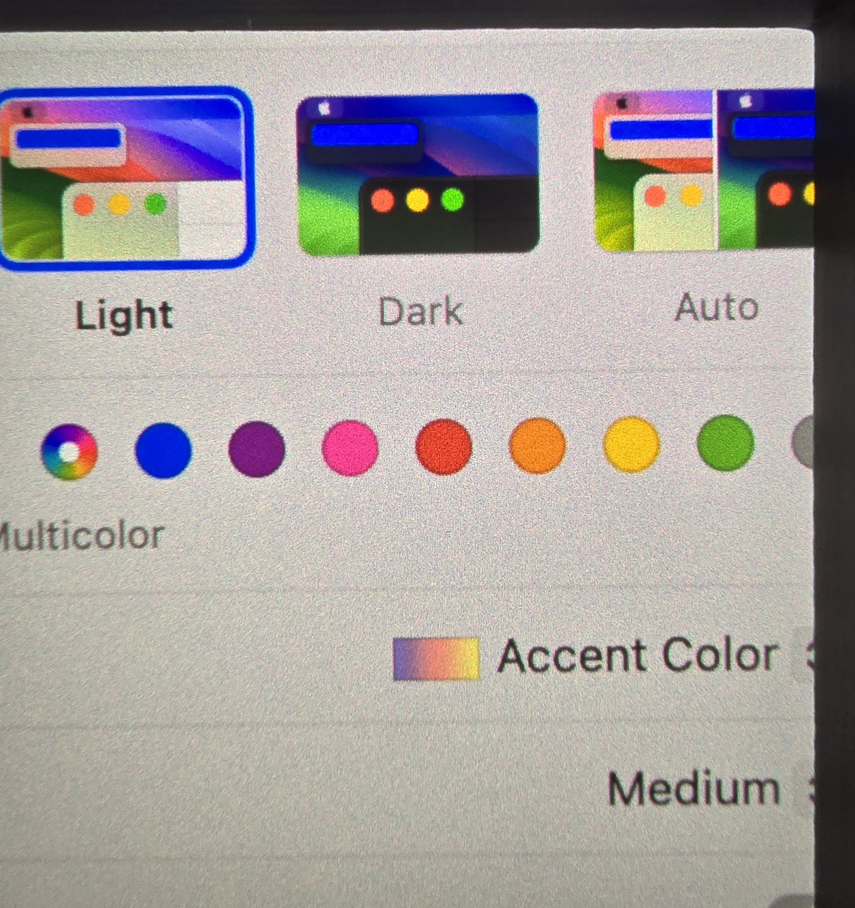
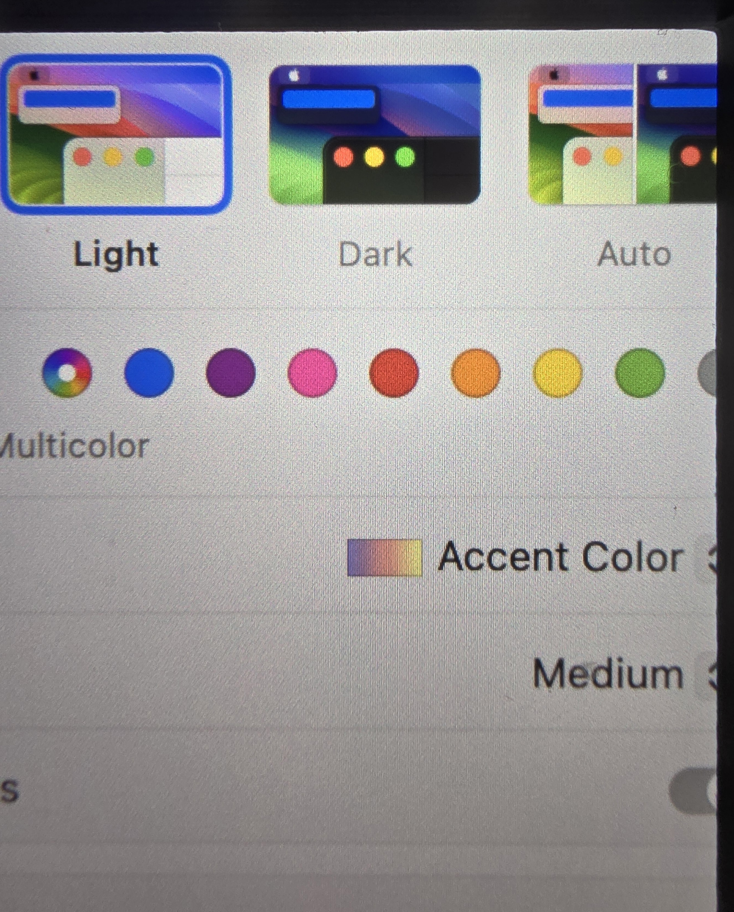
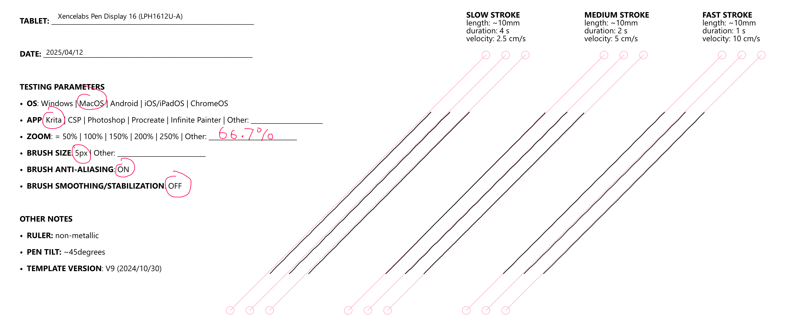

# Xencelabs Pen Display 16 (LPH1612U-A) notes

## Overview 

Overall good performance.

* The pens don't have the super low IAF that you see in Wacom professional pens but most will be fine with the 3gf IAF they do offer.
* Some moderate AG sparkle is visible - if you are sensitive to that then this tablert may not be the right choice

## Specs

These specs come from the [DrawTabData Explorer](https://thesevenpens.github.io/DrawTabDataExplorer/entity/xencelabs.tabletfamily.xencelabs_pendisplay). Click a model ID to see its full record there.



| | [LPH1612U-A](https://thesevenpens.github.io/DrawTabDataExplorer/entity/xencelabs.tablet.lph1612ua) |
| --- | --- |
| Name | Pen Display 16 Lite |
| Released | 2024-05-08 |
| Status | — |



| | [LPH1612U-A](https://thesevenpens.github.io/DrawTabDataExplorer/entity/xencelabs.tablet.lph1612ua) |
| --- | --- |
| Resolution | 3840 × 2160 |
| Aspect ratio | 16:9 |
| Pixel density | 283 PPI |
| Panel | OLED |
| Lamination | Yes |
| Anti-glare | Etched glass |
| Color gamut | Adobe RGB 98% DCI-P3 98% Rec. 709 99% |
| Color depth | 10 bits per channel |
| Brightness | 300 cd/m² |
| Peak brightness | — |
| Viewing angle | — |
| Refresh rate | 60 Hz |
| Response time | — |



| | [LPH1612U-A](https://thesevenpens.github.io/DrawTabDataExplorer/entity/xencelabs.tablet.lph1612ua) |
| --- | --- |
| Active area | 344.2 × 193.6 mm (13.6 × 7.6 in) |
| Diagonal | 394.9 mm (15.5 in) |
| Aspect ratio | 16:9 |
| Pen technology | Passive EMR |
| Pressure levels | 8192 |
| Tilt | ±60° |
| Accuracy (center) | — |
| Accuracy (corner) | — |
| Report rate | — |
| Density | 200 LPmm (5080 LPI) |
| Max hover | — |



| | [LPH1612U-A](https://thesevenpens.github.io/DrawTabDataExplorer/entity/xencelabs.tablet.lph1612ua) |
| --- | --- |
| Included pen | [3-Button Pen V2 (3BUTTONV2)](https://thesevenpens.github.io/DrawTabDataExplorer/entity/xencelabs.pen.3buttonv2) [Thin Pen V2 (THINV2)](https://thesevenpens.github.io/DrawTabDataExplorer/entity/xencelabs.pen.thinv2) |
| Compatible pens | [3-Button Pen V2 (3BUTTONV2)](https://thesevenpens.github.io/DrawTabDataExplorer/entity/xencelabs.pen.3buttonv2) [Thin Pen V2 (THINV2)](https://thesevenpens.github.io/DrawTabDataExplorer/entity/xencelabs.pen.thinv2) |



| | [LPH1612U-A](https://thesevenpens.github.io/DrawTabDataExplorer/entity/xencelabs.tablet.lph1612ua) |
| --- | --- |
| Buttons | — |
| Dials | — |
| Touch rings | — |
| Touch strips | — |
| Touch | No |



| | [LPH1612U-A](https://thesevenpens.github.io/DrawTabDataExplorer/entity/xencelabs.tablet.lph1612ua) |
| --- | --- |
| Size | 410 × 259.4 × 12 mm (16.1 × 10.2 × 0.5 in) |
| Weight | 1200 g |
| VESA mount | — |
| Legs | — |
| Included stand | — |



| | [LPH1612U-A](https://thesevenpens.github.io/DrawTabDataExplorer/entity/xencelabs.tablet.lph1612ua) |
| --- | --- |
| Ports | — |
| Attached cable | — |
| Bluetooth | — |



| | [LPH1612U-A](https://thesevenpens.github.io/DrawTabDataExplorer/entity/xencelabs.tablet.lph1612ua) |
| --- | --- |
| Contents | — |



## Notes on specs

### Display

* Display size: 13.6 x 7.6" -> diagonal = 15.58"
* Contrast ratio: 100000:1
* Parallax: Unknown
* Color gamut (beyond what the Specs tab lists)
  * P3-D65 98%
  * sRGB 99%
  * REC 2020 82%

### Pens

* For more information about these pens: [Xencelabs V2 pens notes](../../pens/xencelabs-pens/xencelabs-v2-pens-notes.md)

## Links

* Product page: [https://www.xencelabs.com/us/products/pen-display-16](https://www.xencelabs.com/us/products/pen-display-16)
* [Grant Abbitt - Review of Xencelabs Pen DIsplay 16](https://www.youtube.com/watch?v=zGkTjf5HoB4) 2024-08-07
* [AppleInsider review of Xencelabs Pen Display 16](https://appleinsider.com/articles/24/05/28/xencelabs-pen-display-16-review-a-compact-digital-art-masterpiece) 2024-05-28
* [The Honest Laborers Review - Xencelabs 16-inch 4K Pen Display Hands-On and Test](https://www.youtube.com/watch?v=FCuVrJMncKI) - 2024-05-23

## Form factor

* Has a typical size, thickness and weight for a 16 pen display.
* Note, if you have used a Wacom Movink 13 which also has an OLED display, be aware that the Movink is much thinner than this tablet. To be fair, Xencelabs does not market this tablet as an ultra-portable, lightweight tablet.

## Anti-glare sparkle

Rating: OK-ish. Moderate sparkle visible.

Having some sparkle at 16" seems is normal for pen displays. However this amount is more than I would expect for a pro display. If you are sensitive to sparkle then this may not be the right tablet for you. This tablet clearly has more sparkle than the Wacom Cintiq Pro 16 (DTH-167). This is something I'd like to see Xencelabs improve for any future 4K tablets at this size.

AG Sparkle for Xencelabs Pen Display 16

<figure><figcaption></figcaption></figure>

AG Sparkle for Wacom Cintiq Pro 16 (DTH-167)

<figure><figcaption></figcaption></figure>

## Diagonal wobble

The tablet exhibits moderate diagonal wobble at all speeds.

<figure><figcaption></figcaption></figure>

## Stand

The tablet comes with the Xencelabs Mobile Easel. [Xencelabs Mobile Easel](../../accessories/stands/xencelabs-mobile-easel.md).

## OLED longevity

To early to say. More here: [OLED Longevity](../../../tech/oled-longevity.md).
