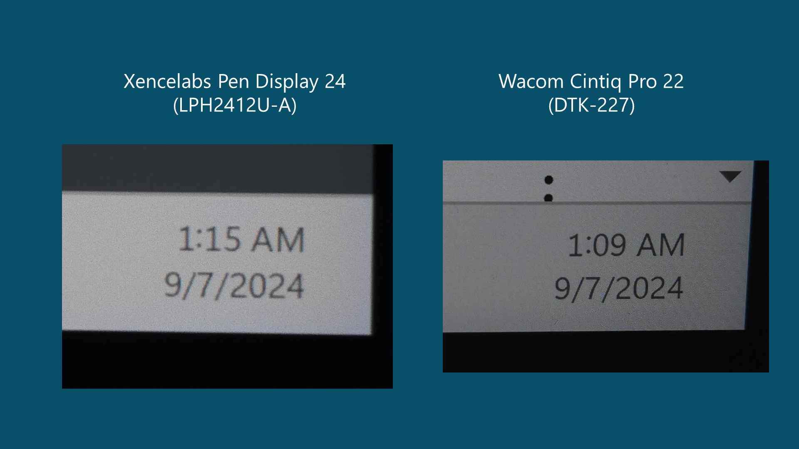
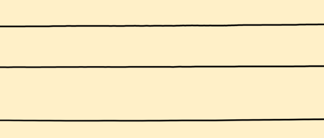
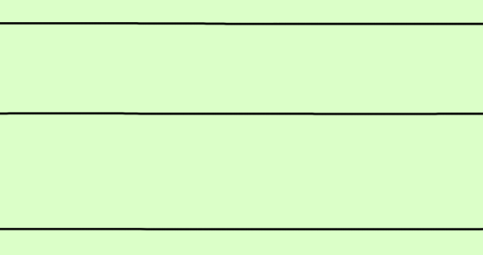
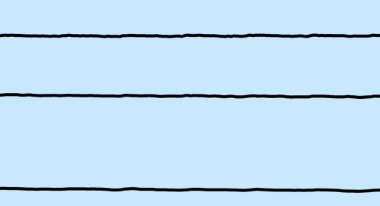
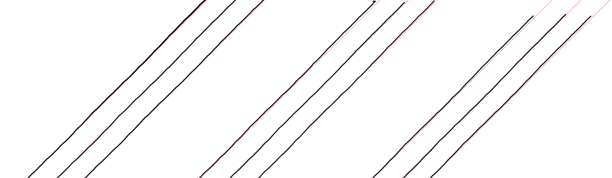
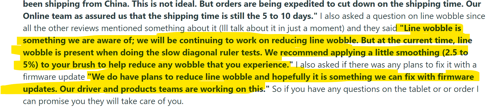

# Xencelabs Pen Display 24 (LPH2412U-A) notes

## Overview

This overall is a very good tablet. It design and demonstrates a lot of thoughtfulness to the user that shows up in the industrial design, driver, and inclusion of accessories.

The one place this tablet struggles compared to other pen displays is with line wobble that show up in strokes at all angles. This wobble can be addressed with some additional position smoothing settings in a painting application.

## Links

These links come from the [DrawTabData Explorer](https://thesevenpens.github.io/DrawTabDataExplorer/entity/xencelabs.tabletfamily.xencelabs_pendisplay). To add or fix a link, change it in DrawTabData.

| Source | Link | Date |
| --- | --- | --- |
| Xencelabs | [Product page](https://www.xencelabs.com/us/products/pen-display) |  |
| Xencelabs | [Store page](https://www.xencelabs.com/us/store/pen-display/xencelabs-pen-display-24) |  |
| MobileTechReview | [Xencelabs Pen Display 24 Review](https://www.youtube.com/watch?v=o6R07naf2es) | 2024-03-19 |
| Grant Abbitt | [Is the Xencelabs Pen Display 24" a Serious Challenger to the Wacom Cintiq Pro](https://www.youtube.com/watch?v=Woe0_XSUtLE) | 2023-09-14 |
| Brad Colbow | [Xencelabs Pen Display 24 Review](https://youtu.be/sr76rKKO4iQ) | 2023-06-04 |
| Teoh on Tech | [Xencelabs Pen Display 24 Announcement + My Thoughts](https://www.youtube.com/watch?v=jLEj12-um3A) | 2023-03-28 |

## Specs

These specs come from the [DrawTabData Explorer](https://thesevenpens.github.io/DrawTabDataExplorer/entity/xencelabs.tabletfamily.xencelabs_pendisplay). Click a model ID to see its full record there.



| | [LPH2412U-A](https://thesevenpens.github.io/DrawTabDataExplorer/entity/xencelabs.tablet.lph2412ua) |
| --- | --- |
| Name | Pen Display 24 |
| Released | 2023-03-21 |
| Status | — |



| | [LPH2412U-A](https://thesevenpens.github.io/DrawTabDataExplorer/entity/xencelabs.tablet.lph2412ua) |
| --- | --- |
| Resolution | 3840 × 2160 |
| Aspect ratio | 16:9 |
| Pixel density | 185 PPI |
| Panel | — |
| Lamination | Yes |
| Anti-glare | Etched glass |
| Coatings | — |
| Color gamut | sRGB 99% coverage Adobe RGB 99% coverage DCI-P3 93% coverage Rec. 709 99% coverage |
| Color depth | 10 bits per channel |
| Brightness | 330 cd/m² |
| Peak brightness | — |
| Viewing angle | — |
| Refresh rate | 60 Hz |
| Response time | — |



| | [LPH2412U-A](https://thesevenpens.github.io/DrawTabDataExplorer/entity/xencelabs.tablet.lph2412ua) |
| --- | --- |
| Active area | 527 × 296 mm (20.7 × 11.7 in) |
| Diagonal | 604.4 mm (23.8 in) |
| Aspect ratio | 16:9 |
| Pen technology | Passive EMR |
| Pressure levels | 8192 |
| Tilt | ±60° |
| Accuracy (center) | — |
| Accuracy (corner) | — |
| Report rate | — |
| Density | 200 LPmm (5080 LPI) |
| Max hover | — |



| | [LPH2412U-A](https://thesevenpens.github.io/DrawTabDataExplorer/entity/xencelabs.tablet.lph2412ua) |
| --- | --- |
| Included pen | [3-Button Pen V2 (3BUTTONV2)](https://thesevenpens.github.io/DrawTabDataExplorer/entity/xencelabs.pen.3buttonv2) [Thin Pen V2 (THINV2)](https://thesevenpens.github.io/DrawTabDataExplorer/entity/xencelabs.pen.thinv2) |
| Compatible pens | [3-Button Pen V2 (3BUTTONV2)](https://thesevenpens.github.io/DrawTabDataExplorer/entity/xencelabs.pen.3buttonv2) [Thin Pen V2 (THINV2)](https://thesevenpens.github.io/DrawTabDataExplorer/entity/xencelabs.pen.thinv2) |



| | [LPH2412U-A](https://thesevenpens.github.io/DrawTabDataExplorer/entity/xencelabs.tablet.lph2412ua) |
| --- | --- |
| Buttons | — |
| Dials | — |
| Touch rings | — |
| Touch strips | — |
| Touch | No |



| | [LPH2412U-A](https://thesevenpens.github.io/DrawTabDataExplorer/entity/xencelabs.tablet.lph2412ua) |
| --- | --- |
| Size | 618.5 × 388 × 34.7 mm (24.4 × 15.3 × 1.4 in) |
| Weight | 6000 g |
| VESA mount | — |
| Legs | — |
| Included stand | — |



| | [LPH2412U-A](https://thesevenpens.github.io/DrawTabDataExplorer/entity/xencelabs.tablet.lph2412ua) |
| --- | --- |
| Ports | — |
| Attached cable | — |
| Bluetooth | — |



| | [LPH2412U-A](https://thesevenpens.github.io/DrawTabDataExplorer/entity/xencelabs.tablet.lph2412ua) |
| --- | --- |
| Power input | 12 V, 5 A |
| Consumption | — |
| Standby | — |
| Power adapter | — |
| Power output | — |



| | [LPH2412U-A](https://thesevenpens.github.io/DrawTabDataExplorer/entity/xencelabs.tablet.lph2412ua) |
| --- | --- |
| Contents | — |



## Notes on specs

### Display

* Screen size: 23.8in (60.5cm)

### Pens

* For more information about these pens: [Xencelabs V2 pens notes](../../pens/xencelabs-pens/xencelabs-v2-pens-notes.md)
* Pens in the box: These pens are different than the one that comes with the Xencelabs pen tablet. And the pens are NOT swappable.
* Pen buttons: This new 3 Button Pen V2 is an improvement from the old V1 pen. The buttons are more prominent and easier to tell apart by touch.
* Pen eraser: Both pens have an eraser. But I don't use erasers so I have no comment on them.

## Other links

* [**r/drawingtablet - Xencelabs Pen Display 24 Review**](https://www.reddit.com/r/drawingtablet/comments/14y8xl7/xencelabs_pen_display_24_review/) 2023-07-12
* [**r/drawingtablet - Xencelabs Pen Display 24 review**](https://www.reddit.com/r/drawingtablet/comments/173v9je/comment/k5geg5x/?utm_source=share&utm_medium=web2x&context=3) 2023-10-09

## **Edge & Corner accuracy**

Rating: VERY GOOD. Extremely accurate at edges and in corners. Among the best I've seen.

* Better than my Wacom Cintiq Pro 27 (which is also VERY GOOD).
* Clearly better than Huion Kamvas 24 Pro 4K (which is TYPICAL)

## **Anti-glare treatment**

It uses an etched-glass surface that does a very good job of reducing glare.

In comparison:

* has a bit more glare reduction than the Cintiq Pro 22
* has around the same glare reduction as the Huion Kamvas Pro 19

## **Anti-glare sparkle**

Rating: VERY GOOD. \[LESS IS BETTER] Slight AG Sparkle only noticeable when eye is \~4" away from glass or closer. At normal drawing distance not visible..

* about the same as the Wacom Cintiq Pro 27 (Which is GOOD).
* Clearly better than with Huion Kamvas 24 Pro 4K (Which is OK)

## **Color modes**

* AdobeRGB
* sRGB
* REC 709
* DCI P3
* REC 2020
* Pantone
* User mode

### **sRGB mode**

I used this display in only in SRGB mode. When setting sRGB mode the brightness stayed steady. Some pen displays and monitors reduce the brightness in sRGB mode, but that did not happen with this tablet.

## **Pointer lag**

Rating: Slightly above TYPICAL RANGE

Comparisons:

* has a bit more than Wacom Cintiq Pro 27.
* is comparable to but the Huion Kamvas 24 Pro 4K (Which is Typical) - maybe just a little more than the Huion.

## **Screen sharpness**

The anti-glare etched glass adds a noticable amount softness to the pixels. Below is the comparison between the Xencelabs Pen Display 24 and the Cintiq Pro 22. It can be hard for photos to be accurate about sharpness but these photos are close to what my eyes perceive.

<figure><figcaption></figcaption></figure>

Although taking these kinds of photos can be tricky, the picture closely matches what my eyes perceive. You can see with the Cintiq Pro 22 that the pixels are crisp and well delineated.

This amount of softness is similar to what I saw with the Huion Kamvas Pro 19 - maybe just a little more.

## **Surface texture**

Rating: VERY GOOD. It feels really nice.

With a plastic nib

* Slightly more texture than the Cintiq Pro 27.
* More texture than Huion Kamvas Pro 19
* More texture than Huion Kamvas Pro 24 4K

With a felt nib

* Felt comparable to the Huion Kamvas Pro 19

## Pressure range

For more information about these pens: [Xencelabs V2 pens notes](../../pens/xencelabs-pens/xencelabs-v2-pens-notes.md)

## Pressure Transition

Moving from very light pressure to heavy pressure works well, the pressure moves up and down smoothly. Staying in low pressure works well - no add bumps or pulsing in strokes.

## Pressure scan rate

I draw 50 strokes as fast as I could - similar to crosshatching quickly. No strokes were missed.

## **General wobble**

In general to the position of the pointer wobbles a little bit as you move your pen. This happens at all angles - not just diagonal angles. Even vertical or horizontal lines exhibit the wobble. This wobble occurs at all velocities of the pen, but diminishes a little bit if the pen is moving fast.

The wobble is easily seen noticable to the eyes.

In comparison the wobble for horizontal and vertical lines is:

* clearly more than the Huion Kamvas Pro 19 (which is excellent)
* clearly more than the Cintiq Pro 27 (which excellent)

**Horizontal line examples (the same happens with vertical lines)**

Kamvas Pro 19

Cintiq pro 27

<figure><figcaption></figcaption></figure>

Xencelabs pen display 24

<figure><figcaption></figcaption></figure>

## **Diagonal wobble**

NOTE: Keep in mind the general wobble describes contributes to the diagonal wobble.

Rating: OK. There is more diagonal wobble than comparable tablets.

Diagonal wobble effects all tablets, and it tends to be present in pen displays more often especially as they get larger. But here I am seeing two things:

* There is a bit more wobble than I would expect.
* The additional wobble happens even with faster strokes.

Compared to other tablets

* Has noticeably more than the Huion Kamvas Pro 19
* Has a bit more wobble than Wacom Cintiq Pro 27
* Has a bit more wobble than the Huion Kamvas Pro 24 4K
* Has a bit more wobble than the XP-Pen Artist Pro 16 GEN2

<figure><figcaption></figcaption></figure>

## Smoothing settings to reduce wobble

Here are the settings I used that seemed to substantially diminish the wobble - in same cases to the point where it was haerd to distinguish from a perfect line.

Krita

* Smoothing mode: **Weighted** with **distance** = 150 to 200
* Smoothing mode **Basic** had no effect in my testing.

Clip Studio Paint

* Stabilization = 50

## Xencelabs awareness of wobble

Xencelabs is at least aware of the diagonal wobble.

In this review post on reddit (posted July 12, 2023) there are some quoted responses from Xencelabs [**r/drawingtablet - Xencelabs Pen Display 24 Review**](https://www.reddit.com/r/drawingtablet/comments/14y8xl7/xencelabs_pen_display_24_review/) 2023-07-12

<figure><figcaption></figcaption></figure>

It's unclear if they are aware of the more general wobble I encountered.

## **Driver UX**

Rating: EXCELLENT The best user experience and design of any tablet in the industry.

## **Hover distance**

Rating: TYPICAL. I measured it at 10mm.

## Fans

No fans.

## Noise

Completely quiet. No noise.

## Heat

After leaving it on for 3 hours with brightness set at 100%, the overall surface has a slightly warm feel - close to body temperature.

In comparison, I left it on for 3 hours with the brightness set at 50%, and the the surface felt much closer to room temperature with a slight body temperature warmth towards the left side of the display.
