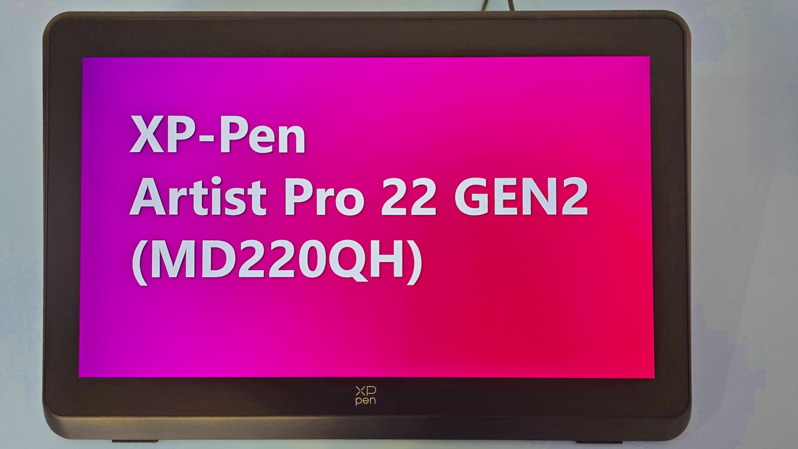
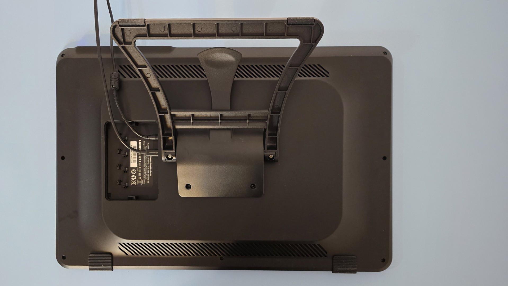
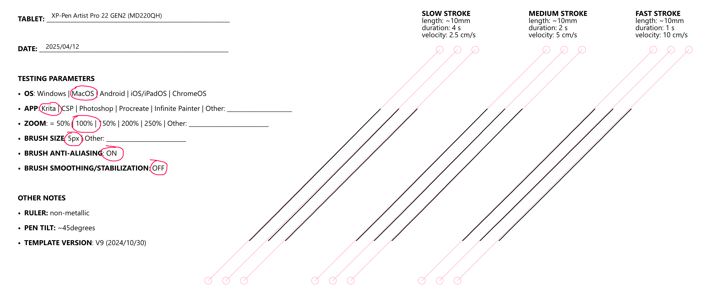
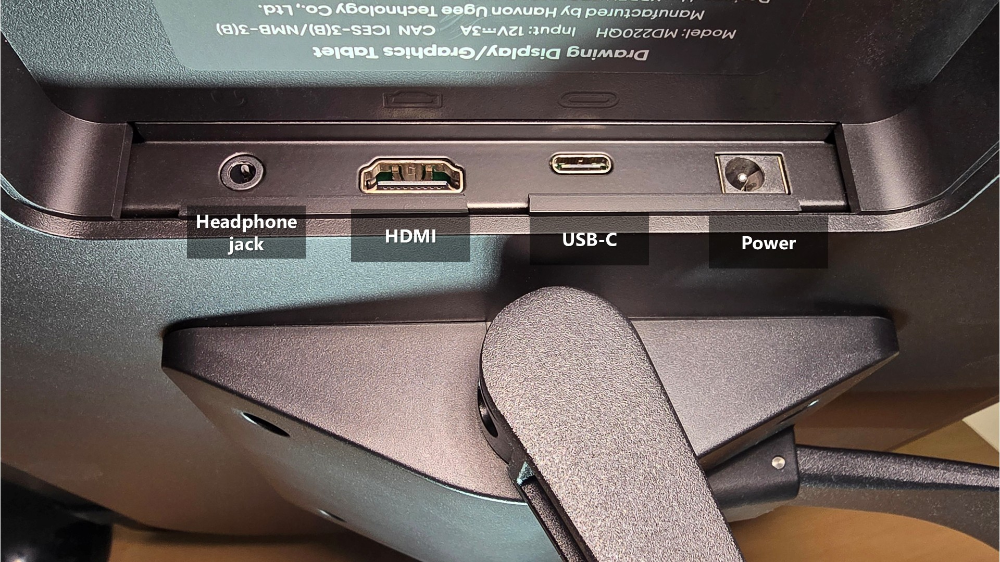
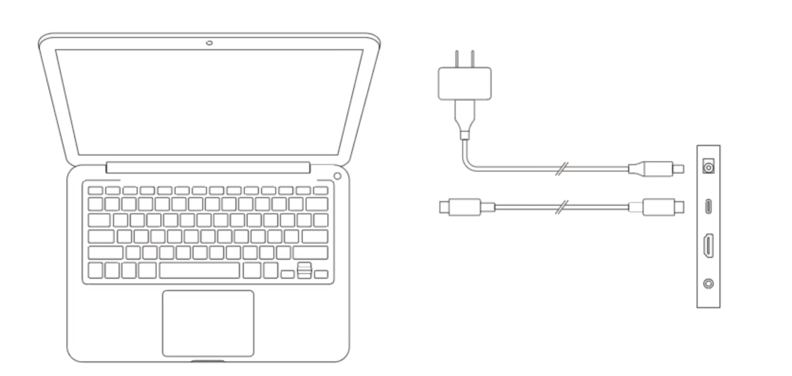
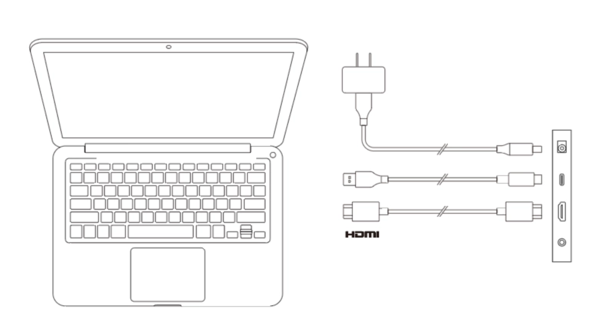
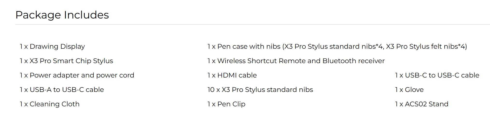

# XP-Pen Artist Pro 22 GEN2 (MD220QH) notes

## Summary

* As of May 2025...
  * This is my favorite tablet in the XP-Pen'Artist Pro GEN2 series
  * This is my favorite non-Wacom 22" pen display
* Drawing performance is very good.
  * Unlike some other models in the Artist Pro GEN2 series, the unit I tested had very good tilt compensation and very low diagonal wobble
* This is a nice step up in terms of size over the Artist Pro 16 GEN2 and the Artist Pro 19 GEN2 in terms without getting too large. In general 22" is my favorite size for pen tablets.

## Basics

* Release year: 2025
* Product page: [https://www.xp-pen.com/product/artist-pro-22-gen-2.html](https://www.xp-pen.com/product/artist-pro-22-gen-2.html)
* User manual [https://www.xp-pen.com/user-manual/artist-pro-22-gen-2.html](https://www.xp-pen.com/user-manual/artist-pro-22-gen-2.html)

## Links

* product page: [https://www.xp-pen.com/product/artist-pro-22-gen-2.html](https://www.xp-pen.com/product/artist-pro-22-gen-2.html)
* [Teoh on Tech - review of XP-Pen Artist Pro 22](https://www.youtube.com/watch?v=PMscqe2rO1M) GEN2 2025-04-20

## Photos

<figure><figcaption></figcaption></figure>

<figure><figcaption></figcaption></figure>

## Core specs

* Active Area:
  * 18.716” x 10.528" -> 21.474" diagonal
  * 475.392 mm x 267.408 mm -> 545.4mm diagonal
* Aspect Ratio: 16x9
* Accuracy: ±0.4 mm (center)
* Report rate: 220Hz

## Display

* **Resolution**: WQHD (2560x1440)
  * This a significant upgrade from the Full HD (1920x1080) resolution of the XP-Pen Artist 22 Plus
* Display panel tech: IPS
* Aspect Ratio: 16:9
* Lamination: YES
* Viewing Angle: 178°
  * Minimal color shift at extreme left/right angles, with very slight dimming at steep up/down tilts.
* Contrast: unspecified
* Response time: unspecified
* Refresh rate: 60hz
* Brightness: 250 cd/m2

## **Display > Anti-glare**

* Anti-glare treatment: Etched glass
* Glare Reduction: The screen effectively reduced glare. Reflections are very well diffused.

## **Display > color**

* Color depth: 8 bit
* Color Gamut Coverage Ratio: 99% sRGB, 99% Adobe RGB, 94% Display P3
* **Color Calibration Report**: Tablet package came with a factory calibration report with a Delta E value of 0.88. I'm not an expert on colors but I was told this is good.

## Included pen

* The tablet comes with a single pen: X3 Pro Stylus.
* See [XP-Pen X3 Pro pens](../../../pens/xppen-pens/xppen-x3pro-pen.md).
* I was disappointed it only came with 1 pen. With some of the other Artist Pro GEN2 products we are getting two pens.

## Compatible pens

It is compatible with other pens in the X3 pro series. I tested with all of the pens below.

* X3 Pro Roller Stylus
* X3 Pro Slim Stylus
* X3 Pro

## Physical characteristics

* **Size**
  * The tablet measures 22" diagonally
  * 22" is my favorite size for pen displays, and it is definitely notable size upgrade from a 19" pen display
* **Bezels**
  * Noticeably large bezels.
    * \~40 mm on top
    * \~35 mm on sides
    * \~55 mm on the bottom
  * The bezels were larger than competitors like Wacom and Huion. Some will find these wide bezes impacting the tablet’s visual elegance but it does provide some nice space to rest your hands.
* **Weight**: This is a relatively heavy tablet - as expected for its 22" size and wide bezels.

## Anti-glare sparkle

* RATING: VERY GOOD. Low amounts of AG sparkle.
* Maybe just slightly more than the Cintiq Pro 22.
* Similar amount of AG sparkle to Huion Kamvas Pro 19

## Sharpness

Photos may not capture it, but the display is slightly "soft" like what I saw in the Kamvas Pro 19. The Artist Pro19 GEN2 and Cintiq Pro 22 are a bit sharper. It is NOT blurry just a little softer. This is likely due to the anti-glare treatment.

<figure><figcaption></figcaption></figure>

## Display Performance on macOS

* **Resolution and Text**:
  * Text appeared slightly blurry due to macOS scaling, not the tablet’s fault. Using BetterDisplay made the text much crisper.
  * At normal drawing distances, I could not distinguish it from a 4K display. Though I imagine many of you have sharper eyes.

## Design

Looks exactly like the XP-Pen Artist 22 Plus. So very attractive overall design.

## Pressure transition

Moving between low and high pressure gave smooth pressure transitions.

## Accuracy

XP-Pen states:

* Center: ±0.4 mm
* Corner: NOT STATED

RATING: VERY GOOD.

My experience matched the accuracy numbers XP-Pen provides for center accuracy. Corner accuracy was typical for a pen display - a slight inaccuracy of 1 or 2 mm.

## Parallax

VERY GOOD.

On par with Cintiq Pro 22 and with Huion Kamvas Pro 19.

## Tilt compensation

EXCELLENT - I didn't see the pointer shift much at all as I tilted in different directions

<figure><figcaption></figcaption></figure>

## Pressure scan rate testing

* RATING: VERY GOOD
* Drawing 50 strokes as fast possible results in no lost strokes.

## Diagonal wobble

* Rating: VERY GOOD - very low amounts of diagonal wobble.
* On par with the Huion Kamvas Pro 19 and the Wacom Cintiq Pro 22

<figure><figcaption></figcaption></figure>

## Ports

<figure><figcaption></figcaption></figure>

## Connections and cabling

### Ports

* USB-C
* HDMI
* power connection,
* headphone jack - unexpected but appreciated

### Power

* The USB-C port alone cannot power the tablet. You MUST use the included power supply. This is typical for displays over 16".

### Connection options

It can be connected with USB-C cable to your computer, This USB-C cable should be either the full-featured USB-C cable that came with the tablet or you can use a Thunderbolt 3 or Thunderbolt 4 cable.

<figure><figcaption></figcaption></figure>

You can also connect it with HDMI and USB if needed

<figure><figcaption></figcaption></figure>

### 3-in-1 cable

This tablet does not use or come with a 3-in-1 cable. And you shouldn't need a 3-in-1 cable anyway.

## Stand

* The tablet comes with a stand.
* The stand is pre-attached in the box. So you can start using it without any additional assembly.
* Changing the angle of the stand is very easy thanks to the tall lever on the back. And there is a wide range of angles supported - from about 25 degrees to almost vertical.
* The stand seems very sturdy and solidly built

## Heat

* After an hour at 100% brightness, the tablet was slightly warm, comparable to body temperature, and not disruptive.

## Noise

* Silent

## VESA compatibility

* Tablet supports VESA mounting.
* The stand is attached via the VESA mounting holes on the back.

### Unboxing the XP-Pen Artist Pro 22 Gen 2

### Packaging

* The tablet arrived in a large, heavy, and nicely decorated box.
* The artwork on the box continues XP-Pen's trend have having beautiful art on the box.
* The tablet has a protective cover pre-applied - this is a temporary cover for protection. Which I removed.
* The included stand pre-attached. I appreciated that convenience.

### What comes in the box

<figure><figcaption></figcaption></figure>
