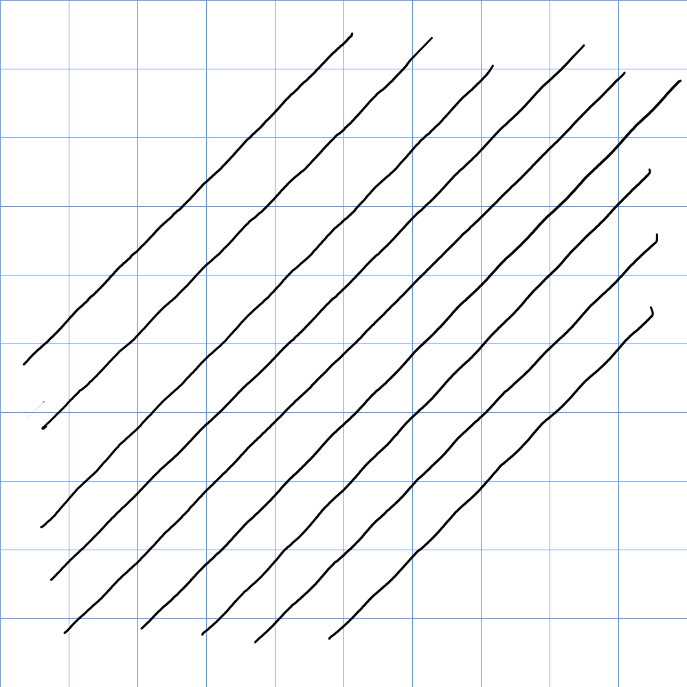
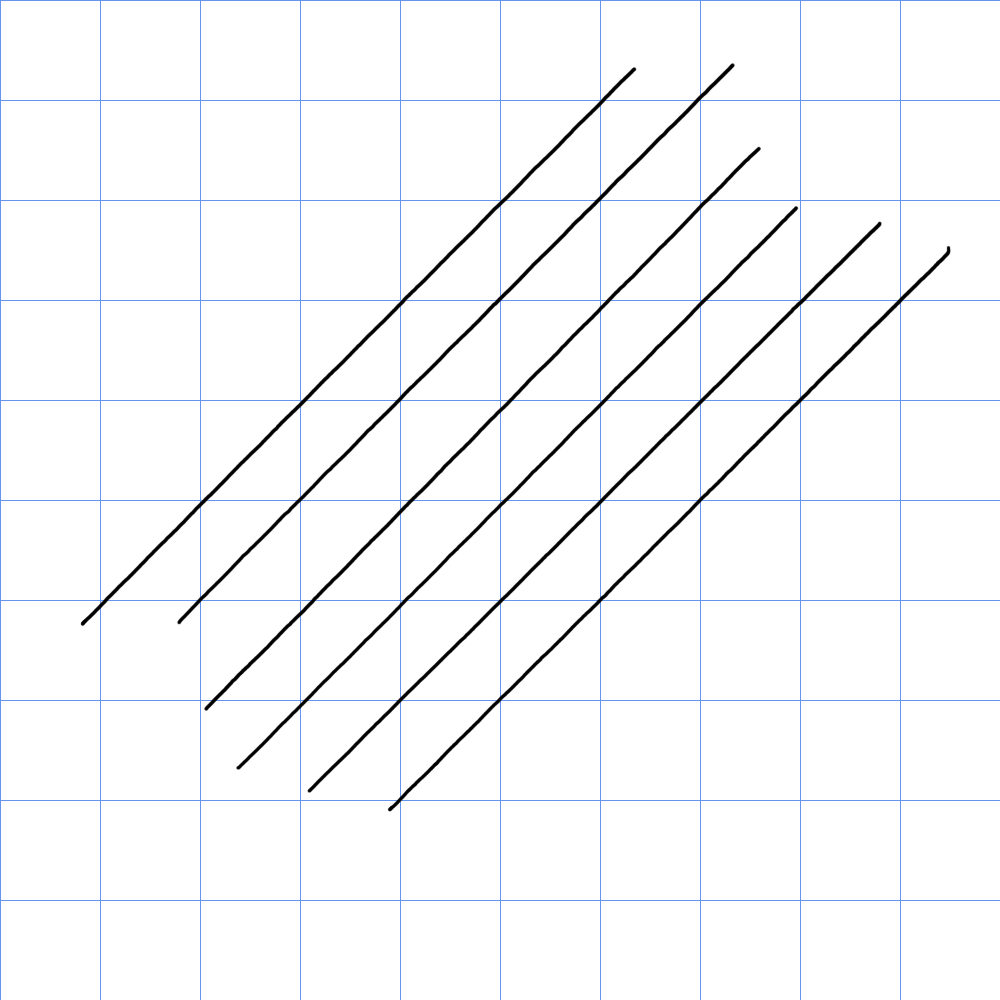

# XP-Pen Artist 12 Gen2 (CD120FH) notes

## Summary

I have this tablet but haven't used it extensively. Overall seemed like a decent tablet.

* The X3 Elite pen it came with had a good physical pressure range.
* The display has low amounts of anti-glare sparkle.
* The tablet exhibited a little more diagonal wobble than I normally like but smoothing/stabilization should help. The Artist 13 GEN2 unit has less diagonal wobble.

## Specs

These specs come from the [DrawTabData Explorer](https://thesevenpens.github.io/DrawTabDataExplorer/entity/xppen.tabletfamily.xppen_artistgen2). Click a model ID to see its full record there.



| | [CD120FH](https://thesevenpens.github.io/DrawTabDataExplorer/entity/xppen.tablet.cd120fh) |
| --- | --- |
| Name | Artist 12 GEN2 |
| Released | 2021-09-01 |
| Status | — |



| | [CD120FH](https://thesevenpens.github.io/DrawTabDataExplorer/entity/xppen.tablet.cd120fh) |
| --- | --- |
| Resolution | 1920 × 1080 |
| Aspect ratio | 16:9 |
| Pixel density | 185 PPI |
| Panel | — |
| Lamination | Yes |
| Anti-glare | — |
| Color gamut | sRGB 127% Adobe RGB 94% NTSC 90% |
| Color depth | — |
| Brightness | 220 cd/m² |
| Peak brightness | — |
| Viewing angle | 178° horizontal 178° vertical |
| Refresh rate | — |
| Response time | — |



| | [CD120FH](https://thesevenpens.github.io/DrawTabDataExplorer/entity/xppen.tablet.cd120fh) |
| --- | --- |
| Active area | 263.2 × 148.1 mm (10.4 × 5.8 in) |
| Diagonal | 302 mm (11.9 in) |
| Aspect ratio | 16:9 |
| Pen technology | Passive EMR |
| Pressure levels | 8192 |
| Tilt | ±60° |
| Accuracy (center) | ±0.5 mm |
| Accuracy (corner) | ±1 mm |
| Report rate | 200 Hz |
| Density | 200 LPmm (5080 LPI) |
| Max hover | 10 mm |



| | [CD120FH](https://thesevenpens.github.io/DrawTabDataExplorer/entity/xppen.tablet.cd120fh) |
| --- | --- |
| Included pen | [X3 Elite (PH10B)](https://thesevenpens.github.io/DrawTabDataExplorer/entity/xppen.pen.ph10b) |
| Compatible pens | [X3 Elite (PH10B)](https://thesevenpens.github.io/DrawTabDataExplorer/entity/xppen.pen.ph10b) [X3 Elite Plus (PH20B)](https://thesevenpens.github.io/DrawTabDataExplorer/entity/xppen.pen.ph20b) |



| | [CD120FH](https://thesevenpens.github.io/DrawTabDataExplorer/entity/xppen.tablet.cd120fh) |
| --- | --- |
| Buttons | — |
| Dials | — |
| Touch rings | — |
| Touch strips | — |
| Touch | No |



| | [CD120FH](https://thesevenpens.github.io/DrawTabDataExplorer/entity/xppen.tablet.cd120fh) |
| --- | --- |
| Size | 346.2 × 209 × 12 mm (13.6 × 8.2 × 0.5 in) |
| Weight | — |
| VESA mount | — |
| Legs | — |
| Included stand | — |



| | [CD120FH](https://thesevenpens.github.io/DrawTabDataExplorer/entity/xppen.tablet.cd120fh) |
| --- | --- |
| Ports | — |
| Attached cable | — |
| Bluetooth | — |



| | [CD120FH](https://thesevenpens.github.io/DrawTabDataExplorer/entity/xppen.tablet.cd120fh) |
| --- | --- |
| Contents | — |



## Notes on specs

### Pens

* Included pen: OK IAF and a GOOD pressure range. More here: [XP-Pen X3 Elite pen notes](../../pens/xppen-pens/xppen-x3elitepen-notes.md)

## Pen tracking 

* I agree with XP-Pens accuracy numbers

## Diagonal wobble

<figure><figcaption>
Diag Wobble XP-Pen Artist 12 GEN2 (CD120FH)
</figcaption></figure>

Compare to the Artist 13 GEN2

<figure><figcaption></figcaption></figure>

## Pen pressure range 

See: [XP-Pen X3 Elite pen notes](../../pens/xppen-pens/xppen-x3elitepen-notes.md)

## Pointer lag 

TYPICAL for a pen display - very slightly more than typical. But not by much.

## Parallax

VERY GOOD. The tip of the pointer aligns very closely with the tip of the pen.
