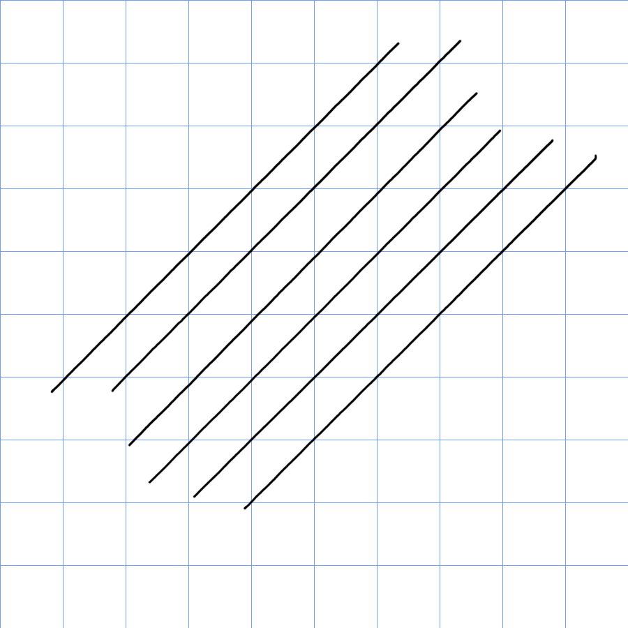

# XP-Pen Artist 13 GEN2 (CD130FH) notes

## Overall

Decent tablet. Not the ultimate drawing experience but I think it will server a lot of people well and is a good beginner tablet.

## Basics

* Product page: [https://www.xp-pen.com/ie-store/buy/artist-13-2nd-generation.html](https://www.xp-pen.com/ie-store/buy/artist-13-2nd-generation.html)
* [user manual](https://download01.xp-pen.com/file/2022/07/Artist%20Series%20Drawing%20Display%20\(2nd%20Gen\)\(English\).pdf)

## Specs

These specs come from the [DrawTabData Explorer](https://thesevenpens.github.io/DrawTabDataExplorer/entity/xppen.tabletfamily.xppen_artistgen2). Click a model ID to see its full record there.



| | [CD130FH](https://thesevenpens.github.io/DrawTabDataExplorer/entity/xppen.tablet.cd130fh) |
| --- | --- |
| Name | Artist 13 GEN2 |
| Released | 2022-04-29 |
| Status | — |
| Included pen | [X3 Elite (PH10B)](https://thesevenpens.github.io/DrawTabDataExplorer/entity/xppen.pen.ph10b) |



| | [CD130FH](https://thesevenpens.github.io/DrawTabDataExplorer/entity/xppen.tablet.cd130fh) |
| --- | --- |
| Resolution | 1920 × 1080 |
| Panel | — |
| Lamination | Yes |
| Anti-glare | AG film |
| sRGB | 130% |
| Color depth | 8 bits per channel |
| Brightness | 220 cd/m² |
| Refresh rate | — |
| Response time | — |



| | [CD130FH](https://thesevenpens.github.io/DrawTabDataExplorer/entity/xppen.tablet.cd130fh) |
| --- | --- |
| Active area | 294 × 165 mm (11.6 × 6.5 in) |
| Pen technology | Passive EMR |
| Pressure levels | 8192 |
| Tilt | ±60° |
| Report rate | — |
| Density | 200 LPmm (5080 LPI) |
| Max hover | 10 mm |



| | [CD130FH](https://thesevenpens.github.io/DrawTabDataExplorer/entity/xppen.tablet.cd130fh) |
| --- | --- |
| Buttons | — |
| Dials | — |
| Touch rings | — |
| Touch strips | — |
| Touch | No |



| | [CD130FH](https://thesevenpens.github.io/DrawTabDataExplorer/entity/xppen.tablet.cd130fh) |
| --- | --- |
| Size | 378 × 225 × 12 mm (14.9 × 8.9 × 0.5 in) |
| Weight | — |
| VESA mount | — |
| Legs | — |
| Included stand | — |



| | [CD130FH](https://thesevenpens.github.io/DrawTabDataExplorer/entity/xppen.tablet.cd130fh) |
| --- | --- |
| Ports | USB-C USB-C |
| Attached cable | None |
| Bluetooth | — |



## Pen

Comes with the XP-Pen X3 Elite pen - with an OK IAF and a GOOD pressure range. More here: [XP-Pen X3 Elite pen notes](../../pens/xppen-pens/xppen-x3elitepen-notes.md)

### Pen tracking 

* Accuracy in edges and corners is good.
* XP-pen lists accuracy as:
  * center ±0.5mm
  * corner ± 2mm
* I agree with XP-Pens accuracy numbers

## Diagonal wobble

EXCELLENT. very little wobble. at all stroke speeds.

These are 10cm lines - each drawn over 4 seconds. V

<figure><figcaption></figcaption></figure>

### Anti-glare sparkle 

Amount of AG sparkle is at the LOW end of MODERATE

I didn't find the sparkle distracting. And I don't notice it at my normal eye distance when drawing.

It has more sparkle than the Wacom One (DTC-133) but less than the Huion Kamvas 13.

## Drawing Experience 

These things worked well

* drawing lots of dots
* drawing many small quick tiny low pressure lines - hatching
* keeping pressure constant
* moving between high and low pressure smoothly
* Line Tapering - typical

## Pen pressure range 

See: [XP-Pen X3 Elite pen notes](../../pens/xppen-pens/xppen-x3elitepen-notes.md)

## Pointer lag 

TYPICAL for a pen display - very slightly more than typical. But not by much.

## Parallax

VERY GOOD. The tip of the pointer aligns very closely with the tip of the pen.

## Ports

2 USB-C ports on the side

Note that the ports are deeply recessed into wells.

## Cables and connections

Comes with a a 3-in-1 cable. Which I didn't use.

Instead I my own Thunderbolt 3 cable.

because the USB-C ports are in deep wells, my TB3 cable has ends that are too thick to fit in the well. I had to chop away some plastic to make it fit.

## Using a single-USB-C cable

This works. I was able to use it with a single USB-C cable
