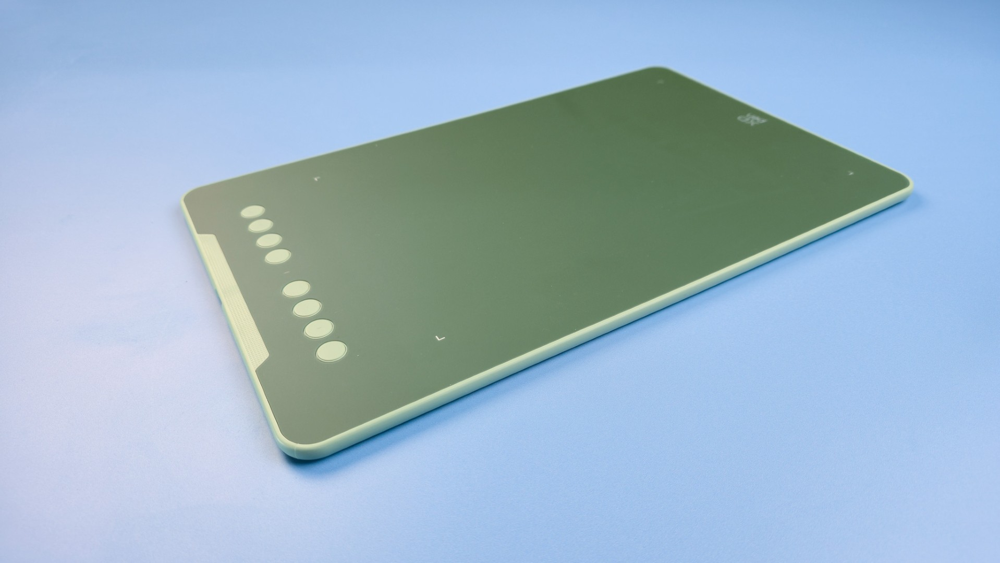
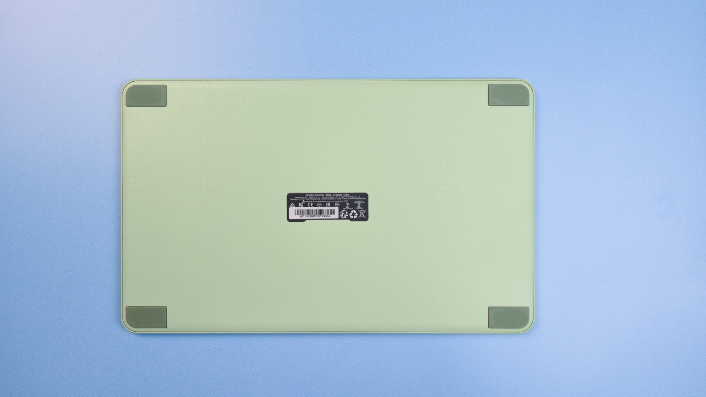

# XP-Pen Deco 01 V3 notes

## Overview

This is OK tablet that despite being released in 2025, uses an older generation of pen technology that has a higher IAF than modern consumer tablets. It might work well as a tablet for a beginner - someone new to drawing tablets.&#x20;

There similar tablets with better pens: [Pen tablet recommendations (MEDIUM)](../../../recs/pen-tablet-recs-medium.md)

## Basics

* Product page: [https://www.xp-pen.com/product/deco-01-v3.html](https://www.xp-pen.com/product/deco-01-v3.html)
* User manual: [https://www.xp-pen.com/user-manual/deco-01-v3.html](https://www.xp-pen.com/user-manual/deco-01-v3.html)
* Release year: 2025

## Links

* [Brad Colbow - Review of Deco 01 V3](https://www.youtube.com/watch?v=2-TKwccrvuE) 2026-04-30

## Compared Deco 01 V2

XP-Pen sells this tablet as an upgrade to the Deco 01 V2 - HOWEVER this looks to be the same exact tablet with the same exact pen and having the same exact drawing performance. The primary difference seems to be that XP-Pen says the Deco 01 V3 works better with Android devices.

## Android support

XP-Pen says that one clear improvement is that this tablet has better Android support. I did not find that to be the case in my testing. It had the same issues as I encountered with the Deco 01 V2. Why it didn't work seamlessly is unclear. It could have been due to the specific Android devices I tested with (I did test multiple).

Other users say they have used this tablet with an Android device and it worked correctly. That just was not my experience.

## Pens

### Included pen

XP-Pen P05 - [XP-Pen P05 pen notes](../../pens/xppen-pens/xppen-p05-notes.md)

The included P05 pen has exactly the same as the old model and has the same high IAF.

### Other compatible pens

NONE

## Better alternatives

A better choice in 2025 would be these tablets: [Pen tablet recommendations (MEDIUM)](../../../recs/pen-tablet-recs-medium.md)

## Photos

<figure><figcaption></figcaption></figure>

<figure><figcaption></figcaption></figure>

<figure><figcaption></figcaption></figure>

<figure><figcaption></figcaption></figure>

<figure><figcaption></figcaption></figure>

<figure><figcaption></figcaption></figure>
