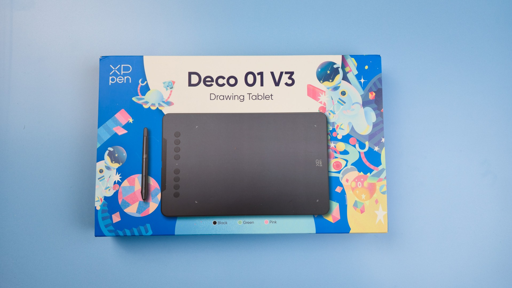
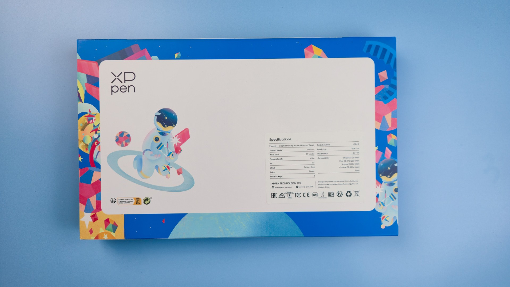
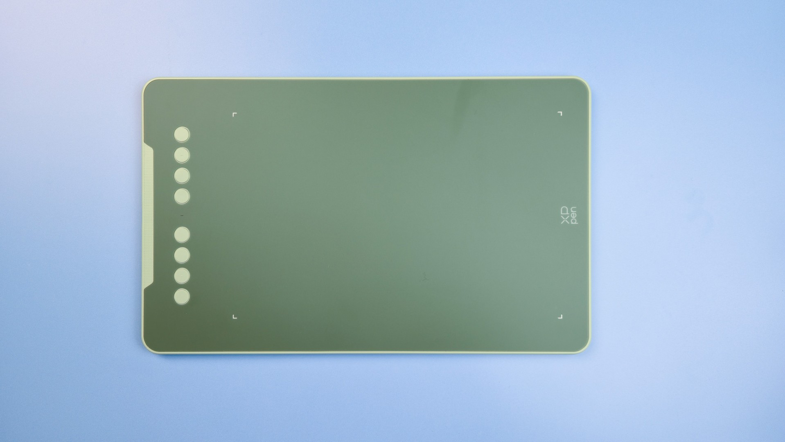
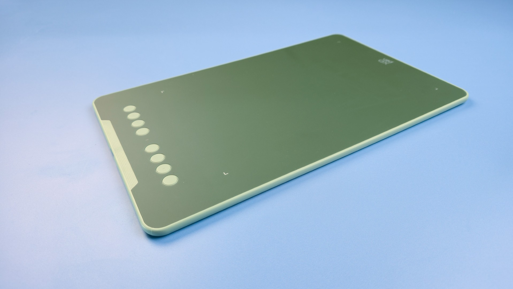
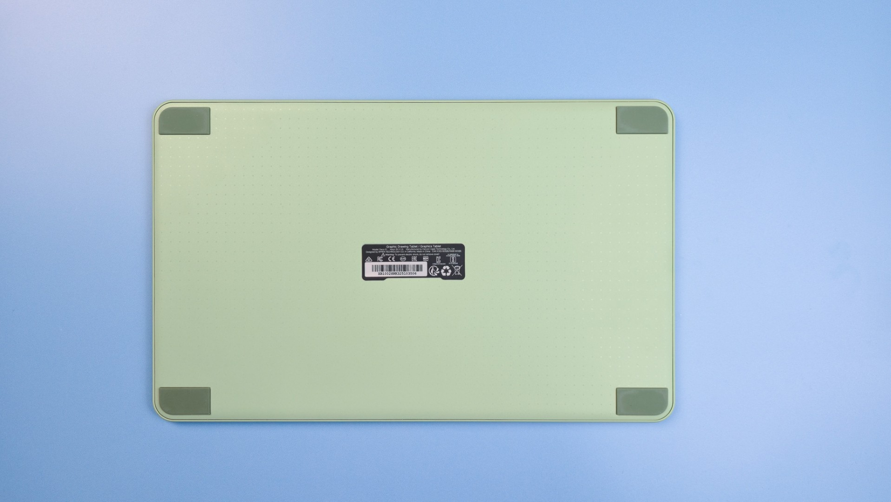
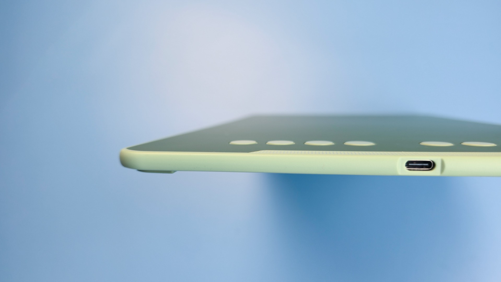

# XP-Pen Deco 01 V3 notes

## Overview

This is decent tablet. It was released in 2025 and uses an older generation of pen technology that has a slightly higher IAF than modern consumer drawing tablet pens such as a X3 Elite - but the difference may not be noticable. He table will work well as a beginner or basic tablet.

There similar tablets and some have better pens with lower IAF: [Pen tablet recommendations (MEDIUM)](../../../recs/pen-tablet-recs-medium.md)

## Links

These links come from the [DrawTabData Explorer](https://thesevenpens.github.io/DrawTabDataExplorer/). To add or fix a link, change it in DrawTabData.

### From the manufacturer

* [Product page](https://www.xp-pen.com/product/deco-01-v3.html)
* [Store page](https://www.xp-pen.com/store/buy/deco-01-v3.html)
* [User manual](https://www.xp-pen.com/user-manual/deco-01-v3.html)

### Reviews

* [The Cheapest Drawing Tablet That I Recommend - XP Pen Deco 1 v3](https://www.youtube.com/watch?v=2-TKwccrvuE) - Brad Colbow, 2026-04-30
* [XpPen Deco 01V3 - review on GNU/Linux](https://www.youtube.com/watch?v=trXxX3ZY5FM) - David Revoy, 2025-03-05
* [XpPen Deco 01V3 - review on GNU/Linux](https://www.davidrevoy.com/article1066/xppen-deco-01v3-review-on-gnulinux) - David Revoy, 2025-03-04

## Specs

These specs come from the [DrawTabData Explorer](https://thesevenpens.github.io/DrawTabDataExplorer/). Click a model ID to see its full record there.



| | [DECO01V3](https://thesevenpens.github.io/DrawTabDataExplorer/entity/xppen.tablet.deco01v3) |
| --- | --- |
| Name | Deco 01 V3 |
| Released | 2024 |
| Status | — |



| | [DECO01V3](https://thesevenpens.github.io/DrawTabDataExplorer/entity/xppen.tablet.deco01v3) |
| --- | --- |
| Active area | 254 × 159 mm (10 × 6.3 in) |
| Diagonal | 299.7 mm (11.8 in) |
| Aspect ratio | 16:10 |
| Pen technology | Passive EMR |
| Pressure levels | 16384 |
| Tilt | ±60° |
| Accuracy (center) | — |
| Accuracy (corner) | — |
| Report rate | 220 Hz |
| Density | 200 LPmm (5080 LPI) |
| Max hover | 10 mm |



| | [DECO01V3](https://thesevenpens.github.io/DrawTabDataExplorer/entity/xppen.tablet.deco01v3) |
| --- | --- |
| Included pen | [P05 (P05)](https://thesevenpens.github.io/DrawTabDataExplorer/entity/xppen.pen.p05) |
| Compatible pens | [P05 (P05)](https://thesevenpens.github.io/DrawTabDataExplorer/entity/xppen.pen.p05) |



| | [DECO01V3](https://thesevenpens.github.io/DrawTabDataExplorer/entity/xppen.tablet.deco01v3) |
| --- | --- |
| Buttons | — |
| Dials | — |
| Touch rings | — |
| Touch strips | — |
| Touch | No |



| | [DECO01V3](https://thesevenpens.github.io/DrawTabDataExplorer/entity/xppen.tablet.deco01v3) |
| --- | --- |
| Size | 350.5 × 215.9 × 8 mm (13.8 × 8.5 × 0.3 in) |
| Weight | 570 g |



| | [DECO01V3](https://thesevenpens.github.io/DrawTabDataExplorer/entity/xppen.tablet.deco01v3) |
| --- | --- |
| Ports | — |
| Attached cable | — |
| Bluetooth | — |



| | [DECO01V3](https://thesevenpens.github.io/DrawTabDataExplorer/entity/xppen.tablet.deco01v3) |
| --- | --- |
| Contents | — |



## Notes on specs

### Pens

* Included pen: [XP-Pen P05 pen notes](../../pens/xppen-pens/xppen-p05-notes.md)
* The included P05 pen has exactly the same as the old model and has the same high IAF that ranges from 6gf to 9gf depending on the pen unit I tested. This IAF is higher than is typical for modern pen tablets. But it might work for some people.

## Compared Deco 01 V2

XP-Pen sells this tablet as an upgrade to the Deco 01 V2 - HOWEVER this looks to be the same exact tablet with the same exact pen and having the same exact drawing performance. The primary difference seems to be that XP-Pen says the Deco 01 V3 works better with Android devices.

## Android support

XP-Pen says that one clear improvement is that this tablet has better Android support. I did not find that to be the case in my testing. It had the same issues as I encountered with the Deco 01 V2. Why it didn't work seamlessly is unclear. It could have been due to the specific Android devices I tested with (I did test multiple).

Other users say they have used this tablet with an Android device and it worked correctly. That just was not my experience.

## Better alternatives

A better choice in 2025 would be these tablets: [Pen tablet recommendations (MEDIUM)](../../../recs/pen-tablet-recs-medium.md)

## Photos

<figure><figcaption></figcaption></figure>

<figure><figcaption></figcaption></figure>

<figure><figcaption></figcaption></figure>

<figure><figcaption></figcaption></figure>

<figure><figcaption></figcaption></figure>

<figure><figcaption></figcaption></figure>
